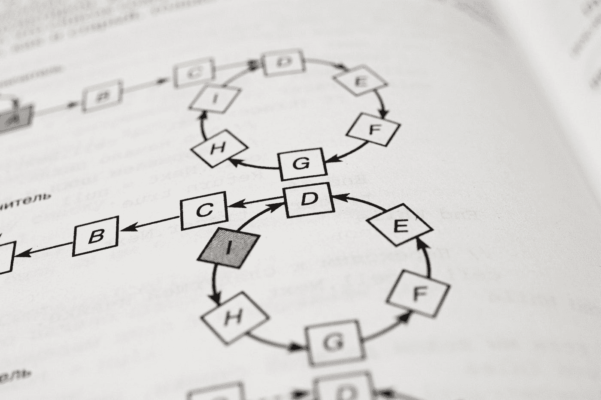
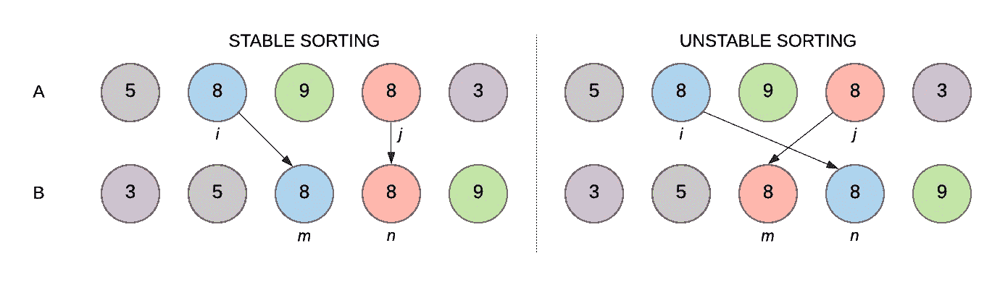
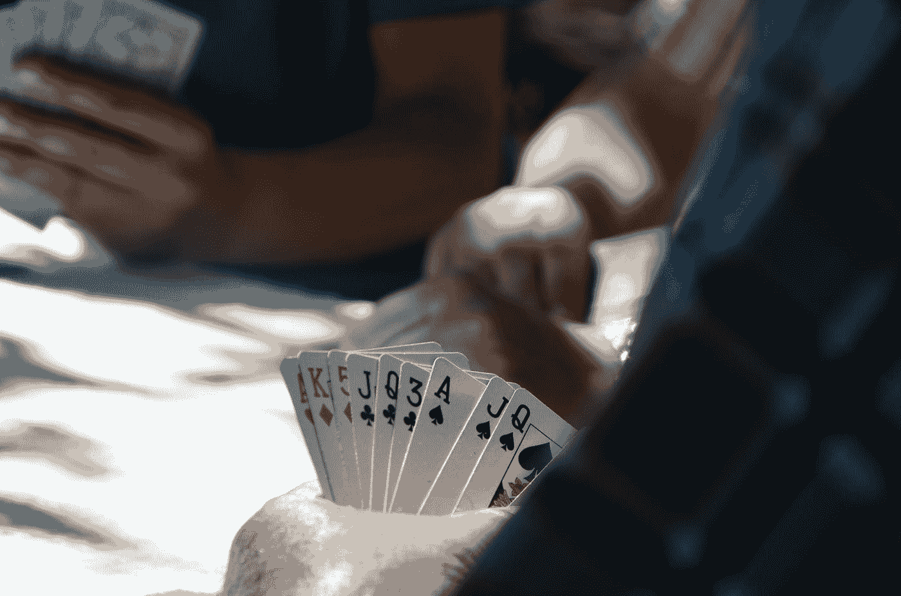
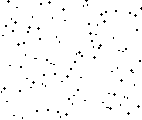
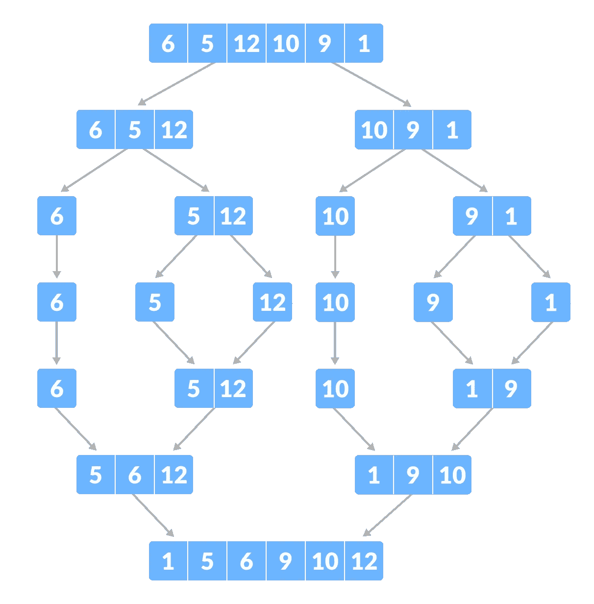
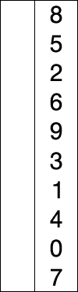
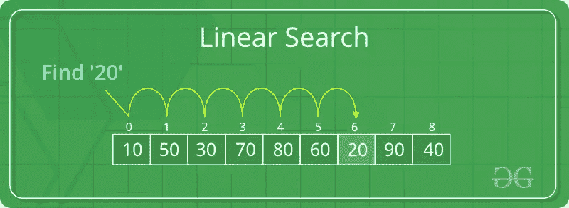
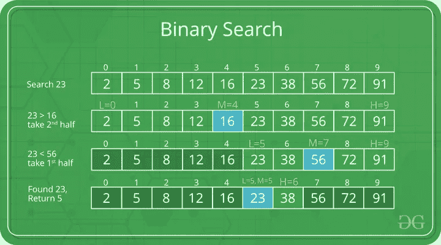
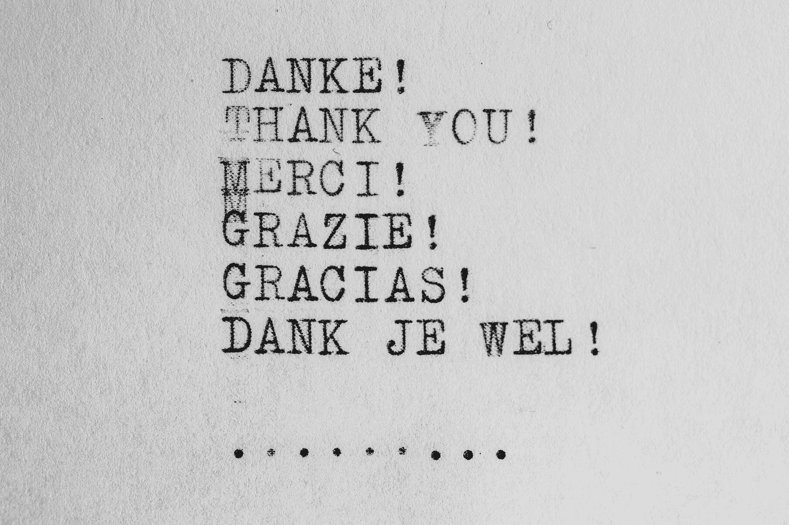

# 关于算法的面试问题

> 原文：<https://medium.com/javarevisited/interview-questions-on-algorithms-f7b37ce8c605?source=collection_archive---------0----------------------->

## 面试经验与指南—第六部分

## 软件工程算法面试准备

*Hello peeps* 😊*，今天我要分享的是* [*算法相关的面试问题*](/javarevisited/20-algorithms-coding-problems-to-crack-you-next-technical-interviews-23191f229788) *作为我软件工程师面试准备系列的一部分。这是该系列的第六部分。如果你错过了前几期，可以在这里阅读第一部分*[](/geekculture/interview-preparation-kid-for-software-engineer-1380f6fcbae9)**[*OOP&Java*](/javarevisited/interview-questions-on-object-oriented-programming-and-java-41b027d93ddb)*[*数据库*](https://faun.pub/interview-questions-on-database-concepts-d480defce050)*[*数据结构*](/geekculture/interview-questions-on-data-structures-417761216620)*和* [*并发编程*不再拖延，让我们进入今天的主题算法。](/javarevisited/interview-questions-on-concurrent-programming-concepts-2c85fbce6657)****

**[](https://javarevisited.blogspot.com/2018/11/top-5-data-structures-and-algorithm-online-courses.html)

由[凡泰媒体](https://unsplash.com/@vantaymedia?utm_source=medium&utm_medium=referral)在 [Unsplash](https://unsplash.com?utm_source=medium&utm_medium=referral) 上拍摄的照片** 

*   **一个[算法](/javarevisited/10-data-structure-algorithms-and-programming-courses-to-crack-any-coding-interview-e1c50b30b927)是一系列定义明确的指令，用于解决计算机编程中的某个问题。它接受一组输入并输出想要的结果。**
*   **输入和输出必须明确规定。**
*   **算法的每个阶段都应该简单明了。**
*   **在众多解决问题的方法中，[算法](https://www.java67.com/2019/02/top-10-free-algorithms-and-data.html)应该是最有效的。**
*   **计算机代码不应包含在算法中。相反，方法的设计方式应该允许它在各种编程语言中使用。**

**[](https://javarevisited.blogspot.com/2018/01/top-5-free-data-structure-and-algorithm-courses-java--c-programmers.html)

照片由在 [Unsplash](https://unsplash.com?utm_source=medium&utm_medium=referral) 上拍摄** 

*   **主要是在面试中，这些问题通常会在基本算法中被问到，如[搜索算法](https://javarevisited.blogspot.com/2019/04/top-20-searching-and-sorting-algorithms-interview-questions.html#axzz6w2HbOcR7)和[排序算法](https://javarevisited.blogspot.com/2016/09/iterative-quicksort-example-in-java-without-recursion.html#axzz6dZLE9cMu)。有时面试官可能会要求为一个给定的场景写一个算法。甚至有时问题会被要求为给定的场景选择更好的排序或搜索算法。**
*   **让我们从排序算法转到[问答](/javarevisited/50-data-structure-and-algorithms-interview-questions-for-programmers-b4b1ac61f5b0)部分。**

> ****排序算法****

**[](https://javarevisited.blogspot.com/2020/11/python-data-structure-algorithm-course.html)

由 [Markus Spiske](https://unsplash.com/@markusspiske?utm_source=medium&utm_medium=referral) 在 [Unsplash](https://unsplash.com?utm_source=medium&utm_medium=referral) 上拍摄的照片** 

1.  ****排序算法是什么意思？****

*   **排序算法根据元素上的比较运算符重新排列数组或列表的成员。在相关的[数据结构](https://javinpaul.medium.com/6-best-data-structure-and-algorithms-courses-for-javascript-developers-c35e23236165)中，使用比较运算符来确定元素的新顺序。**

****2。你知道的排序算法有哪些？****

*   **[合并排序](https://www.java67.com/2018/03/mergesort-in-java-algorithm-example-and.html)**
*   **[插入排序](http://www.java67.com/2014/09/insertion-sort-in-java-with-example.html)**
*   **[冒泡排序](https://javarevisited.blogspot.com/2014/08/bubble-sort-algorithm-in-java-with.html#axzz6dXsEfLvJ)**
*   **[快速排序](https://javarevisited.blogspot.com/2014/08/quicksort-sorting-algorithm-in-java-in-place-example.html#axzz6Kgpx2OGT)**
*   **堆排序**
*   **[计数排序](https://www.java67.com/2017/06/counting-sort-in-java-example.html)**

****3。稳定和不稳定排序算法是什么意思？****

*   **排序算法的稳定性取决于它处理相同(或重复)项目的方式。与稳定排序算法相比，[不稳定排序算法](https://javarevisited.blogspot.com/2017/06/difference-between-stable-and-unstable-algorithm.html#axzz7DyRjLUX9)不保留相等元素的相对顺序。换句话说，稳定排序保持两个相等组件的相对位置。**
*   **在排序对象上非常突出。**
*   **如下图所示，A 是输入数字序列，B 是排序算法的输出序列。你可以清楚地观察到稳定排序和不稳定排序的区别。**

**[](https://javarevisited.blogspot.com/2017/06/difference-between-stable-and-unstable-algorithm.html#axzz7DyRjLUX9)

图片来源是[这里的](https://www.baeldung.com/cs/stable-sorting-algorithms#:~:text=Stability%20in%20Sorting%20Algorithms&text=Stable%20sorting%20algorithms%20preserve%20the,elements%20relative%20to%20one%20another.)** 

*   **[冒泡排序](https://www.java67.com/2012/12/bubble-sort-in-java-program-to-sort-integer-array-example.html)、[插入排序](https://javarevisited.blogspot.com/2014/12/insertion-sort-algorithm-in-java-to-array-example.html)和归并排序自然是稳定的排序算法。**

****4。就地排序算法是什么意思？****

*   **就地算法“就地”转换输入，并在存储数据的同一内存中创建输出。但是，允许为变量留出少量额外空间。这种类型的排序算法称为就地排序算法。**
*   **插入排序、冒泡排序、堆排序和快速排序是[就地排序算法](https://www.java67.com/2014/07/quicksort-algorithm-in-java-in-place-example.html)。**
*   **合并排序不是就地排序算法，因为它在分治步骤中使用一些额外的内存进行排序。**

****5。任何排序算法的最佳情况、最坏情况、平均情况时间复杂度是什么意思？****

*   ****最佳情况**:最佳情况是对 n 元输入数据采取最少步骤的函数。从排序算法的角度来看，可以认为要排序的给定数组已经处于排序形式。因此给出输出所需的步骤非常少。让我们考虑排序算法**【1，2，3，4，5，6，7】**的以下输入数组。已经排序了。因此，将采用时间复杂度的最佳情况来执行排序。**
*   ****最差情况**:对大小为 n 的输入数据采取最多步骤的函数是最差情况。从排序算法的角度来看，可以认为要排序的给定数组已经处于反向排序的形式。因此，输出所需的步骤非常多。让我们考虑排序算法**【7，6，5，4，3，2，1】**的以下输入数组。它是反向排序的。因此执行排序将花费更多的时间。这是时间复杂度的最坏情况的**。****
*   ****平均情况**:平均情况是对 n 项输入数据取平均步数的函数。可以认为要排序的给定数组没有以任何形式排序(升序或降序)。所以给出输出所需的步骤是平均的。让我们考虑排序算法**【4，6，2，1，3，5，7】**的以下输入数组。它没有按任何顺序排序。是时间复杂度的**平均** **情况**。对于任何排序算法来说，这都是最常见的情况。更好的排序算法必须具有更好的平均时间复杂度。**

****7。解释插入排序是如何工作的？****

*   **插入排序是基本排序算法之一。**
*   **该算法非常类似于纸牌游戏中的点卡。原地排序算法&稳定排序算法。**

****

**照片由[伊内斯·费雷拉](https://unsplash.com/@inesrochaferreira?utm_source=medium&utm_medium=referral)在 [Unsplash](https://unsplash.com?utm_source=medium&utm_medium=referral) 上拍摄**

*   **数组的一边被认为是已排序的数组&数组的另一部分是未排序的。然后，在已排序数组的正确位置上，将每个元素从未排序部分逐一移动到已排序部分。下面的动画肯定有助于理解**插入排序**的工作原理。插入分类的代码是[这里是](https://www.geeksforgeeks.org/insertion-sort/)。可以跟进进一步了解。**

**[](https://javarevisited.blogspot.com/2015/06/top-20-array-interview-questions-and-answers.html)

图片来源:[https://www.pinterest.com/pin/420734790180626311/](https://www.pinterest.com/pin/420734790180626311/)** 

*   **在接近排序的数组中工作良好。有效地用于排序一个小的元素数组。**

> **最佳情况时间复杂度:O(n)**
> 
> **平均案例时间复杂度:O(n*n)**
> 
> **最坏情况时间复杂度:O(n*n)**
> 
> **空间复杂度:O(1)，执行排序时不需要额外的空间来存储元素。**

**8。解释冒泡排序是如何工作的？**

*   **冒泡排序是基本排序算法之一。**
*   **它通过比较每个相邻的元素来工作。**
*   **这是一个非常容易理解的算法。你可以观看下面的动画来获得更多的理解。插入排序的代码是[这里是](https://www.geeksforgeeks.org/bubble-sort/#:~:text=Bubble%20Sort%20is%20the%20simplest,and%20swaps%20since%205%20%3E%201.)。可以跟进进一步了解。**

****

**泡泡排序来源:【https://en.wikipedia.org/ **

*   **它需要更多的元素比较和互换。对长数组排序不是一个好的选择。它不能用于交换元素是非常昂贵的操作的情况。**
*   **许多情况下排序算法效率低下。**

> ****最佳情况时间复杂度:O(n)****
> 
> ****平均案例时间复杂度:O(n*n)****
> 
> ****最坏情况时间复杂度:O(n*n)****
> 
> ****空间复杂度:O(1)，执行排序时不需要额外的空间来存储元素。****

****6。解释合并排序是如何工作的？****

*   **合并排序算法是一种**分治**型算法。**
*   **它对给定数组的每个小块重复排序，以对给定的大数组元素进行排序。**
*   **在对每个小块进行排序后，在给定的数组中，它们被正确地组合以获得最终的解决方案。你可以看到下面的合并排序动画。所有的数据点都被分类成小块，以后再合并。合并排序算法的代码可以在这里找到[。合并排序可以作为递归方法和迭代方法来实现。](https://www.java67.com/2018/03/mergesort-in-java-algorithm-example-and.html)**

****

**合并排序来源:[https://upload . wikimedia . org/Wikipedia/commons/8/8e/Merge _ Sort _ animation . gif](https://upload.wikimedia.org/wikipedia/commons/8/8e/Merge_sort_animation.gif)**

*   **您也可以查看下图，进一步了解算法。初始数组**【6，5，12，10，9，1】**分为**【6，5，12】****【10，9，1】**两个小数组。然后两个数组也被进一步分成一些更小的数组。它一直持续到整个数组被分成每个元素。然后比较每个元素，并像以前一样加入到数组中。图像会正确地澄清你的疑惑。**

**[](https://javarevisited.blogspot.com/2021/03/top-dynamic-programming-problems-for-coding-interviews.html)

图片来源:[https://www.programiz.com/dsa/merge-sort](https://www.programiz.com/dsa/merge-sort)** 

*   **合并排序将占用更多的额外空间来排序给定的元素。因此，在内存消耗大的环境中使用这种类型的排序算法是没有效率的。**

> **最佳情况时间复杂度:O(nlogn)**
> 
> **平均案例时间复杂度:O(nlogn)**
> 
> **最坏情况时间复杂度:O(nlogn)**
> 
> **空间复杂度:O(n)，执行排序时需要额外的空间来存储元素。**

****9。解释快速排序是如何工作的？****

*   **快速排序算法也是一种**分治**型算法。**
*   **在快速排序中，排序是在**除法**部分完成的，但是当我们考虑合并排序时，主要的排序工作是在算法的**征服**步骤中完成的。**
*   **在快速排序中，它选择一个透视元素，并围绕该透视拆分指定的数组。QuickSort 有多种风格，每种风格都以独特的方式选择 pivot。选择第一个、最后一个、中间或随机元素作为主元素。**
*   **分区是 quickSort()中最重要的操作。给定一个数组和一个 pivot 元素 x，分区的目标是将 x 放在排序后的数组中的正确位置，所有较小的项目(小于 x)放在 x 之前，所有较大的元素(大于 x)放在 x 之后，所有这些都应该以线性方式完成。**
*   **下面的动画将教授快速排序中排序的确切过程。**

****

**快速排序来源:[https://en.wikipedia.org/](https://en.wikipedia.org/)**

*   **快速排序算法的代码可以在[这里](https://javarevisited.blogspot.com/2016/09/iterative-quicksort-example-in-java-without-recursion.html#axzz6dZLE9cMu)找到。快速排序可以作为递归方法和迭代方法来实现。**
*   **它不是一个稳定的排序算法，但它是一个就地排序算法。**

> **最佳情况时间复杂度:O(nlogn)**
> 
> **平均案例时间复杂度:O(nlogn)**
> 
> **最坏情况时间复杂度:O(n*n)**
> 
> **空间复杂度:O(1)，执行排序时不需要额外的空间来存储元素。**

****10。解释选择排序的工作原理？****

*   **选择排序算法通过从未排序的段中连续选择最小的成员并将其放在开头(按升序)来对数组进行排序。**
*   **像插入排序一样，该技术在给定的数组中保留两个子数组。第一个是已经排序的子数组。剩下的未排序的子数组是另一半。**
*   **在选择排序的每次迭代中，未排序的子数组的最小元素被选择并转移到已排序的子数组。为了更好地理解，下面的动画解释了这些阶段。**

****

**选择排序来源:[https://en.wikipedia.org/](https://en.wikipedia.org/)**

*   **选择排序中的交换数量总是小于需要排序的元素，这在内存写入开销很大时非常方便。**

> **最佳情况时间复杂度:O(n*n)**
> 
> **平均案例时间复杂度:O(n*n)**
> 
> **最坏情况时间复杂度:O(n*n)**
> 
> **空间复杂度:O(1)，执行排序时不需要额外的空间来存储元素。**

****11。冒泡排序的优缺点是什么？****

*   ***优点*:简单易懂。最好情况下的更好算法。**
*   ***缺点*:一般情况，最坏情况时间复杂度高。**

**12。可以用来比较排序算法的标准是什么？**

*   **基于比较的次数**
*   **基于递归或非递归**
*   **基于稳定。**
*   **基于额外的空间要求。**
*   **基于互换的数量**

**13.**什么是计数排序算法？****

*   **整数排序算法&一种非比较排序算法。**
*   **[计数排序](https://javarevisited.blogspot.com/2017/02/difference-between-comparison-quicksort-and-non-comparison-counting-sort-algorithms.html)是一种排序算法，可用于对已知范围内的值进行排序。**
*   **它可以在 O(n)时间内对值进行排序。你可以去[这里](https://www.geeksforgeeks.org/counting-sort/)更好的理解。对于计数排序，没有比上述地方更有效的资源了。**

**14.**比较排序算法和非比较排序算法有什么区别？****

*   **顾名思义，基于比较的排序算法(如 quicksort)要求您对项目进行比较以进行排序，而非基于比较的排序算法(如 Counting sort)允许您在不对元素进行比较的情况下对元素进行排序。惊讶吗？**

> **搜索算法**

****

**照片由[马丁纽霍尔](https://unsplash.com/@laughayette?utm_source=medium&utm_medium=referral)在 [Unsplash](https://unsplash.com?utm_source=medium&utm_medium=referral) 上拍摄**

1.  **[**什么是线性搜索及其工作原理**](https://javarevisited.blogspot.com/2020/01/how-to-implement-linear-or-sequential-search-in-java.html#axzz6VYKcmyZz) **？****

*   **搜索数据集合的最简单方法是线性搜索。**
*   **从数据收集开始，逐一检查每条数据，直到找到匹配项。**
*   **一旦找到目标，搜索就结束了。如果找不到匹配，则对象不在集合中。**
*   **不需要排序的集合来执行搜索。**
*   **在下面的示例中，我们执行搜索来查找数字 20。这张图片很容易解释这个过程。**

**[](https://javarevisited.blogspot.com/2020/01/how-to-implement-linear-or-sequential-search-in-java.html#axzz6VYKcmyZz)

来源 [GeeksforGeeks](https://www.geeksforgeeks.org/)** 

*   **线性搜索的 python 代码如下所示。这是不言自明的。**

```
****def** linear_search(arr, length, k): **for** j **in** range(0, length): **if** (arr[j] **==** k): **return** j **return** **-**1**
```

> **最坏情况时间复杂度:O(n)**

****2。什么是二分搜索法，它是如何工作的？****

*   **一个[二分搜索法](/javarevisited/binary-search-in-java-algorithm-eca288cb9bc2)是一种高级搜索方法，用于从一个排序列表中查找和检索数据。它的主要操作思想是将列表中的数据一分为二，直到找到需要的值并显示在搜索结果中给用户。**
*   **[二分搜索法](https://www.java67.com/2022/01/how-to-find-kth-smallest-element-in.html)背后的目标是利用数组被排序的事实来降低时间复杂度。**
*   ****二分搜索法的步骤****

1.  **首先创建一个跨越整个阵列的间隔。**
2.  **如果搜索关键字的值小于间隔中点的项目，则应将间隔缩小到下半部分，否则，将其限制在页面的上半部分**
3.  **检查该值，直到发现该值或间隔为空。**

*   **仅仅经过一次比较，我们实际上忽略了一半的元素。**
*   **下面显示了一个搜索示例。这幅画是不言自明的。您可以对任何澄清进行评论。**

**[](https://javarevisited.blogspot.com/2018/06/binary-search-in-java-without-recursion.html#axzz6pLtvLG5i)

来源 [GeeksforGeeks](https://www.geeksforgeeks.org/)** 

```
****def** bSearch(arr, l, r, x): **if** r >**=** l: mid **=** l **+** (r **-** l) **//** 2 **if** arr[mid] **==** x: **return** mid **elif** arr[mid] > x: **return** bSearch(arr, l, mid**-**1, x) **else**: **return** bSearch(arr, mid **+** 1, r, x) **else**: **return** **-**1**
```

*   **这是二分搜索法的递归算法。它也可以以迭代的方式实现。**
*   **通常要求从技术面试的角度来解释或撰写。**

> **最坏情况时间复杂度:O(log n)**

****3。如何使用二分搜索法在一个有一百万个数字的数组中找到一个数字？****

****

**由 [Mufid Majnun](https://unsplash.com/@mufidpwt?utm_source=medium&utm_medium=referral) 在 [Unsplash](https://unsplash.com?utm_source=medium&utm_medium=referral) 拍摄的照片**

*   **因为数组是排序的，所以首先想到的是二分搜索法。**
*   **但是，难点在于我们不知道数组的大小。如果数组是无限的，我们不能使用二分搜索法，因为我们没有合适的边界。**
*   **所以，要定位钥匙的位置，我们必须首先确定边界，然后使用二分搜索法技术。**
*   **让 low 指向数组的第一个元素，high 指向第二个元素。**
*   **现在将键与高索引元素进行比较，如果它大于高索引元素，则将高索引复制到低索引中，并将高索引加倍。如果它更小，对找到的高低指数进行二分搜索法。**
*   **让 **k** 表示要寻找的元素的位置。发现高指数 **h** 所需的步骤数为 O ( **log k** )。 **h** 的值必须小于 **2*k** 。在 **h/2** 和 **h** 之间，组件数量必须为 **O(k)** 。由此，二分搜索法步骤的时间复杂度为 **O(log k)** ，整体时间复杂度为 **2*O(Log k)** ，即 **O(log k)** 。**

**我相信你已经理解了上面讨论的与面试算法相关的所有问题。如果您有任何问题或任何澄清，不要犹豫，通过回复部分与我联系。感谢你花宝贵的时间阅读这篇博客，我相信这会激励你继续阅读其他关于面对面试的博客。前面面试准备的部分可以在这里[找到](/@sthenusan)。这些对你准备面试会很有帮助。下次见，再见！👋**

***喜欢这篇文章吗？成为* [*中等会员*](https://sthenusan.medium.com/membership) *继续学习没有任何限制。如果你使用上面的链接，我会收到你的会员费的一部分，不需要你额外付费。提前感谢。***

****

**照片由[威廉·冈克尔](https://unsplash.com/@wilhelmgunkel?utm_source=medium&utm_medium=referral)在 [Unsplash](https://unsplash.com?utm_source=medium&utm_medium=referral) 上拍摄**