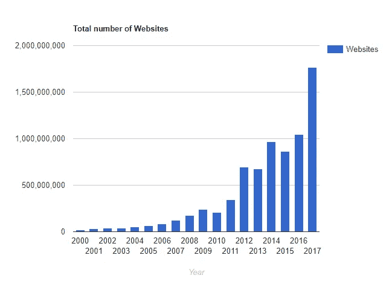
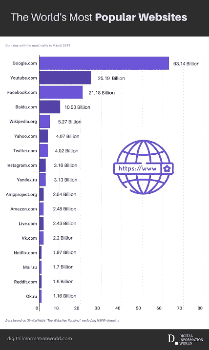
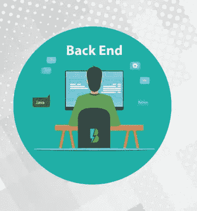
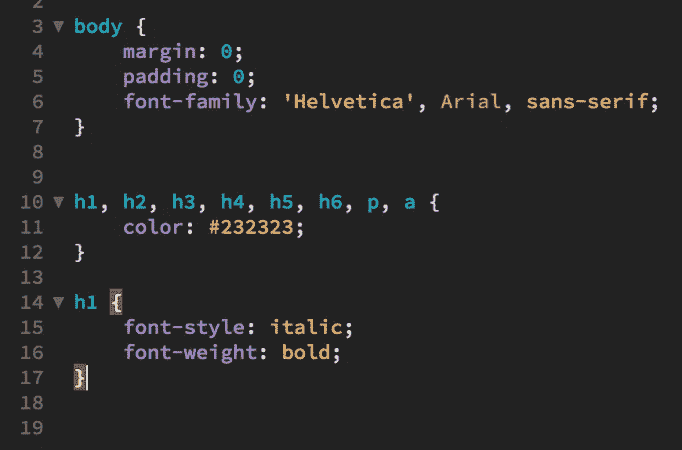
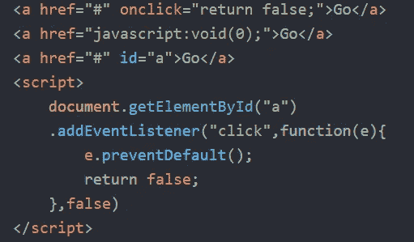
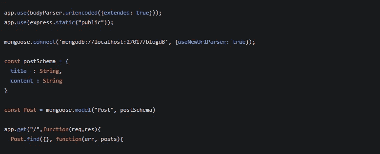
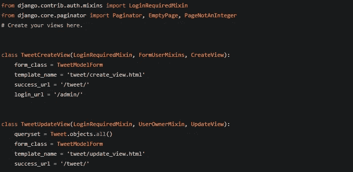

# 现代 Web 开发介绍

> 原文：<https://medium.com/javarevisited/intro-to-modern-web-development-d714563c87e?source=collection_archive---------1----------------------->

1.  如今网络开发需求巨大。越来越多的技术和小工具减少了大量的努力和辛勤工作。Web 开发是指使用各种工具为互联网开发网站，从简单的网站到复杂的网站。

来源:https://images.app.goo.gl/zSnfccMMLBSxnMFp6

上图显示了从 2000 年到 2017 年的网站创建数量，正如它显示的那样，随着 YouTube、Paytm、Instagram、Google e.t.c 等每个网站的新想法和创新，网站创建数量不断增加。e.t.c 是当今使用最多的网站和应用程序。

web 开发的特点:-

*   清晰和用户友好的导航
*   提供新鲜内容
*   充满了新想法
*   与众不同
*   担保
*   信息可访问

最著名和最常用的网站显示在这个图表中

来源:【https://tinyurl.com/y8qqg9hq】

**如图所示，世界各地的人们大多使用 google.com 搜索引擎。**

**创建一个网站涉及三种类型的 web 开发人员专业化:[前端 web 开发人员](/javarevisited/5-best-react-js-books-for-beginners-and-experienced-web-developers-e7b90b1ab9d2)、[后端 web 开发人员](/hackernoon/the-2019-web-developer-roadmap-ab89ac3c380e)、[全栈 web 开发人员](/javarevisited/top-10-online-courses-to-become-a-fullstack-web-developer-in-2020-d608a6b63232)。**

# **前端 web 开发**

**它也被称为客户端开发，涉及到使用 [HTML](/javarevisited/5-free-html-and-css-courses-to-learn-front-end-web-development-online-8b04517c6ecb?source=collection_home---4------0-----------------------) 、 [CSS](/javarevisited/top-10-free-courses-to-learn-html-5-css-3-and-web-development-872d62d97a97) 、 [Javascript](/javarevisited/10-javascript-frameworks-and-libraries-to-learn-in-2020-best-of-lot-5f61f86c60b4) 、 [bootstrap](/javarevisited/7-free-courses-to-learn-bootstrap-for-web-designers-and-developers-5135215648f1) 等等来开发网站的前端。这种前端开发的主要目标是使用户易于交互和使用。**

**

来源:[https://images.app.goo.gl/vRmqSR9kK5VcrUj87](https://images.app.goo.gl/vRmqSR9kK5VcrUj87)** 

# **后端 web 开发**

**它也被称为服务器端开发。它涉及出于安全目的对外界隐藏的编码实现。它用于为网页提供功能。它还使用数据库，如 [MongoDB](https://javarevisited.blogspot.com/2019/01/top-5-mongodb-online-training-courses.html) 、 [SQL](/hackernoon/top-5-sql-and-database-courses-to-learn-online-48424533ac61) 、 [Postgresql](https://javarevisited.blogspot.com/2020/02/top-5-courses-to-learn-postgresql-in.html) 许多工具用于开发网站的后端，如 [Node.js](/javarevisited/top-10-online-courses-to-learn-node-js-in-depth-8ef0e31ca139) 、 [Django](/@javinpaul/my-favorite-courses-to-learn-django-for-beginners-2020-ac172e2ab920) 、flask、 [python](/javarevisited/my-favorite-books-to-learn-python-in-depth-77465633b46e) 、 [ruby on rails](/javarevisited/top-5-free-courses-to-learn-ruby-and-rails-for-beginners-best-of-lot-e149fe03c964)**

****

**资料来源:https://images.app.goo.gl/vRmqSR9kK5VcrUj87**

# **全栈 web 开发**

**它是前端和后端 web 开发人员的结合。那些能够为客户端和服务器开发软件和网站的人被称为全栈式 web 开发人员。f[full stack web developer](/javarevisited/top-10-frameworks-full-stack-java-developers-can-learn-in-2020-5995021401e5)的主要优势是根据需求在前端和后端之间切换。**

**

来源:[https://images.app.goo.gl/Eb9LSF1NhStHjMKP9](https://images.app.goo.gl/Eb9LSF1NhStHjMKP9)** 

# **开始开发前端网站的工具**

## **超文本标记语言**

**它是用于设计在 web browser.html 中显示的网页的标准标记语言，以基本标记的形式编写，如标题标记(**

# **到

###### )、段落标记(p)、表格标记(** 

**)、表格标记()等，如下所示**

****

**来源:https://images . app . goo . GL/rptniyh 73 bxm 3 jrq 6**

## **CSS(级联样式表)**

**它是定义 HTML 文档风格的语言，用于设计目的。它改善了网页的外观，可以更好地与用户互动，包括布局、颜色、样式和字体。脚本标签用于定义 HTML 文件中的 CSS**

****

**来源:[https://images.app.goo.gl/xj3YM8coXDEYC4cF6](https://images.app.goo.gl/xj3YM8coXDEYC4cF6)**

## **JS**

**众所周知，即时编译编程语言向网页内容提供功能。它允许用户创建动态更新的内容，控制多媒体等**

****

**来源:谷歌**

**有许多其他的库/框架可以在前端使用，如 [Angular](/javarevisited/10-courses-to-learn-angular-for-web-development-6da1bd2856dc?source=---------8------------------) ，Vue， [React](/javarevisited/top-10-free-courses-to-learn-react-js-c14edbd3b35f) ，Ember 等等，以更好地管理代码库。**

# **开始开发后端的工具**

## **节点+快速**

**它是一种服务器端脚本语言，用于在内容发送到 web 浏览器之前产生动态网页内容，node.js 中的 js 代表 **javascript** 代码。它允许使用 javascript 和其他模块(如 nodemon-npm、express、e.t.c)创建 web 服务器和网络工具。**

****

## **姜戈**

**它是一个开源的基于 python 的 web 框架，用于快速开发和简洁设计，用于编程逻辑以快速有效地实现，帮助开发者避免常见错误。**

****你可以用烧瓶来装 Django apps 的小版本。****

****

## **结论:**

**希望这篇关于 web 开发的文章能够理清你对网站创建的想象，并且鼓励你学习更多关于 web 开发的知识。**

**非常感谢你阅读这篇文章，也分享这篇文章。**

**请随意连接:**

> ***领英~*[https://www.linkedin.com/in/priyanshsinghal/](https://www.linkedin.com/in/priyanshsinghal/)**
> 
> ***insta gram ~*[https://www.instagram.com/18_priyansh/](https://www.instagram.com/_daksh_trehan_/)**
> 
> ***Github ~*https://github.com/priyansh18**

**关注更多…**

> ***干杯。***