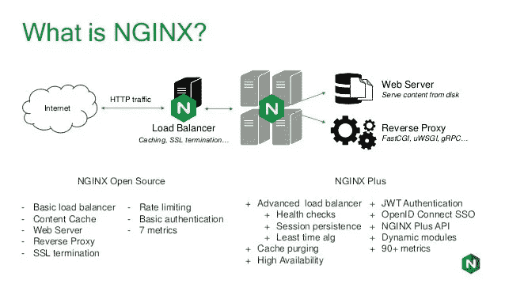

# Nginx Web 服务器介绍(第 1 部分)

> 原文：<https://medium.com/javarevisited/intro-to-nginx-web-server-part-1-bb590fad7035?source=collection_archive---------1----------------------->

[](https://www.java67.com/2016/06/3-difference-between-web-server-vs-application-server-vs-servlet-container.html)

# 介绍

今天我们将讨论 Nginx，这是一个开源软件 web 服务器，也是 Apache HTTP 服务器的主要替代品/竞争对手。Nginx 自诞生以来越来越受欢迎，广泛应用于 web 服务、反向代理、缓存、负载平衡、媒体流等等。

类似“engine-ex”的 Nginx 是开源项目，可以提供管理保留代理、HTTP 缓存和负载平衡器，Nginx 比其他 web 服务更受青睐，因为 Nginx 解决了一个问题，这个问题说明我如何连接 10000 个并发连接

如今，网络中的连接数量没有限制。为了克服这个问题，Nginx 引入了事件驱动的异步架构，这与传统的流程驱动架构完全不同。这就是为什么 Nginx 被认为是保持速度和可伸缩性的最可靠的服务器。

早些时候，Nginx 的功能是 HTTP web 服务。但从那时起，它已经得到了发展，现在它还用作 IAMP、POP3 和 SMTP 的反向代理、HTTP 负载平衡器、媒体流和电子邮件代理。Nginx 是许多处理高流量网站的首选网络服务器之一，因为它能够以惊人的速度处理大量连接。它作为 Apache HTTP 服务器的重要竞争对手进入市场。

**Nginx 文章的所有部分:**

*   你是 Nginx 系列的第一部分
*   [安装 Nginx 并由命令管理(第二部分)](/javarevisited/installing-nginx-and-managed-by-command-part-2-b6b32b90b62d)
*   [Nginx 文件配置和日志(第三部分)](/p/62e71ad1c3a0)

# Nginx 是如何工作的？

Nginx 旨在提供更低的内存使用和高并发性

Nginx 为每个 web 请求创建一个新的进程

Nginx 使用异步的、事件驱动的方法，其中请求在单线程中处理

Nginx 有一个可以控制多个进程的主进程，主进程将维护工作进程

工作进程将完成实际的工作

Nginx 将没有任何阻塞地处理每个进程，因为这是异步的。

# Nginx 深感:

# Nginx 对事件驱动工作的连接数没有限制。

*   异步的
*   事件驱动方法

Nginx 考虑了大多数 web 服务的可维护性、速度和可伸缩性。

Nginx 只是用来处理 HTTP 请求的，但是现在它可以提供以下服务

*   反向代理
*   HTTP 负载平衡器
*   媒体流
*   IAMP、POP3 和 SMTP 的电子邮件代理

NGINX 工作:

Nginx 是一个提供 HTTP 请求的 web 服务，但是也可以提供反向代理和其他服务

nginx 可以同时处理多个网络，因为它是异步架构

nginx 可以帮助保护您的数据和何时接收网络之间的连接

# nginx 的优势是什么

*   编写的代码基础比其他替代方案更加一致。
*   它提供了友好的配置格式，并且具有比任何其他 web 服务器替代方案都更现代的设计。
*   它是基于事件的，允许您处理多个连接，而不会因为上下文切换而产生开销。
*   它使用较少的内存和资源。
*   NGINX 使网站速度更快，并帮助他们获得更好的谷歌排名。
*   它显示了与常用 web 应用程序的兼容性，如 ruby、python、Joomla 等。
*   它有助于将动态内容转换为静态内容。
*   它有助于同时处理数千个并发连接。

但是每个优点也有缺点

*   与 Apache 相比，它的社区支持较少，但使用案例比 [Apache](https://javarevisited.blogspot.com/2017/01/12-essential-apache-web-server-interview-questions-answers-java-linux.html#axzz5b2narrgt) 多。
*   与 Apache 相比，它没有提供很多模块和扩展。
*   由于社区支持少，它不太喜欢被偏爱

# NGINX 如何处理请求:

[](https://javarevisited.blogspot.com/2017/01/12-essential-apache-web-server-interview-questions-answers-java-linux.html#axzz5b2narrgt)

在这一节中，我将编写一个简单的配置来解释如何处理请求，在下一篇文章中，我将解释如何安装 Nginx。

NGINX 配置文件必须包含至少一个服务器指令来定义虚拟服务器。当 NGINX 处理请求时，它首先选择服务请求的虚拟服务器。

虚拟服务器由“http”上下文中的“server”指令定义，例如:

```
server {
}
```

让我们从一个简单的配置开始，其中所有三台虚拟服务器都监听端口*:80:

```
server {
 listen  80;
 server_name example.org [www.example.org;](http://www.example.org;)
 ...
}

server {
 listen  80;
 server_name example.net [www.example.net;](http://www.example.net;)
 ...
}

server {
 listen  80;
 server_name example.com [www.example.com;](http://www.example.com;)
 ...
}
```

在上面的配置中，所有的服务器监听端口 80，但是具有不同的域，如果没有任何域存在的任何请求到来，Nginx 将在默认情况下在第一个服务器中处理，将第一个服务器设置为主服务器，但是如果在服务器部分 default_server 附近编写此配置，我们可以更改它。查看下面的配置，了解如何设置 default_server。

```
server {
 listen  80 default_server;
 server_name example.org [www.example.org;](http://www.example.org;)
 ...
}
```

> *default _ server 参数从版本 0.8.21 开始可用。在早期版本中，应该使用默认参数。*

但是如果请求没有任何 server_name，我们能做什么。

对于这种情况，我们可以在一个配置文件中定义新的服务器来捕捉任何没有 server_name 的请求。

我们可以将其定义为以下配置

```
server {
 listen  80;
 server_name "";
 return  444;
}
```

# 结论:

从以上我们可以得出结论，当进入 Nginx 时，任何请求都会检查配置文件来处理请求，并转到正确的路径和端口。

我们看到如何在 config Nginx 文件中定义服务器。

而且我们知道为什么要用 Nginx？

在下一篇文章中，我将在您的服务器中安装 Nginx 来处理您的应用程序。

**Nginx 文章的所有部分:**

*   你是 Nginx 系列的第一部分
*   [安装 Nginx 并由命令管理(第二部分)](/javarevisited/installing-nginx-and-managed-by-command-part-2-b6b32b90b62d)
*   [Nginx 文件配置和日志(第三部分)](/p/62e71ad1c3a0)

> **别忘了拍文章，每篇文章可以拍 50 次。**

# 参考资料:

[http://nginx . org/en/docs/http/request _ processing . html #:~:text = In % 20 this % 20 configuration % 20 nginx % 20 tests，默认% 20 server % 20 for % 20 this % 20 port](http://nginx.org/en/docs/http/request_processing.html#:~:text=In%20this%20configuration%20nginx%20tests,default%20server%20for%20this%20port)。

[https://docs . nginx . com/nginx/admin-guide/we B- server/we B- server/](https://docs.nginx.com/nginx/admin-guide/web-server/web-server/)