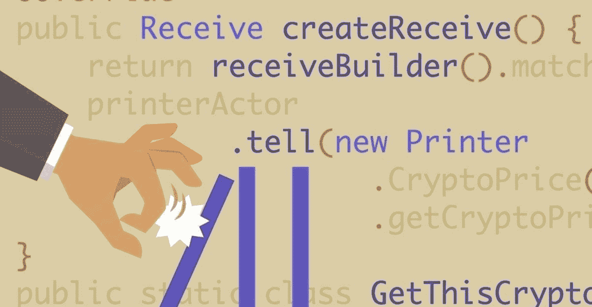
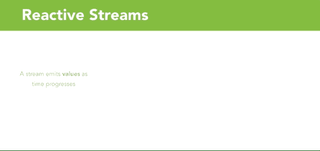

# 反应式函数编程简介

> 原文：<https://medium.com/javarevisited/intro-to-reactive-functional-programming-d49e00365847?source=collection_archive---------0----------------------->

[https://linkedin-learning.pxf.io/reactive-java-8](https://linkedin-learning.pxf.io/reactive-java-8)

# 介绍

在现代计算环境中，有更多的用户具有更重的使用模式，并且对用户体验有更高的期望。许多应用程序开始部署在高度分布式的云服务器上，这带来了它们自己的复杂性。

为了解决这些问题，许多工程团队正在转向编程的反应功能范例。

本文将为您简单介绍一下**反应式函数编程**。

# 什么是反应式编程？

> 交互式程序按照自己的节奏工作，主要处理通信，而反应式程序只响应外部需求，主要处理准确的中断处理。
> 
> **—热拉尔·贝里*(*INRIA 研究部主任)**

**反应式编程**是一种声明式编程范式，需要构建异步、非阻塞和事件驱动的应用程序，这些应用程序利用异步数据流，并且可以轻松扩展。

**一个流可以发出三样东西:**

*   一种价值观
*   一个错误
*   完整的信号

## 什么是异步数据流？

**流**是按时间顺序排列的一系列正在进行的事件。事件的例子包括变量、用户输入、属性或点击事件。

# 下面是一个正在运行的流的示例:

活动中的反应流大理石图

上述图表被称为[弹球图](/@jshvarts/read-marble-diagrams-like-a-pro-3d72934d3ef5)，它们通常用于解释[反应流](https://www.reactivemanifesto.org/)的各个方面。

在 LinkedIn 学习视频**[用 Java 8](https://linkedin-learning.pxf.io/reactive-java-8) 进行反应式编程中，对这些概念和更多的概念进行了更详细的解释**

# **反动宣言**

**在你开始构建反应系统的旅程之前，你应该看看[反应宣言](https://www.reactivemanifesto.org/)。反应宣言解释了反应系统应该具备的各种特征。**

**反应式系统趋向于松散耦合、灵活和高度可伸缩。以正确的方式构建，并给工程团队时间来适应新的范例，这些系统将随着系统的发展和增长而变得更容易开发和改变。**

## **反应系统需要:**

*   **应答的**
*   **弹回的**
*   **弹性的**
*   **消息驱动**

# **让我们来看看这些特征的相互作用:**

****

**行动中的反应宣言**

**我们可以看到，消息驱动系统有助于促进弹性和弹性特征，这反过来又有助于使整个系统更具响应性。构建具有良好用户体验的响应式系统是反应式宣言的最终目标。**

# **为什么要进行反应式编程？**

**过渡到**反应系统**可能是一项非常具有挑战性和耗时的工作。**

## **但是，请考虑以下情况:**

*   **现代系统需要强健、有弹性和灵活**
*   **它们部署在运行数千个多核处理器的基于云的集群上**
*   **用户期望毫秒级的响应时间和 100%的正常运行时间**
*   **数据以 Pb 为单位**
*   **现代系统需要容忍失败，优雅地失败，并且在给予用户有效的、交互式的反馈的同时具有高度的响应性**

**构建反应式系统是应对这些挑战的绝佳解决方案。所以，帮你自己一个忙，开始学习更多关于**反应式功能范例**的知识，以及它如何帮助你的组织中的系统变得更加面向未来和可伸缩！**

**其他**编程与技术篇**你可能喜欢的
[2019 年 Java 开发者应该学会的 10 件事](http://javarevisited.blogspot.sg/2017/12/10-things-java-programmers-should-learn.html#axzz53JaDYLsP)
[2019 年要探索的 10 种编程语言](http://www.java67.com/2017/12/10-programming-languages-to-learn-in.html)
[2019 年程序员应该学会的 10 种框架](https://javarevisited.blogspot.com/2018/04/top-5-java-frameworks-to-learn-in-2018_27.html)
[2019 年学习新技术的 10 种方法](http://www.java67.com/2017/12/10-ways-to-learn-new-technology-programming-language-or-framework.html)
[2019 年你可以阅读的 20 本 Java 书籍](http://javarevisited.blogspot.sg/2017/12/top-20-java-books-of-2017-which-you-can-read-in-2018.html)** 

**[**了解更多以上反应 Java 8！**](https://linkedin-learning.pxf.io/reactive-java-8)**

****

**【https://linkedin-learning.pxf.io/reactive-java-8 **

****

**[https://www.linkedin.com/in/anataliocs](https://www.linkedin.com/in/anataliocs)**

## **在 LinkedIn 上寻找更多最新头条新闻？**

**[发现更多故事](https://www.linkedin.com/)**

***原载于 2018 年 7 月 22 日*[*https://www.linkedin.com*](https://www.linkedin.com/pulse/intro-reactive-functional-programming-chris-anatalio/)*。***