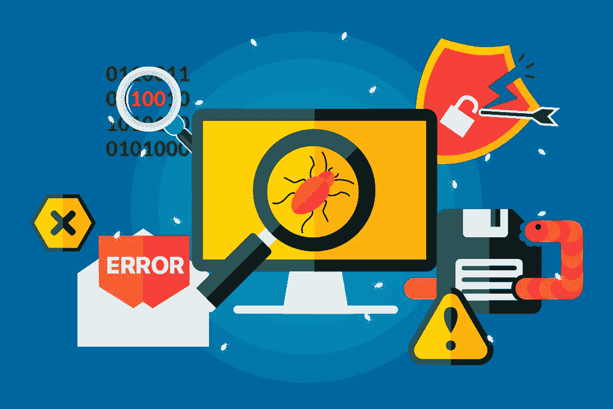

# 易访问性测试简介:什么是易访问性测试，为什么它很重要

> 原文：<https://medium.com/javarevisited/introduction-to-accessibility-testing-what-is-it-and-why-is-it-important-78757328f85e?source=collection_archive---------1----------------------->

信息技术已经成为我们生活中不可或缺的一部分很长时间了，让尽可能多的人能够使用它们是必须的。我们这里所说的可访问性指的是添加使网站、应用程序或操作系统为残疾人所用的功能。

除了开发，还有测试。我会见了英特尔软件公司的质量保证工程师鲍里斯·科托夫，了解关于可访问性测试的细节。

## -什么是可访问性测试？

-可访问性测试是一种软件测试，旨在确保应用程序符合 W3C 标准和[网页内容可访问性指南(WCAG) 2.1 的建议。](https://www.w3.org/TR/WCAG21/)特别是。在执行可访问性测试时，专家会检查一个或另一个应用程序对残疾人的可用性。

## -为什么您认为应用程序需要改编？

-一般来说，包括残疾人在内的广泛人群使用的应用程序都要进行调整。除了可访问性允许应用程序的用户数量增加这一事实之外，许多公司认为这是一个伟大的营销举措，声称:“我们希望我们的应用程序尽可能对所有人都是可访问的。”没有人会对这个事实无动于衷，这有助于公司、开发人员和应用程序本身获得更多的信任。

## -应用程序可以适应哪些残疾？

-易访问性首先是可用性。我认为，在某些情况下，无障碍环境不仅能帮助残疾人，还能帮助其他人。例如，一个人可以在嘈杂且手边没有耳机的情况下观看带字幕的视频。或者，当没有机会阅读时，你可以通过耳机来听。应用程序通常适合有听觉和视觉障碍的用户，不太适合不能使用键盘或任何其他手动输入设备的人。

## -网站或应用程序应该添加哪些功能才能被视为“适应”？

-在开发应用程序时，甚至更早，在起草项目技术要求时，应考虑所有功能。基本上，所有这些有助于适应应用程序的功能都隐藏在标签、属性和页面布局中。这类应用中的视频应该支持字幕。开发人员和设计人员还应该为有视觉障碍的人使用特定的文本大小、字体和对比色。

浏览器有额外的程序和扩展，帮助人们浏览网页，以某种方式感知信息:视觉或听觉。我们可以帮助用户在必要的页面元素之间进行切换。开发人员可以避免长而复杂的单词，可以使它们更短，更简单，更容易理解；重要的图片可以配有标题，这些标题可以用屏幕阅读器来朗读。屏幕阅读器功能通常嵌入在设备的固件中:对于 iOS，它是 [VoiceOver](https://www.apple.com/accessibility/iphone/vision/) ，对于 [Android](https://javarevisited.blogspot.com/2017/12/top-5-android-online-training-courses-for-Java-developers.html) ，它是可以在设置中找到的辅助功能菜单，对于 Windows，你可以安装并使用 [NVDA](https://www.nvaccess.org/) 。

一个页面还可以包含一些设计元素，这些设计元素不参与页面的直接管理，也不会以任何方式影响页面内容。这些元素不需要显示，需要隐藏。我们有可能让这些工具专注于真正重要的事情。

## -您能说出几家已经针对残疾人调整了应用程序的知名公司吗？他们具体做了什么？

-我想到的第一家公司是 Yandex。不久前，我读了他们关于 Habr 的文章，我对此很感兴趣。这篇文章很久以前就被删除了，但是它非常详尽地描述了实现他们项目的可访问性建议的过程。

因此，在我看来，大多数例子都与医学有某种联系，就像我目前的项目一样。例如，在我正在开发的应用程序中，我可以打一个“生病电话”,或者点击几下就可以找到最近的合适诊所并在那里预约。

## -是否有必要让残疾人参与无障碍测试过程？

-一开始就让残疾人参与进来并不总是至关重要的，因为存在许多不同的残疾和特征。这些功能中的许多也可以用于没有残疾的人。事实上，任何人都可以在设备上“限制”他们的能力。例如，您可以将音量静音，或者尝试在闭着眼睛使用语音输入时使用应用程序。或许，在执行最终测试(阿尔法或测试版)时，让残疾人参与进来会很有用，因为需要与焦点小组一起工作。

## -您能详细介绍一下易访问性测试的流程和特点吗？当进行这种测试时，你使用什么特殊的工具？

-测试本身的过程是这样进行的:从 [W3C 文档](https://www.w3.org/TR/WCAG21/)中我们选择开发和测试 app 时应该坚持的段落。首先，在自动化网络工具和扩展的帮助下进行应用程序的测试。我们用了:[斧头](https://chrome.google.com/webstore/detail/axe/lhdoppojpmngadmnindnejefpokejbdd)、[灯塔](https://chrome.google.com/webstore/detail/lighthouse/blipmdconlkpinefehnmjammfjpmpbjk)、[波浪](https://chrome.google.com/webstore/detail/wave-evaluation-tool/jbbplnpkjmmeebjpijfedlgcdilocofh)。这些工具检查代码、对比度、字体大小和其他东西，然后收集主要的差异并给出改进建议。

之后，开发人员修复 bug，然后所有的测试任务都是手动进行的。我们编写测试用例，描述我们应该在易访问性测试中检查的东西。然后，我们测试一个应用程序，并将发现的所有错误发送给一个错误修复程序，并给出改进建议。

自动化工具不能发现所有的不一致，所以最好同时执行自动化和手动测试。在执行自动测试时，段落之间的空格以及页面导航时的一些陷阱经常被跳过。例如，当使用“tab”按钮在页面元素之间切换时，有些东西可以在一个段落或链接之间循环，这些东西是手动定义的。自动化测试也不能在平板电脑和电话上定义这样的东西。在这种情况下，最好进行手动测试——自己观察、倾听，以便了解从真实用户的角度来看一切会是什么样子。

总之，我想说的是，实现可访问性对任何网站或应用程序都是一个很好的补充。在工作中，意识到这将极大地方便人们的生活，感觉真的很鼓舞人心。我希望看到尽可能多的应用程序适合不同能力的人，也希望在这类项目上做更多的工作。

其他**你可能喜欢的 Java 文章**探索
[2019 年 Java 开发者路线图](https://javarevisited.blogspot.com/2019/10/the-java-developer-roadmap.html)
[2019 年 Java 和 Web 开发者应该学会的 10 件事](http://javarevisited.blogspot.sg/2017/12/10-things-java-programmers-should-learn.html#axzz53ENLS1RB)
[Java 开发者应该知道的 10 个测试工具](http://javarevisited.blogspot.sg/2018/01/10-unit-testing-and-integration-tools-for-java-programmers.html)
[5 个框架 Java 开发者应该学会的 2019 年](http://javarevisited.blogspot.sg/2018/04/top-5-java-frameworks-to-learn-in-2018_27.html)
[5 门课程学习 Java 中的大数据和 Apache Spark](http://javarevisited.blogspot.sg/2017/12/top-5-courses-to-learn-big-data-and.html)
[10 条学习 DevOps for 每一个 Java 程序员都应该阅读](https://javarevisited.blogspot.com/2018/09/10-devops-courses-for-experienced-java-developers.html)
[Java 开发人员在日常工作中使用的 10 个工具](http://javarevisited.blogspot.sg/2017/03/10-tools-used-by-java-programming-Developers.html#axzz55lrMRnNC)
[成为更好的 Java 开发人员的 10 个技巧](https://javarevisited.blogspot.com/2018/05/10-tips-to-become-better-java-developer.html)

</javarevisited/what-next-for-senior-developers-in-tech-project-manager-technical-architect-or-a-devops-engineer-b532a80c9ba1>  </javarevisited/these-are-the-highest-paying-tech-jobs-programmers-can-aim-to-increase-their-pay-c59e1eeb6904>  </javarevisited/top-10-courses-to-learn-devops-for-experienced-programmers-d93b666db151>  

*原载于 2019 年 10 月 7 日 https://intexsoft.com*<https://intexsoft.com/blog/introduction-to-accessibility-testing-what-is-it-why-its-important/>**。**