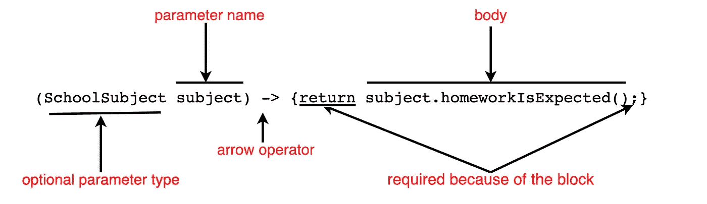
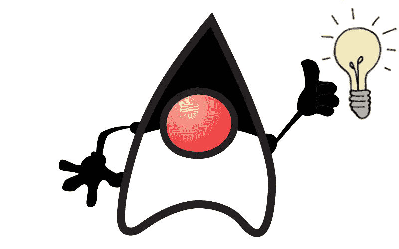

# Java Lambdas 简介

> 原文：<https://medium.com/javarevisited/introduction-to-java-lambdas-58e3854c4fdf?source=collection_archive---------1----------------------->


在 JAVA 8 中，我们的 **OOP(面向对象编程)语言**获得了许多新特性，lambda 表达式(简称 lambdas)就是其中之一。Lambdas 允许我们使用 Java 进行**函数式编程**。在 [OOP](/javarevisited/6-best-object-oriented-programming-books-and-courses-for-beginners-d46235cbda49) 中，我们处理对象的状态，而在[函数式编程](/javarevisited/5-best-java-functional-programming-books-for-beginners-and-experienced-programmers-4daecd159756)中，我们直接写下需要做什么。记住使用 JAVA lambdas 允许我们进行函数式编程，这将有助于我们理解 lambdas 的语法。

我们来看看可以用 [lambda](/javarevisited/7-best-java-tutorials-and-books-to-learn-lambda-expression-and-stream-api-and-other-features-3083e6038e14?source=---------14------------------) 的问题。我们的目标是打印日程表上所有具有特定质量的主题。我们将从学校科目课开始:

```
class SchoolSubject {

    *//instance variabls* private String subjectName;
    private boolean supplies;
    private boolean expectHomework;

    *//constructor, sets instance variables* public SchoolSubject (String subjectName, boolean supplies, boolean expectHomework) {
        this.subjectName = subjectName;
        this.supplies = supplies;
        this.expectHomework = expectHomework;
    }

    public boolean suppliesAreNeeded() {
        return this.supplies;
    }

    public boolean homeworkIsExpected() {
        return this.expectHomework;
    }
   public String toString() {
        return this.subjectName;
    }
}
```

`SchoolSubject` 类有三个在构造函数中设置的私有变量。有两种方法可以告诉我们是否需要供应品以及是否需要作业。还有一个被覆盖的 [toString()方法](https://javarevisited.blogspot.com/2012/12/3-example-to-print-array-values-in-java.html)，它返回主题的名称。

我们将针对不同的内容检查学校科目，因此我们需要定义一个接口:

```
interface CheckSubject{
    boolean check(SchoolSubject subject);
}
```

首先，让我们检查一下我们的学校科目是否有作业。我们创建了一个可以做到这一点的类:

```
class HomeworkChecker implements CheckSubject{

    @Override
    public boolean check(SchoolSubject subject) {
        return subject.homeworkIsExpected() ;
    }
}
```

在这一点上，我们有了我们需要的一切来确定我们的学校科目是否有家庭作业:

```
public class Lambda{

    public static void main(String[] args) {
        List<SchoolSubject> schedule = new ArrayList<>();
        schedule.add(new SchoolSubject("math", true,true));
        schedule.add(new SchoolSubject("reading", true, true));
        schedule.add(new SchoolSubject("choir",false,false));

        *print*(schedule, new HomeworkChecker());
    }

    static void print(List<SchoolSubject> schedule, CheckSubject checker) {
        for (SchoolSubject subject : schedule) {
            if (checker.check(subject)) {
                System.*out*.println(subject);
            }
        }
    }
}
```

在我们的主类中，有一个 print()方法，该方法对每个主题执行检查，并在符合特定标准时打印出它的名称。这个方法不需要知道我们在检查什么，我们可以传递实现`CheckSubject` 接口的任何类的任何对象。我们程序的网关，main 方法，实例化了时间表并向它添加了主题。这是我们程序的输出:

数学
阅读

现在，让我们使用[λ表达式！](https://javarevisited.blogspot.com/2018/08/top-5-java-8-courses-to-learn-online.html)


我们将替换该行:

```
*print*(schedule, new HomeworkChecker());
```

用包含[λ表达式的行](https://javarevisited.blogspot.com/2014/02/10-example-of-lambda-expressions-in-java8.html#axzz6ieZZarMY):

```
*print*(schedule,subject -> subject.homeworkIsExpected());
```

这个λ意味着我们只担心有作业的科目。

如果我们只想打印需要耗材的主题呢？如果我们不使用 [lambda](https://www.java67.com/2014/11/java-8-comparator-example-using-lambda-expression.html) ，我们将不得不编写另一个 checker 类来实现 CheckSubject 接口。使用 lambda 时，我们只需要一行代码，按照上面的例子，我们得到了这样一行代码:

```
*print*(schedule,subject -> subject.suppliesAreNeeded());
```

如果我们想要没有家庭作业的科目:

```
*print*(schedule,subject -> !subject.homeworkIsExpected());
```

不需要供应品:

```
*print*(schedule,subject -> !subject.suppliesAreNeeded());
```

使用 lambdas 使我们的代码更加简洁。


为简洁的代码鼓掌。

正如你所看到的，我们仍然在传递主题列表，但是，我们用我们的 [lambda 表达式](https://javarevisited.blogspot.com/2021/05/java-8-stream-lambda-expression-d.html)替换了 CheckSubject 类型的参数:

```
subject -> subject.homeworkIsExpected()
```

我们的方法 print()希望第二个参数的类型是 CheckSubject，所以 Java 将我们的 lambda 映射到 interface 的方法:

```
boolean check(SchoolSubject subject);
```

这个方法接受一个类型为 SchoolSubject 的参数，因为我们的 print()方法的返回类型是 boolean，所以我们知道我们的 lambda 返回 boolean。

记住，在这篇文章的开始，提到了使用 lambdas 允许我们做[函数式编程](/javarevisited/6-best-online-courses-to-learn-functional-programming-in-java-for-beginners-1dab627b63ca)，更明确地写我们想要使用 lambda 做什么。这里，我们希望位于箭头操作符(→)左侧的参数 subject 由包含右侧 lambda 表达式操作的 lambda 主体进行分析。我们可以把[箭头操作符](http://www.java67.com/2018/06/what-is-double-colon-operator-in-java-8.html#ixzz5IY8AZCCt) (→)看作“进入”，左边的参数看作箭头“进入”右边的 lambda。

[](https://www.java67.com/2020/03/how-to-write-clean-code-using-java-8.html)

上面的例子展示了我们可以编写的最简单的 lambda 表达式。兰姆达斯有一些可选部件，这可能会使事情有些棘手。下一行与上面的表达式做同样的事情:



如果只有一个参数，并且没有明确说明它的类型，我们就不必使用括号。我们不需要只为一个语句加大括号。当我们没有大括号时，我们不必有“返回”和分号。

等一下！！！



[Lambda 表达式](http://www.java67.com/2017/06/10-points-about-lambda-expressions-in-java-8.html)听起来像一个方法——它有参数和主体，但是，它没有名字，所以我们可以把 Lambda 看作匿名方法。从上面的例子中，我们看到我们可以像传递变量一样传递 lambda 异常。

Lambda 表达式允许我们使用 JAVA 进行函数式编程，并使我们的代码更加简洁易读。值得一提的是，lambdas 有助于我们利用多核环境的并行处理能力。

快乐编码我的朋友们！


所有代码都可以在这里找到:

<https://github.com/forfireonly/MediumArticlesJava/blob/master/src/com/company/Lambda.java> 