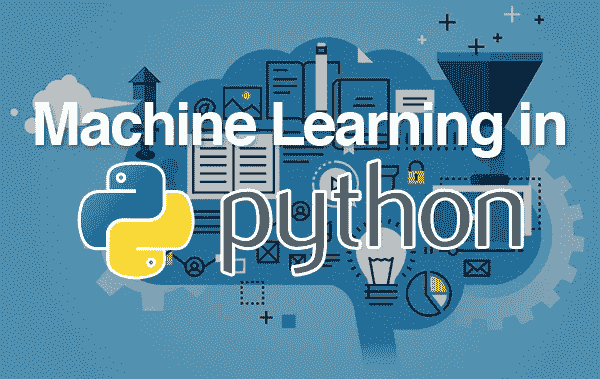

# Python 机器学习入门。

> 原文：<https://medium.com/javarevisited/introduction-to-machine-learning-with-python-46af4f313475?source=collection_archive---------4----------------------->

**机器学习**是一种人工智能，通过使用算法或方法从原始数据中提取模式。

ML 的主要焦点是允许计算机系统在没有明确编程或人工干预的情况下从经验中学习。

## **需要机器学习。**

此时此刻的人类是地球上最聪明和最先进的物种，因为他们能够思考、评估和解决复杂的问题。另一方面，[人工智能](/javarevisited/7-best-courses-to-learn-artificial-intelligence-in-2020-26d59d62f6fe)还处于初级阶段，还没有超越人类智能。

由于可用数据的数量和种类不断增加，计算处理变得更便宜、更强大，以及数据存储变得更经济实惠，[机器学习](/javarevisited/my-favorite-data-science-and-machine-learning-courses-from-coursera-udemy-and-pluralsight-eafc73acc73f)对于以下方面至关重要:
*生成能够分析更大、更复杂的数据并提供更快、更准确结果的模型。
*建立精确的模型，确保组织有更好的机会识别盈利机会或避免未知风险。

## 为什么以及何时让机器学习

在一些情况下，我们需要机器在大范围内高效地做出数据驱动的决策，例如:

**缺乏人类的专业知识。**
缺乏人类专业知识的场景，如在未知领域或太空星球导航，需要机器学习。

**动态场景**
随着时间不断变化的场景需要一台机器来学习，并做出各种数据驱动的决策。

**将专业知识转化为计算任务的困难**
人类可以在各种领域拥有专业知识，但他们无法将专业知识转化为计算任务，如语音识别和认知任务。

## 机器学习的挑战

虽然机器学习正在快速发展，但它还有很长的路要走。这背后的原因是因为 ML 未能克服挑战，例如:

耗时的任务——数据获取、特征选择和检索需要花费大量时间。

缺乏专家——由于 ML 仍在发展，专家的可用性是一项艰巨的工作。

过度拟合和欠拟合的问题——如果模型过度拟合或欠拟合，它不能很好地代表问题。

部署困难——ML 项目的复杂性使得它在现实生活中很难部署。

数据质量——拥有 ML 算法的高质量数据是一个挑战。低质量数据的使用导致与数据预处理和特征提取相关的问题。

## 机器学习的应用。

[机器学习](/javarevisited/10-free-machine-learning-courses-for-beginners-181f83b4c816)是发展最快的技术，用于解决无法通过传统方法解决的现实世界中的复杂问题，例如:

情感分析
股市分析预测
语音合成。
客户细分。
欺诈检测。
天气预报和预测。

**为什么用 Python 做机器学习？**
一套广泛的套餐。
[Python](/javarevisited/top-10-courses-to-learn-python-for-web-development-in-2020-best-of-lot-efe11fb6d212) 有一套广泛而强大的软件包，可用于各种领域，如 numpy、scipy、 [pandas](https://becominghuman.ai/5-best-courses-to-learn-pythons-pandas-libary-for-data-analysis-and-data-science-34b62abb0e96) 和 scikit learn。

简单的原型制作。
Python 为开发新算法提供了简单快速的原型。

Python 拥有用于数据加载、可视化、统计、[自然语言处理](/javarevisited/10-best-nlp-natural-language-processing-with-python-courses-for-beginners-bfe526c6b0b2)和图像处理的库，为数据科学家提供了大量通用和专用功能。

**安装**
对于我们使用机器学习项目的工作，我们将使用预打包的 python 发行版:Anaconda。

Anaconda 是用于科学计算的 [Python](/javarevisited/8-advanced-python-programming-courses-for-intermediate-programmer-cc3bd47a4d19) 和 [R 编程语言](/javarevisited/10-free-python-tutorials-and-courses-from-google-microsoft-and-coursera-for-beginners-96b9ad20b4e6)的发行版，旨在简化包管理和部署。这个发行版包括适用于 Windows、Linux 和 macOS 的数据科学包。
Anaconda 自带 NumPy、SciPy、matplotlib、 [pandas](https://javarevisited.blogspot.com/2019/10/top-5-courses-to-learn-pandas-for-data-analysis-python.html) 、IPython、Jupyter Notebook、scikit-learn。

**要使用 Anaconda 设置 Python 环境，请使用以下步骤:**

使用这个链接从 Anaconda 发行版[下载所需的安装包。](https://www.anaconda.com/products/individual)

您可以根据需要选择 Windows、Mac 和 Linux。

接下来，选择要安装在机器上的 python 版本。最新的 python 版本是 3.9。在那里，您可以选择 64 位和 32 位安装程序。

在选择了操作系统和 python 版本之后，它会将 Anaconda 安装程序下载到您的计算机上。双击该文件，安装程序将安装 Anaconda 包。

**Python ML 生态系统的组成部分。**
构成 python 机器学习生态系统组件的核心库有；

**Jupyter 笔记本**它是一个在浏览器中运行代码的交互环境。它是探索性数据分析的一个很好的工具，被数据科学家广泛使用，并且可以很容易地合并代码、文本和图像。

**NumPy**

Matplotlib
这是一个用于在 Python 中创建静态、动画和交互式可视化的综合库。

**Pandas**
它是一个快速、强大、灵活且易于使用的开源数据分析和操作工具，构建在 [Python 编程语言](/javarevisited/10-free-python-tutorials-and-courses-from-google-microsoft-and-coursera-for-beginners-96b9ad20b4e6)之上。

**了解你的任务和数据**
机器学习过程中最重要的部分是了解你正在处理的数据，以及它与你想要解决的任务之间的关系。
随机选择一个[算法](https://www.java67.com/2018/06/data-structure-and-algorithm-interview-questions-programmers.html)并把你的数据扔向它是不会有效的。在开始构建模型之前，有必要了解数据集中发生了什么，因为每种算法在数据类型和最适合的问题设置方面都是不同的。

机器学习方法。一旦对数据有了清晰的了解，就可以根据以下方法选择最佳算法来解决问题。

**1。监督学习**
在监督学习中，用户向算法提供成对的输入和期望的输出，算法在给定输入的情况下找到产生期望输出的方法。

监督学习最常见的形式是分类和回归。

分类用于将相似的数据点分组到不同的部分。回归输出的是一个数字而不是一个类别，在预测股票价格、事件概率甚至某一天的温度等问题时非常有用。

**监督学习任务的例子有:**

预测房价。
这里的输入可以是平方英尺、房间数量、特征、房子是否有花园。
-通过利用来自成千上万所房屋、其特征和价格的数据，我们现在可以训练一个受监督的机器学习模型，根据模型观察到的例子来预测新房的价格。

检测信用卡交易中的欺诈行为。
这里的输入是信用卡交易的记录，输出是它是否可能是欺诈性的。

其他的例子有天气预测、股票预测等等

## 2.无监督学习。

在无监督学习中，只有输入数据是已知的，没有已知的输出数据给算法。

现实生活中无监督学习的一个例子是将不同颜色的硬币分类成不同的堆。通过观察它们的特征，如颜色，你可以看出哪些硬币是相关的，并把它们归入正确的类别。

[无监督学习](https://www.java67.com/2018/10/top-10-data-science-and-machine-learning-courses.html)常用于聚类和异常检测。

聚类是创建具有不同特征的群体的行为。它试图在一个数据集中找到各种子组。在聚类中，关联学习揭示了描述数据的规则。

异常检测是对不同于大多数数据的罕见或不寻常项目的识别。

无监督学习任务的例子包括:

将客户划分为具有相似偏好的群体
-给定一组客户记录，您可能想要确定哪些客户是相似的，以及是否存在具有相似偏好的客户群体。

对于购物网站来说，这些人可能是“父母”、“书虫”或“游戏玩家”。因为您事先不知道这些组可能是什么，甚至不知道有多少，所以您没有已知的输出。

检测网站的异常访问模式
-为了识别滥用或漏洞，发现与正常模式不同的访问模式通常很有帮助。

每个异常模式可能非常不同，您可能没有任何异常行为的记录实例。因为在这个例子中你只观察流量，你不知道什么构成正常和异常行为，这是一个[无监督问题](https://www.java67.com/2020/07/top-5-machine-learning-algorithms-for-beginners.html)。

## 3.半监督学习。

它是监督和非监督方法的混合。
它采取了中间路线，能够将少量的已标记数据与更大的未标记数据集混合在一起。

## 4.强化学习。

与其他方法相比，它不太常见，也复杂得多。它不使用标签，而是使用奖励来学习。
该方法利用偶尔的积极和消极反馈来强化行为。