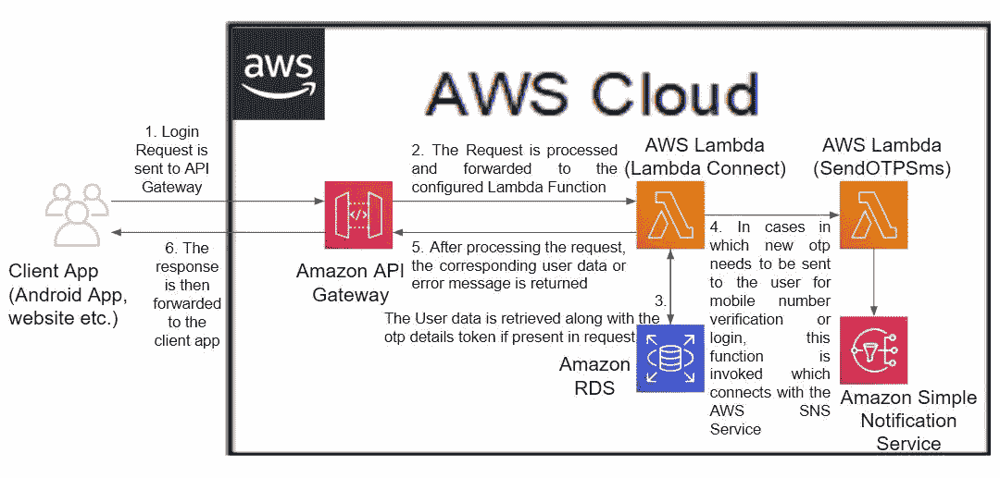
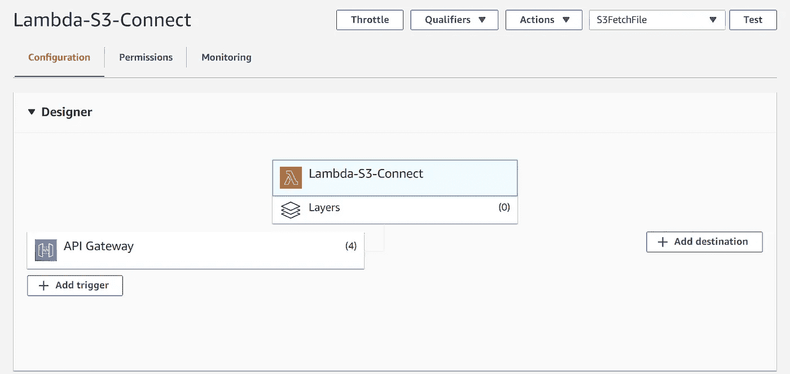
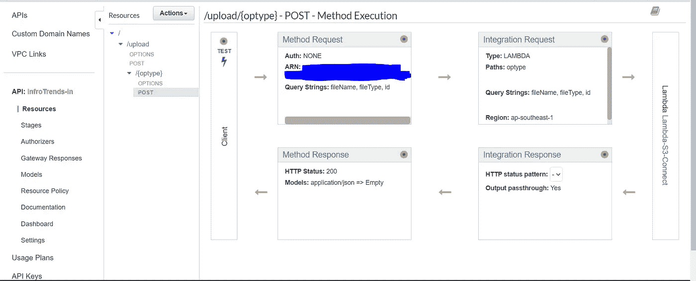

# 亚马逊网络服务中的无服务器计算简介

> 原文：<https://medium.com/javarevisited/introduction-to-serverless-computing-in-amazon-web-services-43f51ffeac9f?source=collection_archive---------4----------------------->

# **无服务器计算及其优势**

无服务器计算是云计算中的一种执行模式，服务提供商按需分配服务器所需的所有资源，并代表客户照管这些资源。

在这种情况下，定价实际上是基于应用程序的总运行时间和它消耗的资源数量等因素。这反过来简化了部署过程。

使用无服务器的主要优点是:

1.  **无需服务器维护**:在无服务器模式下，所有服务器和硬件配置都由服务提供商管理，并保证 SLA 中规定的正常运行时间。这也消除了对服务器容量的依赖。
2.  **性价比**:这比用服务器资源运行一个单独的系统要便宜。 [EC2 实例](/javarevisited/7-best-aws-ec2-amazon-elastic-compute-cloud-online-courses-for-beginners-in-2021-f7a1a55ea719)以每小时的速率定价，即使它们处于空闲状态，即实例的处理能力没有被使用。在无服务器架构的情况下，服务器不会一直运行，只有在接收到任何请求进行处理时才是活动的。因此，在这种情况下，用户仅在服务器活动的时间内付费。
3.  **更好的按需可扩展性**:与受服务器容量限制的基于服务器的应用不同，基于无服务器架构的应用会随着需求的增加而自动扩展。当需求减少时，他们会自动缩减规模。这比为 ec2 实例设置自动扩展组的过程更简单，也更便宜。
4.  **更快更轻松的部署**:开发人员无需将代码上传至服务器，也无需进行任何后端配置，即可发布新版应用。因此，开发者可以直接上传新版本的代码。像 AWS lambda 这样的无服务器计算服务也提供了一个在线的想法来直接处理代码并上传。
5.  **更容易引入新功能**:向应用添加新功能更容易，因为只需要更新基本代码。在 AWS Lambda 的情况下，甚至许多基础依赖项(如基于所选语言版本的运行时)都已经得到维护并随时可用。此外，还有一个功能是快照应用程序的当前状态，并保存它供以后使用，可以作为版本或别名部署，并可以轻松地在它们之间切换。
6.  **延迟增加**:无服务器架构可以全局访问，从而提高性能。该应用程序可以轻松地接受来自全球任何位置的请求。因此，应用程序的响应时间也减少了。
7.  **增加的灵活性**:在[无服务器](https://javarevisited.blogspot.com/2020/07/top-6-courses-to-learn-aws-lambda-and-serverless.html#axzz6iYmMFnsA)中实现应用比传统方法更容易，因为我们可以跳过与设置服务器和添加依赖关系相关的步骤，直接跳到决定应用的实际功能并实现它的部分。此外，通过创建不同的功能，可以更容易地为应用程序实现微服务。
8.  **更多的时间用于设计 UX** :由于我们的应用程序的基础设施是由云服务提供商自己提供的，因此可以将更多的时间用于开发我们应用程序的前端和后端。

# **AWS Lambda**

AWS Lambda 是由 Amazon Web Services 提供的事件驱动的无服务器计算服务，它让我们无需配置任何服务器就可以运行响应事件的代码。

它于 2014 年 11 月 13 日作为“功能即服务(FaaS)”工具推出。它允许开发者定义和上传由基于事件的特定触发动作或执行代码执行的功能。

它还允许将调用记录发送到已配置的目的地，如另一个 lambda 函数、SNS 主题、SQS 队列或 EventBridge 事件总线。这些功能也可用于将输入事件数据保存到 s3。触发器可以是 API Gateway、AWS IOT、 [Apache Kafka](/javarevisited/top-10-apache-kafka-online-training-courses-and-certifications-621f3c13b38c) 等。

AWS 提供的一个额外特性——cloud watch 可以与 AWS lambda 集成，以存储和监控用于调试的日志。

使用无服务器架构实现的登录操作的示例流程

目前，AWS Lambda 支持的语言有:

1.  [。NET Core 3.1](/javarevisited/7-best-online-courses-to-learn-asp-net-core-and-mvc-in-depth-a68c1b728090?source=---------28------------------)([c#](/javarevisited/5-best-c-c-sharp-programming-courses-for-beginners-in-2020-494f7afc7a5c)/powerShell)
2.  [Go](https://www.java67.com/2019/12/top-5-courses-to-learn-go-or-golang.html) 1.x
3.  [Java 8](/javarevisited/top-5-java-online-courses-for-beginners-best-of-lot-1e1e240a758) ，8(Corretto)，11(Corretto-Latest)
4.  [Node.js](/javarevisited/top-10-online-courses-to-learn-node-js-in-depth-8ef0e31ca139) 10x，12x
5.  [Python](/javarevisited/10-best-python-certification-courses-from-coursera-4576890eb6b3) - 2.7，3.6，3.7，3.8(最新)
6.  [红宝石](/javarevisited/10-best-ruby-on-rails-courses-for-beginners-dca4d66e9f7b) 2.5，2.7(最新)
7.  还支持自定义运行时。

AWS Lambda 服务的配置窗格的示例图片。

上图显示了 AWS Lambda 函数中可用的各种配置选项

1.  触发器:触发器是其他 AWS 服务，如 API 网关、AWS IOT、SQS 等。它可以调用 lambda 函数。
2.  目的地:这些是接收成功和失败的调用记录的 AWS 资源。它们可以被配置为流调用或异步调用。对于成功和失败的执行，这也可以用于在该函数执行之后调用另一个 Lambda 函数。
3.  层:这可用于添加额外的资源，如库、定制运行时和独立于功能代码的项目依赖项，以便不同的功能可以使用。
4.  标签:这些是键值标签，可以添加到函数中，将它们分成不同的组以便识别。
5.  环境变量:这些是键值字符串，存储在基于版本的配置中，可以从代码中访问。
6.  IAM 角色:这个角色是 Lamba 函数与其他 AWS 服务和 API 交互所必需的。
7.  Lambda 函数权限:用于定义可以调用 lambda 函数的事件源。
8.  内存分配:这可以在基本设置选项卡中找到，用于配置分配给 lambda 函数的内存以及 CPU 资源。这必须在 128 到 10240 MB 之间。CPU 是根据分配的内存资源调配的。
9.  超时设置:这也可以在 basic settings 选项卡中找到，用于限制每次调用后代码运行的时间。
10.  监控:lambda 函数可以配置适当的策略来访问 cloudwatch 日志，以维护用于调试和监控性能的日志。

# **亚马逊 API 网关**

Amazon API Gateway 是一个完全托管的服务，用于使开发人员更容易创建、发布、监控和保护 API，这些 API 充当应用程序/用户从后端服务访问数据或功能的端点，并创建 [RESTful](/javarevisited/top-5-books-and-courses-to-learn-restful-web-services-in-java-using-spring-mvc-and-spring-boot-79ec4b351d12?source=---------17------------------) 和 WebSocket APIs 以实现 API 之间的实时交互。这通常与 AWS lambda 服务一起使用，以创建无服务器堆栈。

API 网关用于封装来自外部的内部云服务。通过使用此服务，可以监视和控制对内部服务的访问。

创建过程中可用的 API 类型有:

1.  HTTP API(用于 Lambda 和 HTTP 后端)
2.  WebSocket API(用于 Lambda、HTTP 和 AWS 服务-无法导入)
3.  Rest API(用于 Lambda、HTTP 和 AWS 服务)
4.  rest API——用于私有连接，只能在 VPCs 中访问。

API 创建过程分为四个阶段。它们是:

1.  API 名称和集成:在 lambda 函数的情况下，集成选项也可以与资源名称和版本一起指定。此外，还可以配置 API 将与之通信的服务。
2.  配置路由:这里的路由是指配置 URL 路径参数和方法(ANY、POST、PUT 等。)可用于此 API。
3.  定义阶段:这用于定义 API 的阶段名。这些是将要部署 API 的独立环境。这些可以用于维护一个项目的多个环境，其中每个环境都将独立运行，并且可以进行不同的配置。
4.  审查和创建阶段:这用于在创建 API 之前审查一次它的细节。

在 API 网关中，API 的安全性和行为可以分四个阶段进行配置:

1. ***方法请求*** 用于定义客户端在访问后端的请求中应该发送什么，以及客户端收到的响应。这可以用来限制可以发送到所选方法的请求类型。它提供了设置与请求相关的各种参数的选项，如请求路径、URL 查询字符串参数、HTTP 请求头、请求正文和 SDK 设置。可以使用用户定义的模型来指定请求体，这些模型包含 JSON 请求的模式定义和请求的内容类型。在查询字符串的情况下，它们可以在这里被配置为必需的或可选的。

2. ***集成请求*** 用于提供关于 API 所连接的后端服务的信息。这里，API 请求在被发送到所选服务之前被处理。为了调用 Lambda 函数，必须提供集成类型、Lambda 区域和 Lambda 函数的详细信息。其他可配置的参数有:

*   URL 路径参数
*   URL 查询字符串参数
*   HTTP 标题
*   映射模板

可以使用映射约定- method.request 将 URL 和头参数的值映射到特定值。{ " path " | " query string " | " Header " | " multivaluequerystring " | " multivalueheader " }。{参数名称}，其中*参数名称*对应于正在映射的参数。

映射模板用于在将传入的请求发送到后端之前将它们转换为所需的类型，并基于内容类型进行应用。因此，您可以为一个内容类型定义一个映射模板。如果请求中没有指定内容类型，则使用 application/json。

3. ***集成响应*** 用于定义如何处理 lambda 错误或 HTTP 错误代码等响应代码。可以指定从内部服务获取错误响应，并将它们放在可以发送给客户的响应正文中。这可用于将服务中发生的内部错误映射到可发送给客户端的预定义结构中。

4. ***方法 response*** 用于定义在各种场景下，响应客户端发送的请求，客户端应该收到什么。因此，您可以指定哪些类型的状态代码可以发送回客户端，以及基于内容类型的响应主体的定制头和响应模型。