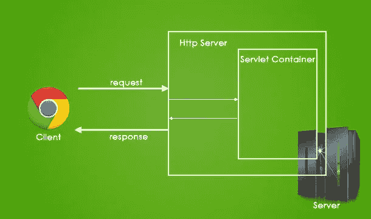
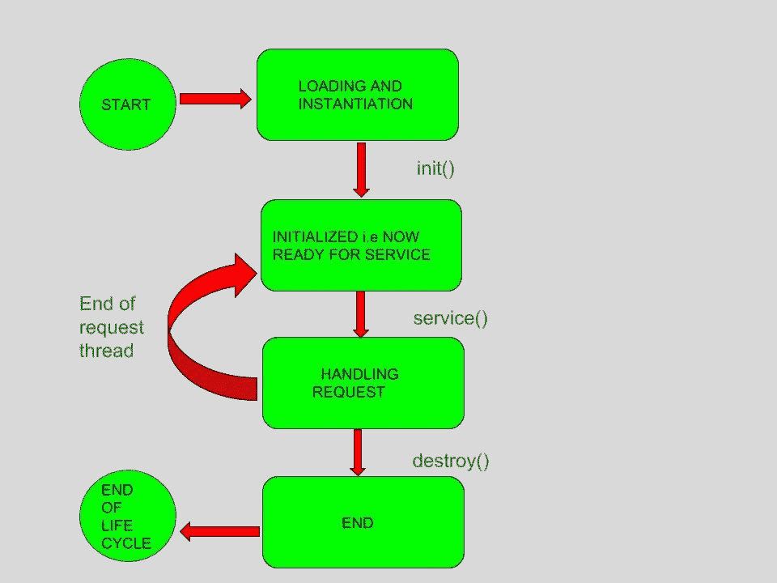
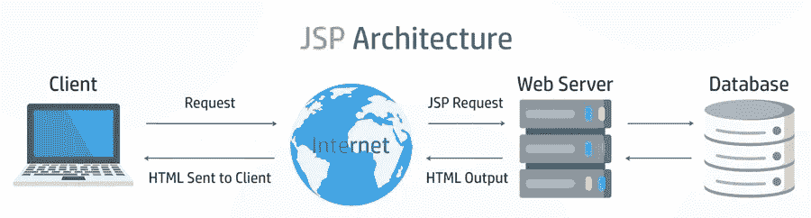
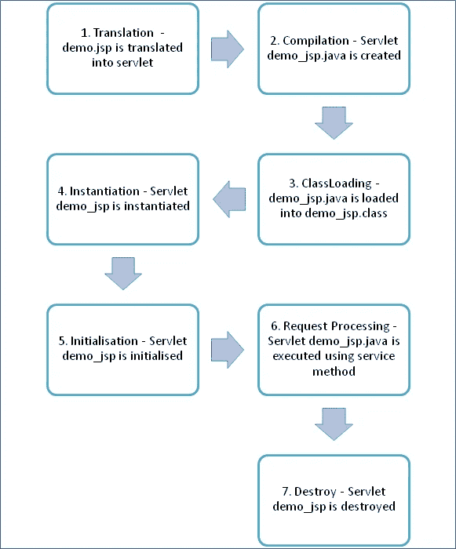

# Servlet 和 JSP 简介

> 原文：<https://medium.com/javarevisited/introduction-to-servlet-and-jsp-7e4706985211?source=collection_archive---------3----------------------->

> 在本文中，我们学习了 Servlet 和 JSP。

# 1 .Servlet:-

Servlet 是一个 Java 程序，运行在 web 服务器端或应用服务器(如 Apache Tomcat)上。Servlet 处理从 web 服务器收到的请求。

图 Servlet 的参考图像

**servlet 中涉及的步骤:-**

1.  web 服务器接收请求。
2.  web 服务器将请求传递给相应的 servlet。
3.  [servlet](https://www.java67.com/2021/07/servlet-and-filter-interview-questions-answers-java-.html) 处理请求并以输出的形式生成响应。
4.  servlet 将响应发送回 web 服务器。
5.  web 服务器将响应发送回客户端，客户端浏览器将它显示在屏幕上。

Servlet 使用 HTTP 协议来处理请求和响应。HTTP 协议是一种无状态协议。

**Servlet 生命周期:-**

Servlet 生命周期主要经历四个阶段:

图:Servlet 生命周期的参考图

1.  **加载一个 Servlet:-**

当服务器启动时， [servlet 容器](https://www.java67.com/2016/06/3-difference-between-web-server-vs-application-server-vs-servlet-container.html)部署并加载所有的 servlet。

**2。正在初始化 Servlet:-**

接下来，通过调用 init *()* 方法初始化 servlet。 *Servlet。Servlet 容器调用 init()* 方法来通知这个 Servlet 实例已经成功实例化，并且即将投入使用。服务方法的语法如下。

公共 void 初始化(ServletConfig 配置)

**3。请求处理:-**

然后，servlet 调用 *service()* 方法处理客户机的请求，并被调用来通知 Servlet 客户机的请求。服务方法的语法如下。

`public void service(ServletRequest request, ServletResponse response)`

service()方法实际上是执行实际任务的主要方法。servlet 容器调用 service()方法来处理来自客户机/浏览器的请求，并将响应返回给客户机。每次服务器收到对 servlet 的请求时，服务器都会创建一个新线程并调用服务。service()方法检查 HTTP 请求类型，并根据需要调用相应的方法。

**4。销毁 servlet:-**

最后，通过调用 *destroy()来终止 servlet。在 Servlet 的生命周期中， *destroy()* 方法只运行一次，并发出 Servlet 实例结束的信号。服务方法的语法如下。*

公共 void 销毁()

init()和 destroy()方法只被调用一次。当收到第一个请求时，servlet 的对象被创建一次。

**创建 Servlet 的步骤:-**

1.  创建 java 类
2.  扩展了 [Httpservlet](https://www.java67.com/2012/12/difference-between-genericservlet-vs-httpservlet-jsp.html) 类

**Servlet 上下文:-**

Servlet 上下文指的是一个包含应用程序和 Web 容器信息的对象。使用 Servlet 上下文，我们可以记录事件，获取特定资源的 URL，并存储供其他 Servlet 使用的属性。

servlet 上下文的重要方法如下:

*   **getInitParameter ():** 返回参数的值。
*   **getInitParameterNames():**返回参数的名称。
*   **void setAttribute ():** 用于设置属性的值。
*   **void getAttribute ():** 用于获取属性的值。
*   **void removeAttribute ():** 用于删除属性。

**请求分配器:-**

[request dispatcher](https://www.java67.com/2016/09/difference-between-include-and-forward-in-Servlet-JSP.html)接口提供了将请求分派给另一个资源的工具，它可能是 [HTML](/javarevisited/10-best-html-and-css-courses-for-beginners-in-2021-6757eec00032) 、 [servlet](/javarevisited/10-best-servlet-and-jsp-online-courses-for-java-developers-d23cf6902360) 或 [JSP](/javarevisited/6-free-courses-to-learn-servlet-jsp-and-java-fx-in-2020-best-of-lot-720201c84f63) 。这个拦截器也可以用来包含另一个资源的内容。

# JSP:-

它代表 **Java 服务器页面**。

图:Jsp 的参考图像

Java Server Pages (JSP)是一种用于开发网页的技术，通过制作特殊的 JSP 标签将 [Java](https://www.guru99.com/java-tutorial.html) 代码插入 HTML 页面。允许 java 代码包含在其中的 JSP 标签是<%———Java 代码— % >。它可以由 HTML 或 XML(两者的组合也是可能的)组成，带有 [JSP 动作](https://www.java67.com/2019/02/difference-between-include-directive.html)和命令。它可以用作 HTML 页面，可以在表单和注册页面中使用，动态内容包含在其中。动态内容包括一些字段，如下拉列表、复选框等。其值将从数据库中提取。我们可以使用请求和响应对象跨页面共享信息。JSP 可用于 web 应用程序中视图层与业务逻辑的分离。

**JSP 的生命周期:-**

JSP 生命周期被定义为将 JSP 页面转换为 servlet，因为 JSP 页面需要首先转换为 servlet 才能处理服务请求。生命周期从 JSP 的创建开始，到它的解体结束。

图:JSP 生命周期的参考图

以下步骤解释了 JSP 生命周期:

1.  JSP 页面的翻译
2.  JSP 页面的编译(将 JSP 页面编译成 _jsp.java)
3.  Classloading (_jsp.java 转换为类 file _jsp.class)
4.  实例化(创建生成的 servlet 的对象)
5.  初始化(_jspinit()方法由容器调用)
6.  请求处理(_jspservice()方法由容器调用)
7.  Destroy (_jspDestroy()方法由容器调用)

JSP 中的**标签:-**

1.  **声明标签** :-用于声明变量。

**语法:-** < %!十二月 var % >

**举例:-** < %!int var = 10% >

**2。Java 脚本** :-它允许我们添加任意数量的 JAVA 代码、变量和表达式。

**语法:-** < % java 代码% >

**3。JSP 表达式** :-它计算表达式并将其转换为字符串。

**语法:-** < %=表达式% >

**示例:-**<% num 1 = num 1+num 2%>

**4。JAVA Comments** :-它包含了为必须忽略的信息而添加的文本。

**语法:-** < % — JSP 评论% >

**JSP 的优势:-**

1.  JSP 为编码动态网页提供了一种更有效、更直接的方法。
2.  JSP 不需要有 java 类文件、web.xml 等附加文件。
3.  当 JSP 代码中发生变化时，Web 容器(或类似 tomcat 的应用服务器)会处理变化，并且不需要重新编译。
4.  可以直接访问 JSP 页面，因此不需要像在 servlets 中那样进行 web.xml 映射。
5.  JSP 代码易于编写和维护。
6.  开发速度变快，不需要重新编译和重新部署。
7.  与其他动态 web 开发工具相比，它具有高性能和可伸缩性。
8.  JSP 是基于 Java 技术构建的，这使得它与平台无关。

**JSP 的缺点:-**

1.  很难调试错误。
2.  第一次访问导致时间的浪费
3.  它的输出是缺少特性的 HTML。