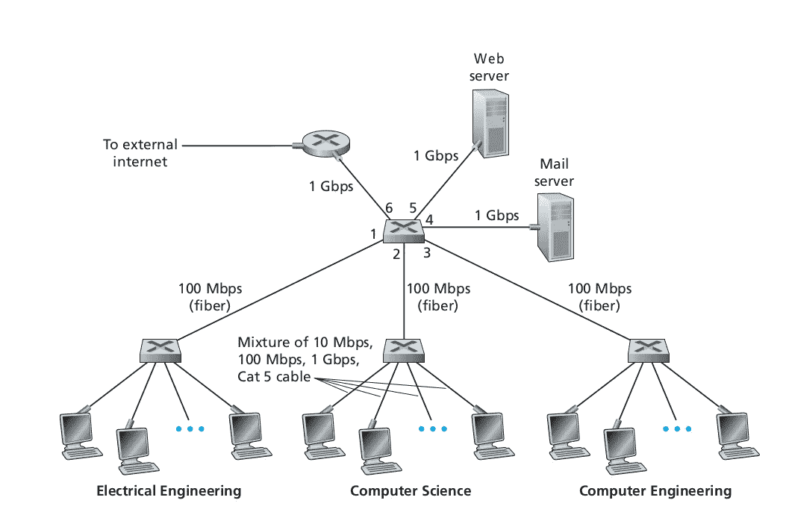
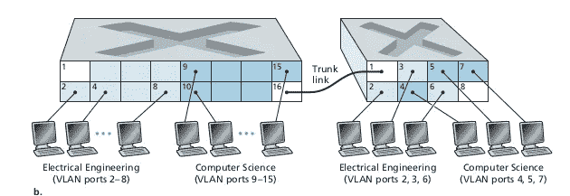
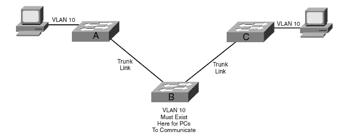
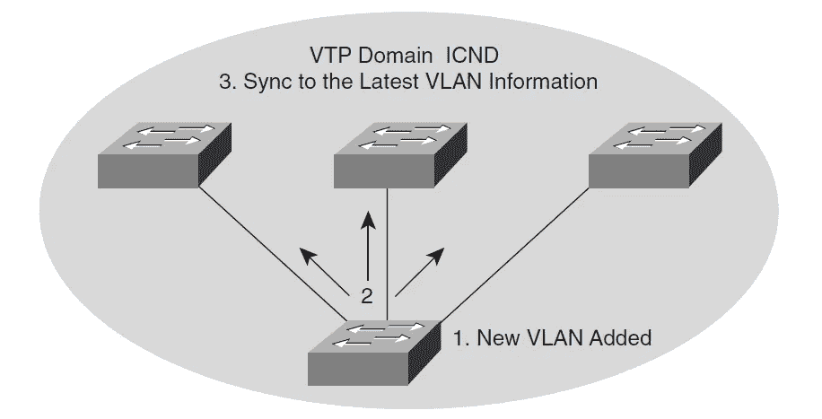
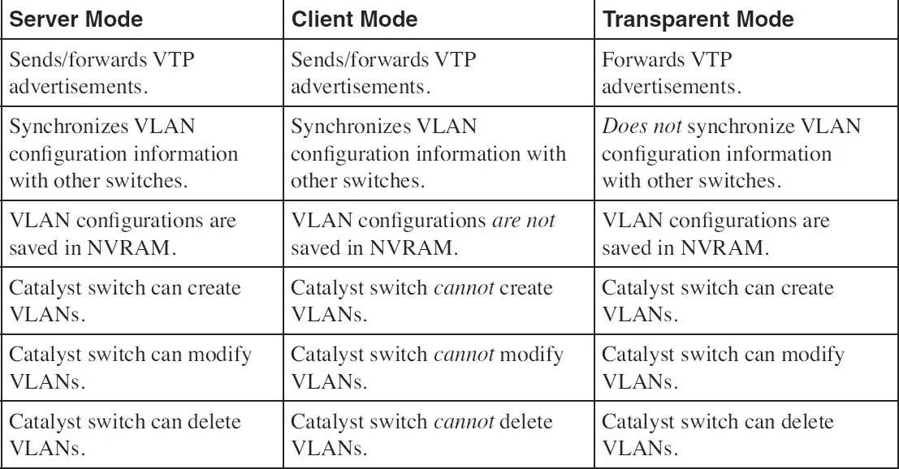
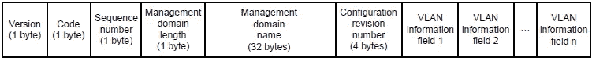
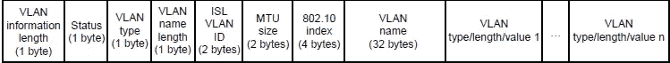

# VLAN 和 VTP 简介

> 原文：<https://medium.com/javarevisited/introduction-to-vlan-vtp-8c4f990c633c?source=collection_archive---------0----------------------->

IST 2019 年 1 月 6 日 18 时 27 分 30 秒

> **跟随进场:**

概念——面临的问题——如何解决问题

> **联网:**

通过通信信道连接在一起的一组设备，用于共享资源和信息。

> **网络分类:**

根据区域覆盖范围，它分为

1.  局域网—覆盖实验室、办公室或建筑
2.  男人
3.  广域网

> **简单局域网:**

高校局域网络

> **局域网中的问题:**

**缺乏隔离:**

*群组流量局限于局域网:*

考虑电气工程中的系统 S1 向电气工程中的系统 S2 发送消息。现在不会涉及其他系统。

*广播流量未本地化:*

如果 S1 系统想在局域网中广播一条消息，那么所有部门的所有系统都会收到这条消息。我们需要限制局域网中广播流量的范围，尤其是出于安全原因。

**开关使用效率低下:**

*场景:*

#部门> #每个部门中的系统

*效果说明:*

所需的开关数量非常高，这确实是低效的。

**用户管理:**

当用户转到另一个部门时，他/她需要负责物理布线

> **子网划分没有帮助:**

我们可以应用子网划分来解决上述局域网问题。

但是，

1)不同物理位置的设备不能在同一个网络中

2)子网中的所有设备都应该连接到一台交换机，并且应该连接到路由器的一个端口

因此，子网划分不能有效解决 LAN 问题，我们选择 VLAN。

> **—*虚*兰:**

虚拟的——实际上存在，但实际上并不存在。

虚拟现实

可以在一个现有的物理局域网上定义多个 VLAN

> **类型:**

1)基于端口

2)基于 MAC 地址

3)基于网络层协议

> **基于端口:**

网络管理员使用交换机管理软件将交换机的端口或接口划分为 VLANs

未申报的端口属于默认的 VLAN

> **VLAN 内部通信:**

将端口 1(未配置)连接到外部路由器。

来自电气部门的 IP 数据报到达路由器，然后路由器将数据报转发给计算机科学部门

如今，一台设备同时充当 VLAN 交换机和路由器

> **互连 VLAN 开关:**

**需要:**

如果用户不是 VLAN 的一部分，但他们想连接到它，我们需要连接两个 VLAN 交换机

**如何:**

浅蓝色— VLAN1，深蓝色— VLAN2

在每台交换机上，为每个 VLANs 分配不同的端口并互连它们

**问题:**

所需端口数随 VLANs 数量而直接变化

为了解决这个问题，我们选择了中继。

> **中继:**

主干——系统的主要部分

在每台交换机中，一个端口充当中继端口。它属于所有的 VLANs

> **问题:**

如果我们只有一个端口，如何区分 VLANs？

> **VLAN 特异性:**

给框架添加一个 VLAN 标签

原始框架

802.1 Q 标记的 VLAN 帧

**字段详细信息:**

TPID —标签协议标识符字段

TCID —标签控制信息字段

2 字节字段，包含

1.  12 位 VLAN ID(一个网络中最多只能有 4096 个 VLAN)
2.  3 位优先级字段

> **基于 MAC 地址的 VLAN:**

**MAC:**

MAC —媒体访问控制

分配给计算机 NIC(网络接口控制器)的唯一 ID

也称为硬件/物理/以太网硬件地址

示例:0A:25:9D:12:34:5R

网络管理员使用交换机管理软件根据 MAC 地址配置 VLANs

**优势:**

这里不需要重新配置

**缺点:**

当交换机的单个端口上存在不同 VLAN 的成员时，就会出现问题

> **基于网络层协议的 VLAN:**

IP 是网络层协议

**IP 地址:**

分配给连接到使用 IP 进行通信的计算机网络的设备的数字标签

例如:172.16.254.11

网络管理员使用交换机管理软件根据 IP 地址配置 VLAN

**优势:**

1)用户可以移动工作站

2)不需要帧标记

> **对 VTP 的需求:**

我们需要在交换机上手动创建 VLAN，以维护中继交换机之间的 VLAN 连通性

**问题:**

手动配置既耗时又容易出错

所以，我们去 VTP

> VTP:

VTP — VLAN 中继协议— L2 层协议—维护 VLAN 配置的一致性

对单个 VTP 服务器交换机的更改会传播到所有中继连接的交换机

> **VTP 如何工作:**

**第一步:**

VLAN 配置在 VTP 交换机中

**第二步:**

它被发送到连接到 VTP 交换机的所有交换机

**第三步:**

所有开关同步最新的 VLAN 信息

> **VTP 开关的三种模式:**

> **VTP 帧格式:**

广告—包含 VLAN 配置信息

**摘要广告:**

什么？讲述有关发送设备的信息和有关 ad 的摘要信息

**字段说明:**

关注者——关注的广告子集数量

更新者身份— IP 地址

更新时间戳—更新 CRN 的时间

MD5 —整个 VLAN 的 MD5 摘要值

管理域名—网络的名称

**广告请求:**

什么？请求 VLANs 的配置信息

**字段说明:**

版本— VTP 版本

代码—帧格式

MDL—MDL 名称的长度

起始值—如果我们需要 n 个 VLAN 的信息，我们指定第一个 VLAN 的起始 ID

如果我们需要所有 VLANs 的信息，我们需要将“0”作为起始值

**子集广告:**

什么？关于被通告的 VLANs 的信息

> **VLAN 配置使用 VTP:**

1)每 5 分钟或当发生变化时，使用多播帧通过默认 VLAN 发送 VTP 广告

2)当收到 VTP 广告时，交换机检查管理域名和密码，然后检查配置修订号(CRN)

3)如果接收的 CRN 大于其 CRN，则意味着已经进行了更新。因此，交换机相应地同步其配置

> **参考文献:**

计算机网络——自上而下的方法，第六版，Kurose 和 Ross