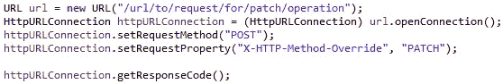

# 无效的 HTTP 方法:补丁

> 原文：<https://medium.com/javarevisited/invalid-http-method-patch-e12ba62ddd9f?source=collection_archive---------0----------------------->

令人沮丧对吗？当 Java 告诉你一个有效的 HTTP 方法**补丁不是有效的**时，作为一个 REST API 开发者，你的眉毛肌肉开始伸缩了。如果你正在读这篇文章，脸上带着笑容(我真的祈祷你会这样)，这意味着你已经对上面的 Java 异常动了手脚，至少一次。

如果您正在构建一个 **Java 客户端**应用程序，而**使用了一个** [**REST** ful API](/javarevisited/top-5-books-and-courses-to-learn-restful-web-services-in-java-using-spring-mvc-and-spring-boot-79ec4b351d12) ，那么您可能会经常遇到这种异常。这是因为 Java 客户端将使用[***HttpURLConnection***](https://docs.oracle.com/javase/8/docs/api/java/net/HttpURLConnection.html)类来表示到后端 API 的连接，问题就在这里。

连接到 HTTP URL 的简单方法

如果你仍然对补丁 http 方法和 PUT http 方法到底有什么不同感到困惑，我想我们只需要回忆一下 Jason Byrne 在他的一篇文章中所说的区别。在 REST 的世界中，补丁请求的目标是**更新现有资源的一个或多个属性**，而 [PUT 请求](https://javarevisited.blogspot.com/2016/10/difference-between-put-and-post-in-restful-web-service.html)的目标是做同样的事情，但只是做了一点小小的改动，如果没有找到，它可以**创建一个新资源**。

## 不开玩笑！

是的，我不是在开玩笑。虽然 PATCH 是一个完全有效的 HTTP 请求方法，但是 [Java](/javarevisited/10-best-places-to-learn-java-online-for-free-ce5e713ab5b2) 拒绝识别它。

我在写上一篇文章时就经历过这种情况，我构建了一个 RESTful 服务来演示向 Google OAuth 2.0 的迁移。

 [## 带有 Google 客户端库的 OAuth 2.0:Java SDK

### 免责声明:本实施指南旨在增强用户对概念的理解，而不是构建一个完整的…

medium.com](/@hrishabhpurohit/oauth-2-0-with-google-client-libraries-java-sdk-e5439accdf7a) 

我碰巧有一个用例的补丁方法，并且正在使用我的一个 Java HTTP 客户端测试它。

在执行该行时引发了异常:

[HttpURLConnection](https://www.java67.com/2019/03/7-examples-of-httpurlconnection-in-java.html) 类不识别这个 http 方法。

## 好，所以我不能通过 JAVA 发送补丁请求？

在您下结论之前，让我向您保证，确实有一种方法可以通过 Java 发送补丁 http 请求。但是，不是直截了当的。

> 因此，我们在这里遇到的是**无法让我们的 http 客户端**(构建在 Java 上)向**发送请求元数据中的特定 HTTP 方法类型**，以便服务器能够将请求导航到其对应的处理程序方法。

## 我们来试试糊弄 Java 吧！

这会很有趣的，对吧？

虽然不允许我们在 HttpURLConnection 类中将“PATCH”设置为 http 请求方法，但是我们可以设置任何我们想要的请求头。

我的意思是我们可以使用 http 协议提供的**请求头**，它在内部**覆盖了在 [HttpURLConnection](/javarevisited/how-to-send-http-get-request-and-parse-json-data-into-string-using-java-3c0cf7eeebbc) 对象中设置的 HTTP 方法类型**。

知道我们是怎么骗过 Java 的了吧？

我们最初将 http 方法类型设置为“POST”，由 HttpURLConnection 类识别，并将请求头“***X-HTTP-Method-Override***”设置为值“PATCH”。这很管用。

# 结论

在本文中，我们观察到了一种通过 Java http 客户端使用 PATCH REST API 方法的方式。

继续深挖！