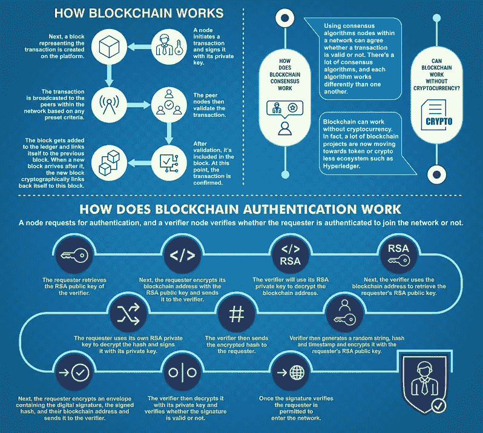
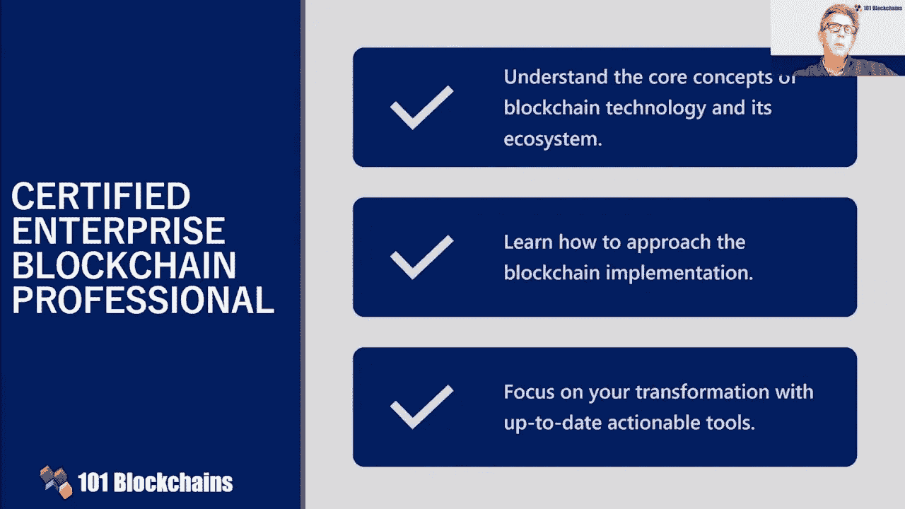
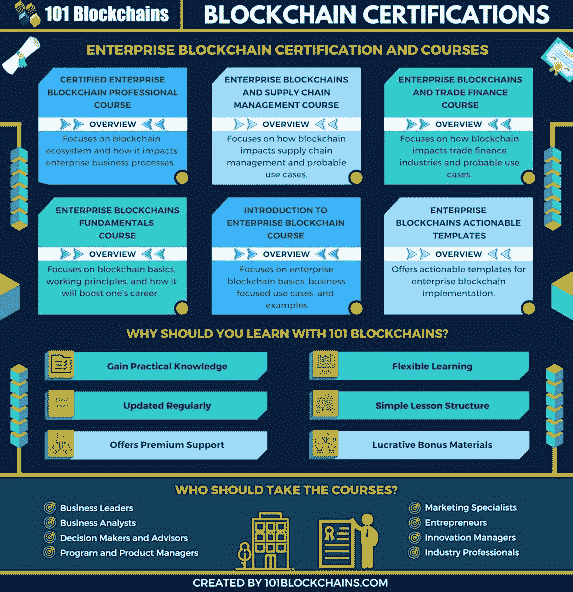
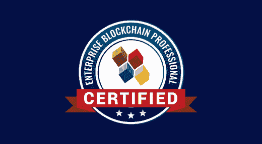
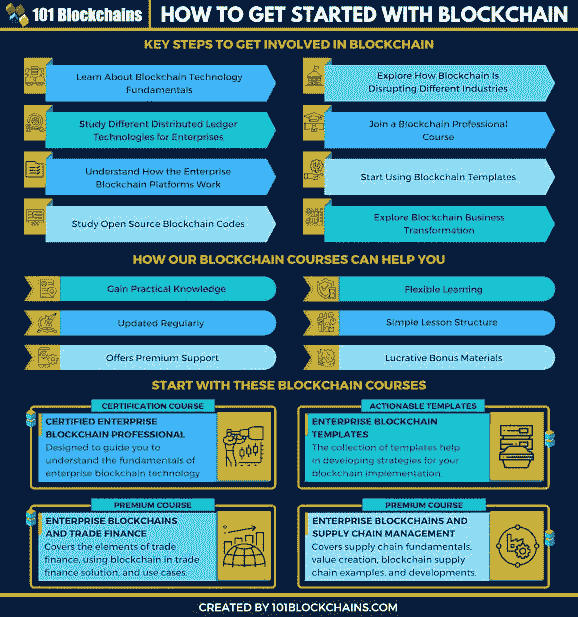

# 101 区块链认证企业区块链专业认证值得吗？回顾

> 原文：<https://medium.com/javarevisited/is-certified-enterprise-blockchain-professional-by-101-blockchains-worth-it-cebp-review-342a48d19263?source=collection_archive---------5----------------------->

## 你想成为区块链专业人士，并想知道是否加入 101 区块链 CEBP 认证企业区块链专业计划？读一下

区块链 101 号

大家好，去年，我正在寻找一个全面的区块链认证，当时我偶然发现了由 101 Blockchins.com 认证的<https://www.shareasale.com/r.cfm?b=1713885&u=880419&m=105464&urllink=&afftrack=>**(CEBP)，这是一个致力于教你区块链、NFT、元宇宙和 Web3 技能的网站。**

**这是我从一开始就在寻找的区块链课程，因为我发现大多数课程要么太浅，要么太专业，你会从第一堂课开始就感到困倦。**

**这个[区块链课程](https://www.shareasale.com/r.cfm?b=1713885&u=880419&m=105464&urllink=&afftrack=)刚刚好。它不仅涵盖了你需要了解的关于区块链技术的一切，还以引人入胜的详细方式涵盖了它们。**

**当我第一次在我的 [**最佳区块链认证和课程**](/javarevisited/best-blockchain-courses-and-certification-in-2020-63729f8f04d0) 列表中提到这门课程时，你们中的许多人要求我发布这门课程的详细评论，我们在这里。**

**这门课程最棒的一点是，你还将获得区块链认证，你可以把它放在简历上，展示你的区块链技能。这可以帮助你获得区块链开发者的工作，或者帮助你进入利润丰厚的区块链技术领域，并[成为区块链开发者](https://javarevisited.blogspot.com/2022/06/best-coursera-courses-for-blockchain.html)、架构师、项目经理或区块链顾问。**

**技术的不断变化和创新对劳动力市场产生了重大影响。例如，新技术可能会取代劳动力中的人力，而一些技术需要新的专业人员来完成这项工作。**

**作为一种技术突破，区块链的稳步增长已经成为技术劳动力市场的一个重要方面。几乎每个对区块链感兴趣的企业都希望有一个[认证的企业区块链专家](https://www.shareasale.com/r.cfm?b=1713885&u=880419&m=105464&urllink=&afftrack=)来帮助他们过渡到区块链。**

**因此，一个认证的区块链专业人士肯定可以为他们在区块链的专业技能获得一些丰厚的薪水和工作福利。该认证证明了他们的工作技能和知识，并为区块链的工作提供了一个可信的竞争优势。**

**本文将帮助你发现 101 区块链[认证企业区块链专业人士](https://www.shareasale.com/r.cfm?b=1713885&u=880419&m=105464&urllink=&afftrack=) (CEBP)是否能帮助你实现职业目标。顺便说一下，如果你已经下定决心，想要加入这个认证项目，那么你也可以使用我的代码 **BCHAIN20** 获得 20%的折扣。**

****

## **认证的区块链专业人才是否紧缺？**

**在选择区块链认证之前，你需要了解的第一件事是认证专家的机会范围。您必须知道，企业正在使用基于区块链的系统来简化和优化他们的流程。**

**此外，区块链的开发者已经成为最受欢迎的科技专业人士之一。**

**全球对区块链专业人士的需求每年都在增长，在美国、柏林、伦敦和香港都有很好的工作机会。区块链专业人士的平均年收入约为 12 万美元，几乎每个专业人士都想抓住这个机会。**

**[**101 区块链学院**](http://shrsl.com/349rm) 出了 CEBP 最好的区块链认证，你可以去看看有没有前途的工作机会。CEBP 认证如何提供价值优势？毕竟，它只是现在可用的企业区块链认证的长列表中的另一个条目。**

****

## **为什么要选择认证企业区块链专业认证？**

**如今，你可以在网上找到的众多区块链认证课程会造成很大程度的混乱。你必须通过大量的认证课程，然后才能决定具体的认证。有趣的是，[**【101】区块链**](http://shrsl.com/349rm) 提出了一个可信的解决方案，将区块链认证与相关的工作角色联系起来。**

**[CEBP](https://www.shareasale.com/r.cfm?b=1713885&u=880419&m=105464&urllink=&afftrack=) (认证企业区块链专家)认证是为任何对区块链技术的企业应用感兴趣的人量身定制的。它提供了您在任何认证中都会发现的一般好处，例如**

*   **切实证明你的区块链专业知识和知识。**
*   **证明您对区块链技术和专业发展的承诺。**
*   **了解区块链在现实世界中的企业应用。**
*   **使用区块链工具和技术的实际专业知识。**
*   **与非认证同行相比，薪酬更高。**

**你可以在今天的互联网上找到任何一个区块链顶级认证的好处。作为区块链专家，这些好处无疑会提升您的投资组合，从而为您的职业生涯增添价值。**

**然而，重要的是要想一想 CEBP 认证值得任何有抱负的区块链专业人士付出努力和时间的具体原因。**

****

## **是什么让企业区块链专业认证独一无二？**

**几乎每一个声称你会成为区块链认证专家的认证都有一些独特的亮点。有趣的是，认证之间的差异在它们提供的内容的真实性上是显而易见的。 [CEBP 区块链认证](https://dev.to/javinpaul/5-best-courses-to-learn-blockchain-for-beginners-in-2022-2me4)是一个独特的证书，它有助于发展你的技能和区块链知识。**

**以下是这种流行的区块链认证的独特亮点。**

****1。涵盖区块链基础知识**
CEBP 认证测试考生对区块链技术基础知识的掌握程度。你必须证明你的专业知识在区块链基本面和共识机制的工作，如工作证明。此外，您还可以了解有关在区块链中创建块链的方法的更多信息。与此同时， [CEBP 区块链认证](https://www.shareasale.com/r.cfm?b=1713885&u=880419&m=105464&urllink=&afftrack=)也吸引了公众和私人区块链以及智能合同基础知识的关注。**

****2。企业区块链平台基础知识**
任何想成为区块链认证专家的人，都必须对所有企业区块链平台有一个牢固的印象。企业区块链平台提供了在业务用例中使用区块链的工具。通过 CEBP 认证，您可以深入了解如何在区块链开发平台上工作，如[以太坊](https://javarevisited.blogspot.com/2021/11/top-5-courses-to-learn-ethereum-for.html)、 [Hyperledger Fabric](https://javarevisited.blogspot.com/2022/02/top-5-courses-to-learn-hyperledger-blockchain.html) 和 Corda。**

****3。区块链在贸易金融中的应用**
作为专业人士的最佳区块链认证，CEBP 认证为区块链在贸易金融中的应用提供了启示。您可以探索对[加密](https://javarevisited.blogspot.com/2022/01/5-best-courses-to-learn-cryptocurrency.html)及其在区块链生态系统中的相关性的详细了解。此外，还主要关注区块链在贸易融资中的应用。**

****4。区块链的应用**
与其他任何顶级的区块链认证不同， [CEBP 认证](https://www.shareasale.com/r.cfm?b=1713885&u=880419&m=105464&urllink=&afftrack=)帮助你揭开关于区块链应用的信息。本课程概述了区块链在供应链管理应用中的潜在影响，并讨论了使用案例。认证课程反映了确定工具以促进区块链数字化转型的最佳实践。**

****5。区块链的一般用例**
你也可以通过多个例子来提高自己对不同领域的区块链用例的认识。[认证课程](https://javarevisited.blogspot.com/2020/08/top-10-coursera-courses-specilizations-and-certifications.html)帮助您了解区块链应用程序在不同企业业务场景的不同用例中的含义。**

****

## **认证企业区块链专业(CEBP)值得吗？**

**关于认证企业区块链专家(CEBP)认证的最后概述是，它是一个有效的凭证。区块链技能和知识主题的全面覆盖是认证的最大好处，对我来说这是值得的。**

**此外，您还可以享受作为您的导师的主题专家的保证。 [101 区块链学院](http://shrsl.com/349rm)确保来自专家的全天候支持，这有助于更好的学习体验。**

**CEBP 认证不仅仅是另一个认证的区块链专家证书，因为它具有许多其他优势。除了区块链相关认证的一般好处之外，你还可以在广泛的领域积累知识。**

**最新的课程，全面覆盖区块链概念、工具和生态系统，使该认证成为 2022 年最佳区块链认证，值得追求。在价格方面，你可能会发现它有点贵，但它完全值得，你也可以使用 [**折扣代码 BCHAIN20 获得 20%的折扣**](https://www.shareasale.com/r.cfm?b=1713885&u=880419&m=105464&urllink=&afftrack=) 。**

****

**随后，该认证还将让您深入了解区块链的实际使用案例，为学习者提供更多信息。**

**以上就是 101 区块链学院**审核认证企业区块链专业认证**的全部内容。CEBP 认证的候选人将不仅有技能的证明，而且有在工作的真实生活情况中实施它们的实际知识。了解更多关于 101 区块链 CEBP 认证的信息，以及它现在可以如何帮助你。**

**您可能喜欢的其他**区块链和技术文章****

*   **[面向开发者的 10 门最佳区块链课程](/javarevisited/best-blockchain-courses-and-certification-in-2020-63729f8f04d0)**
*   **[Coursera 的 6 门最佳区块链开发课程](https://javarevisited.blogspot.com/2022/01/5-best-blockchain-certifications-and.html)**
*   **[初学者学习区块链的 5 个最佳网站](https://www.java67.com/2020/07/top-5-websites-to-learn-blockchain-in.html)**
*   **[Meta 前端和后端认证值得吗？](/javarevisited/is-the-meta-frontend-and-backend-developer-certificates-on-coursera-worth-it-review-125f1571e515)**
*   **[我最喜欢的学习以太坊的在线课程](https://javarevisited.blogspot.com/2021/11/top-5-courses-to-learn-ethereum-for.html)**
*   **[学习数据科学表格的前 5 门课程](https://javarevisited.blogspot.com/2019/07/top-5-tableau-online-courses-and-certifications-for-data-science-engineers.html)**
*   **[初学者学习 Python 的 10 门免费课程](https://hackernoon.com/10-free-python-programming-courses-for-beginners-to-learn-online-38312f3b9912)**
*   **[2022 年学习 Python 的 5 大课程](https://hackernoon.com/top-5-courses-to-learn-python-in-2018-best-of-lot-26644a99e7ec)**
*   **[2022 年学习 Python 的 10 个理由](https://hackernoon.com/10-reasons-to-learn-python-in-2018-f473dc35e2ee)**
*   **[5 个深度学习区块链的最佳平台](https://faun.dev/c/stories/javinpaul/5-best-platforms-to-learn-blockchain-technology/)**
*   **[学习数据科学 Python 的 5 本书](https://javarevisited.blogspot.com/2019/08/top-5-python-books-for-data-science-and-machine-learning.html)**
*   **[初学者学习数据科学的 10 门课程](https://hackernoon.com/10-machine-learning-data-science-and-deep-learning-courses-for-programmers-7edc56078cde)**
*   **[如何成为区块链架构师？路线图](/javarevisited/the-blockchain-developer-architect-roadmap-d212d3bbbb00)**
*   **[面向程序员的 10 门机器学习和深度学习课程](https://hackernoon.com/top-5-courses-to-learn-python-in-2018-best-of-lot-26644a99e7ec)**
*   **[学习 Solidity 编程语言的 5 门最佳课程](https://javarevisited.blogspot.com/2022/01/top-5-courses-to-learn-solidity-for.html)**
*   **[2022 年学习区块链的 7 门免费课程](/javarevisited/7-free-courses-to-learn-blockchain-in-2020-764e66b47ebe)**

**感谢您阅读本文。如果你喜欢这篇关于 101 区块链认证企业区块链专家(CEBP)认证的评论，请分享给你的朋友和同事。如果您有任何问题或反馈，请留言。**

****p . s .**——如果你真的想学习区块链技术，那么我也建议你不仅要参加这个认证，还要获得一个 [**101 区块链会员资格**](https://shareasale.com/r.cfm?b=1696402&u=880419&m=105464&urllink=https%3A%2F%2F101blockchains%2Ecom%2Fmembership%2F&afftrack=) ，以访问他们所有的区块链课程、认证和培训材料。它的年计划费用约为每月 25 美元，并提供所有区块链培训资源的访问权限。我的许多学生和读者都选了这门课，反馈非常好。**

**</javarevisited/7-free-courses-to-learn-blockchain-in-2020-764e66b47ebe> **