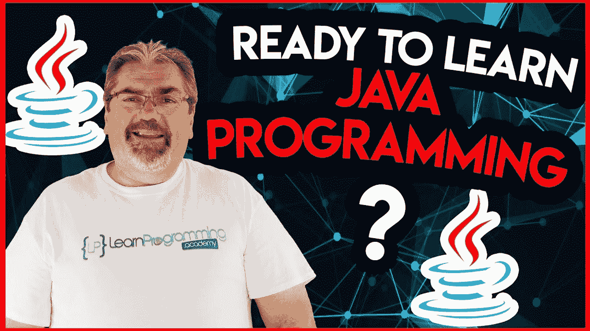

# Udemy 完整的 Java 大师班课程值得吗？回顾

> 原文：<https://medium.com/javarevisited/is-complete-java-masterclass-from-udemy-good-to-learn-java-online-in-2021-review-cef466469733?source=collection_archive---------0----------------------->

## 我在 Udemy 上对 Tim Buchalaka 的软件开发人员 J **ava 编程大师班课程的评论，2023 年学习 Java 值得吗？**

image_credit — Udemy

大家好，如果你想在 2023 年从头开始学习 Java 编程，并寻找最好的 Java 课程加入，那么你来对地方了。此前，我已经分享了 [**最佳 Java 编程课程**](/javarevisited/top-5-java-online-courses-for-beginners-best-of-lot-1e1e240a758) ，以及[学习 Java 的最佳场所](/javarevisited/10-best-places-to-learn-java-online-for-free-ce5e713ab5b2)，而今天，我将回顾一下 Udemy 评分最高的 Java 课程之一 Tim Buchalaka 的《面向软件开发人员的 Java 编程大师课》。

这门课程之前被称为[完整的 Java 大师课](https://click.linksynergy.com/fs-bin/click?id=JVFxdTr9V80&subid=0&offerid=323058.1&type=10&tmpid=14538&RD_PARM1=https%3A%2F%2Fwww.udemy.com%2Fjava-the-complete-java-developer-course%2F)。我在不同的文章中多次提到这门课程，因为它是目前学习 Java 的最佳课程。

它既全面又最新，最重要的是它非常划算，这使它成为 2023 年学习 Java 的绝佳资源。你只需花 10 美元就能买到这个 80 小时的综合课程，这真是太棒了。

如果你赶时间，你可以去参加 [**面向软件开发人员的 Java 编程大师班**](https://click.linksynergy.com/fs-bin/click?id=JVFxdTr9V80&subid=0&offerid=323058.1&type=10&tmpid=14538&RD_PARM1=https%3A%2F%2Fwww.udemy.com%2Fjava-the-complete-java-developer-course%2F) ，这是 2023 年在线学习 Java 的一门清晰、实用、全面、最新的课程。

您不仅将学习如何设置您的环境，还将与 Tim Buchalaka 一起学习如何编写 Java 代码。该课程还附带了许多测验、练习和小项目，使学习变得非常有趣。

<https://click.linksynergy.com/fs-bin/click?id=JVFxdTr9V80&subid=0&offerid=323058.1&type=10&tmpid=14538&RD_PARM1=https%3A%2F%2Fwww.udemy.com%2Fjava-the-complete-java-developer-course%2F>  

如果你还没有决定是否要参加这个课程，那么*读一读我对软件开发人员 Java 编程大师课程的评论*，我相信你会找到答案。

Java 语言的巨大普及使得许多学生试图学习并在这个领域开始新的职业生涯。这种语言在各个行业都在发展，比如使用 java 创建 android 应用程序，以及为任何运行 Java 的系统创建桌面应用程序，比如 Windows、 [Linux](/javarevisited/7-best-linux-courses-for-developers-cloud-engineers-and-devops-in-2021-7415314087e1) 和 macOS。

Java 是甲骨文公司早在 1995 年创造的一种高级编程语言，使用易于理解、学习和记忆的命令。

它还支持 OOP ( [**)面向对象编程**](https://www.java67.com/2018/02/5-free-object-oriented-programming-online-courses.html) )并使用我前面提到的可以在任何平台上运行的 JavaFX 创建用户界面。

许多平台上都有大量的 Java 课程，如 [Udemy](https://javarevisited.blogspot.com/2018/01/top-10-udemy-courses-for-java-and-web-developers.html) 、 [Coursera](https://javarevisited.blogspot.com/2020/08/top-10-coursera-courses-specilizations-and-certifications.html) 、 [edX](https://javarevisited.blogspot.com/2021/05/top-10-edx-courses-and-certificates-for.html#axzz6v6xLSPvq) ，甚至 YouTube 视频，但它们都教你这种语言的基础知识，但并不深入。在本文中，我将回顾一门建立在 Udemy 上的课程，它肯定会让你在使用 Java 方面变得专业。

# 2023 年 Udemy 上 Tim Buchalka 的 Java 编程大师班回顾

现在，您已经了解了 Java 的重要性以及这门课程如何帮助您学习 Java，是时候深入研究和回顾这门课程的各种参数了，如讲师、课程内容、授课、参与度和社会证明，以决定您是否应该参加这门 Udemy 课程。

# 1.教师

这个课程是由 Tim Buchalka 在许多学院和其他讲师的帮助下创建的，但是我将和你讨论这位主要讲师的成就。Tim Buchalka 是一名拥有超过 35 年经验的软件开发人员，他的视频课程被 PayPal 和 IBM 这样的大型科技公司的员工购买。

他的 12 所学校招收了超过 80 万名学生，当你使用他的在线课程学习一些技能时，你可以说你掌握得很好。

以下是加入本课程的链接— [**完整的 Java 编程大师班**](https://click.linksynergy.com/fs-bin/click?id=JVFxdTr9V80&subid=0&offerid=323058.1&type=10&tmpid=14538&RD_PARM1=https%3A%2F%2Fwww.udemy.com%2Fjava-the-complete-java-developer-course%2F)

# 2.课程结构和内容质量

[**课程**](https://click.linksynergy.com/fs-bin/click?id=JVFxdTr9V80&subid=0&offerid=323058.1&type=10&tmpid=14538&RD_PARM1=https%3A%2F%2Fwww.udemy.com%2Fjava-the-complete-java-developer-course%2F) 从蒂姆·布查尔卡开始，他解释了课程是如何组织的，以及一些与课程相关的设置，如获得帮助和视频质量等等。让我们开始探索课程内容:

## 2.1.设置过程

在开始使用 [Java](https://www.java.com/en/) 进行编码之前，您需要首先在您的机器系统上为 windows、Linux、macOS 设置这种语言的适当版本，并选择适当的 IDE 来编写实际代码，为此您将使用 [Intellij IDEA](/javarevisited/7-best-courses-to-learn-intellij-idea-for-beginners-and-experienced-java-programmers-2e9aa9bb0c05) 。

## 2.2.学习 Java 基础知识

在您设置好使用 Java 开始编码所需的一切之后，您将学习 Java 基础知识，如变量、创建您的第一个 Hello World 程序、逻辑运算符、表达式、switch 语句等等。好的方面是你会得到很多小练习，通过练习更好的学习这些基础。

## 2.2.面向对象的概念

正如我在上面提到的，Java 是一种 [**面向对象编程**](https://javarevisited.blogspot.com/2018/08/5-object-oriented-programming-and-design-courses-for-Java-programmers.html) 语言，讲师创建了整整两个部分来教授您这些技能，这将有助于您减少代码长度，使其更易于理解、故障排除等等。

## 2.3.高级 Java

在学习了 Java 语言的概念以及面向对象的编程方法之后，您将学习更高级的技能，例如 Java 内置列表、[抽象类](https://javarevisited.blogspot.com/2010/10/abstraction-in-java.html)、[泛型类](https://javarevisited.blogspot.com/2012/08/how-to-write-parametrized-class-method-Generic-example.html)，使用包为您的程序添加更多的功能，以及更多的技能。

## 2.4.JavaFX

Java 也可以用来创建运行在任何平台上的用户界面应用程序，如 windows、 [Linux](/javarevisited/top-10-courses-to-learn-linux-command-line-in-2020-best-and-free-f3ee4a78d0c0?source=collection_home---4------0-----------------------) 和 macOS，因此本节将向您介绍 [JavaFX](https://javarevisited.blogspot.com/2020/06/top-5-courses-to-learn-java-fx-in-2020.html) 是一个创建用户界面的软件平台或软件包，您将花费十多个小时来学习这些技能。

## 2.5.数据库技术

使用 JavaFX 创建用户界面应用程序时，您可能需要在数据库中存储一些数据，本节将教您使用 [SQL 数据库](/hackernoon/top-5-sql-and-database-courses-to-learn-online-48424533ac61)技术来实现这一目的，并花七个多小时来学习数据库。

## 2.6.Java 网络

您可能需要让您的应用程序与 web 交互，例如从一些网站提取数据或连接到服务器等等。本节将教你使用 Java 与[网络](/javarevisited/10-free-full-stack-java-development-courses-for-beginners-and-experienced-programmers-8473390bec03)和[网络](https://javarevisited.blogspot.com/2010/10/basic-networking-commands-in-linuxunix.html#axzz5maI4jOmX)互动。

# 3.人物评论

超过 1，000，000 名学生选择注册这门包含 80 小时视频内容的课程，并获得了 4.6 分的评分，与其他 Java 语言课程相比，这是相当不错的成绩。

当您向下滚动时，您会看到 60%的学生给课程留下了 5 颗星的评价，这意味着他们对课程内容以及课程中的视频质量、声音、练习示例等非常满意。

这里是加入本课程的链接— [**完整的 Java 编程大师班**](https://click.linksynergy.com/fs-bin/click?id=JVFxdTr9V80&subid=0&offerid=323058.1&type=10&tmpid=14538&RD_PARM1=https%3A%2F%2Fwww.udemy.com%2Fjava-the-complete-java-developer-course%2F)

以上就是关于 Udemy 最佳 Java 课程的回顾——**Tim Buchalka**为软件开发人员开设的 Java 编程大师班。总体来说，2023 年学习 Java 的全面、清晰、最新的在线课程。它充满了例子和练习，还有测验，你会看到真正有助于在线学习 Java 的实时编码。

我向初学者和中级 Java 开发人员强烈推荐这门课程。这个课程将教会你比这篇文章中所看到的更多的技巧。

其中的许多，我不能提及，像[并发](/javarevisited/8-best-multithreading-and-concurrency-courses-for-experienced-java-developers-8acfd3b25094)、[λ](/javarevisited/8-best-lambdas-stream-and-functional-programming-courses-for-java-developers-3d1836a97a1d)、调试等等，这些将使你真正成为这种语言的专家，完成这门课程后，你现在可以开始新的职业生涯，成为一名 Java 软件开发人员。

您可能想探索的其他**编程资源文章**

*   [深入学习 Spring 的五大课程](https://javarevisited.blogspot.com/2018/06/top-6-spring-framework-online-courses-Java-programmers.html)
*   [与 Spring Boot 一起学习微服务的 5 大课程](https://javarevisited.blogspot.com/2018/02/top-5-spring-microservices-courses-with-spring-boot-and-spring-cloud.html#axzz6JJFPbsyP)
*   [2023 年学习 Web 开发的 5 门课程](http://javarevisited.blogspot.sg/2018/02/top-5-online-courses-to-learn-web-development.html#axzz57wed1PWd)
*   [编程/编码工作面试 10 门课程](http://javarevisited.blogspot.sg/2018/02/10-courses-to-prepare-for-programming-job-interviews.html)
*   [面向 Java 开发者的 5 门免费 Spring 框架课程](http://www.java67.com/2017/11/top-5-free-core-spring-mvc-courses-learn-online.html)
*   [面向 Java 开发人员的 10 门高级 Spring Boot 课程](/javarevisited/10-advanced-spring-boot-courses-for-experienced-java-developers-5e57606816bd)
*   [初学者学习 Spring Cloud 的 5 大课程](https://javarevisited.blogspot.com/2018/04/top-5-spring-cloud-courses-for-java.html)
*   免费学习核心 Java 的 5 门在线课程
*   [面向有经验者的 5 门最佳 Java 设计模式课程](https://javarevisited.blogspot.com/2018/02/top-5-java-design-pattern-courses-for-developers.html)
*   [学习 Java 微服务的 7 大课程](/javarevisited/top-5-courses-to-learn-microservices-in-java-and-spring-framework-e9fed1ba804d)
*   [面向全栈 Java 开发人员的 5 大课程](https://javarevisited.blogspot.com/2020/04/top-5-courses-to-become-full-stack-java-developer-with-Angular-and-Reactjs.html#axzz6Nq9yk7Sc)
*   [学习 learn Shell 脚本的 5 门课程](http://javarevisited.blogspot.sg/2018/02/5-courses-to-learn-shell-scripting-in-linux.html)
*   [面向 Java 程序员的 10 个免费 Spring Boot 教程和课程](/javarevisited/10-free-spring-boot-tutorials-and-courses-for-java-developers-53dfe084587e)

感谢您阅读本文。如果你在 Udemy 上发现了我对 Tim Buchalaka 撰写的面向软件开发人员的 Java *编程大师班的评论，那么请与你的朋友和同事分享。如果您有任何问题或反馈，请留言。*

**P. S.** —如果你热衷于学习 Java，但负担不起这门课程，并且正在寻找免费的在线培训课程来学习 Java，那么我强烈推荐你查看 Udemy 上的 [**【完全初学者 Java 教程(免费)**](http://bit.ly/2zO3AHT) 。这个课程是完全免费的，到目前为止已经有超过 100 万的开发者加入了这个课程来免费学习 Java。

<http://bit.ly/2zO3AHT> 