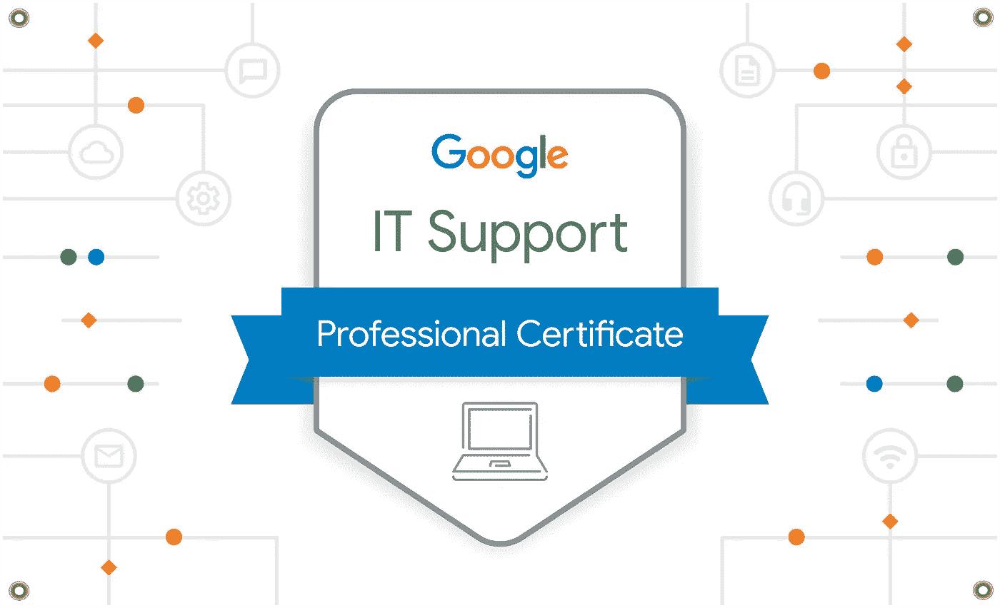
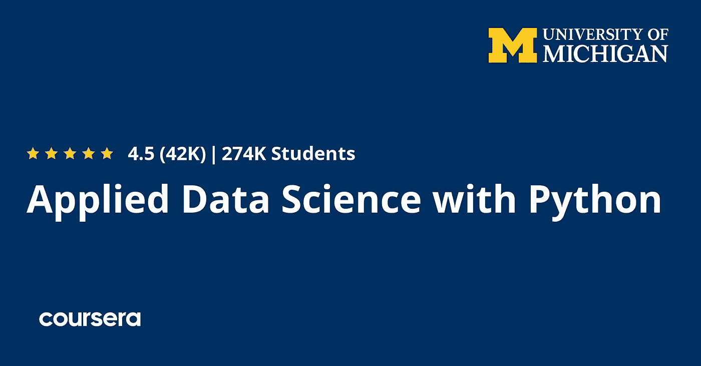
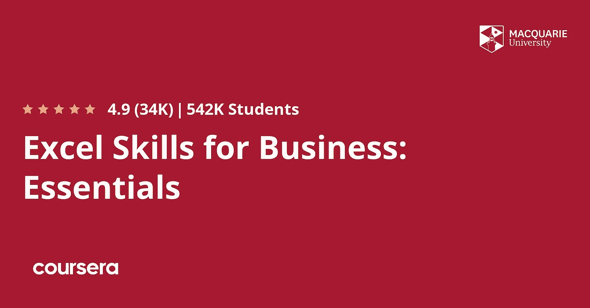

# 2023 年 Coursera Plus 值得吗？[综述]

> 原文：<https://medium.com/javarevisited/is-coursera-plus-worth-it-review-7df4915cd326?source=collection_archive---------0----------------------->

## 我对 Coursera Plus 的评论，这是一个 Coursera 的订阅计划，它允许你无限制地访问 7000 多门 Coursera 课程、认证和项目。

image_credit — Coursera

> **更新:**在有限的时间内，直到 2023 年 1 月 31 日，你可以[**获得 Coursera Plus 的 200 美元优惠**，](https://imp.i384100.net/c/3294490/1164545/14726?u=https%3A%2F%2Fwww.coursera.org%2Fcourseraplus%2Fspecial%2Fholiday2023)Coursera Plus 的这种优惠是罕见和有限的，所以如果你曾经想加入 Coursera Plus，现在是最好的时机。

作为一名程序员，我们总是需要学习新的技能、框架、技术和库，我们经常最终为此购买这么多课程，但 Coursera 现在有一个更好的方法， [**Coursera Plus**](https://coursera.pxf.io/c/3294490/1164545/14726?u=https%3A%2F%2Fwww.coursera.org%2Fcourseraplus) 。

这是 Coursera 课程和专业的订阅计划，只需订阅一次，您就可以访问 3000 多门课程、专业和专业证书。

与其他订阅和会员制在线学习门户网站相比，这听起来更贵，比如 [**Pluralsight**](https://pluralsight.pxf.io/c/1193463/424552/7490?u=https%3A%2F%2Fwww.pluralsight.com%2Flearn) (每月 29.9 美元)和[**CodeCademy**](https://bit.ly/codecademypro)**(每月 15.9 美元)，以及 [**Educative**](https://www.educative.io/subscription?affiliate_id=5073518643380224) (每月 14.9 美元)，但 Coursera 提供世界各地的证书和课程

如果你想知道*Coursera Plus 是否值得*，那么这里有几个理由让[**Coursera Plus**](https://coursera.pxf.io/c/3294490/1164545/14726?u=https%3A%2F%2Fwww.coursera.org%2Fcourseraplus)值得你花时间和金钱。**

## **1.学点什么**

**只需一次订阅，您就可以探索任何感兴趣或流行的主题，学习先决条件，并提高您的技能**

## **2.省钱**

**[Coursera Plus](https://click.linksynergy.com/deeplink?id=JVFxdTr9V80&mid=40328&murl=https%3A%2F%2Fwww.coursera.org%2Fcourseraplus) 其实是一种性价比很高的上 Coursera Plus 课程的方式。考虑到你需要为个人 Coursera 专业化支付 30 至 50 美元，如果你今年计划选修多门课程，你实际上花在学习上的钱会更少。**

## **3.灵活学习**

**Coursera Plus 实际上促进了你的学习。你不需要每次想参加课程时都购买课程，这是非常灵活的。**

**你可以按照自己的进度学习，在多门课程之间切换，或者不买就换一门不同的课程。只需订阅一次，你就可以获得一流大学的许多顶级课程。**

## **4.无限证书**

**许多人加入 [Coursera 课程](/javarevisited/18-coursera-courses-you-can-join-in-2020-to-learn-from-the-worlds-top-tech-companies-google-74af46967d1e?source=collection_home---4------0-----------------------)的主要原因之一是他们的证书，这些证书肯定比任何其他门户网站的任何其他课程完成证书更有价值。**

> **有了 Coursera Plus，你可以免费获得所有学习课程的证书。**

**简而言之，Coursera Plus 是一种既经济又灵活的加入 Coursera 课程的方式。如果你在 Coursera 上做不止一个认证，我强烈推荐你加入 [**Coursera Plus**](https://coursera.pxf.io/c/3294490/1164545/14726?u=https%3A%2F%2Fwww.coursera.org%2Fcourseraplus) 来节省一个月的时间，并获得无限的证书和培训材料。**

** [## Coursera Plus |无限制访问 7，000 多门在线课程

### 用 Coursera Plus 投资你的职业目标。无限制访问 90%以上的课程、项目…

coursera.pxf.io](https://coursera.pxf.io/c/3294490/1164545/14726?u=https%3A%2F%2Fwww.coursera.org%2Fcourseraplus) 

# 2023 年使用 Coursera Plus 加入哪些 Coursera 认证和专业？

如果你已经决定加入这个项目，但是不知道从哪里开始以及如何利用这个 [Coursera Plus 项目](https://javarevisited.blogspot.com/2020/08/coursera-plus-better-way-to-take-coursera-courses-specilizations-certification.html)的最大好处，那么这里是你可以瞄准的 5 大 Coursera 专业化。

这包括各种技能，如[数据科学](/javarevisited/my-favorite-data-science-and-machine-learning-courses-from-coursera-udemy-and-pluralsight-eafc73acc73f)、 [Python](/javarevisited/top-10-courses-to-learn-python-for-web-development-in-2020-best-of-lot-efe11fb6d212) 、[编程](/javarevisited/top-10-pluralsight-courses-to-learn-programming-and-software-development-during-covid-19-stay-at-30b7d8a4f88f)、IT 支持和个人发展

## 1.[谷歌 IT 支持专业证书](https://coursera.pxf.io/c/3294490/1164545/14726?u=https%3A%2F%2Fwww.coursera.org%2Fprofessional-certificates%2Fgoogle-it-support)

这是一个最有用的在线项目，可以让你在 IT 领域开始职业生涯。该计划旨在让初学者在大约 3 到 6 个月内做好工作准备。

> 这个专业证书最好的一点是它是由谷歌提供的，这增加了它的价值，也使它成为 Coursera 上最受欢迎的专业证书。

以下是您将在本课程中学到的关键技能:

*   客户支持
*   Linux 操作系统
*   解决纷争
*   Ipv4 和域名系统(DNS)
*   网络模型
*   Powershell
*   Linux 文件系统
*   命令行界面
*   轻型目录访问协议(LDAP)

专业证书的好处是你需要完成一个项目来获得证书，这给了你一个应用你在这个课程中学到的任何东西的机会。

**这里是加入这个最佳 Coursera 认证**——[谷歌 IT 支持专业证书](https://coursera.pxf.io/c/3294490/1164545/14726?u=https%3A%2F%2Fwww.coursera.org%2Fprofessional-certificates%2Fgoogle-it-support)的链接

**

## **2.[Python 专业化的应用数据科学](https://coursera.pxf.io/c/3294490/1164545/14726?u=https%3A%2F%2Fwww.coursera.org%2Fspecializations%2Fdata-science-python)**

**获得对数据的新见解。学习应用数据科学方法和技术，并获得分析技能。这个专业是由密歇根大学提供的 5 门课程的集合。这将教你所有你需要知道的关于 Python 数据科学的知识。

以下是您将在该计划中学习到的关键技能:**

*   **如何进行推断性统计分析**
*   **如何辨别数据可视化的好坏**
*   **如何使用应用机器学习增强数据分析**
*   **如何分析社交网络的连通性**

**谈到社会证明，超过 36%的人在完成这一专业后开始了新的职业生涯，23%的人获得了加薪或晋升。**

****这里是加入这个项目的链接**——[应用数据科学与 Python 专业化](https://coursera.pxf.io/c/3294490/1164545/14726?u=https%3A%2F%2Fwww.coursera.org%2Fspecializations%2Fdata-science-python)**

****

## **3.[商业专业化的 Excel 技能](https://coursera.pxf.io/c/3294490/1164545/14726?u=https%3A%2F%2Fwww.coursera.org%2Fspecializations%2Fexcel)**

**微软 Excel 对商业和 IT 都是有用的技能之一，这是学习商业 Excel 技能的最佳课程。掌握 Excel，为你的就业能力投资组合增添一笔宝贵的财富

以下是你将在这项专业中学习到的关键技能:**

*   **数据有效性**
*   **[微软 Excel 基础知识](https://www.java67.com/2020/07/5-free-microsoft-excel-xls-or-xlsx-courses-for-beginners.html)**
*   **Microsoft Excel 宏**
*   **数据透视表和图表**
*   **电子表格、图表和数据透视表图表**
*   **串联**
*   **查找表**
*   **[微软 Excel VBA](/javarevisited/5-advanced-courses-to-learn-microsoft-excel-in-depth-b556aaee5f6c)**

**谈到社会证明，超过 42%的学员在完成本专业后开始了新的职业生涯，超过 32%的人获得了加薪或晋升。**

****以下是参加本课程的链接** — [商务专业化 Excel 技能](https://coursera.pxf.io/c/3294490/1164545/14726?u=https%3A%2F%2Fwww.coursera.org%2Fspecializations%2Fexcel)**

****

## **4.耶鲁大学的《幸福科学》**

**这是 Coursera 上的一门免费课程，有超过 280 万人学习。在本课程中，你将参与一系列的挑战，这些挑战旨在增加你自己的快乐和建立更有成效的习惯。作为一名程序员，我们经常忽略这些事情，但是我强烈建议你参加这个课程来体验它能带来多大的不同。**

**作为这些任务的准备，劳里·桑托斯教授揭示了对幸福的误解，导致我们这样思考的恼人的思维特征，以及可以帮助我们改变的研究。你最终会准备好成功地将一项特定的健康活动融入你的生活。**

**这里是加入本课程的链接——[幸福的科学](https://coursera.pxf.io/c/3294490/1164545/14726?u=https%3A%2F%2Fwww.coursera.org%2Flearn%2Fthe-science-of-well-being)**

****

**即使你没有 [**Coursera Plus 订阅**](https://coursera.pxf.io/c/3294490/1164545/14726?u=https%3A%2F%2Fwww.coursera.org%2Fcourseraplus) 课程，你也可以加入这个课程，因为它完全免费，我鼓励你这样做，因为超过 36%的人在完成这些课程后开始了新的职业生涯，34%的人从这个课程中获得了切实的职业利益**

## **5. [Python 为大家特殊化](https://coursera.pxf.io/c/3294490/1164545/14726?u=https%3A%2F%2Fwww.coursera.org%2Fspecializations%2Fpython)**

**这可能是 Coursera 上最好的 Python 课程了。该专业由密歇根大学提供，是学习用 Python 编程和分析数据的 5 门课程的集合。你还将开发程序来收集、清理、分析和可视化数据。

以下是您将在 Python 专业化认证中学习的关键技能:**

*   **Json 和 Xml**
*   **Python 编程**
*   **数据库(DBMS)**
*   **Python 语法和语义**
*   **基本编程语言**
*   **计算机编程**
*   **数据结构和元组**
*   **网页抓取**
*   **SQLite 和 SQL**

**总的来说，这是从零开始学习 Python 的最好的 Coursera 课程之一，我强烈推荐给任何想在 2023 年学习 Python 的人。**

****这里是加入本节目的链接**——[Python 为大家特殊化](https://coursera.pxf.io/c/3294490/1164545/14726?u=https%3A%2F%2Fwww.coursera.org%2Fspecializations%2Fpython)**

****

**谈到社会证明，超过 39%的人在完成这个专业后开始了新的职业生涯，19%的人获得了加薪或晋升，这使其成为 Coursera 上最好的 Python 专业和课程之一。**

**这就是关于 Coursera Plus 的全部内容，Coursera 推出了一项高级订阅计划，可以无限制地获得认证和专业化认证。这绝对是一个伟大的创举，你不仅可以省钱，还可以有这么多的课程、专业和专业证书。

不需要购买课程，直接加入即可。这种灵活性本身是非常有用的，尤其是如果你不断地学习和加入一个以上的专业。

简而言之， [**Coursera Plus**](https://coursera.pxf.io/c/3294490/1164545/14726?u=https%3A%2F%2Fwww.coursera.org%2Fcourseraplus) 对于你的职业目标来说是一笔不错的投资，因为它可以无限制地访问 Coursera 上 90%以上的课程、专业和职业证书，由顶尖大学和公司的顶级讲师授课。那么，你还在等什么，去看看 Coursera Plus 能为你提供什么？**

** [## Coursera Plus |无限制访问 7，000 多门在线课程

### 用 Coursera Plus 投资你的职业目标。无限制访问 90%以上的课程、项目…

coursera.pxf.io](https://coursera.pxf.io/c/3294490/1164545/14726?u=https%3A%2F%2Fwww.coursera.org%2Fcourseraplus) 

你可能喜欢的其他 **Coursera 和编程文章**

*   [2023 年程序员十大课程](https://javarevisited.blogspot.com/2020/08/top-10-coursera-courses-specilizations-and-certifications.html)
*   [学习云计算的 10 门最佳 Coursera 课程](https://javarevisited.blogspot.com/2020/08/top-10-coursera-certifications-to-learn-cloud-computing-aws.html#axzz6WK1yC5WW)
*   [学习 Web 开发的十大 Coursera 课程](https://javarevisited.blogspot.com/2020/08/top-10-coursera-certifications-to-learn-web-development.html)
*   [学习数据科学的十大 Coursera 课程](https://javarevisited.blogspot.com/2020/08/top-10-coursera-certifications-to-learn-Data-Science-Visualization-and-Data-Analysis.html)
*   [面向程序员和开发者的 Coursera 十大项目](https://javarevisited.blogspot.com/2020/08/top-10-coursera-projects-to-learn-essential-programming-skills.html)
*   [5 个最佳 Coursera 程序员职业证书](https://javarevisited.blogspot.com/2019/10/top-5-coursera-professional-certificates-for-programmers-IT-professionals.html)
*   [2023 年学习 Python 可以做的 8 个项目](/javarevisited/8-projects-you-can-buil-to-learn-python-in-2020-251dd5350d56)
*   [你可以在 Coursera 上在线申请的前 5 个计算机科学学位](https://javarevisited.blogspot.com/2020/04/is-it-possible-to-get-master-of-computer-science-degree-online-coursera.html)
*   [Udemy vs Coursera？学理工和编程哪个好](https://javarevisited.blogspot.com/2020/01/coursera-vs-udemy-which-is-better-for-programming-tech.html)
*   【Coursera 证书对工作和事业有帮助吗
*   [你可以在 Coursera Online 上获得 5 个数据科学学位](https://www.java67.com/2020/06/top-5-data-science-degree-you-can-earn-online-coursera-edx.html)
*   【Coursera 的 10 项数据科学和机器学习认证
*   [开始职业生涯的十大 Coursera 认证](/javarevisited/top-10-coursera-certificates-to-start-your-career-in-cloud-data-science-ai-mainframe-and-it-558690c83587)
*   [2023 年学习人工智能的 7 门最佳课程](/javarevisited/7-best-courses-to-learn-artificial-intelligence-in-2020-26d59d62f6fe)
*   [Udemy vs 复数视线？哪个学习平台比较好？](https://javarevisited.blogspot.com/2019/10/udemy-vs-pluralsight-review-which-is-better-to-learn-code.html)
*   [Udemy vs CocdeCademy vs one month？](https://javarevisited.blogspot.com/2019/09/codecademy-vs-udemy-vs-onemonth-which-is-better-for-learning-code.html#axzz6VYKcmyZz)
*   Udemy vs Educative vs Codecademy？新手用哪个好

感谢阅读这篇文章。如果你喜欢这个 *Coursera Plus Review* 和我建议的*最佳 Coursera 课程和认证* s，那么请与你的朋友和同事分享。如果您有任何问题或反馈，请留言。

**p . s .**——如果你正在寻找免费的 Coursera 课程来学习 Python，那么你也可以看看我列出的来自谷歌、微软和 Coursera **的[**免费 Python 教程。**包含免费 Coursera 课程，从零开始学习 Python。](/javarevisited/10-free-python-tutorials-and-courses-from-google-microsoft-and-coursera-for-beginners-96b9ad20b4e6)**

 [## 免费 Python 教程——Python 编程介绍

### Avinash Jain 目前是加州大学伯克利分校电气工程和计算机科学专业的大二学生。他是…

bit.ly](http://bit.ly/2D5vvnV) 

**p . s . s .——**如果你还没有加入 Coursera Plus，现在就加入，在 1 月 31 日之前可以享受 200 美元的优惠。我从未在 Coursera Plus 上见过这种折扣，去年花 399 美元购买，但你可以节省 200 美元，只需 199 美元即可获得相同的会员资格，但请尽快行动，因为此优惠将于 2023 年 1 月 31 日到期，[**现在就加入 Coursera Plus**](https://coursera.pxf.io/c/3294490/1164545/14726?u=https%3A%2F%2Fwww.coursera.org%2Fcourseraplus%2Fspecial%2Fholiday2023)**。此优惠仅在本页面提供。**

 [## Coursera Plus |无限制访问 7，000 多门在线课程

### 无论你是开始你的第一份工作，转换到一个新的路径，或在你目前的角色，一年一度的课程…

coursera.pxf.io](https://coursera.pxf.io/c/3294490/1164545/14726?u=https%3A%2F%2Fwww.coursera.org%2Fcourseraplus%2Fspecial%2Fholiday2023) 

.**