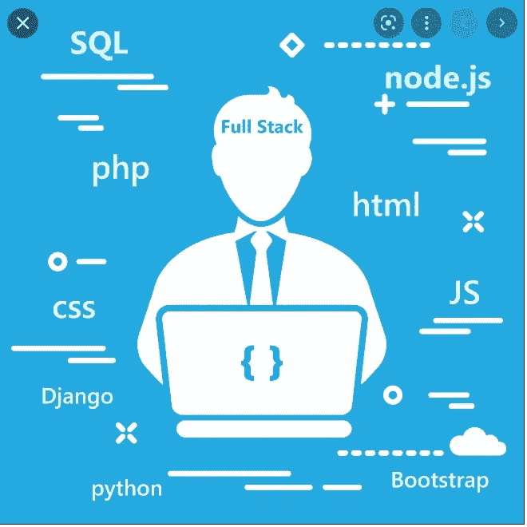
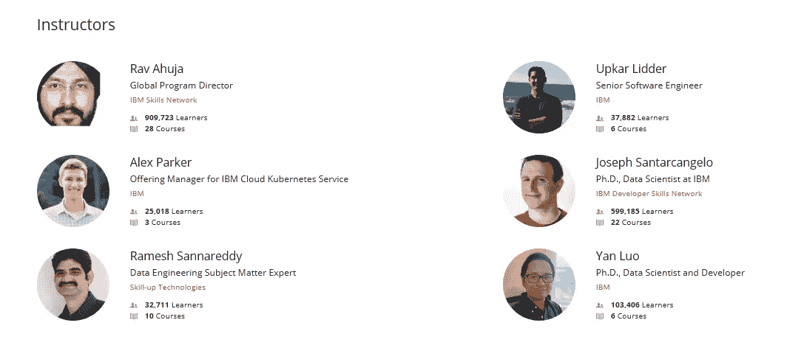
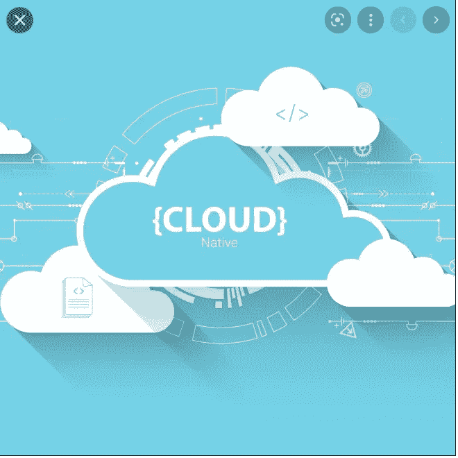
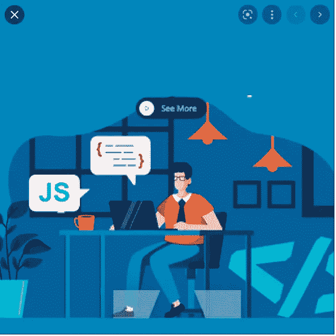
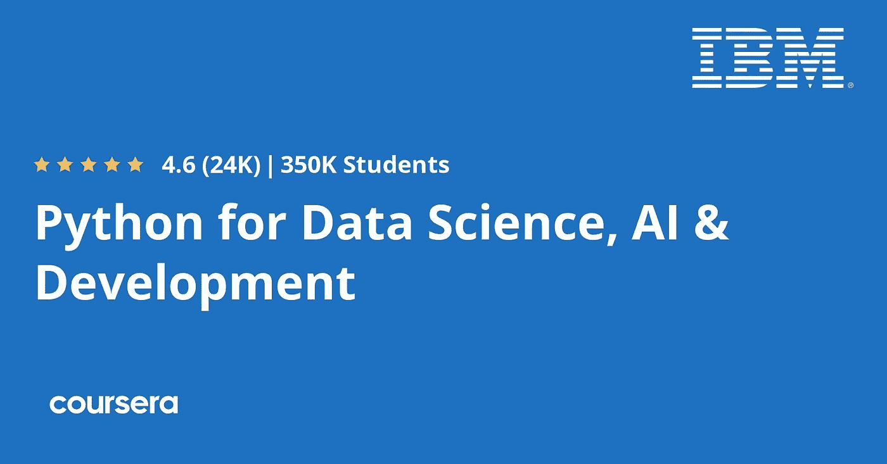
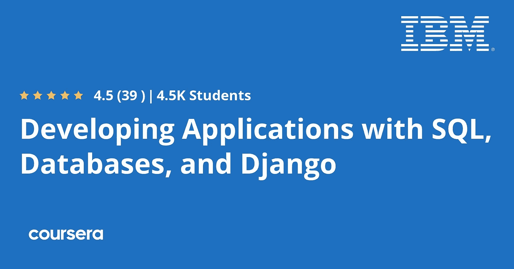
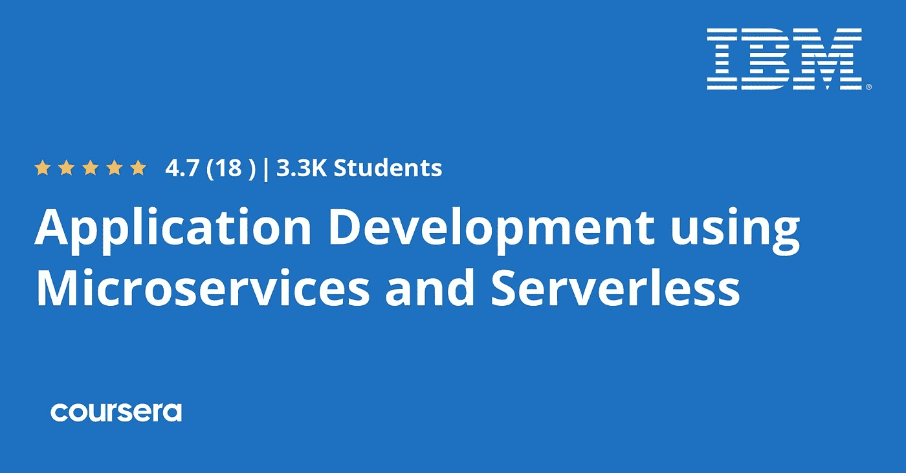
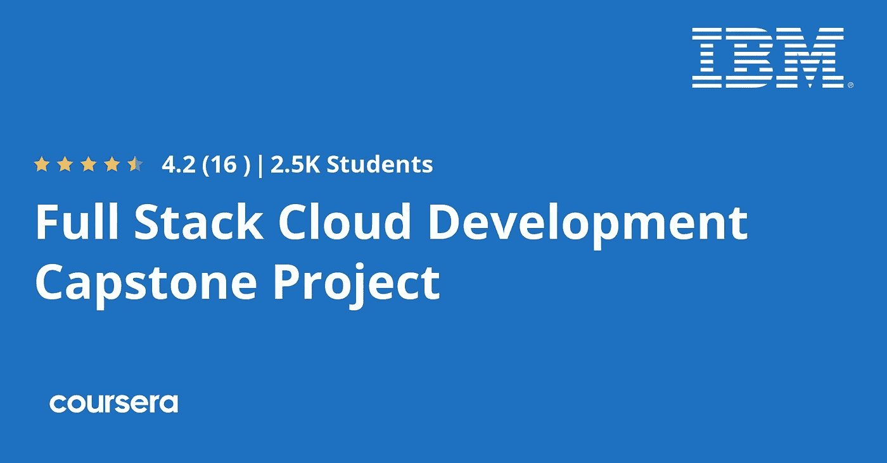
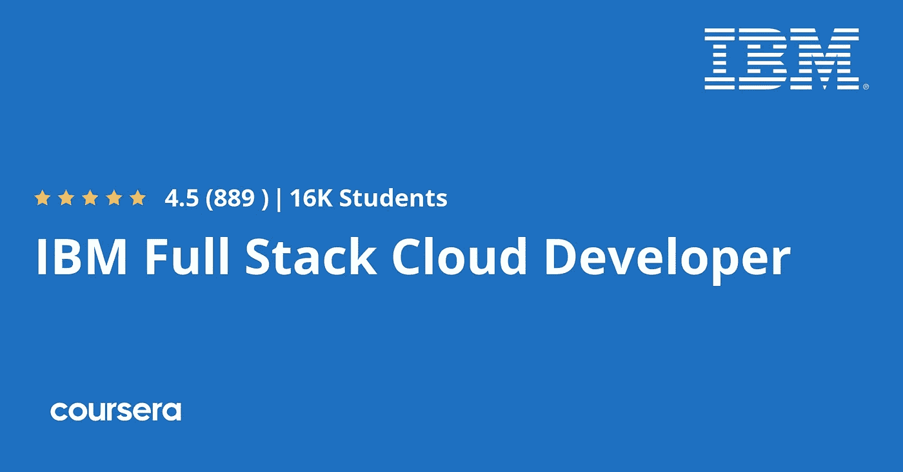

# Coursera 的 IBM 全栈云开发者专业证书值得吗？回顾

> 原文：<https://medium.com/javarevisited/is-courseras-full-stack-cloud-developer-professional-certificate-by-ibm-worth-it-8891c9942591?source=collection_archive---------0----------------------->

## 是的，这是一个非常好的结构和全面的 Coursera 计划，可以学习云计算和全栈开发，绝对值得加入，以便在 2023 年成为全栈云开发者。

大家好，如果你想在 2023 年成为云原生全栈开发者，并在 Coursera 上寻找最好的全栈云开发者课程或认证，或者你想加入[*IBM 的全栈云开发者专业认证*](https://coursera.pxf.io/c/3294490/1164545/14726?u=https%3A%2F%2Fwww.coursera.org%2Fprofessional-certificates%2Fibm-full-stack-cloud-developer) ，但不确定它是否适合你，那么你来对地方了。

早些时候，我已经分享了 [**最佳云计算课程**](/javarevisited/5-best-cloud-computing-courses-to-learn-in-2020-f5f091159401) 以及最佳 [**全栈 Python 开发课程**](/javarevisited/7-best-online-courses-to-become-fullstack-python-developer-ea2cc52cfc86) ，在本文中，我们将回顾 IBM FullStack 云开发人员认证，看看它是否值得加入。

一般来说，我会从三个重要方面来评估任何课程或专业认证，即教师声誉、课程结构和内容质量，以及人们的评价。这将帮助你决定这门课程是否适合你。

开发一个网站需要了解网站的不同部分:前端，开发人员使用诸如[HTML&CSS](/javarevisited/10-best-html-and-css-courses-for-beginners-in-2021-6757eec00032)&[JavaScript](/javarevisited/my-favorite-free-tutorials-and-courses-to-learn-javascript-8f4d0a71faf2)之类的语言来创建用户在其浏览器中与之交互的设计。

后端是搜索和支付等网站功能，最后是存储用户数据的数据库，所有东西都需要存储在数据库中。

每个公司至少应该有几个开发人员来创建整个网站，从设计到后端和管理数据库，但有时一个人可以完成所有这些工作，这就是所谓的全栈 web 开发人员，你必须学习使用一些工具在 web 上部署应用程序，所以所有这些技能都可以在这个 [**IBM 全栈云开发人员专业证书**](https://coursera.pxf.io/c/3294490/1164545/14726?u=https%3A%2F%2Fwww.coursera.org%2Fprofessional-certificates%2Fibm-full-stack-cloud-developer) 项目中学习。

 [## IBM 全栈云开发者

### 启动您的应用程序开发职业生涯。使用动手实践进行主云原生和全栈开发…

coursera.pxf.io](https://coursera.pxf.io/c/3294490/1164545/14726?u=https%3A%2F%2Fwww.coursera.org%2Fprofessional-certificates%2Fibm-full-stack-cloud-developer) 

# Coursera 的全栈云开发者专业证书评审

现在我们知道了云原生开发和全栈开发对于现代软件开发的重要性，是时候深入研究并评估本课程的 3 个主要参数:讲师、课程内容和公众意见。

## 1.教员回顾

顶级员工在 IBM 公司创造了这种专业化。他们中的一些人是各自领域、数据科学和云计算的专家。他们中的许多人在他们的领域获得了博士学位，所以你在这门课程中向专家学习，而不是像 Udemy 等其他在线平台的业余爱好者。

# 2.认证结构和课程

这是 Coursera 上最全面、结构最合理的项目之一。它不仅涵盖了开发人员应该知道的关于云计算的一切，还涵盖了程序员应该知道的关于使用 Python 和 JavaScript 进行全栈开发的一切。以下是本专业涵盖的课程:

## 2.1.[云计算简介](https://coursera.pxf.io/c/3294490/1164545/14726?u=https%3A%2F%2Fwww.coursera.org%2Flearn%2Fintroduction-to-cloud%3Fspecialization%3Dibm-full-stack-cloud-developer)

专业化的第一部分将向您介绍云计算及其概念和工作原理。您将从业务角度理解这一点，以及云计算带来的历史和新兴技术使用案例。你会看到各种各样的云计算，比如 Saas、Paas 和 Iaas。

## 2.2.【HTML、CSS、JavaScript Web 开发入门

您将了解云应用程序开发及其涉及的内容，然后学习前端开发的基础知识及其语言，即 HTML CSS JavaScript，因此您将使用 HTML 构建您的网站，使用 CSS 添加不同的样式和颜色，然后使用 JavaScript 添加交互性，然后学习如何使用 Github 与公司团队协作。

## 2.3.[开发云原生应用](https://https//coursera.pxf.io/c/3294490/1164545/14726?u=https%3A%2F%2Fwww.coursera.org%2Flearn%2Fdeveloping-cloud-native-applications%3Fspecialization%3Dibm-full-stack-cloud-developerwww.coursera.org/learn/developing-cloud-native-applications?specialization=ibm-full-stack-cloud-developer)

本节将向您介绍最重要的云概念。您将学习用于构建云原生应用程序的不同工具和技术，了解 IBM cloud，创建和管理 IBM cloud 应用程序，并使用 DevOps 工具进行应用程序开发。您将学习使用 REST 从 web 上检索、删除、更新数据。

## 2.4.[使用 Node.js 和 React 开发云应用](https://coursera.pxf.io/c/3294490/1164545/14726?u=https%3A%2F%2Fwww.coursera.org%2Flearn%2Fnode-js%3Fspecialization%3Dibm-full-stack-cloud-developer)

本节将教你如何使用 Node.js(一个用于后端开发的 JavaScript 框架)和 React(一个用于开发网站前端的 JavaScript 库)来开发一个完整的 web 应用程序，以及如何使用它的一些功能(如 I/O 回调)和使用 Express 框架。

## 2.5.[介绍带有 Docker、Kubernetes 的集装箱& OpenShift](https://coursera.pxf.io/c/3294490/1164545/14726?u=https%3A%2F%2Fwww.coursera.org%2Flearn%2Fibm-containers-docker-kubernetes-openshift%3Fspecialization%3Dibm-full-stack-cloud-developer)

您将了解使用容器的概念、用例、好处以及容器和虚拟机之间的区别。

接下来，了解最流行的容器 [Kubernetes 架构](/javarevisited/10-best-kubernetes-courses-for-developers-and-devops-engineers-94c35cd3a2fd)，以及如何使用该容器管理您的应用程序，并了解像 [OpenShift](/javarevisited/6-best-openshift-courses-for-beginners-and-experienced-developers-d124edd2baff) 这样的 Kubernetes 生态系统。

## 2.6. [Python 用于数据科学，AI &开发](https://coursera.pxf.io/c/3294490/1164545/14726?u=https%3A%2F%2Fwww.coursera.org%2Flearn%2Fpython-for-applied-data-science-ai%3Fspecialization%3Dibm-full-stack-cloud-developer)

这一节将教你 python 语言。您将从这门语言的基础开始，然后转到 python 的结构，以及如何在一个变量中存储多个值，如列表和字典。你将使用循环和函数，学习面向对象编程和使用 python 数据。

## 2.7.[人工智能的 Python 项目&应用开发](https://coursera.pxf.io/c/3294490/1164545/14726?u=https%3A%2F%2Fwww.coursera.org%2Flearn%2Fpython-project-for-ai-application-development%3Fspecialization%3Dibm-full-stack-cloud-developer)

这一小段将要求你开发一个由人工智能解决方案驱动的应用程序。您将使用 python 框架 [Flask](/javarevisited/5-best-python-flask-courses-for-beginners-2f262f8e23da) 来开发一个 web 应用程序。

## 2.8.[使用 SQL、数据库和 Django 开发应用](https://coursera.pxf.io/c/3294490/1164545/14726?u=https%3A%2F%2Fwww.coursera.org%2Flearn%2Fdeveloping-applications-with-sql-databases-and-django%3Fspecialization%3Dibm-full-stack-cloud-developer)

您将开始学习用于与数据库通信并与之交互的 SQL 语言。然后你将了解到 [Django 框架](/javarevisited/my-favorite-courses-to-learn-django-for-beginners-2020-ac172e2ab920)，并将其用于 web 应用程序，使用其模板并使用该框架构建一个管理站点。

## 2.9.[使用微服务和无服务器的应用开发](https://coursera.pxf.io/c/3294490/1164545/14726?u=https%3A%2F%2Fwww.coursera.org%2Flearn%2Fapplications-development-microservices-serverless-openshift%3Fspecialization%3Dibm-full-stack-cloud-developer)

无服务器是一种云原生开发模型，允许开发人员运行他们的 web 应用程序，而无需管理服务器。这样的例子有 [AWS Lambda](/javarevisited/7-best-serverless-and-aws-lambda-courses-to-learn-in-2021-de1820111c85) ，谷歌云功能等等。本课程将教你无服务器编程，并探索如何使用它。

## 2.10.[全栈云开发顶点项目](https://coursera.pxf.io/c/3294490/1164545/14726?u=https%3A%2F%2Fwww.coursera.org%2Flearn%2Fibm-cloud-native-full-stack-development-capstone%3Fspecialization%3Dibm-full-stack-cloud-developer)

最后一节将测试您所学的知识，使用前端技术(如 HTML、CSS JavaScript 和其他语言)创建 web 应用程序，构建后端并将其部署在服务器上，并在项目中使用 GitHub。

# 3.社会证明

谈到社交证明，这是最受 web 开发人员欢迎的云原生开发课程之一。超过 12，000 名学生参加了这门课程，平均有近 1000 人给它打了 4.5 分，这是惊人的。

下面是加入这个认证的链接— [**IBM 全栈云开发者专业证书**](https://coursera.pxf.io/c/3294490/1164545/14726?u=https%3A%2F%2Fwww.coursera.org%2Fprofessional-certificates%2Fibm-full-stack-cloud-developer)

## 结论

学习全栈 web 开发是非常辛苦的，但是值得你投入这个职业的时间和痛苦。许多公司通过只使用像这样的几个人来管理和建立他们的网站来减少他们雇用开发人员的成本。如果你想在 2023 年成为一名成功的全栈云开发者，那么这是一个合适的计划。

顺便说一句，如果你发现 Coursera 的课程很有用，因为它们是由世界各地的知名公司和大学创建的，我建议你加入 Coursera Plus 的[课程，这是 Coursera 的一个订阅计划，让你可以无限制地访问他们最受欢迎的课程、专业、专业证书和指导项目。它每年花费大约 399 美元，但它完全值得你的钱，因为你可以获得无限的证书。](https://coursera.pxf.io/c/3294490/1164545/14726?u=https%3A%2F%2Fwww.coursera.org%2Fcourseraplus)

 [## Coursera Plus |无限制访问 7，000 多门在线课程

### 用 Coursera Plus 投资你的职业目标。无限制访问 90%以上的课程、项目…

coursera.pxf.io](https://coursera.pxf.io/c/3294490/1164545/14726?u=https%3A%2F%2Fwww.coursera.org%2Fcourseraplus) 

你可能喜欢的其他 **Coursera 资源和文章**

*   [学习云计算的 10 门最佳 Coursera 课程](https://javarevisited.blogspot.com/2020/08/top-10-coursera-certifications-to-learn-cloud-computing-aws.html#axzz6WK1yC5WW)
*   [你可以在 Coursera 上在线申请的前 5 个计算机科学学位](https://javarevisited.blogspot.com/2020/04/is-it-possible-to-get-master-of-computer-science-degree-online-coursera.html)
*   [5 个最佳 Coursera 程序员职业证书](https://javarevisited.blogspot.com/2019/10/top-5-coursera-professional-certificates-for-programmers-IT-professionals.html)
*   [2023 年学习 Python 可以做的 8 个项目](/javarevisited/8-projects-you-can-buil-to-learn-python-in-2020-251dd5350d56)
*   [2023 年学习人工智能的 7 门最佳课程](/javarevisited/7-best-courses-to-learn-artificial-intelligence-in-2020-26d59d62f6fe)
*   [2023 年程序员十大课程课程](https://javarevisited.blogspot.com/2020/08/top-10-coursera-courses-specilizations-and-certifications.html)
*   [面向程序员和开发人员的 Coursera 十大项目](https://javarevisited.blogspot.com/2020/08/top-10-coursera-projects-to-learn-essential-programming-skills.html)
*   Udemy vs. Pluralsight？哪个学习平台比较好？
*   [Coursera 证书对工作和事业有帮助吗](https://javarevisited.blogspot.com/2020/02/does-udemy-coursera-edx-educative-or.html)？
*   [你可以在 Coursera Online 上获得 5 个数据科学学位](https://www.java67.com/2020/06/top-5-data-science-degree-you-can-earn-online-coursera-edx.html)
*   [开始职业生涯的十大 Coursera 认证](/javarevisited/top-10-coursera-certificates-to-start-your-career-in-cloud-data-science-ai-mainframe-and-it-558690c83587)
*   [Coursera Plus Review——在 Coursera 上学习的更好方式](https://javarevisited.blogspot.com/2020/08/coursera-plus-better-way-to-take-coursera-courses-specilizations-certification.html)
*   [学习 Web 开发的十大 Coursera 课程](https://javarevisited.blogspot.com/2020/08/top-10-coursera-certifications-to-learn-web-development.html)
*   [学习数据科学的十大 Coursera 课程](https://javarevisited.blogspot.com/2020/08/top-10-coursera-certifications-to-learn-Data-Science-Visualization-and-Data-Analysis.html)
*   [Udemy vs CodeCademy vs one month？](https://javarevisited.blogspot.com/2019/09/codecademy-vs-udemy-vs-onemonth-which-is-better-for-learning-code.html#axzz6VYKcmyZz)
*   Udemy vs. Educative vs. Codecademy？新手用哪个好
*   [学习 Python 的 10 个 Coursera 专业和认证](https://javarevisited.blogspot.com/2020/02/10-best-coursera-courses--for-python.html)
*   Coursera 的 10 项数据科学和机器学习认证

感谢阅读这篇文章。如果你喜欢 Coursera 的 IBM 全栈云开发者专业证书的这篇*评论，*那么请分享给你的朋友和同事。如果您有任何问题或反馈，请留言。

**p . s .**——如果你正在寻找学习 Java 全栈开发的最佳 Udemy 在线课程，那么你也可以查看 Udemy **上的 [**Go Java 全栈和 Angular**](https://click.linksynergy.com/deeplink?id=CuIbQrBnhiw&mid=39197&murl=https%3A%2F%2Fwww.udemy.com%2Fcourse%2Ffull-stack-application-development-with-spring-boot-and-angular%2F) **课程**。**这是 Udemy 上最好的 Java 全栈开发课程之一，受到超过 65K 名学习者的信赖。

 [## 2023 年成为全栈 Java 开发人员的前 5 门课程——最好的

### 嗨，伙计们，如果你想在 2023 年成为一名全栈 Java 开发人员，但不确定你应该走哪条路…

javarevisited.blogspot.com](https://javarevisited.blogspot.com/2020/04/top-5-courses-to-become-full-stack-java-developer-with-Angular-and-Reactjs.html)