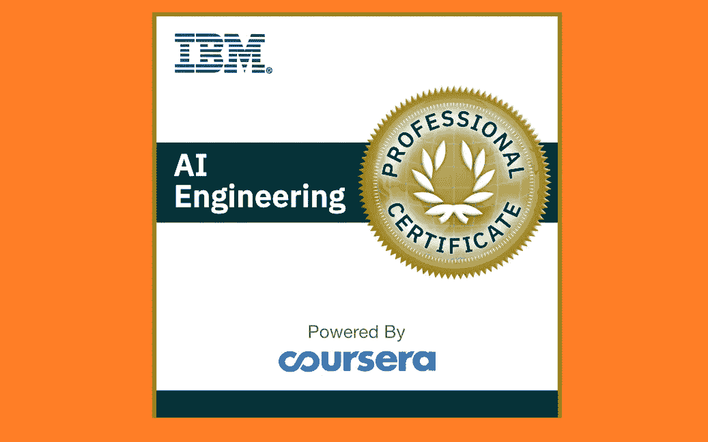
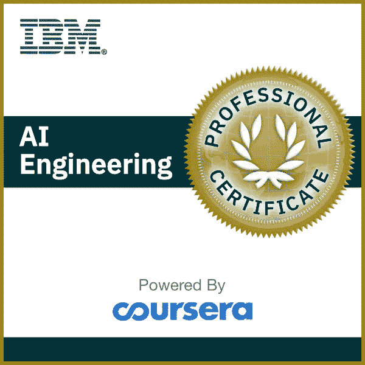
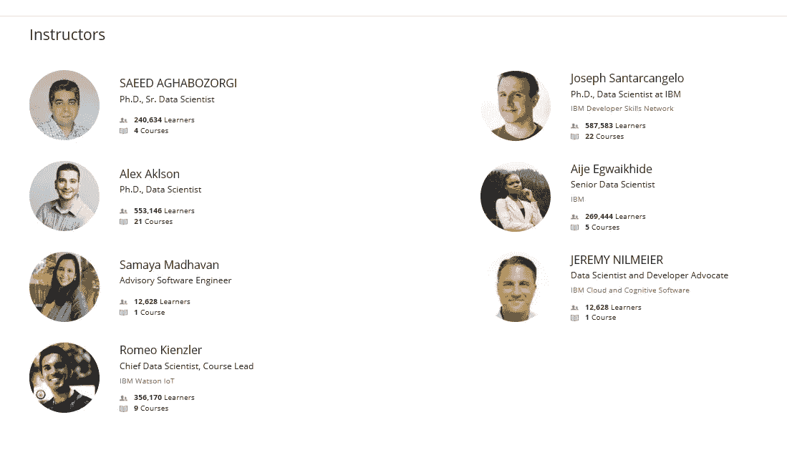
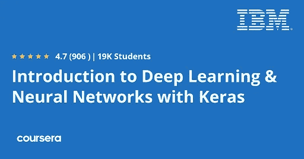
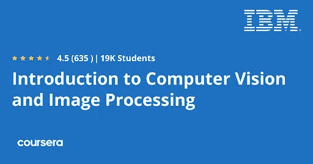
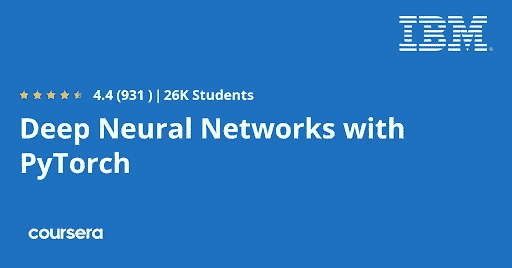
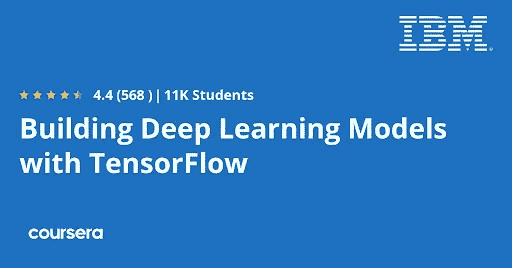
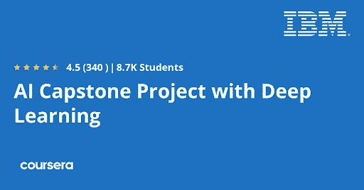

# Coursera 的 IBM AI 工程专业证书值得吗？[综述]

> 原文：<https://medium.com/javarevisited/is-courseras-ibm-ai-engineering-professional-certificate-worth-it-review-7b770a1f103e?source=collection_archive---------0----------------------->

## 你想在 2023 年成为一名人工智能工程师吗？那么这个由 IBM 提供的 Coursera' AI 工程专业证书是一个很好的开始资源。

大家好，如果你想在 2023 年成为一名人工智能工程师，并寻找最好的资源，如在线课程、书籍和教程，那么你来对地方了。之前我已经分享了适合初学者的</javarevisited/7-best-courses-to-learn-artificial-intelligence-in-2020-26d59d62f6fe>**最佳 AI 课程，今天我将回顾 Coursera 的最佳 AI 课程之一和认证，IBM 提供的 [*AI 工程专业证书*](https://coursera.pxf.io/c/3294490/1164545/14726?u=https%3A%2F%2Fwww.coursera.org%2Fprofessional-certificates%2Fai-engineer) 。**

**这是一个课程集，将教你基本的人工智能概念，工具和过程，并让你开始你的人工智能生涯。**

**如今，人工智能正在几乎每个行业掀起一场革命，从 YouTube 推荐检测银行欺诈交易，到在你的脸书订阅中显示广告。**

**公司需要合格的人工智能工程师来保持在这个行业的竞争力，并提供更好的用户体验。根据 glassdoor.com 的数据，人工智能工程师的平均年薪超过 118000 美元。**

**人工智能中使用了大量的编程语言。还是那句话， [python](/javarevisited/10-free-python-tutorials-and-courses-from-google-microsoft-and-coursera-for-beginners-96b9ad20b4e6) ，毫无疑问是你在这个行业开始职业生涯的最佳选择。**

**你还需要学习一些用 python 编写的框架，并拥有一些内置算法来执行这些操作，如谷歌开发的 [Tensorflow](/@javinpaul/top-10-courses-to-learn-tensorflow-for-machine-learning-in-2020-39a31e7cd84b) 和脸书开发的 [Pytorch](/javarevisited/5-best-pytorch-and-keras-courses-for-deep-learning-in-2021-c9ba377b1170) 并由特斯拉用于他们的自动驾驶汽车。**

**网上有很多课程可以学习这些技能，但是有一个是我推荐给你的专家创造的，就是[**IBM AI 工程专业证书**](https://coursera.pxf.io/c/3294490/1164545/14726?u=https%3A%2F%2Fwww.coursera.org%2Fprofessional-certificates%2Fai-engineer) 专业化。**

****

# **1.教员回顾**

**这种专业化是由在 IBM 公司工作的专家创造的。他们中的大多数人都获得了软件工程师或数据科学家等专业领域的博士学位。**

**他们所有人都是根据他们多年的经验创建了这个程序，这就是为什么我推荐这门课程，而不是其他上百门由普通人创建的课程。**

****

# **2.课程内容**

**现在让我们看看哪些课程是这个流行的 IBM AI 工程师职业证书的一部分，涵盖了哪些主题，它们是如何结构化的，以及你打算在这些课程中学到什么。**

## **2.1.[用 Python 进行机器学习](https://coursera.pxf.io/c/3294490/1164545/14726?u=https%3A%2F%2Fwww.coursera.org%2Flearn%2Fmachine-learning-with-python%3Fspecialization%3Dai-engineer)**

**从概述机器学习概念开始，如监督学习和非监督学习之间的区别以及如何使用算法。接下来，您将了解不同的回归模型，并将它们应用到实验室中。**

**稍后，您将了解分类和算法，如 [KNN](https://www.java67.com/2020/07/top-5-machine-learning-algorithms-for-beginners.html) ，然后转向聚类并创建一个推荐系统。**

****这里是加入本课程** — [用 Python 进行机器学习](https://coursera.pxf.io/c/3294490/1164545/14726?u=https%3A%2F%2Fwww.coursera.org%2Flearn%2Fmachine-learning-with-python%3Fspecialization%3Dai-engineer)的链接**

****

## **2.2.[深度学习简介&带 Keras 的神经网络](https://coursera.pxf.io/c/3294490/1164545/14726?u=https%3A%2F%2Fwww.coursera.org%2Flearn%2Fintroduction-to-deep-learning-with-keras)**

**您将了解深度学习模型，以及它们如何模仿人类大脑来执行其功能。接下来，您将学习神经网络在现实生活中是如何工作的，并从数据及其概念(如反向传播)中学习。**

**稍后您将看到不同的可用深度学习框架，并使用 [Keras](https://www.java67.com/2020/06/top-5-courses-to-learn-pytorch-and-keras.html) 构建一个简单的深度学习模型。最后，使用 Keras 和递归神经网络(RNN)构建卷积神经网络(CNN)。**

****这里是加入这个 Coursera 课程的链接——**[深度学习简介&带 Keras 的神经网络](https://coursera.pxf.io/c/3294490/1164545/14726?u=https%3A%2F%2Fwww.coursera.org%2Flearn%2Fintroduction-to-deep-learning-with-keras)**

****

## **2.3.[计算机视觉和图像处理简介](https://coursera.pxf.io/c/3294490/1164545/14726?u=https%3A%2F%2Fwww.coursera.org%2Flearn%2Fintroduction-computer-vision-watson-opencv)**

**您将了解计算机视觉领域及其应用，如诊断疾病。接下来，您将使用 pillow 和 [OpenCV 库](/javarevisited/2-projects-to-learn-computer-vision-and-open-cv-for-beginners-1e0479ed171b)开始处理图像并执行一些动作，如像素转换。**

**稍后，您将使用不同的[机器学习算法](/javarevisited/5-machine-learning-algorithms-every-data-scientists-should-learn-de467fd2e444)对图像进行分类，如 KNN 和支持向量机，并使用深度学习和对象检测建立模型对图像进行分类。**

****以下是加入本课程的链接—** [计算机视觉和图像处理简介](https://coursera.pxf.io/c/3294490/1164545/14726?u=https%3A%2F%2Fwww.coursera.org%2Flearn%2Fintroduction-computer-vision-watson-opencv)**

****

## **2.4.[使用 PyTorch 的深度神经网络](https://coursera.pxf.io/c/3294490/1164545/14726?u=https%3A%2F%2Fwww.coursera.org%2Flearn%2Fdeep-neural-networks-with-pytorch)**

**本节将向您介绍 PyTorch 库，该库在公司中广泛用于创建深度神经网络。您将从学习 PyTorch 的张量及其工作方式开始，然后创建一个线性回归模型。**

**在此过程中，您将理解其概念，如损失函数，如何在 PyTorch 中优化您的模型，以及如何创建多元线性回归模型。最后，深入 CNN 模型并使用 PyTorch 创建一个。**

****

## **2.5.[用 TensorFlow 构建深度学习模型](https://coursera.pxf.io/c/3294490/1164545/14726?u=https%3A%2F%2Fwww.coursera.org%2Flearn%2Fbuilding-deep-learning-models-with-tensorflow)**

**Tensorflow 也是深度学习的一个很好的框架，在这一节你会学到什么以及如何使用 TensorFlow 来创建深度学习模型。接下来，进入监督学习，对挖掘数据集进行分类，了解递归神经网络，并将其应用于语言建模。**

**稍后，您将了解什么是无监督学习，什么是受限制的波尔兹曼机器，并应用它们来创建推荐系统和学习 autoencoder。**

****以下是加入本课程的链接—** [用 TensorFlow 构建深度学习模型](https://coursera.pxf.io/c/3294490/1164545/14726?u=https%3A%2F%2Fwww.coursera.org%2Flearn%2Fbuilding-deep-learning-models-with-tensorflow)**

****

## **2.6.[深度学习 AI 顶点工程](https://coursera.pxf.io/c/3294490/1164545/14726?u=https%3A%2F%2Fwww.coursera.org%2Flearn%2Fai-deep-learning-capstone%3Fspecialization%3Dai-engineer)**

**专业培训的最后一部分将要求您首先完成之前的所有课程，并要求您使用您所学的知识按照以下步骤解决实际问题:首先加载数据，使用 [PyTorch](https://www.java67.com/2020/06/top-5-courses-to-learn-pytorch-and-keras.html) 准备数据，使用此框架构建线性分类器，并使用一些预训练的模型构建图像分类器。**

****以下是加入本课程的链接—** [深度学习 AI 顶点工程](https://coursera.pxf.io/c/3294490/1164545/14726?u=https%3A%2F%2Fwww.coursera.org%2Flearn%2Fai-deep-learning-capstone%3Fspecialization%3Dai-engineer)**

****

## **结论**

**以上就是 IBM 和 Coursera 的 AI 工程师职业证书。是的，绝对值得，因为你学到了很多与深度学习、[机器学习](/javarevisited/review-is-introduction-to-machine-learning-specialization-by-ibm-on-coursera-worth-it-973dfe055855)以及 AI 本身相关的本质概念。**

**如果你想成为一名人工智能工程师，你可以参加这个课程，你将学习三个最常用的深度学习框架，它们是 [Keras](https://www.java67.com/2020/06/top-5-courses-to-learn-pytorch-and-keras.html) 、 [TensorFlow](https://javarevisited.blogspot.com/2018/08/top-5-tensorflow-and-machine-learning-courses-online-programmers.html) 和 [PyTorch](/javarevisited/5-best-pytorch-and-keras-courses-for-deep-learning-in-2021-c9ba377b1170) ，所以你可以选择其中一个框架，深入了解它的所有功能和算法。**

**你可能喜欢的其他 Coursera 资源文章**

*   **[开始职业生涯的十大 Coursera 认证](/javarevisited/top-10-coursera-certificates-to-start-your-career-in-cloud-data-science-ai-mainframe-and-it-558690c83587)**
*   **[2023 年学习人工智能的 7 门最佳课程](/javarevisited/7-best-courses-to-learn-artificial-intelligence-in-2020-26d59d62f6fe)**
*   **[2023 年程序员十大课程课程](https://javarevisited.blogspot.com/2020/08/top-10-coursera-courses-specilizations-and-certifications.html)**
*   **[面向程序员和开发者的 Coursera 十大项目](https://javarevisited.blogspot.com/2020/08/top-10-coursera-projects-to-learn-essential-programming-skills.html)**
*   **[Udemy vs. Pluralsight？哪个学习平台比较好？](https://javarevisited.blogspot.com/2019/10/udemy-vs-pluralsight-review-which-is-better-to-learn-code.html)**
*   **[学习数据科学的 10 大 Coursera 课程](https://javarevisited.blogspot.com/2020/08/top-10-coursera-certifications-to-learn-Data-Science-Visualization-and-Data-Analysis.html)**
*   **[学习云计算的 10 门最佳 Coursera 课程](https://javarevisited.blogspot.com/2020/08/top-10-coursera-certifications-to-learn-cloud-computing-aws.html#axzz6WK1yC5WW)**
*   **[Coursera Plus Review——在 Coursera 上学习的更好方式](https://javarevisited.blogspot.com/2020/08/coursera-plus-better-way-to-take-coursera-courses-specilizations-certification.html)**
*   **[向顶级科技公司学习的 18 门 Coursera 课程](/javarevisited/18-coursera-courses-you-can-join-in-2020-to-learn-from-the-worlds-top-tech-companies-google-74af46967d1e?source=collection_home---4------0-----------------------)**
*   **[5 个最佳 Coursera 程序员职业证书](https://javarevisited.blogspot.com/2019/10/top-5-coursera-professional-certificates-for-programmers-IT-professionals.html)**
*   **[2023 年学习 Python 可以做的 8 个项目](/javarevisited/8-projects-you-can-buil-to-learn-python-in-2020-251dd5350d56)**
*   **你可以在 Coursera Online 上获得 5 个数据科学学位**
*   **Udemy vs. CodeCademy vs. OneMonth？**
*   **Udemy vs. Educative vs. Codecademy？新手用哪个比较好**
*   **[学习 Python 的 10 个 Coursera 专业和认证](https://javarevisited.blogspot.com/2020/02/10-best-coursera-courses--for-python.html)**
*   **【Coursera 的 10 项数据科学和机器学习认证**

**感谢阅读这篇文章。如果你喜欢 Coursera 和 IBM 的人工智能工程专业化的*评论，*那么请与你的朋友和同事分享。如果您有任何问题或反馈，请留言。**

****P. S.** —如果你正在寻找最好的 Udemy 在线课程来学习 Python 上的数据科学，你也可以查看[**人工智能 A-Z:学习如何构建一个 AI (Udemy)**](https://click.linksynergy.com/deeplink?id=JVFxdTr9V80&mid=39197&murl=https%3A%2F%2Fwww.udemy.com%2Fcourse%2Fartificial-intelligence-az%2F) **。Udemy 上有最好的人工智能初学者课程。****

**<https://becominghuman.ai/5-best-artificial-intelligence-courses-for-beginners-in-2020-38db08617b12> **