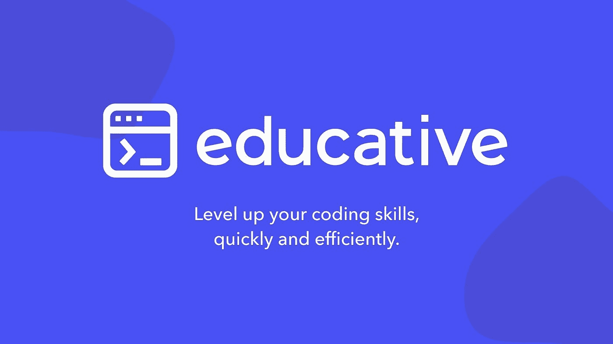
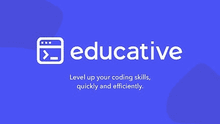
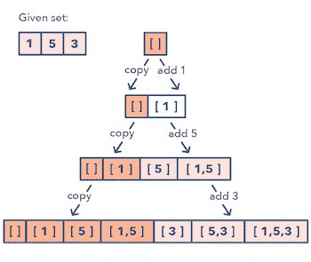

# 2023 年教育性课程值得吗？

> 原文：<https://medium.com/javarevisited/is-educative-courses-worth-it-6b6014ffbdb9?source=collection_archive---------0----------------------->

## 如果你正在准备编码面试，那么 Educative 是一个最好的去处，他们的搜索课程像搜索系统设计、OOP 设计、编码模式都是编码面试的极好资源

你好，伙计们，如果你正在考虑加入[教育性的](https://www.educative.io?affiliate_id=5073518643380224)以一种引导的、互动的方式学习新的技术技能，但不确定你来对地方了。

在过去，我曾分享过[面向程序员和软件开发人员的最佳教育课程](https://javarevisited.blogspot.com/2020/05/top-10-educative-courses-for-programmers.html)以及他们的[学习编程的最佳免费文本课程](/javarevisited/20-free-educative-courses-for-programmers-and-software-engineers-a7135028350c)，也回顾过他们的最佳在线课程，如[搜索系统设计课程](https://javarevisited.blogspot.com/2022/03/eview-is-grokking-system-design-worth-it.html)和 [OOP 设计课程](https://javarevisited.blogspot.com/2022/04/review-is-grokking-object-oriented.html)，在本文中，我将回顾 Educative.io，用于学习技术技能并为 2023 年使用在线课程进行编码面试做准备。

在线教育是这个时代的新趋势，如果你想被大公司聘用或学习大学所需的高技能，你可以说仅仅依靠你的大学学位是不够的。许多在线平台利用这种趋势来生活，其中一个叫做 [**教育性**](https://www.educative.io?affiliate_id=5073518643380224) 。

<https://www.educative.io/?affiliate_id=5073518643380224>  

## 1.什么是教育性？

对于那些想成为软件开发人员，并作为初学者学习计算机科学，甚至已经作为软件开发人员工作，但又想提升技能的人来说，你最好看看 educative.io 平台。

[Educative](https://www.educative.io?affiliate_id=5073518643380224) 是一个平台，旨在通过许多不同编程语言和主题的在线课程，向人们和专业人士传授成为软件开发人员所需的技能，例如 web 开发&移动应用程序开发。

Educative 与其他流行的在线平台(如 Udemy、Coursera、Pluralsight、Datacamp、edx、Udacity 和 Codecademy)的区别在于，它们基于文本的互动课程和平台允许您在浏览器上运行 Java、Python、JavaScript 或任何编程代码。

这种教育性的能力消除了初学者甚至经验丰富的开发人员在学习新技术时面临的许多摩擦，这就是为什么你不仅学得快，而且比仅仅看视频学得更好，记得更久。

## 2.Educative 有哪些课程？

Educative 是一家盈利性公司，提供与编程和软件开发相关的课程，例如 [python 语言](https://www.java67.com/2020/05/top-5-courses-to-learn-python-in-depth.html)、 [web 开发技术](https://javarevisited.blogspot.com/2018/02/top-5-online-courses-to-learn-web-development.html)、[机器学习](https://www.java67.com/2018/10/top-10-data-science-and-machine-learning-courses.html)、移动应用程序开发、云计算、数据库、软件测试、系统设计等等。

除此之外，他们还有最好的在线课程来准备编码面试。Educative 不是只提供一门课程进行浅层次的准备，而是提供专门的课程来深入准备关键的编码面试主题。

比如他们的 [**搜罗系统设计面试课程**](https://www.educative.io/collection/5668639101419520/5649050225344512?affiliate_id=5073518643380224) 是准备系统设计面试最好的线上资源之一，这往往是编码面试成败的关键。

他们现在还推出了第二部分，以涵盖高级系统设计面试中更高级的主题，这两个课程都是在编程工作面试中破解系统设计问题的惊人资源。

同样，他们的 [**寻找编码面试模式课程**](https://www.educative.io/collection/5668639101419520/5671464854355968?affiliate_id=5073518643380224) 也是同类课程之一，教你 15 种基本的编码模式，如滑动窗口、双指针、快慢指针等，可以用来解决 100 多个 Leetcode 问题。

这比只是盲目练习 leetcode 问题并希望你能在面试中得到其中一个结果却最终失望要好得多。

学习这些模式不仅会教你如何解决常见的编码问题，还会让你为看不见和未知的编码问题做好准备，这些问题通常会在 FAANG 和大型技术面试中被问到。

与 Coursera、Udemy、edx 等其他在线学习平台不同，它们提供视频课程，educative 提供文章教程和互动环境来练习你所学的知识。

## 3.谁分享教育课程？

许多其他在线平台，如 [Udemy](https://javarevisited.blogspot.com/2020/05/top-10-udemy-courses-to-learn-python-programming.html) ，让每个人发布课程并设定价格。 [Coursera](https://javarevisited.blogspot.com/2021/12/top-5-google-certifications-on-Coursera.html) & [edx](https://javarevisited.blogspot.com/2021/05/top-10-edx-courses-and-certificates-for.html) 只让机构和顶尖大学发布自己的内容，但对于 educative 来说，就不一样了。

这个平台拥有经验丰富的开发人员，他们总是发布新内容，使其成为最好的在线教育和值得信赖的网站之一，即使是为亚马逊和谷歌等知名公司工作的员工也是如此，目前有超过 97.5 万名学习者。

## 4.最佳教育课程推荐

如果你喜欢这个平台，并且想尝试学习一些新的技能，那么我会试着推荐一些最好的课程，这些课程将促进你作为软件开发人员的职业生涯，但这完全取决于你的需求以及你最终想成为什么样的人:

**5.1。**[**python for Programmers**](https://www.educative.io/path/python-for-programmers?affiliate_id=5073518643380224)**:**这是一门学习 Python 语言的优秀入门课程，Python 语言是现在许多工作中很好的抢手技能之一，你可以用这种语言创建无尽的项目。

<https://www.educative.io/path/python-for-programmers?affiliate_id=5073518643380224>  

**5.2。** [**开始飘起**](https://www.educative.io/courses/beginning-flutter-android-mobile-app-development) **:** 这是一个基于 dart 语言的框架，可以开发混合移动应用，这意味着你可以创建一个代码并提取运行在 iOS & Android 上的移动应用。

<https://www.educative.io/courses/beginning-flutter-android-mobile-app-development?affiliate_id=5073518643380224>  

**5。3** [**摸索式动态编程**](https://www.educative.io/collection/5668639101419520/5633779737559040?affiliate_id=5073518643380224)

为编码面试寻找动态编程模式是我们最畅销的“寻找”面试准备系列的最新条目(在“[寻找系统设计面试](https://www.educative.io/collection/5668639101419520/5649050225344512?affiliate_id=5073518643380224)”和“[寻找面向对象设计面试](https://www.educative.io/courses/grokking-the-object-oriented-design-interview?affiliate_id=5073518643380224)”之后)。

与许多其他资源不同，本课程不只是让您记住解决方案，它还教会您基本的模式和您应该采取的方法，以便您可以解决将来可能遇到的任何与 DP 相关的问题。

<https://www.educative.io/collection/5668639101419520/5633779737559040?affiliate_id=5073518643380224>  

## 5.教育性定价

大多数教育课程都是付费的，但是你可以有一个免费的帐户，可以有限地使用他们的课程和其他好处。Educative 有像[**Educative unlimited**](https://www.educative.io/subscription?affiliate_id=5073518643380224)这样的计划，按月收费或按年收费，如果你按年付费，每个月大约需要 19.99 美元，按月收费的话，每个月大约需要 35 美元，这比其他选择要贵得多。

<https://www.educative.io/unlimited?affiliate_id=5073518643380224>  

你也可以**一次性支付两年，**这将花费你每月 8.97 美元左右，两年的账单为 215 美元，如果你想长期使用这个平台，这比其他两个计划要好。价格有时可能会根据您看到它的日期而变化，也许他们会在一些特定的日子进行销售，以销售更多的课程。

此外，**educative 中的课程可以单独购买，**您不会永远无法访问这些内容。因此，对于只对一个主题感兴趣的人来说，这是一件好事，不用很长时间使用这个平台，并且学习许多其他技能。否则，订阅将更适合这种情况。

大多数开发人员和工程师都希望有一个基于视频的在线教育平台。不过，基于文本的教程比视频要好，因为视频中的平均字数是每分钟 150 个单词。普通读者可以达到每分钟 250 个单词，这使得学习新东西更快，不要指望观看总共 3 小时的视频内容，这些内容可能很难理解。

教育平台也有一个团队计划，所以如果你是一家至少有 3 名员工、最多有 25 名员工的公司，你可以购买团队计划，每位学员每年的费用约为 119 美元。如果你有一家员工超过 25 人的公司，你需要联系他们了解整个套餐的价格。

## 结论

这就是 Educative 的基于文本的编程和技术课程是否值得的问题。在我看来，教育性的课程是完全值得的，因为它们更容易学习，并提供没有任何摩擦的实践，这是学习一门新的编程语言、框架或技术的关键。它们也是由专家创建的，有测验和评估，并提供证书，这是加入 Educative 的额外原因，也是我认为它们值得的原因。

感谢阅读！正如我提到的，Educative 有超过 975，000 名学习者和数千家公司使用他们的内容，这使得它成为一个值得信赖的平台，可以学习新的技能并在软件开发中提升自己。

他们还提供 [**7 天免费试用**](https://www.educative.io/trial?affiliate_id=5073518643380224) ，这是检查课程和平台的好方法，我强烈推荐给你。这是免费的，你有机会检查他们最令人惊讶的课程。

<https://www.educative.io/trial?affiliate_id=5073518643380224> 