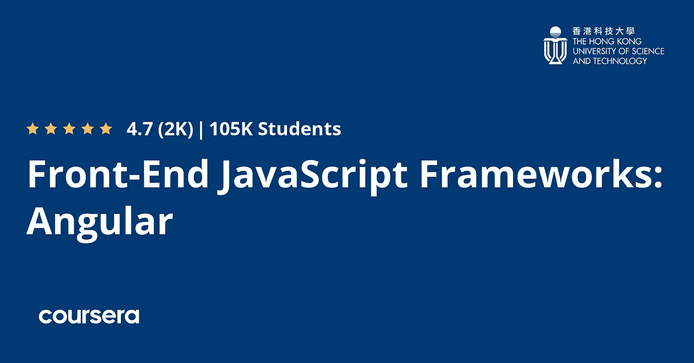
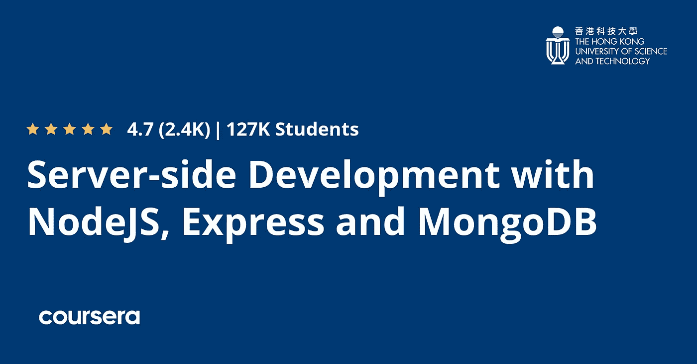

# Coursera 上 Angular Specialization 的全栈 Web 开发值得吗？回顾

> 原文：<https://medium.com/javarevisited/is-full-stack-web-development-with-angular-specialization-on-coursera-worth-it-review-e1077792f6af?source=collection_archive---------1----------------------->

你好伙计们，如果你正在寻找学习 Angular 的最佳 Coursera 课程，或者想知道 Coursera 上 Angular 专业化的全栈 Web 开发是否值得你花费时间和金钱，那么你来对地方了。

前面我已经分享过 Coursera 的 [**最佳 web 开发课程，在这篇文章中，我将回顾最受欢迎的 Angular 课程——**](/javarevisited/10-best-coursera-courses-for-web-development-and-web-design-9ec54ed92dd9)**[**全栈 Web 开发与 Angular 专业化**](https://coursera.pxf.io/c/3294490/1164545/14726?u=https%3A%2F%2Fwww.coursera.org%2Fspecializations%2Ffull-stack-mobile-app-development) 。这是 Angular 最好的 Coursera 专业之一，它包含 3 门课程，学习 Bootstrap、Angular 和 Node.js，成为使用 JavaScript 的完整的全栈开发人员。**

对于大多数人来说，从头构建一个 web 应用程序似乎很难，因为他们需要学习许多编程语言，然后学习他们的框架，以完成从前端到后端的整个应用程序的构建，并将数据存储在数据库中。

许多公司在其前端使用的一个框架叫做 [Angular](https://angular.io/) ，它可以让你创建网站的前端，即所谓的单页应用程序。

在过去的几年里，角形框架太受欢迎了。它是 2022 年 StackOverflow 调查中开发者使用第四多的框架，意味着学习这个框架，你将能够开发高度可扩展的单页面应用，并在需要时从社区获得帮助。

许多人在试图在线学习任何东西时都面临着同样的问题，这就是他们如何在成千上万的可用课程中选择正确的课程。它们中的许多是由非专家创建的，也许他们在学习过程中不会像专家那样给你一些建议。

为此，我搜索了学习 angular development 的最佳课程，并在香港大学创建的 Coursera 平台上找到了一个名为 [**的全栈 Web Development with Angular Specialization**](https://coursera.pxf.io/c/3294490/1164545/14726?u=https%3A%2F%2Fwww.coursera.org%2Fspecializations%2Ffull-stack-mobile-app-development)。

 [## 使用 Angular 进行全栈 Web 开发

### 由香港科技大学提供。构建完整的 Web 和混合移动解决方案。主人…

coursera.pxf.io](https://coursera.pxf.io/c/3294490/1164545/14726?u=https%3A%2F%2Fwww.coursera.org%2Fspecializations%2Ffull-stack-mobile-app-development) 

# 回顾 Coursera 的 Angular Specialization 全栈 Web 开发值得吗？

现在你已经知道这是学习全栈开发 Angular 的最好的课程之一，让我们详细回顾一下这个课程。我的评论是基于三个关键的参数或标准，谁在教，课程有多好，以及其他人对这门课的评价。这是我选择课程的三个重要标准，它很好地服务了我。

## 1.教员回顾

本课程由 Jogesh K.Muppala 为香港大学创建，香港大学以其高水准的声誉而闻名，是世界上学习编程最好的大学之一。副教授 Jogesh K. Muppala 创建了该课程，他于 1991 年从美国杜克大学获得博士学位。

专业的 Jogesh K. Muppala 是一位多产的讲师，在 Coursera 上为香港大学创建了 12 门课程。他也是 Coursera 广受欢迎的 React 课程— [**全栈 Web 开发与 React 专业化**](https://coursera.pxf.io/c/3294490/1164545/14726?u=https%3A%2F%2Fwww.coursera.org%2Fspecializations%2Ffull-stack-react) 的导师，这可能是 React 在线学习最有组织的培训项目。

谈到教学，Jogesh 非常清晰简洁。他的讲解也是切中要害，没有一点绒毛的牵扯，即使是初学者学习起来也非常轻松。如果你喜欢 Jogesh 的教学风格，你也可以在 Coursera 上看到他的其他课程，包括 React 那门。

# 2.课程结构、主题和内容

这是复习一门课程的另一个重要参数，因为如果课程结构不合理，你会以一种随机的方式学习，但结构合理的课程会先教你字母，然后教你单词。

这个 Coursera 认证基于三个课程，一个是前端基础，如 Bootstrap，然后是 Angular 课程，然后是 Node.js 和 Express.js 课程，以学习使用 JavaScript 进行服务器端开发。当你学习前端和后端时，这种结构对于成为全栈开发人员来说是非常好的。

## 2.1.[前端 Web UI 框架和工具:Bootstrap 4](https://coursera.pxf.io/c/3294490/1164545/14726?u=https%3A%2F%2Fwww.coursera.org%2Flearn%2Fbootstrap-4)

这门课程只有一个缺点。它需要你有一些使用这三种语言的前端开发经验:HTML、CSS 和 JavaScript。

在开始学习 Angular 之前，你需要在 YouTube 或者 Coursera 上学习这门语言。本课程从 Bootstrap 4 开始，它是一个 CSS 框架，用于构建响应性网站并设置 Git 和 Git 命令。

稍后，您将了解到 [Bootstrap 4 组件](https://javarevisited.blogspot.com/2020/07/top-5-courses-to-learn-bootstrap-in.html#axzz6n14jKy5s)以及如何创建导航栏和向您的网站添加按钮，处理图像&媒体，使用标签，以及创建进度条。你所学的组件是基于 CSS 语言的。

不过，现在您将了解 Bootstrap 的 JavaScript 组件，并将创建选项卡式导航、折叠和折叠、工具提示、旋转木马等等。最后，讨论如何使用 NPM 脚本通过任务自动化来构建和部署 web 项目。

**这里是加入本课程的链接**——[前端 Web UI 框架和工具:Bootstrap 4](https://coursera.pxf.io/c/3294490/1164545/14726?u=https%3A%2F%2Fwww.coursera.org%2Flearn%2Fbootstrap-4)

## 2.2.[前端 JavaScript 框架:Angular](https://coursera.pxf.io/c/3294490/1164545/14726?u=https%3A%2F%2Fwww.coursera.org%2Flearn%2Fangular)

完成第一门课程并熟悉 Bootstrap 4 后，您将了解 Angular，这是一个用于构建单页面应用程序的平台和框架。当用户浏览它的页面时，他们的浏览器不会每次都刷新。

这将提供良好的用户体验。然后你将使用这种语言开始实际的编程，并学习 [Angular](https://javarevisited.blogspot.com/2018/06/5-best-courses-to-learn-angular.html#axzz6WrhXVpNr) 中的数据绑定，设计基本服务，以及使用 Angular router 设计单页面应用 SPA。

稍后了解 Angular 如何支持表单和表单验证，并了解模板驱动的表单和反应式表单。你会理解承诺，rjx，以及它们在 Angular 中的用法。

最后，您将了解 network essentials，探索使用 Angular HTTP 和 REST API 的客户机-服务器通信，以及测试、构建和部署 Angular 应用程序。

**这里是加入本课程的链接** — [前端 JavaScript 框架:Angular](https://coursera.pxf.io/c/3294490/1164545/14726?u=https%3A%2F%2Fwww.coursera.org%2Flearn%2Fangular)

## 2.3.[使用 NodeJS、Express 和 MongoDB 进行服务器端开发](https://coursera.pxf.io/c/3294490/1164545/14726?u=https%3A%2F%2Fwww.coursera.org%2Flearn%2Fserver-side-nodejs)

第三部分也是最后一部分是关于服务器端和服务器内部发生的事情，因此您将使用 Node.js 框架来实现这一目的，您将了解它的模块和 Node HTTP 服务器，以及如何使用 [Express framework](https://javarevisited.blogspot.com/2018/01/top-5-nodejs-and-express-js-online-courses-for-web-developers.html) 来设置 REST API。

此外，您将了解数据库以及如何使用 MongoDB 技术建立 NoSQL 数据库，并通过节点应用程序与 [MongoDB](/javarevisited/5-best-mongodb-courses-to-learn-nosql-for-beginners-in-2020-42df5af5496c) 进行交互，等等。

接下来，您将了解身份验证是如何工作的，并使用 passport 设置基本身份验证。了解快速会话和 cookies，这是浏览网站时服务器生成的一小块数据。

最后，学习如何使用 HTTPS 协议建立安全通信，并学习上传文件和用户验证等操作。超过 113，000 人加入了该课程。

**这里是加入本课程的链接** — [使用 NodeJS、Express 和 MongoDB 进行服务器端开发](https://coursera.pxf.io/c/3294490/1164545/14726?u=https%3A%2F%2Fwww.coursera.org%2Flearn%2Fserver-side-nodejs)

# 3.人民评论

这是 Coursera 上相对较新的 Angular 课程，但尽管如此，它还是获得了一些加入该课程的人的惊人评论。整个专业以三门课程为基础，每门课程都有自己的复习。总的来说，专业化平均得分从 5.0 分上升到 4.7 分，这是惊人的。

超过 90，000 人加入了 Angular，这是该专业的第二个课程，超过 225，000 人加入了全栈开发的 Bootstrap 课程。

总的来说，这是 Coursera 非常受欢迎的 Angular 认证，我强烈推荐给任何想学习 Angular 并想获得认证的人。

这里是加入本课程的链接— [**带 Angular 专业化的全栈 Web 开发**](https://coursera.pxf.io/c/3294490/1164545/14726?u=https%3A%2F%2Fwww.coursera.org%2Fspecializations%2Ffull-stack-mobile-app-development)

## 结论

Coursera 上的 Angular Specialization 全栈 Web 开发是学习 Angular 进行全栈开发的最佳培训项目之一。它内容全面，引人入胜，结构良好，这使得它完全值得在 2022 年学习 Angular。

以上就是关于 Coursera 最佳 Angular 认证**——**[**全栈 Web 开发与 Angular Specialization**](https://coursera.pxf.io/c/3294490/1164545/14726?u=https%3A%2F%2Fwww.coursera.org%2Fspecializations%2Ffull-stack-mobile-app-development)**的这篇回顾，由港大提供。Angular 是大型科技公司用来创建单页面应用程序的最好和最流行的框架之一。**

**因此，学习这些技能将有助于你参与竞争，获得他人的高薪，或获得 web 开发工作。**

**当谈到加入这门课程时，你有两个选择，你可以单独加入这门课程，每月花费大约 39 美元进行专业化，你也可以加入 [**Coursera Plus**](https://coursera.pxf.io/c/3294490/1164545/14726?u=https%3A%2F%2Fwww.coursera.org%2Fcourseraplus) 每年 399 美元，这是 Coursera 的一个订阅计划，让你无限制地访问他们最受欢迎的课程、专业化、专业证书和指导项目。**

** [## Coursera Plus |无限制访问 7，000 多门在线课程

### 用 Coursera Plus 投资你的职业目标。无限制访问 90%以上的课程、项目…

coursera.pxf.io](https://coursera.pxf.io/c/3294490/1164545/14726?u=https%3A%2F%2Fwww.coursera.org%2Fcourseraplus) 

您可能想探索的其他 **Web 开发和角度文章**

*   [前端和后端开发者路线图](https://javarevisited.blogspot.com/2019/02/the-2019-web-developer-roadmap.html)
*   [面向 Java 和 DevOps 工程师的 5 门免费 Docker 课程](http://www.java67.com/2018/02/5-free-docker-courses-for-java-and-DevOps-engineers.html)
*   [2022 年学习 JavaScript 的 13 门免费课程](/javarevisited/12-free-courses-to-learn-javascript-and-es6-for-beginners-and-experienced-developers-aa35874c9a32)
*   [全栈开发者路线图](/javarevisited/the-2019-web-developer-roadmap-ab89ac3c380e)
*   [成为 Fullstack Java 开发人员的前 5 门课程](https://javarevisited.blogspot.com/2020/04/top-5-courses-to-become-full-stack-java-developer-with-Angular-and-Reactjs.html#axzz6Nq9yk7Sc)
*   [2022 年 React JS 开发者路线图](https://javarevisited.blogspot.com/2018/10/the-2018-react-developer-roadmap.html#axzz5dPh5g7tg)
*   [学习 Learn RESTful Web 服务的 3 本书和课程](http://www.java67.com/2018/02/3-books-and-courses-to-learn-restful-web-services-with-spring.html)
*   [面向初学者的 10 门 Python Web 开发课程](/javarevisited/top-10-courses-to-learn-python-for-web-development-in-2020-best-of-lot-efe11fb6d212)
*   [2022 年 5 门免费课程学习 Angular](https://javarevisited.blogspot.com/2018/06/5-best-courses-to-learn-angular.html)
*   [2022 年学习打字稿的 10 门免费课程](/javarevisited/top-10-free-typescript-courses-to-learn-online-best-of-lot-44bce9da41d1)
*   [我最喜欢的初学者学习棱角分明的课程](/javarevisited/10-courses-to-learn-angular-for-web-development-6da1bd2856dc)
*   [Web 开发人员学习 PHP 和 MySQL 的 5 门课程](http://www.java67.com/2018/02/5-free-php-and-mysql-courses-for-web-developers.html)
*   【Fullstack 开发者应该学习的 10 个框架

感谢您阅读本文。如果你喜欢香港大学在 Coursera 上发表的关于 Angular Specialization 全栈 Web 开发的*课程评论，请分享给你的朋友和同事。如果您有任何问题或反馈，请发表评论。

**P. S. —** 如果你是 Udemy 课程的爱好者，并且正在寻找最好的 React.js 课程，以便在 Udemy 上从头开始学习 React，我强烈推荐你查看这本由马克西米连·施瓦茨穆勒 编写的 [**Angular 完全指南课程。这是我见过的最好的角度路线。**](https://click.linksynergy.com/deeplink?id=JVFxdTr9V80&mid=39197&murl=https%3A%2F%2Fwww.udemy.com%2Fcourse%2Fthe-complete-guide-to-angular-2%2F)*

 [## 2022 年学习 Angular Framework 的前 5 门课程——最佳课程

### 如果你是一个网页开发人员或者想学习网页开发的 Angular，并且正在寻找一些优秀的…

javarevisited.blogspot.com](https://javarevisited.blogspot.com/2018/06/5-best-courses-to-learn-angular.html)**