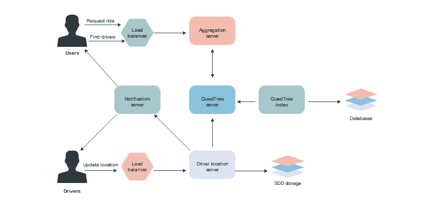
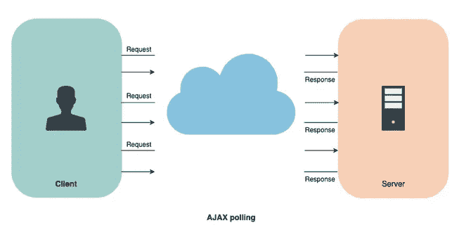
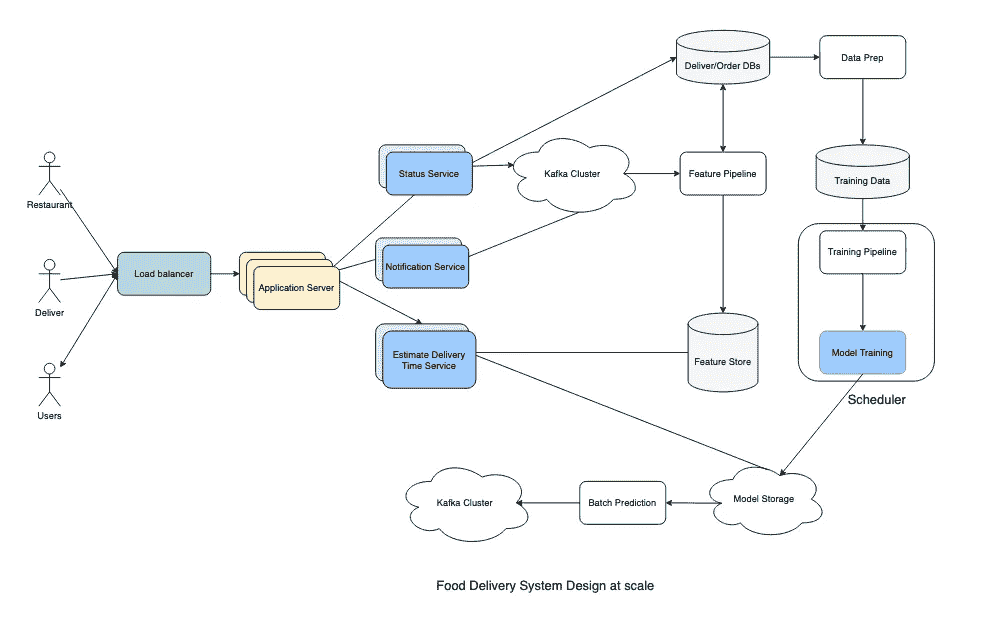
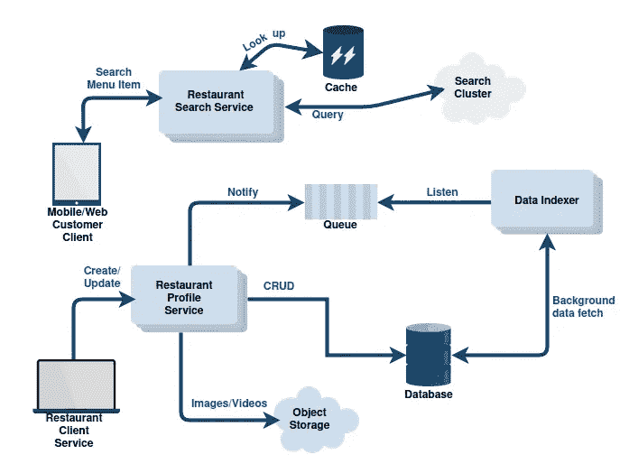

# 探索先进的教育系统设计值得吗？回顾

> 原文：<https://medium.com/javarevisited/is-grokking-advanced-system-design-interview-on-educative-worth-it-review-d0be0148c9f0?source=collection_archive---------1----------------------->

## 探索先进的系统设计教育面试值得吗？我想是的，鉴于其互动和深入的内容。

你好，伙计们，如果你想知道在 Educative 上学习高级系统设计课程是否值得，那么你来对地方了。

之前，我不仅分享了 [**最好的系统设计课程**](/javarevisited/10-best-system-design-courses-for-coding-interviews-949fd029ce65) ，还回顾了 Educative 最受欢迎的[探索系统设计课程](/javarevisited/review-of-grokking-the-system-design-course-on-educative-is-it-worth-it-b24af8fb326d)以及新的[探索现代系统设计课程](/javarevisited/review-grokking-modern-system-design-for-software-engineers-and-managers-really-the-best-course-f4f3ed31de63)，在这篇文章中，我将回顾他们第三受欢迎的系统设计课程。

但是，在我对 Educative 的[高级系统设计面试](https://www.educative.io/courses/grokking-adv-system-design-intvw?affiliate_id=5073518643380224)进行评论之前，让我告诉你一些关于这门课程的更多信息，这样我们就在同一页上了。

如果你曾经参加过软件工程面试，你一定已经知道，系统设计问题是这个过程中不可或缺的一部分。系统设计起着非常重要的作用，因为它被认为比解决编码问题更重要。

为了给你的潜在雇主留下深刻印象，你必须能够展示你真正的设计技能，并让他们相信你能够处理复杂的设计系统。

此外，我不必说，在系统设计面试中表现出色会给你带来更高的职位，更高的薪酬和稳定性。这就是这门课程的意义所在。

Educative 的[**Grokking Advanced System Design Interview**](https://www.educative.io/courses/grokking-adv-system-design-intvw?affiliate_id=5073518643380224)基本上是对著名分布式系统的架构回顾。本课程的主要目的是筛选出与系统设计面试问题非常相关的非常重要的设计细节。

该课程还有一个精彩的系统设计模式列表，这些模式构成了常见的系统设计问题，以及不同的分布式系统已经开发出的解决方案。

本课程的另一个主要特点是它完全基于文本。你不会在这里看到任何华而不实的视频。这能确保你长时间保持专注。你也不必坐着听几个小时无聊的视频讲座。

# 关于教育的高级系统设计面试课程。值得吗

你可以把这个课程看作是教育平台上的 [*探索系统设计面试课程*](https://www.educative.io/collection/5668639101419520/5649050225344512?affiliate_id=5073518643380224) 的续篇，这也是最受欢迎的教育课程之一。

正如你从课程名称中已经猜到的那样，这门课程更进一步。这里你不会看到任何一般的[系统设计面试问题](/javarevisited/25-software-design-interview-questions-to-crack-any-programming-and-technical-interviews-4b8237942db0)。

本课程基本上由描述一些最流行、最广泛使用和最广泛部署的分布式系统的内部工作原理的概要组成。对于初学者来说，你将开始学习像迪纳摩，卡珊德拉，卡夫卡，查比，GFS，HDFS 和大桌子系统。

## 1 .1 **系统设计案例研究**

课程分为两个主要部分:**系统设计案例分析**和**系统设计模式**。

在第一部分中，你将学习一个流行的和精心选择的分布式系统的架构，比如:

1.  键值存储:**发电机**
2.  非 SQL 宽列存储: **Cassandra** 和 **BigTable**
3.  分布式消息和流媒体系统: [**卡夫卡**](/javarevisited/top-10-apache-kafka-online-training-courses-and-certifications-621f3c13b38c)
4.  分布式文件存储系统: **GFS** 和 **HDFS**
5.  分布式协调和锁定服务:**小胖**(类似于动物园管理员)

您一定已经猜到了，这些系统中的大多数都属于大数据领域。这将帮助你实现分布式系统理论的概念。

本课程的另一个有趣的特点是，它将通过将复杂的系统分解成小块，并要求你将它们重新组装起来，从而为你简化复杂的系统。这对于准备任何深入的系统设计面试都非常有用，如果你也这样认为，那么你应该参加这个课程。

**这里是加入本课程的链接**——[探寻高级系统设计面试](https://www.educative.io/courses/grokking-adv-system-design-intvw?affiliate_id=5073518643380224)

## 1.2 系统设计模式

这个关于教育的 [**高级系统设计课程**](https://www.educative.io/courses/grokking-adv-system-design-intvw?affiliate_id=5073518643380224) 最好的一点是，你将学习到系统设计模式，如 Bloom Filter、一致性散列等。下面是您将在高级系统设计课程的第二部分学习的系统设计模式的完整列表:

1.布鲁姆过滤器
2。一致哈希
3。法定人数
4。领导者和追随者
5。预写日志
6。分段日志
7。高水位标记
8。租赁
9。心跳
10。八卦协议。Phi 累积故障检测
12。裂脑
13。击剑
14 校验和
15。矢量时钟
16。上限定理
17。PACELC 定理
18。暗示的移交。阅读修理
20。Merkle 树

一旦你知道这些模式是什么，你可以如何使用它们来解决常见的系统设计问题，那么你就已经成功了一半。

通过学习它们背后的概念，你也将能够理解所有复杂的分布式系统。你将获得大量的公开文件。

本课程擅长提取这些系统的设计和运行的非常重要的细节，并以迷你摘要的形式呈现在你面前，这样你就可以浏览所有的细节并给面试官留下深刻印象。

**这是加入本课程的链接** — [探索高级系统设计面试](https://www.educative.io/courses/grokking-adv-system-design-intvw?affiliate_id=5073518643380224)

# 教育技术面试的 6 门最佳系统设计课程

如果你认真准备深入的系统设计面试，那么这里有 Educative 为初学者和有经验的开发人员提供的其他最佳系统设计课程。它包括初级和高级水平的系统设计课程，你可以参加，为系统设计面试做准备。

## 1.[系统设计面试](https://www.educative.io/collection/5668639101419520/5649050225344512?affiliate_id=5073518643380224)

这是一门很棒的课程，它会教你所有你需要知道的关于系统设计的知识，同时从零开始。这样的话，对于完全的初学者来说绝对是完美的。对于希望进入令人惊叹的系统设计世界的初学者来说，这是一个完美的入门指南。

课程时长:3 小时
课程评分:4.6 星(满分 5 分)
课程讲师:教育性
课程价格:每月 20 美元

**这里是加入本课程的链接—** [钻研系统设计面试](https://www.educative.io/collection/5668639101419520/5649050225344512?affiliate_id=5073518643380224)

## 2.[为软件工程师钻研现代系统设计](https://www.educative.io/collection/5668639101419520/5649050225344512?affiliate_id=5073518643380224)

本课程将作为现代系统设计惊人世界的一个很好的简介。它非常适合初学者，因为你将从零开始学习系统设计。你将确切地了解什么是系统设计以及为什么要使用它。

课程时长:2 小时
课程评分:4.5 星(满分 5 分)
课程讲师:教育性
课程价格:每月 20 美元

**这里是加入本课程的链接—** [探索现代系统设计](https://www.educative.io/collection/5668639101419520/5649050225344512?affiliate_id=5073518643380224)

## 3.[探寻面向对象设计面试](https://www.educative.io/courses/grokking-the-object-oriented-design-interview?affiliate_id=5073518643380224)

这是一门很棒的课程，它将帮助你把面向对象系统设计的技能提升到另一个层次。通过使用面向对象的系统设计，而不是传统的系统设计技术，你将能够做到这一点。

这门课程将教你如何通过系统设计面试。你还将学习如何在谷歌找到工作。脸书、微软和亚马逊。

课程时长:2 小时
课程评分:4.4 星(满分 5 分)
课程讲师:教育性
课程价格:每月 20 美元

**这里是加入本课程的链接—** [寻找面向对象设计面试](https://www.educative.io/courses/grokking-the-object-oriented-design-interview?affiliate_id=5073518643380224)

## 4.[机器学习系统设计](https://www.educative.io/courses/machine-learning-system-design?affiliate_id=5073518643380224)

这是一门令人兴奋的课程，它将在最短的时间内教会你一切你需要知道的关于机器学习系统设计的基础知识。该课程还将教你所有你需要知道的关于机器学习和系统设计的知识。

课程时长:1 小时
课程评分:4.6 星(满分 5 分)
课程讲师:康咪咪·费姆
课程价格:每月 20 美元

**这里是加入本课程**——[机器学习系统设计](https://www.educative.io/courses/machine-learning-system-design?affiliate_id=5073518643380224)的链接

## 6.[系统设计面试:门板设计](https://www.educative.io/courses/system-design-interview-doordash?affiliate_id=5073518643380224)

在这个奇妙的课程中，你将学到被 Doordash 雇佣所需的关于系统设计不同组成部分的所有知识。你将从学习系统设计的基础开始这门课程。

然后你会继续理解什么是系统设计。本课程结束后，你将能够在 Doordash 找到一份非常好的工作。

课程时长:2 小时课程评分:4.5 星(满分 5 分)
课程讲师:Partha Pratim Sanyal
课程价格:每月 20 美元

**以下是加入本课程的链接** — [系统设计面试:门饰设计](https://www.educative.io/courses/system-design-interview-doordash?affiliate_id=5073518643380224)

## 结论——钻研高级系统设计面试课程值得吗？

如果你问我，这个课程绝对是值得的，因为几乎没有任何课程可以让你一起学习系统设计模式和案例研究。事实上，我几乎找不到任何包含系统设计模式的课程。

当我发现这个课程时，我有类似于我第一次发现 [**寻找编码面试:编码问题的模式**](http://15 underlying patterns to interview questions, and you'll be able to tackle anything you face on the interview) 的感觉，在那里我学到了 15 种面试问题的基本模式，如滑动窗口、2 指针模式等。

本课程非常有价值，无论您是否正在准备系统设计面试，我都强烈建议您参加本课程，了解这些基本的系统设计模式以及大数据、Kafka、消息队列、Dynamo 等如何工作。您在本课程中获得的知识肯定会使您成为一名更好的开发人员。

想了解更多，看这里— [系统设计面试:Doordash 设计](https://www.educative.io/courses/system-design-interview-doordash?affiliate_id=5073518643380224)

这就是 Educative 的《寻找高级系统设计面试课程》的**回顾。简而言之，该课程对系统设计概念和流行的系统设计问题的深入覆盖绝对值得。**

如果你喜欢 Educative 广受欢迎的高级系统设计面试课程的这篇评论，请随意与你的朋友和家人分享。我毫不怀疑这门课程会在几周或几个月内把你从一个完全的新手变成一个专家系统设计师。

顺便说一下，你可以单独参加这个课程，或者你可以参加 [**教育订阅**](https://www.educative.io/subscription?affiliate_id=5073518643380224) (推荐)，以获得他们的 250 多个高质量、基于文本的交互式课程，学习编码面试、软件开发和技术的关键技能。

 [## 教育无限:保持领先

### 我想表达我的无限感激，让您的多功能教育平台可用和访问。我…

www.educative.io](https://www.educative.io/subscription?affiliate_id=5073518643380224) 

您可能喜欢探索的其他**文章**

*   [如何准备 2022 年系统设计面试](/javarevisited/how-to-crack-system-design-interviews-in-2022-tips-questions-and-resources-fcad05e2dab)
*   [准备编码面试的 10 个基本主题](/javarevisited/10-essential-topics-and-resources-for-coding-and-programm-job-interviews-4017cac3a522)
*   [程序员的 10 门最佳教育性. io 课程](https://javarevisited.blogspot.com/2020/05/top-10-educative-courses-for-programmers.html)
*   [成为解决方案架构师的前 5 本书](https://javarevisited.blogspot.com/2018/02/5-must-read-books-to-become-software-architect-solution.html)
*   [我最喜欢的学习软件架构的课程](/javarevisited/top-5-courses-to-learn-software-architecture-in-2020-best-of-lot-5d34ebc52e9)
*   [12 个 SQL 查询面试问题及解答](https://javarevisited.blogspot.com/2017/02/top-6-sql-query-interview-questions-and-answers.html)
*   [学习系统设计和软件设计的前五名](https://javarevisited.blogspot.com/2022/08/top-7-websites-to-learn-system-design.html)
*   来自面试的 20 个软件设计和模式问题
*   [25 递归面试问题及答案](https://javarevisited.blogspot.com/2021/09/top-10-recursion-interview-questions.html)
*   [10 门免费教育课程，供初学者学习编程](https://javarevisited.blogspot.com/2020/01/top-10-free-interactive-online-courses.html)
*   [学习动态编程的 6 门最佳课程](/javarevisited/6-best-dynamic-programming-courses-for-coding-interviews-14744060923c)
*   [学习 Java 大数据和 Apache Spark 的 5 门课程](http://javarevisited.blogspot.sg/2017/12/top-5-courses-to-learn-big-data-and.html)
*   【Java 开发人员在日常工作中使用的 10 种工具
*   [成为更好的 Java 程序员的 10 个技巧](https://javarevisited.blogspot.com/2018/05/10-tips-to-become-better-java-developer.html)

感谢您阅读本文。如果你喜欢高级系统设计面试课程的*评论，那么请分享给你的朋友和同事，他们会很感激的。如果您有任何问题或反馈，请留言。*

如果你正在寻找教育系统设计课程的替代品，那么我也建议你去看看 Udemy 上 Frank Kane 的 [**掌握系统设计面试**](https://click.linksynergy.com/deeplink?id=JVFxdTr9V80&mid=39197&murl=https%3A%2F%2Fwww.udemy.com%2Fcourse%2Fsystem-design-interview-prep%2F) 课程。弗兰克是一名前招聘经理，知道如何才能在 2022 年通过那些大型 FAANG 公司的系统设计面试。

另一个很好的选择是，你也可以参加 Alex Yu 的 [*系统设计面试——一个知情人的指南*](https://www.amazon.com/System-Design-Interview-insiders-Second/dp/B08CMF2CQF/?tag=javamysqlanta-20) 和 ByteByteGo，做一个完整的系统设计面试准备。

 [## ByteByteGo | Ace 您的下一次系统设计面试

### 让您的系统设计技能更上一层楼所需的一切

bytebytego.com](https://bytebytego.com?fpr=javarevisited)