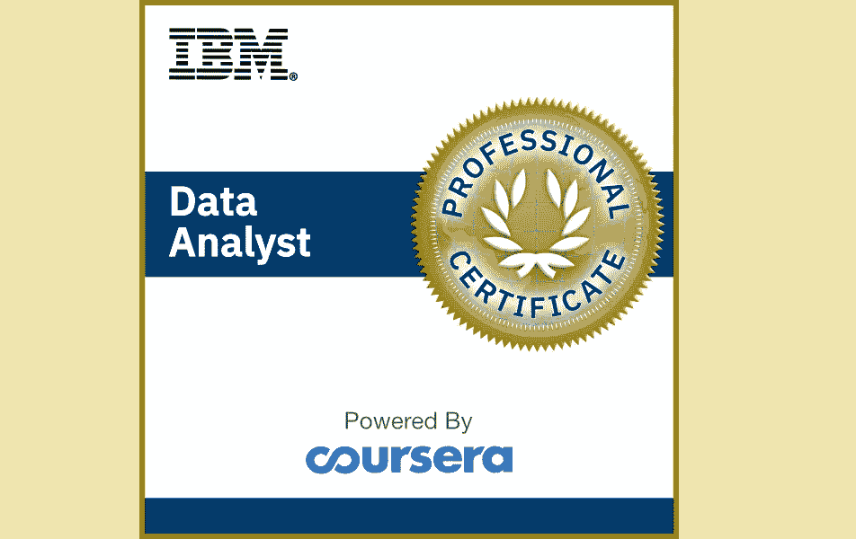
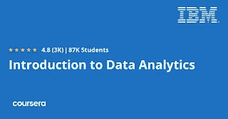
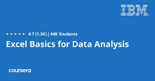
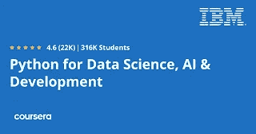
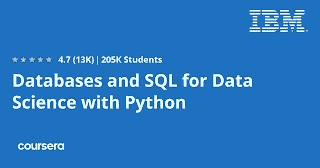
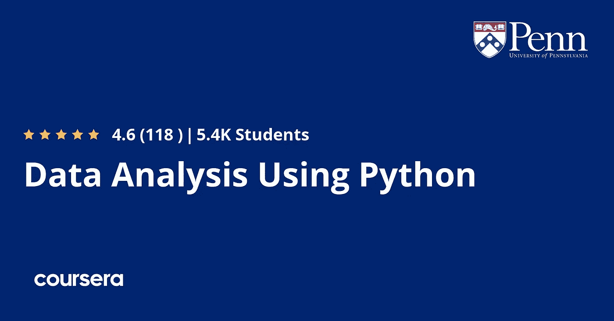
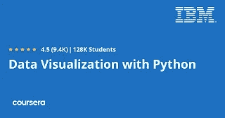
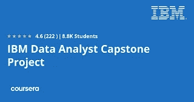
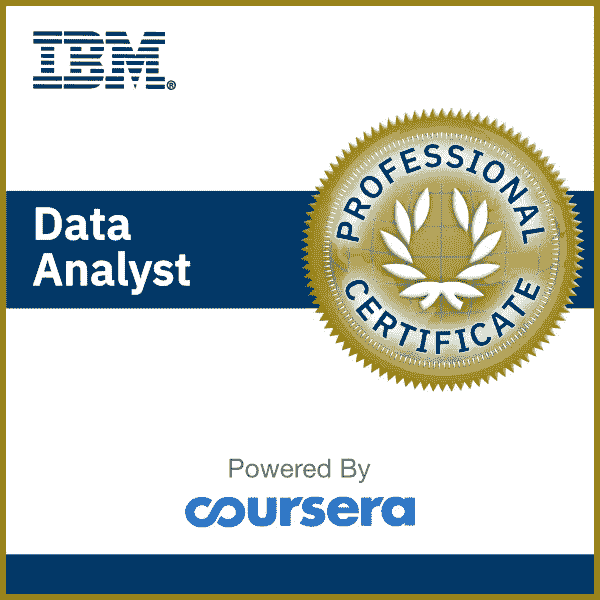

# Coursera 的 IBM 数据分析师专业认证值得吗？[综述]

> 原文：<https://medium.com/javarevisited/is-ibm-data-analyst-professional-certification-coursera-worth-it-review-2a0006db2b1a?source=collection_archive---------0----------------------->

## 2023 年想成为数据分析师专业人士吗？如果是的话，那么这是一个很好的资源，你可以从 IBM 在 Coursera 上的专家培训师那里学到关于数据分析的一切。

你好，伙计们，如果你想在 2023 年成为一名数据分析师，并寻找最好的在线资源来学习数据分析的基本知识并开始你的职业生涯，那么你来对地方了。

之前，我已经分享了针对初学者的 [**最佳数据分析课程**](https://becominghuman.ai/5-best-courses-to-learn-pythons-pandas-libary-for-data-analysis-and-data-science-34b62abb0e96) ，在这篇文章中，我将向您介绍 Coursera 最受欢迎的数据分析认证之一， [*IBM 的数据分析师专业认证*](https://coursera.pxf.io/c/3294490/1164545/14726?u=https%3A%2F%2Fwww.coursera.org%2Fprofessional-certificates%2Fibm-data-analyst) 。

如果你不知道 Coursera 作为密歇根大学和斯坦福大学这样的世界顶级大学，带来了 IBM 和 Google 这样的顶级公司最好的学习资料和资源。他们的[专业认证](https://javarevisited.blogspot.com/2020/09/google-it-support-professional-certification-coursera-review.html)也得到很好的认可，并被很好地组织起来以学习受欢迎的技术技能，这是其中之一。

许多人认为数据分析的概念是新的。尽管如此，实际上，人类从 19 世纪就开始使用分析，甚至可能更早。尽管如此，在 1960 年人们开始使用电脑时，它变得更加流行，但现在每个公司都在使用电脑，全球各地的招聘网站上有数百万人在使用电脑。

许多人认为你需要一个大学学位才能得到一份数据分析师的工作。尽管如此，你现在可以访问许多不同的在线课程来获得这个职位所需的技能，但你们中的一些人会对应该学习什么课程感到困惑。我给你的建议是这是 IBM 提供的 [**IBM 数据分析师专业证书项目**](https://coursera.pxf.io/c/3294490/1164545/14726?u=https%3A%2F%2Fwww.coursera.org%2Fprofessional-certificates%2Fibm-data-analyst) 。

<https://coursera.pxf.io/c/3294490/1164545/14726?u=https%3A%2F%2Fwww.coursera.org%2Fprofessional-certificates%2Fibm-data-analyst>  

# IBM 在 Coursera 上的数据分析师专业证书值得吗？

正如我以前说过的，每当我参加一个课程，我都会考察三个主要参数，谁是讲师，课程是如何组织的，我的意思是涵盖了什么和没有涵盖什么，以及其他人对课程的看法。因此，我也将根据上述三个参数来回顾本课程。

## 1.教员回顾

数据分析专业化由 IBM 公司的 9 名专业人员创建，他们都是数据科学家和数据分析人员，因此当你加入该计划时，你将向在该领域有丰富经验的人学习，与业余爱好者提供的其他课程相比，所有信息都是真实的。

# 2.数据分析课程结构和内容

这是 Coursera 中的专业证书，这意味着它是一系列课程的集合，教你成为数据分析师所需的所有基本技能。让我们进入这些课程教学，看看你会学到什么。

## 2.1.[数据分析简介](https://coursera.pxf.io/c/3294490/1164545/14726?u=https%3A%2F%2Fwww.coursera.org%2Flearn%2Fintroduction-to-data-analytics%3Fspecialization%3Dibm-data-analyst)

您将从什么是数据分析师工作以及不同类型的数据分析师开始学习。然后，您将学习不同类型的数据结构和文件格式，以及不同类型的数据仓库，如数据库和仓库。

此外，您还将学习如何识别、收集和导入来自不同来源的数据，并将它们可视化。

## 2.2. [Excel 数据分析基础](https://coursera.pxf.io/c/3294490/1164545/14726?u=https%3A%2F%2Fwww.coursera.org%2Flearn%2Fexcel-basics-data-analysis-ibm%3Fspecialization%3Dibm-data-analyst)

excel 电子表格是执行数据分析最常用的应用程序之一，您将获得一些使用该软件的知识并浏览其选项。

然后，您将学习执行基本任务，如输入和查看数据，以及如何从不同的资源导入数据。最后，excel 软件内部使用了一些内置函数。

## 2.3.[使用 Excel 和 Cognos 的数据可视化和仪表盘](https://coursera.pxf.io/c/3294490/1164545/14726?u=https%3A%2F%2Fwww.coursera.org%2Flearn%2Fdata-visualization-dashboards-excel-cognos%3Fspecialization%3Dibm-data-analyst)

本节将教你如何使用 excel 进行数据可视化，如基本图表和数据透视表可视化。

然后，您将学习创建散点图和直方图等更高级的图表，并学习仪表板的基础知识。

最后，您将学习使用另一个名为 Cognos analytics 的分析工具，并探索它的选项。

## 2.4. [Python 用于数据科学，AI &开发](https://coursera.pxf.io/c/3294490/1164545/14726?u=https%3A%2F%2Fwww.coursera.org%2Flearn%2Fpython-for-applied-data-science-ai%3Fspecialization%3Dibm-data-analyst)

从 python 编程语言的基础开始，比如数据类型以及如何在一个变量中存储值和在一个变量中存储多个值，即元组、列表、字典和集合。

稍后，您将看到 for 循环，如何迭代条目，处理文件和数据，以及使用 API 和 web 抓取。

## 2.5.[数据科学 Python 项目](https://coursera.pxf.io/c/3294490/1164545/14726?u=https%3A%2F%2Fwww.coursera.org%2Flearn%2Fpython-project-for-data-science%3Fspecialization%3Dibm-data-analyst)

本节依赖于前几节。你必须了解 python 语言，以展示你在这种语言方面的知识，并创建一个程序，使用不同的 [Python 库](https://becominghuman.ai/5-best-courses-to-learn-pythons-pandas-libary-for-data-analysis-and-data-science-34b62abb0e96)和 Jupiter Notebook 提取股票数据。

## 2.6.[使用 Python 为数据科学开发数据库和 SQL](https://coursera.pxf.io/c/3294490/1164545/14726?u=https%3A%2F%2Fwww.coursera.org%2Flearn%2Fsql-data-science%3Fspecialization%3Dibm-data-analyst)

学习用于从数据库中提取数据的 SQL 语言的基础知识，探索数据库背后的一般概念以及数据库中不同表的关系。

接下来，您将学习如何应用高级查询在数据库内部进行搜索，以及使用 python 语言访问数据库。

## 2.7.[使用 Python 进行数据分析](https://coursera.pxf.io/c/3294490/1164545/14726?u=https%3A%2F%2Fwww.coursera.org%2Flearn%2Fdata-analysis-with-python%3Fspecialization%3Dibm-data-analyst)

这是最有趣的部分，您将学习如何使用 python 分析数据，这也是整个程序的目的。使用 python 进行数据分析需要使用不同的库，例如用于数学计算的 [NumPy](https://javarevisited.blogspot.com/2018/10/top-8-python-libraries-for-data-science-machine-learning.html) ，用于导入和处理数据的 [Pandas](https://javarevisited.blogspot.com/2021/11/top-5-free-pandas-courses-for-beginners.html) ，以及用于将机器学习算法应用于数据的 SciPy。

## 2.8.[用 Python 实现数据可视化](https://coursera.pxf.io/c/3294490/1164545/14726?u=https%3A%2F%2Fwww.coursera.org%2Flearn%2Fpython-for-data-visualization%3Fspecialization%3Dibm-data-analyst)

首先学习如何使用 matplotlib 库可视化数据，并创建不同的绘图，如面积图、直方图、饼图等。

您还将看到一些高级的可视化工具，如华夫饼图表以及如何创建它们，并学习其他[数据可视化库](/javarevisited/8-best-data-visualization-tools-and-libraries-data-analysts-and-scientists-can-learn-d2734371df16)，如 Seaborn 和 Folium。

## 2.9. [IBM 数据分析师顶点项目](https://coursera.pxf.io/c/3294490/1164545/14726?u=https%3A%2F%2Fwww.coursera.org%2Flearn%2Fibm-data-analyst-capstone-project%3Fspecialization%3Dibm-data-analyst)

这是最后一部分，要求您应用在之前课程中学到的知识，使用 python 和数据分析技能解决现实世界中的问题，并且假设您最近加入了该组织并开始了这一领域的旅程，因此您将在申请数据分析师职位之前获得真实的世界经验。

## 3.人民评论

这是加入任何课程前要检查的第三个也是非常重要的参数。当谈到社会证明时，这份 [**数据分析师专业证书**](https://coursera.pxf.io/c/3294490/1164545/14726?u=https%3A%2F%2Fwww.coursera.org%2Fprofessional-certificates%2Fibm-data-analyst) 受到超过 33，870 名学生的信任，其平均评分为 4.7，这是惊人的。

当谈到学习者成果时，超过 25%的加入该专业认证的人在完成该专业后开始了新的职业生涯。

简而言之，这绝对是 Coursera 上的一个很好的课程，特别是如果你对数据分析感兴趣，并想成为一名数据分析师，这是一个很好的职业道路。报酬很高，世界各地对专家数据分析师的需求很大。

**这里是加入本专业证书**——[IBM 数据分析师专业证书](https://coursera.pxf.io/c/3294490/1164545/14726?u=https%3A%2F%2Fwww.coursera.org%2Fprofessional-certificates%2Fibm-data-analyst)的链接

以上就是关于 Coursera 最受欢迎的数据分析师职业认证的**回顾。数据分析不仅仅是上一门课，称自己为数据分析师。**

许多公司要求你掌握比你在这个项目中学到的更多的技能，比如统计学和使用 R 语言进行数据分析，所以你必须在申请那个职位之前学习更多。它是由顶级 It 公司之一的 IBM 提供的，完全值得。

顺便说一下，你可以单独加入这个专业证书，也可以参加 [**Coursera Plus**](https://coursera.pxf.io/c/3294490/1164545/14726?u=https%3A%2F%2Fwww.coursera.org%2Fcourseraplus) 会员资格，该会员资格允许访问 3000 多个 Coursera 课程，并无限制地访问热门的 Coursera 认证和专业。如果你想参加一个以上的课程或证书，那么你应该加入 Coursera Plus。

<https://coursera.pxf.io/c/3294490/1164545/14726?u=https%3A%2F%2Fwww.coursera.org%2Fcourseraplus>  

你可能喜欢的其他 **Coursera Courser 和认证文章**

*   [Coursera Plus Review——在 Coursera 上学习的更好方式](https://javarevisited.blogspot.com/2020/08/coursera-plus-better-way-to-take-coursera-courses-specilizations-certification.html)
*   [向谷歌和 IBM 学习的 18 门 Coursera 课程](/javarevisited/18-coursera-courses-you-can-join-in-2020-to-learn-from-the-worlds-top-tech-companies-google-74af46967d1e?source=collection_home---4------0-----------------------)
*   [学习云计算的 10 门最佳 Coursera 课程](https://javarevisited.blogspot.com/2020/08/top-10-coursera-certifications-to-learn-cloud-computing-aws.html#axzz6WK1yC5WW)
*   [你可以在 Coursera 上在线申请的前 5 个计算机科学学位](https://javarevisited.blogspot.com/2020/04/is-it-possible-to-get-master-of-computer-science-degree-online-coursera.html)
*   [5 个最佳 Coursera 程序员职业证书](https://javarevisited.blogspot.com/2019/10/top-5-coursera-professional-certificates-for-programmers-IT-professionals.html)
*   [2023 年学习 Python 可以做的 8 个项目](/javarevisited/8-projects-you-can-buil-to-learn-python-in-2020-251dd5350d56)
*   [Udemy vs Coursera？学理工和编程哪个好](https://javarevisited.blogspot.com/2020/01/coursera-vs-udemy-which-is-better-for-programming-tech.html)
*   Coursera 证书对工作和事业有帮助吗？
*   [学习 Web 开发的十大 Coursera 课程](https://javarevisited.blogspot.com/2020/08/top-10-coursera-certifications-to-learn-web-development.html)
*   [学习数据科学的十大 Coursera 课程](https://javarevisited.blogspot.com/2020/08/top-10-coursera-certifications-to-learn-Data-Science-Visualization-and-Data-Analysis.html)
*   [Udemy vs CodeCademy vs one month？](https://javarevisited.blogspot.com/2019/09/codecademy-vs-udemy-vs-onemonth-which-is-better-for-learning-code.html#axzz6VYKcmyZz)
*   Udemy vs. Educative vs. Codecademy？新手用哪个比较好
*   [学习 Python 的 10 个 Coursera 专业和认证](https://javarevisited.blogspot.com/2020/02/10-best-coursera-courses--for-python.html)
*   [Coursera 的 10 项数据科学和机器学习认证](/javarevisited/top-10-machine-learning-and-data-science-certifications-and-training-courses-for-beginners-and-a6308497b764)

感谢阅读这篇文章。如果你喜欢 Coursera 和 IBM 的机器学习专业化的这篇*评论，*那么请与你的朋友和同事分享。如果您有任何问题或反馈，请留言。

**P. S.** —如果你正在寻找最好的 Udemy 在线课程来学习数据分析和数据科学，你也可以查看 Udemy **上的 [**数据分析与熊猫和 Python**](https://click.linksynergy.com/deeplink?id=CuIbQrBnhiw&mid=39197&murl=https%3A%2F%2Fwww.udemy.com%2Fcourse%2Fdata-analysis-with-pandas%2F) 课程。**它有几个部分，每个部分都详细地涵盖了一个关于熊猫数据分析的基本主题。

也是 2023 年学习数据分析最受欢迎、评分最高的 Udemy 课程之一，而如果需要 Coursera 替代， [**谷歌的数据分析认证**](https://coursera.pxf.io/c/3294490/1164545/14726?u=https%3A%2F%2Fwww.coursera.org%2Fprofessional-certificates%2Fgoogle-data-analytics) 也值得一查。

<https://coursera.pxf.io/c/3294490/1164545/14726?u=https%3A%2F%2Fwww.coursera.org%2Fprofessional-certificates%2Fgoogle-data-analytics> 