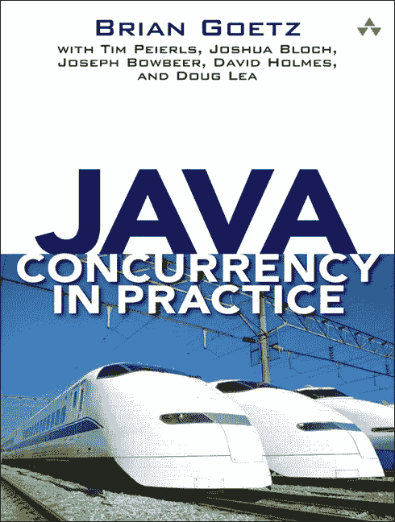
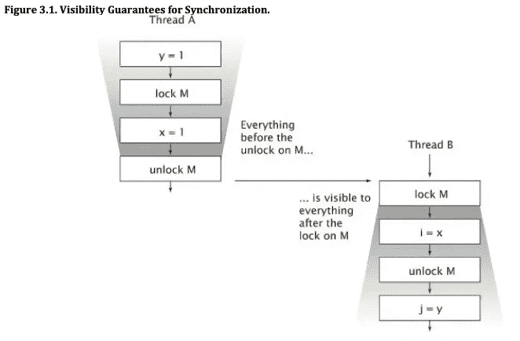
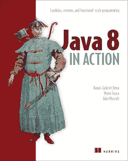

# 实践中的 Java 并发在 2023 年还有效吗？

> 原文：<https://medium.com/javarevisited/is-java-concurrency-in-practice-still-valid-8bb54fc3fb7f?source=collection_archive---------0----------------------->

## TL:DR——是的，Java Concurrency in Practice 仍然有效，是学习 Java 多线程和并发概念的最佳书籍之一。然而，一个更新的版本将是巨大的。

大家好，如果你想知道著名的 Java 书籍之一，**Java Concurrency in Practice**在函数式编程的现代 Java 时代是否有效，那么你并不孤单，许多 Java 开发人员都有类似的疑问。

我的一个读者 Shobhit 在我的博客上问了这个问题，关于中级程序员必读的 [12 本高级 Java 书籍](http://www.java67.com/2016/06/12-must-read-advance-java-books-for-intermediate-programmers.html)——第 1 部分。

我很喜欢这个问题，并认为每当有人推荐他们阅读[**Java Concurrency in Practice**](http://www.amazon.com/dp/0321349601/?tag=javamysqlanta-20)时，许多 Java 程序员可能会有同样的疑问。

当这本书在 2006 年首次问世时，Java 世界还不确定 Java 1.5 中新的并发性变化，我认为这是改进 Java 对多线程和并发性的内置支持的第一次重大尝试。

许多 Java 程序员甚至不知道 API 中引入的新工具，如 [CountDownLatch](http://www.java67.com/2015/06/java-countdownlatch-example.html) 、 [CyclicBarrier](http://www.java67.com/2015/06/how-to-use-cyclicbarrier-in-java.html) 、 [ConcurrentHashMap](https://www.java67.com/2020/02/25-examples-of-concurrenthashmap-in-java.html) 等等。

这本书为他们提供了这些工具的无缝介绍，以及他们如何使用它们来编写高性能的并发 Java 应用程序。

这是对这本书的总体看法，当你问许多 Java 开发人员如何找到[**“Java Concurrency in Practice”**](http://www.amazon.com/dp/0321349601/?tag=javamysqlanta-20)时，他们会给你这样的看法，但我的看法与他们略有不同，这也是我仍然向任何想要掌握并发概念的新 Java 开发人员或中级开发人员推荐《Java Concurrency in Practice》的主要原因**。**

> 顺便说一句，我发现许多开发人员很难理解这些概念，如果你也是其中之一，我建议你也加入海因茨·卡巴兹 Java champion 的 [**Java 并发课程，它以一种非常好的方式解释了这本书。这个课程无疑很贵，但很值得**](https://learning.javaspecialists.eu/courses/concurrency-in-practice-bundle?affcode=92815_johrd7r8)

 [## 实践捆绑包中的 Java 并发

### 我有多长时间可以参加全付费课程？终身访问听起来怎么样？注册后，你有无限的…

learning.javaspecialists.eu](https://learning.javaspecialists.eu/courses/concurrency-in-practice-bundle?affcode=92815_johrd7r8) 

这本书介绍的最重要的东西是并发编程的清晰概念和基础，如可见性、排序、[、线程安全](http://javarevisited.blogspot.com/2012/01/how-to-write-thread-safe-code-in-java.html)、[不变性](http://javarevisited.blogspot.com/2013/03/how-to-create-immutable-class-object-java-example-tutorial.html)、并行性等。

它还解释了为什么大多数并发应用程序不是用 Java 编写的，以及 Java 程序员经常犯的错误，这些错误会导致多线程问题，如[竞争条件](http://javarevisited.blogspot.sg/2012/02/what-is-race-condition-in.html#axzz59AbkWuk9)、[死锁](https://javarevisited.blogspot.com/2018/08/how-to-avoid-deadlock-in-java-threads.html#axzz6ccm5KWKs)、活锁、内存干扰以及简单的错误计算。

在介绍好的和正确的做法之前，表情符号用于显示不好的做法，这不仅有助于纠正许多 Java 开发人员之前的误解，还可以在 Java 开发人员中传播有关多线程和并发性的正确信息。毫无疑问，多线程和并发是困难的，它们都很难在代码中正确运行，也很难理解和解释。我见过许多程序员，他们根本无法想象多线程是如何与具有不同数据的同一段代码进行交互的。很像经典的递归概念，这对于一些程序员来说太容易了，但是对于其他人来说太难了，难以在现实世界中掌握和应用。

[**Java Concurrency in Practice**](http://www.amazon.com/dp/0321349601/?tag=javamysqlanta-20)对 Java 世界最大的贡献不是让并发变得容易，而是提供了过去所缺乏的正确而清晰的信息。由于我参加了很多面试，我知道程序员总是对线程及其工作方式有误解。

许多程序员即使有 4 到 5 年的 Java 经验也不明白[volatile 变量是如何工作的](http://javarevisited.blogspot.sg/2011/06/volatile-keyword-java-example-tutorial.html)，他们所知道的是当你使用 volatile 变量时，它总是在比较时从主存中检查值，这是事实，但不完整。

他们没有被告知 Java 内存模型，以及 volatile 变量如何影响代码的排序和代码背后的计算指令由 [JIT](http://www.java67.com/2013/02/difference-between-jit-and-jvm-in-java.html) 和 [JVM](http://www.java67.com/2016/08/10-jvm-options-for-java-production-application.html) 进行优化，这可能会导致微妙的逻辑错误。他们不知道 volatile 如何保证一个线程在访问另一个线程的 volatile 变量之前的可见性。他们不知道什么是记忆障碍，也不知道它如何影响可见性。《实践中的 Java 并发》一书向许多 Java 程序员传授了这些概念。事实上，我承认在阅读这本书之前，我对许多基本的多线程和并发概念有很多误解，例如顺序、可见性、最终变量的微妙影响和安全发布，这本书帮助我澄清了这些误解。

顺便说一句，如果你觉得这本书的某些部分难以理解，那么你并不孤单，但谢天谢地，Heinz Kabutz 博士在他的[**Java Concurrency in Practice Bundle**](https://learning.javaspecialists.eu/courses/concurrency-in-practice-bundle?affcode=92815_johrd7r8)课程中简化了它们。

如果你认为即使这样也很难，那么 [**掌握线程**](https://javaspecialists.teachable.com/p/mastering-threads-2019/?product_id=984568&coupon_code=LAUNCH_FEBRUARY&affcode=92815_johrd7r8) 是 Heinz 的另一门课程，它为普通 Java 程序员简化了多线程。他还提供 30%的折扣，直到 2 月 19 日。

现在，回到 Java 8，是的，从 Java 1.5 到 Java 8，JDK 有了更多的新工具来实现并发和设计更好的 Java 并发应用。在 JDK 7 中引入了 [fork-join 池](http://javarevisited.blogspot.sg/2016/12/difference-between-executor-framework-and-ForkJoinPool-in-Java.html)，在 Java 8 中引入了 [CompletableFuture](https://www.java67.com/2022/02/completablefuture-in-java-with-example.html) ，最重要的是在 Java 8 中由 [lambda 表达式](http://javarevisited.blogspot.com/2014/02/10-example-of-lambda-expressions-in-java8.html)支持的新的函数式编码风格。

您还获得了流和并行流，这使开发人员无需编码就能利用并发性。将并发性从应用程序开发人员转移到 API 开发人员的总体思想也使之变得更加容易，并降低了用 Java 实现并发性的风险。这也意味着现在你可以在 Java 中只使用几个方法和多线程来执行批量操作，而无需编写一行涉及线程、同步关键字或等待通知方法的代码。毫无疑问，Java 开发人员必须学习这些新工具来保持自己与时俱进，像《Java 8 in Action》这样的书在这方面很有帮助。它向您介绍了 Java 8 中的所有新变化，不仅教您如何在日常工作中使用它们，还解释了它们背后的动机，以了解更大的图景。

尽管当前状态下的 Java 并发性实践没有涵盖所有这些重要的概念和工具，但它仍然是一本学习 Java 编程语言支持的[线程](http://javarevisited.blogspot.sg/2011/02/how-to-implement-thread-in-java.html)、[并发](http://javarevisited.blogspot.com/2015/05/top-10-java-multithreading-and.html)和[多线程](http://javarevisited.blogspot.sg/2014/07/top-50-java-multithreading-interview-questions-answers.html)工具的基础知识的无价之宝。

对于任何想要学习和掌握多线程和并发，使用 Java 进行应用开发的最大优势的 Java 开发人员来说，这仍然是一本必读书。

Java 开发人员非常感谢 Brian Goetz、Joshua Bloch 以及所有的作者，他们为 Java 开发人员提供了这样一本权威的书籍，帮助他们理解多线程和并发性这两个令人困惑但却至关重要的概念。

其他 **Java** **文章你可能喜欢**探索
[完整的 Java master class](https://click.linksynergy.com/fs-bin/click?id=JVFxdTr9V80&subid=0&offerid=323058.1&type=10&tmpid=14538&RD_PARM1=https%3A%2F%2Fwww.udemy.com%2Fjava-the-complete-java-developer-course%2F)
[Java 开发者应该知道的 10 个测试工具](http://javarevisited.blogspot.sg/2018/01/10-unit-testing-and-integration-tools-for-java-programmers.html)
[有经验程序员的 10 门高级核心 Java 课程](https://javarevisited.blogspot.com/2020/04/top-10-advanced-core-java-courses-for-experienced-developers.html)
[5 个框架 Java 开发者应该学习的](http://javarevisited.blogspot.sg/2018/04/top-5-java-frameworks-to-learn-in-2018_27.html)
[学习多线程和并发的前 5 门课程](https://javarevisited.blogspot.com/2016/06/5-books-to-learn-concurrent-programming-multithreading-java.html)
[最后 Java 有 var 来声明局部变量](http://javarevisited.blogspot.sg/2018/03/finally-java-10-has-var-to-declare-local-variables.html)
[10 本高级 Java 书籍供有经验的程序员使用](https://javarevisited.blogspot.com/2020/04/top-10-advanced-java-books-for-experienced-programmers.html)
[Java 和 Web 开发人员应该学习的 10 件事](http://javarevisited.blogspot.sg/2017/12/10-things-java-programmers-should-learn.html#axzz53ENLS1RB)
[每一个 Java 程序员都应该阅读的 10 本书](http://www.java67.com/2018/02/10-books-java-developers-should-read-in.html)
[成为全栈 Java 开发人员的前 5 门课程](https://javarevisited.blogspot.com/2020/04/top-5-courses-to-become-full-stack-java-developer-with-Angular-and-Reactjs.html)
[Java 开发人员在日常工作中使用的 10 种工具](http://javarevisited.blogspot.sg/2017/03/10-tools-used-by-java-programming-Developers.html#axzz55lrMRnNC)
[深入学习 Java 多线程的前 5 门课程](https://javarevisited.blogspot.com/2018/06/top-5-java-multithreading-and-concurrency-courses-experienced-programmers.html) [如果你也喜欢看到 Java 并发的新版本和更新版本，那么请在脸书和 Twitter 上分享这篇文章，也许我们的请求会传到 Brian 和这本书的出版商那里。

**【p . s .】**—让我们希望 Brian Goetz 和本书的其他作者听取这一请求，并在今年向世界各地的 Java 开发人员赠送一个新版本的 Java 并发实践，直到那时，Heinz Kabutz'](https://javarevisited.blogspot.com/2018/06/top-5-java-multithreading-and-concurrency-courses-experienced-programmers.html) [**Java 并发实践捆绑包**](https://learning.javaspecialists.eu/courses/concurrency-in-practice-bundle?affcode=92815_johrd7r8) 可以用来让自己保持最新。

 [## 实践捆绑包中的 Java 并发

### 我有多长时间可以参加全付费课程？终身访问听起来怎么样？注册后，你有无限的…

learning.javaspecialists.eu](https://learning.javaspecialists.eu/courses/concurrency-in-practice-bundle?affcode=92815_johrd7r8)