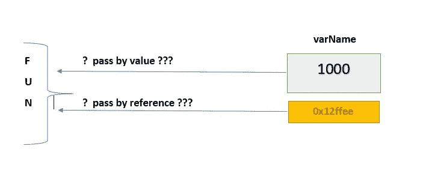
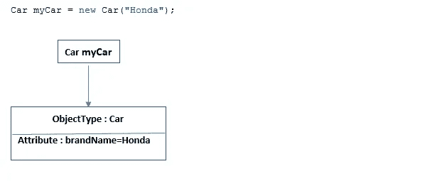
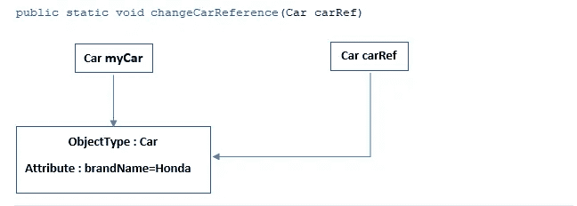
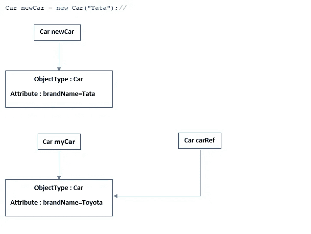
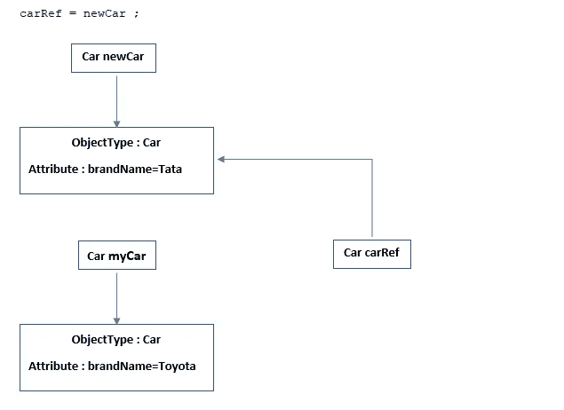
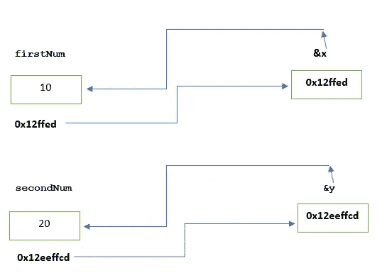
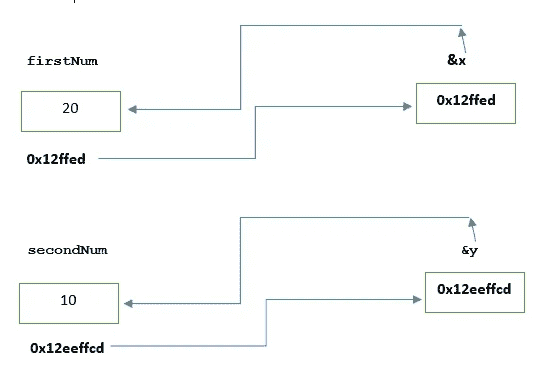

# Java 是“按值传递”还是“按引用传递”？

> 原文：<https://medium.com/javarevisited/is-java-pass-by-value-or-pass-by-reference-73a73b0c2234?source=collection_archive---------6----------------------->

## 面向对象编程

## 了解按值传递和按引用传递。

[](https://javarevisited.blogspot.com/2012/12/does-java-pass-by-value-or-pass-by-reference.html)

**按值传递或按引用传递**

在本文中，我将解释 Java 是使用**按值传递**还是**按引用传递。**读完这篇文章后，你将能够理解按值传递和按引用传递的概念。阅读本文时，请尽量关注示例代码和相关注释。

# 传递值实际上意味着什么？

顾名思义，传值只是意味着，我们将变量(或引用变量)的值而不是变量(或引用变量)的地址从主函数传递给被调用的函数。

实际上，传递的是变量的副本，而不是变量本身。

被调用函数中复制的引用变量可以改变对象的状态(字段)，但不能改变主函数的实际/原始引用变量所保存的地址。

被调用函数的复制引用变量可以指向某个其他对象，但不能修改主函数的实际/原始引用变量所保存的地址。所以主函数的引用变量将继续指向与在**之前指向的对象相同的对象。**

## 因此，Java 是通过值传递的，而不是通过引用传递的。

让我们编写一个示例程序来理解这个概念。我写了一个汽车类和它的驱动程序主类。

我建议在阅读程序时，试着阅读与每个语句相关的注释。

# 汽车类——一个简单的 POJO 类。

这个 Car 类是一个 POJO 类，只有一个字段`brandName`及其 getters 和 setters。

**汽车类别**

# 主要作为驱动程序类。

在主类中，我创建了一个 Car 对象，并将其赋给`myCar`一个引用变量。后来把它传给了法`changeCarReference`。

**按值传递或按引用传递**

## 输出:

```
Car brand is : Honda
car brand is : Honda
car brand is : Toyota
car brand is : Tata
```

# 为了更好地理解，让我用图表来解释。

## 1.当我们创建汽车对象时。

[](https://javarevisited.blogspot.com/2015/10/133-java-interview-questions-answers-from-last-5-years.html)

**按值传递**

## 2.调用后更改一个引用方法。

[](https://javarevisited.blogspot.com/2011/08/why-java-does-not-support-operator.html)

**按值传递**

## `myCar`和`carRef`都是汽车类型，指向同一个`Car`类的对象。

## 3.将汽车对象的品牌名称设置为 Toyota。

[](https://www.java67.com/2015/03/top-40-core-java-interview-questions-answers-telephonic-round.html)

**按值传递**

## 4.用`changeCarReference`方法创建新的汽车对象。

[](https://www.java67.com/2018/03/top-50-core-java-interview-questions.html)

按值传送

## 5.将`newCar`参考分配给`carRef`。



**按值传递**

因此，您可以看到传递给`changeCarReference`方法的`myCar`引用变量从未改变。但是这个`myCar`引用所指向的对象的值被另一个引用`carRef`改变了。
因此我们得出结论，Java 总是“**按值传递**”，而不是“按引用传递”。

> 因此，Java 是通过值传递的，而不是通过引用传递的。

# 按引用传递是什么意思？

在按引用传递的情况下，调用方法将变量传递给被调用函数，被调用函数接受参数作为从调用函数传递的变量的地址。

我建议您阅读带有相关注释的代码。同样，在下面程序的最后，我已经详细解释了这个概念。

下面我举了一个例子，用一个交换程序来交换 c++中的两个数，来解释按引用传递。

**参考通过**

## 输出:

```
Before swap:
10  20
After swap:
20  10
```

# 交换前:

互换前`firstNum` 和`secondNum` 分别持有数值 10 和 20。当调用一个函数(基本上是`main`方法)时，将`firstNum`和`secondNum`作为参数传递给被调用函数(`swapNums`)，然后被调用函数`**&x**`和`**&y**`保存这两个变量的地址。`**x**`和`**y**`分别指向 10 和 20。

[](https://javarevisited.blogspot.com/2013/02/swap-two-numbers-without-third-temp-variable-java-program-example-tutorial.html)

**之前互换**

# 交换后:

互换后的`firstNum` 和`secondNum` 分别持有值 20 和 10。使用临时变量 z 交换由`**&x**`和`**&y**`保存的地址值(10，20)。因此由`firstNum` 和`secondNum`变量保存的值也是 20 和 10，因为这些变量也指向相同的地址。

[](https://www.java67.com/2012/08/10-java-coding-interview-questions-and.html)

**互换后**

*本文到此为止。希望你喜欢这篇文章。*

# 类似内容可以关注[维克拉姆古普塔](https://medium.com/u/2c3b611409dc?source=post_page-----73a73b0c2234--------------------------------)。