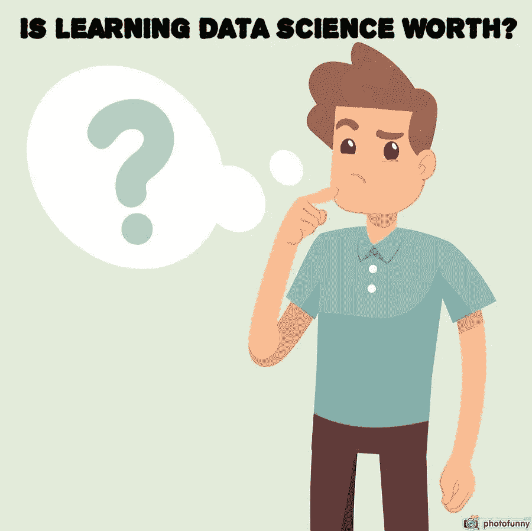
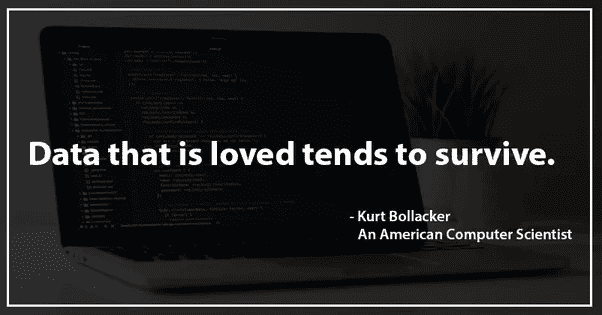
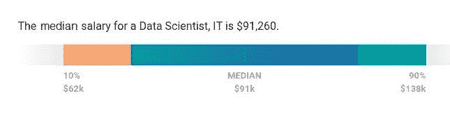

# 学数据科学值得吗？

> 原文：<https://medium.com/javarevisited/is-learning-data-science-worth-8445228f5eeb?source=collection_archive---------0----------------------->

## 除了我热爱数据科学的原因，什么值得学习最终取决于你...

请继续阅读！

***这是 21 世纪最性感的工作！***

**是的**，这是值得学习的，因为它正在发展技术，在当前的机械世界中，对数据分析师和数据科学家有着巨大的需求。许多专家和学生正在考虑他们在数据科学领域的职业生涯，他们对现在如何改变职业感到困惑，他们应该学习和更新什么。

## [成为数据科学家的完美路线图](https://techvidvan.com/tutorials/how-to-become-a-data-scientist/)

从各种来源提供的数据量，例如，物联网设备、无人驾驶汽车(正在尝试中)、人工智能控制的机器和自动机，今年将会增加，预计在[人工智能](https://javarevisited.blogspot.com/2019/10/top-5-courses-to-learn-artificial-intelligence-AI.html)和[深度学习](https://hackernoon.com/10-machine-learning-data-science-and-deep-learning-courses-for-programmers-7edc56078cde)领域会有更多进展。

# 成为数据科学家的理由:

以下是成为数据科学家的几个理由:

*   这是薪酬最高的技术工作之一，普通的数据科学家每年可以赚 123，000 美元，拥有 5 年经验的科学家每年可以赚 300，000 美元！

## [***因为你想成为数据科学家！***](https://techvidvan.com/tutorials/what-is-data-science/)

*   为了得到一个想法，让我们看看 Payscale，它报告(大多数截至 2019 年 10 月 22 日更新)美国数据科学家的薪酬中位数是 91，260 美元，范围是 6.2 万美元到 13.8 万美元。

然而，基本工资并不是最重要的。Payscale 同样报告称，奖金中位数为 8042 美元，范围为 1，000 美元至 1.7 万美元，利润分享中位数为 5139 美元，范围为 970 美元至 1.5 万美元。

在接近 2020 年的时候，严重缺乏超过 100 万的数据科学家

不考虑行业垂直领域，前瞻性的努力正在与数据科学家签约，以获取重要的商业知识和优势

有些基于网络的培训机构提供高质量的培训、经验丰富的导师、符合行业目标的教育计划、真实的行业项目、认证和工作协助

数据科学融合了你的专业才能、分析思维和敏锐的商业敏锐度，使其成为拥有大量发展机会的特别有技能和动力的工作角色。

你将领导一个由技术人才、业务经理、主管组成的团队，并决定重要的高层管理决策，这些决策将合理地影响组织的命运，让你直接掌握主动权。

一个人必须发现生活的意义和原因。

***确保数据科学适合您非常重要。***

 [## 用 Python 和 R 学习数据科学和机器学习的 10 多本书籍和课程—最好的

### 用 Python 和 R 学习数据科学的书籍、教程和交互式课程

medium.com](/javarevisited/top-10-resources-to-learn-data-science-and-machine-learning-best-of-lot-f153e1f44e89) 

## 数据科学家做什么？

从根本上说，数据科学家的主要职责是分析数据中值得注意的知识。

## 具体功能包括:

*   区分为组织提供最佳机会的数据分析问题
*   确定正确的数据集和变量
*   从不同来源收集大量结构化和非结构化数据
*   清理和验证数据，以确保准确性、履行性和一致性
*   制定并应用模型和算法来挖掘大数据的存储
*   分析数据以区分趋势和模式。

## [***你必须知道的顶级数据科学应用！！***](https://techvidvan.com/tutorials/data-science-applications/)

也许，这是进入数据科学并探索其众多潜在应用的理想时机。越来越多的组织希望在其框架中采用和使用数据科学，以了解其业务的最大能力。那你还在等什么？开始你的数据科学之旅，准备好迎接丰厚的职业机会。

其他有用的**数据科学与机器学习**资源
[前 8 名 Python 机器学习库](https://javarevisited.blogspot.com/2018/10/top-8-python-libraries-for-data-science-machine-learning.html)
[5 门免费课程学习机器学习用 R 编程](http://www.java67.com/2018/09/top-5-free-R-programming-courses-for-Data-Science-Machine-Learning-Programmers.html)
[2020 年 5 门免费课程学习 Python](http://www.java67.com/2018/02/5-free-python-online-courses-for-beginners.html)
[前 5 名数据科学与机器学习课程](https://hackernoon.com/top-5-data-science-and-machine-learning-course-for-programmers-e724cfb9940a)
[前 5 名 TensorFlow 与机器学习课程](https://hackernoon.com/top-5-tensorflow-and-ml-courses-for-programmers-8b30111cad2c)
[10 门技术程序员可以在 2020 年学习](http://www.java67.com/2018/01/top-10-web-mobile-and-big-data-framework-libraries-technologies-programmers-should-learn-in-2018.html) 【T20 Python 更好
[面向初学者的 10 大免费 Python 教程](https://dev.to/javinpaul/top-5-places-to-learn-python-programming-for-free-m4c)
[一个日本黄瓜农如何使用深度学习和 TensorFlow](https://cloud.google.com/blog/products/gcp/how-a-japanese-cucumber-farmer-is-using-deep-learning-and-tensorflow)
[学习数据科学 Python 的 5 大书籍](https://javarevisited.blogspot.com/2019/08/top-5-python-books-for-data-science-and-machine-learning.html)
[2020 年学习数据科学的 11 个最佳网站](https://dev.to/javinpaul/11-best-resources-to-learn-data-science-and-machine-learning-in-2020-2od)

# 结束语

谢谢，你坚持到了文章的结尾…祝你的数据科学和机器学习之旅好运！这当然不会很容易，但通过学习这些课程，你离成为你一直想成为的机器学习专家又近了一步。

如果你想在 2020 年成为数据科学家，这里有一些免费的最好的数据科学课程

 [## 9 哈佛、IBM、Udemy 和其他公司的数据科学和机器学习课程

### 数据科学、机器学习、深度学习和人工智能在这个时候真的很热，并提供了一个…

medium.com](/@javinpaul/9-data-science-and-machine-learning-courses-by-harvard-ibm-udemy-and-others-12a0c7c23ec1)