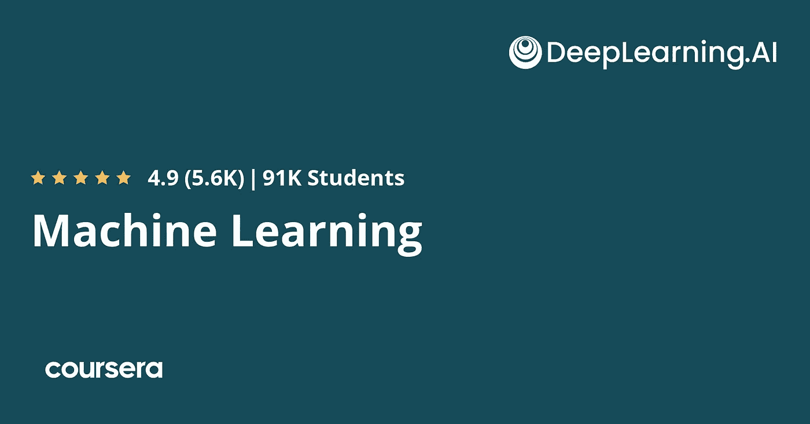
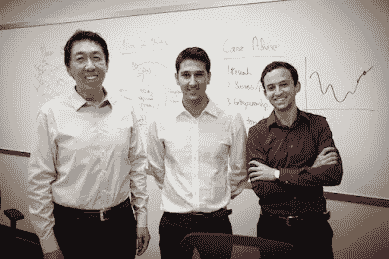
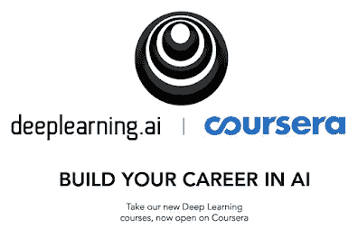
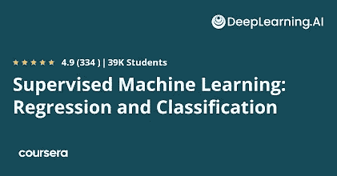
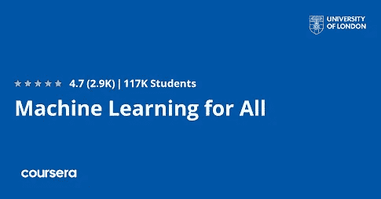
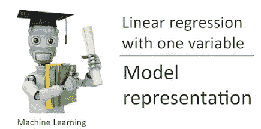

# 2023 年 Coursera 的 Andrew N 的机器学习专精值得吗？[综述]

> 原文：<https://medium.com/javarevisited/is-machine-learning-specialization-by-andrew-ng-and-deeplearning-ai-on-coursera-worth-it-review-29a456336365?source=collection_archive---------1----------------------->

## 如果你想从头开始机器学习，这是最好的课程，程序在线加入。吴恩达是一位伟大的老师和机器学习专家。

image_credit — Coursera

大家好，如果你在 Twitter 上关注 [**【吴恩达】**](https://coursera.pxf.io/c/3294490/1164545/14726?u=https%3A%2F%2Fwww.coursera.org%2Finstructor%2Fandrewng) ，那么你可能会知道，他在斯坦福大学广受欢迎的免费机器学习课程现在正在变成来自斯坦福大学和 DeepLearning.ai 的成熟的 [**机器学习专业化**](https://coursera.pxf.io/c/3294490/1164545/14726?u=https%3A%2F%2Fwww.coursera.org%2Fspecializations%2Fmachine-learning-introduction) ，这对所有想在 2022 年学习机器学习的人来说是一个巨大的新消息。

有许多像我一样的人使用该课程首次了解了机器学习，毫不奇怪，已经有超过 500 万人加入了该课程。

通过这一新的专业化，吴恩达为初学者提供了最真实、最全面和最具吸引力的机器学习资源之一。在过去，我已经分享了[学习机器学习的最佳 Coursera 课程](https://javarevisited.blogspot.com/2020/08/top-10-coursera-courses-and-certification-for-artificial-intelligence-and-machine-learning.html#axzz6oh08Cv8w)、[数据科学](https://javarevisited.blogspot.com/2020/08/top-10-coursera-certifications-to-learn-Data-Science-Visualization-and-Data-Analysis.html)和[区块链](https://javarevisited.blogspot.com/2022/01/5-best-blockchain-certifications-and.html)，在本文中，我将分享我在 Coursera 上关于这个机器学习专业化课程的 2 美分。

但是，在我对 Andrew N 和 DeepLearnin 的机器学习专门化进行评论之前。AI，让我告诉你更多关于机器学习到底是什么。

<https://coursera.pxf.io/c/3294490/1164545/14726?u=https%3A%2F%2Fwww.coursera.org%2Finstructor%2Fandrewng>  

用最基本的术语来说，机器学习是机器学习某种东西的能力，而不必为那种特定的东西编写程序。在机器学习中，计算机使用大量数据并应用算法来训练自己并做出准确的预测。

计算机可以通过将大量的数据输入到算法中来训练，这将使机器有机会了解更多关于处理过的信息。

你可以在互联网上找到机器学习的例子:从回答特定照片中的动物是猫还是狗，检测垃圾邮件，发现自动驾驶汽车前的障碍物，以及语音识别 YouTube 视频以生成字幕，这些都是工作中机器学习的例子。

您也可以将机器学习视为人工智能的一个子集，它由无需任何明确的逐步说明即可收集信息的算法组成。我会给你一个小例子，让你理解机器学习的巨大成功。

顺便说一下，如果你已经加入，只需 [**点击这里加入这个伟大的机器学习课程**](https://coursera.pxf.io/c/3294490/1164545/14726?u=https%3A%2F%2Fwww.coursera.org%2Fspecializations%2Fmachine-learning-introduction) 。

# 2.吴恩达在 Coursera 和 DeepLearning.ai 上的机器学习专业化述评

围棋是一种古老而抽象的战略棋类游戏，几千年前在中国发明。因此，早在 2016 年，世界上最强的围棋手李·塞多尔(Lee Sedol)就坐下来，与谷歌深度思维(Google Deepmind)的机器学习程序 AlphaGo 进行比赛。这场比赛持续了 5 天。最终，阿尔法戈赢了。

这告诉我们，随着机器学习的快速发展，机器模仿人脑的能力几乎可以应用于任何地方。

如今，机器学习在世界各地的商业行业中扮演着非常重要的角色。它对于推动组织发展、自动化手工和枯燥的工作、丰富客户体验以及实现业务目标都很有用。

现在让我们来看问题的关键。[**吴恩达的《机器学习专门化》**](https://coursera.pxf.io/c/3294490/1164545/14726?u=https%3A%2F%2Fwww.coursera.org%2Fspecializations%2Fmachine-learning-introduction) 。

关于这门课程，我想告诉你的第一件事是它有多简单和方便。它擅长将复杂的主题分解成易于理解的简单块。

该课程将教你如何用 [Numpy](/javarevisited/6-best-online-courses-to-learn-numpy-for-beginners-60120f611e06) 和 [sci-kit learn](/javarevisited/5-best-scikit-learn-online-courses-for-machine-learning-and-data-science-6beb02e9cca0) 构建机器学习模型。您将能够构建和训练可用于预测和二元分类任务的监督模型。你还将了解线性回归和逻辑回归背后的理论。

这个精彩的[课程](https://coursera.pxf.io/c/3294490/1164545/14726?u=https%3A%2F%2Fwww.coursera.org%2Fspecializations%2Fmachine-learning-introduction)将帮助你应用机器学习开发的最佳实践，以及使用无监督学习技术进行无监督学习，包括聚类和异常检测。

[课程](https://coursera.pxf.io/c/3294490/1164545/14726?u=https%3A%2F%2Fwww.coursera.org%2Fspecializations%2Fmachine-learning-introduction)将允许你用 TensorFlow 建立并训练一个神经网络，以执行多类分类。您还可以构建和使用决策树和其他树集成方法。

本课程结束时，您将能够构建推荐系统，该系统使用协同过滤方法以及基于内容的深度学习方法来构建深度强化学习模型。

# 3.机器学习专业化课程结构

正如我所说，这是一个包含多门课程的 *Coursera 专业化*，现在让我们深入了解 Coursera 上吴恩达 的这个令人敬畏的 [*机器学习专业化，这是一个面向初学者和中级专业人士在线学习机器学习的伟大计划。*](https://coursera.pxf.io/c/3294490/1164545/14726?u=https%3A%2F%2Fwww.coursera.org%2Fspecializations%2Fmachine-learning-introduction)

## 1.[监督机器学习:回归和分类](https://coursera.pxf.io/c/3294490/1164545/14726?u=https%3A%2F%2Fwww.coursera.org%2Flearn%2Fmachine-learning)

这是一门很棒的课程，它将教你一切你需要知道的关于机器学习以及回归和分类的知识。这样的话，对于完全的初学者来说绝对是完美的。对于希望进入神奇的机器学习世界的初学者来说，这是一个完美的入门指南。

> 课程时长:3 小时
> 
> 课程评分:4.6 星(满分 5 分)
> 
> 课程讲师:DeepLearning。人工智能
> 
> 课程价格:40 美元

**这里是加入本课程的链接**——[监督机器学习:回归与分类](https://coursera.pxf.io/c/3294490/1164545/14726?u=https%3A%2F%2Fwww.coursera.org%2Flearn%2Fmachine-learning)

## 2.[给大家的机器学习介绍](https://coursera.pxf.io/c/3294490/1164545/14726?u=https%3A%2F%2Fwww.coursera.org%2Flearn%2Fmachine-learning-introduction-for-everyone)【Coursera】

在这个奇妙的课程中，您将了解机器学习的所有核心功能。通过学习机器学习，你也会成为一个非常高级的开发者。你将能够掌握算法和理论计算机科学。本课程结束时，你将成为一名软件开发专家。

> 课程时长:2 小时
> 
> 课程评分:4.6 星
> 
> 课程讲师:IBM
> 
> 课程价格:50 美元

**这里是加入本课程**——[机器学习介绍给大家](https://coursera.pxf.io/c/3294490/1164545/14726?u=https%3A%2F%2Fwww.coursera.org%2Flearn%2Fmachine-learning-introduction-for-everyone)

## 3.[全民机器学习](https://coursera.pxf.io/c/3294490/1164545/14726?u=https%3A%2F%2Fwww.coursera.org%2Flearn%2Fuol-machine-learning-for-all)【Coursera】

这门课程将是对令人惊奇的机器学习世界的一个很好的简要介绍。它非常适合初学者，因为你将从零开始学习机器学习。

你将确切地了解什么是机器学习，以及为什么使用它。这门课程将教会你关于算法和机器学习的一切知识，以及两者之间的关系。

> 课程时长:2 小时
> 
> 课程评分:4.5 星(满分 5 分)
> 
> 课程讲师:伦敦大学
> 
> 课程价格:45 美元

**这是加入本课程的链接** — [面向所有人的机器学习](https://coursera.pxf.io/c/3294490/1164545/14726?u=https%3A%2F%2Fwww.coursera.org%2Flearn%2Fuol-machine-learning-for-all)

## 4.[用 Python 进行机器学习](https://coursera.pxf.io/c/3294490/1164545/14726?u=https%3A%2F%2Fwww.coursera.org%2Flearn%2Fmachine-learning-with-python)【Coursera】

这是一门很棒的课程，它将帮助你把你的机器学习技能提升到另一个水平。你将能够通过使用计量经济学、算法和 Sci-kit Learn 来做到这一点。你也将学到你需要知道的关于线性回归和逻辑回归的一切。

> 课程时长:2 小时
> 
> 课程评分:4.4 星(满分 5 分)
> 
> 课程讲师:IBM
> 
> 课程价格:44 美元

**这里是加入本课程**——[用 Python 进行机器学习](https://coursera.pxf.io/c/3294490/1164545/14726?u=https%3A%2F%2Fwww.coursera.org%2Flearn%2Fmachine-learning-with-python)的链接

## 5.[机器学习入门](https://coursera.pxf.io/c/3294490/1164545/14726?u=https%3A%2F%2Fwww.coursera.org%2Flearn%2Fmachine-learning-duke)【Coursera】

在这个奇妙的课程中，你将学到你需要知道的关于机器学习和自然语言处理的不同组成部分的一切。

你将从学习机器学习的基础知识开始这门课程。然后你就会明白什么是回归。本课程结束时，你将成为一名机器学习专家。

> 课程时长:2 小时
> 
> 课程评分:4.5 星(满分 5 分)
> 
> 课程讲师:杜克大学
> 
> 课程价格:35 美元

**这里是加入本课程** — [机器学习简介](https://coursera.pxf.io/c/3294490/1164545/14726?u=https%3A%2F%2Fwww.coursera.org%2Flearn%2Fmachine-learning-duke)的链接

## 结论

如果你喜欢吴恩达和 DeepLearning 对 [***机器学习专业化的评论。AI***](https://coursera.pxf.io/c/3294490/1164545/14726?u=https%3A%2F%2Fwww.coursera.org%2Fspecializations%2Fmachine-learning-introduction) ，随时分享给你的朋友家人。我毫不怀疑，这门课程将在几周或几个月内让你从一个完全的新手变成一个机器学习专家。

如果你对 Machin Learning 有任何疑问，你也可以发表评论，我们会尽快回复你，如果你想加入这个课程，你可以在 Coursera 上加入，它现在已经开放了。

顺便说一句，当谈到参加这个课程，你有两个选择，你可以单独参加这个课程，每个月花费大约 39 美元，你也可以 [**参加 Coursera Plus**](https://coursera.pxf.io/c/3294490/1164545/14726?u=https%3A%2F%2Fwww.coursera.org%2Fcourseraplus) 每个月花费 399 美元，这是 Coursera 的一个订阅计划，让你无限制地访问他们最受欢迎的课程、专业化、专业证书和指导项目。

<https://coursera.pxf.io/c/3294490/1164545/14726?u=https%3A%2F%2Fwww.coursera.org%2Fcourseraplus>  

Coursera 现在在 Coursera Plus 上提供 100 美元的折扣。你可以点击这里了解更多信息。

其他 **Python，机器学习和** **Coursera 文章**你可能喜欢

*   [5 个免费学习 Python 的网站](https://javarevisited.blogspot.com/2019/09/5-websites-to-learn-python-for-free.html)
*   [Python vs Java？从哪个开始比较好？](https://hackernoon.com/java-vs-python-which-is-better-to-learn-for-beginners-in-2020-yq1t3y58)
*   [2022 年学习 Python 的 10 个理由](https://javarevisited.blogspot.com/2018/05/10-reasons-to-learn-python-programming.html)
*   [5 Python 中的数据科学与机器学习课程](https://javarevisited.blogspot.com/2018/03/top-5-data-science-and-machine-learning-online-courses-to-learn-online.html)
*   [初学者学习 Python 的 5 大课程](https://hackernoon.com/top-5-courses-to-learn-python-in-2018-best-of-lot-26644a99e7ec)
*   [Python 开发者的五大 Web 开发框架](https://javarevisited.blogspot.com/2019/04/top-5-python-web-development-frameworks.html)
*   [2022 年程序员十大课程课程](https://javarevisited.blogspot.com/2020/08/top-10-coursera-courses-specilizations-and-certifications.html)
*   [开始职业生涯的十大 Coursera 认证](/javarevisited/top-10-coursera-certificates-to-start-your-career-in-cloud-data-science-ai-mainframe-and-it-558690c83587)
*   Udemy vs 复数视线？哪个学习平台比较好？
*   [学习数据科学的十大课程](https://javarevisited.blogspot.com/2020/08/top-10-coursera-certifications-to-learn-Data-Science-Visualization-and-Data-Analysis.html)
*   [面向程序员和开发人员的 Coursera 十大项目](https://javarevisited.blogspot.com/2020/08/top-10-coursera-projects-to-learn-essential-programming-skills.html)
*   Coursera 证书对工作和事业有帮助吗
*   [学习云计算的 10 门最佳 Coursera 课程](https://javarevisited.blogspot.com/2020/08/top-10-coursera-certifications-to-learn-cloud-computing-aws.html#axzz6WK1yC5WW)
*   [Coursera Plus Review——在 Coursera 上学习的更好方式](https://javarevisited.blogspot.com/2020/08/coursera-plus-better-way-to-take-coursera-courses-specilizations-certification.html)
*   [Udemy vs CodeCademy vs OneMonth？](https://javarevisited.blogspot.com/2019/09/codecademy-vs-udemy-vs-onemonth-which-is-better-for-learning-code.html#axzz6VYKcmyZz)
*   [Udemy vs Educative vs Codecademy？新手用哪个比较好](/javarevisited/codecademy-or-pluralsight-which-is-a-better-platform-to-learn-coding-skills-59251a080642)
*   [2022 年学习 Python 可以做的 8 个项目](/javarevisited/8-projects-you-can-buil-to-learn-python-in-2020-251dd5350d56)
*   [2022 年学习人工智能的 7 门最佳课程](/javarevisited/7-best-courses-to-learn-artificial-intelligence-in-2020-26d59d62f6fe)
*   [Coursera 的 10 项数据科学和机器学习认证](/javarevisited/top-10-machine-learning-and-data-science-certifications-and-training-courses-for-beginners-and-a6308497b764)

感谢阅读这篇文章。如果你喜欢我对 Python 的评论，这是密歇根大学学习 Python 最好的课程之一，那么请与你的朋友和同事分享。如果您有任何问题或反馈，请留言。

**附言** —如果你正在寻找学习 Python 的最佳 Udemy 课程，那么我强烈推荐你加入 Udemy 网站上何塞·波尔蒂利亚的 [**完整 Python 训练营:从零到英雄**](http://bit.ly/2BY5LJC) 课程。这是最受欢迎的 Python 课程，已经有超过 100 万学生在学习这门课程。它也很实惠，你可以在 Udemy 上只花 10 美元就能买到。

<https://javarevisited.blogspot.com/2018/03/top-5-courses-to-learn-python-in-2018.html> 