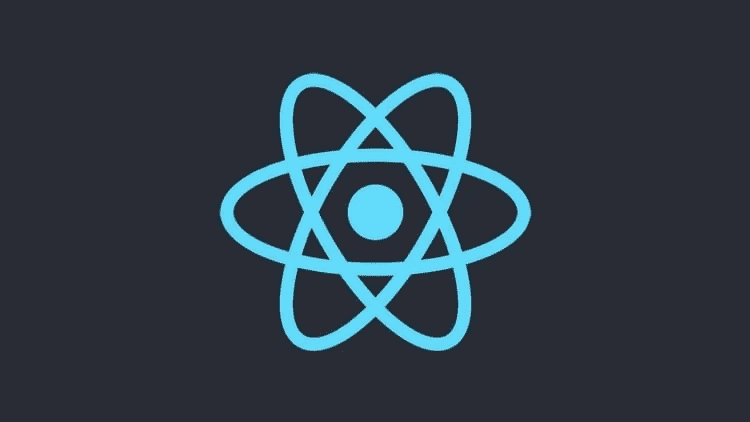
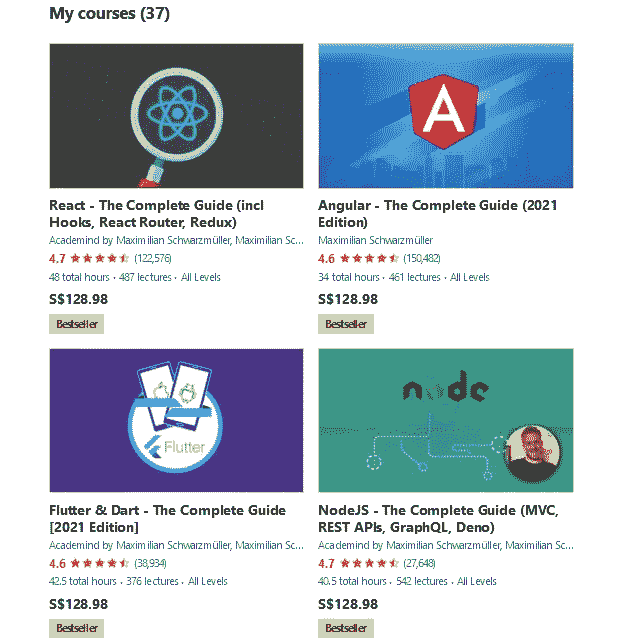
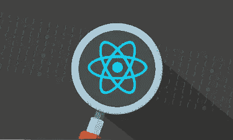

# Udemy 上的 React —完整指南(包括钩子、React 路由器、Redux)值得吗？[综述]

> 原文：<https://medium.com/javarevisited/is-react-the-complete-guide-incl-hooks-react-router-redux-on-udemy-worth-it-review-abbe51c33b65?source=collection_archive---------0----------------------->

## 我对 Udemy 的最佳 React 课程——React——由 AcadMind 的 Maximillian Schwarzmuller 编写的完整指南的评论，这是一门最新、全面而又引人入胜的课程。

大家好，如果你想学习 React.js 并寻找最好的在线课程，或者只是想知道 Udemy 最畅销的 React 课程，[*React-完整指南*](https://click.linksynergy.com/deeplink?id=JVFxdTr9V80&mid=39197&murl=https%3A%2F%2Fwww.udemy.com%2Fcourse%2Freact-the-complete-guide-incl-redux%2F) 是否适合初学者和中级开发者，那么你来对地方了。

早些时候，我已经分享了[免费 React 和 Redux 课程](/javarevisited/top-10-free-courses-to-learn-react-js-c14edbd3b35f)和[书籍](/javarevisited/5-best-react-js-books-for-beginners-and-experienced-web-developers-e7b90b1ab9d2)，在这篇文章中，我将回顾 Udemy 的最佳 React 课程*React-完整指南(包括钩子、React 路由器、Redux)***Maximillian Schwarz muller 和 AcadMind **。****

**这个长达 47 小时的课程是希望学习 React 的人的最佳和最新资源之一，Max 刚刚更新了大多数课程，以教授 React 最新版本 16.8，使其成为 2023 年学习 React.js 库的最新课程。**

**如果你是一名 web 开发人员，你已经学习了 HTML/CSS 等基础知识，也许你已经将你的知识扩展到了 JavaScript，这样你就可以创建更多的交互式网站和更好的用户体验，但是如果你想学习更多关于前端开发的知识，并且不知道应该从哪个库或框架开始，我强烈建议你学习一个叫做 React 的框架。

[React.js](https://reactjs.org/) 是由脸书团队开发的用于构建交互 UI(用户界面)的 JavaScript 库，现在被认为是比 [Angular](/javarevisited/10-courses-to-learn-angular-for-web-development-6da1bd2856dc?source=---------8------------------) 和 [Vue.js](/javarevisited/top-5-online-courses-to-learn-vue-js-in-2021-249e66b60646) 更多的用于构建用户界面的库之一。**

**React 库可用于构建单页面应用程序，该应用程序将提供更好的用户体验以及创建移动应用程序。如果上面的介绍已经说服你开始学习这个库，并且你正在试图寻找一些学习 react 的最佳课程，那么我强烈建议你看看这个名为 [**React 的课程——Udemy**](https://click.linksynergy.com/deeplink?id=JVFxdTr9V80&mid=39197&murl=https%3A%2F%2Fwww.udemy.com%2Fcourse%2Freact-the-complete-guide-incl-redux%2F)的完整指南，这篇文章就是关于这个课程的回顾。**

** [## React 16:完整课程(包括 React 路由器 4 和 Redux)

### 这是完全更新和重新记录从地面上-它教最新版本的反应…

udemy.com](https://click.linksynergy.com/deeplink?id=JVFxdTr9V80&mid=39197&murl=https%3A%2F%2Fwww.udemy.com%2Fcourse%2Freact-the-complete-guide-incl-redux%2F) 

# Udemy 课程回顾——马克西米连和 AcadMind 的 React 完全指南

不要再浪费你的时间了，让我们深入复习一下这个令人敬畏的 React 课程。我的评论分为三个主要部分，教师的声誉，因为如果你想学习，你必须与教师的教学风格相联系。

第二，课程的结构和课程实际涵盖的内容，第三，其他加入这门课程的人对它的评价，人民评论。

## 1.讲师声誉

这门课的老师不是别人，正是 Maximilian Schwarzüller，他是 Udemy 网站开发领域最好的老师之一。

Max 是一名拥有多年经验的自由 web 开发人员，他在 12 岁时就开始了 web 编程之旅。他在当时资源很少的情况下通过试错的方式学习编程，但他有教学的诀窍。他也是 AcadMind 的创始人。

他是我最喜欢的 Udemy 导师之一，也是最畅销的导师之一，迄今为止已经教了超过 140 万名学生，并且还在继续。

Max 最大的优点是他对 web 开发有深入的了解，他可以将复杂的事情变得简单，然后在动画的帮助下以有趣和吸引人的方式解释它们，使学习体验变得愉快。此外，他还创建了各种 Udemy 课程，讨论 web 开发以及使用 [Flutter](https://click.linksynergy.com/deeplink?id=JVFxdTr9V80&mid=39197&murl=https%3A%2F%2Fwww.udemy.com%2Fcourse%2Flearn-flutter-dart-to-build-ios-android-apps%2F) 的移动开发、使用 [Microsoft Power BI](https://click.linksynergy.com/deeplink?id=JVFxdTr9V80&mid=39197&murl=https%3A%2F%2Fwww.udemy.com%2Fcourse%2Fpowerbi-complete-introduction%2F) 的数据可视化、使用 MongoDB 的数据库技术等等。

底线是，如果你想使用课程在线学习 React.js，你会得到很好的帮助，但如果你有疑问，只要看一些预习课，我敢肯定，你会爱上 Max 的教学风格。

以下是他学习热门技术技能的一些畅销课程:

## 2.课程结构和内容质量

本课程包含大约 30 个部分，讨论如何从一开始就成为大约 40 小时视频内容的专家。让我们探索一下课程:

**2.1。React 简介**
如果您不熟悉这种语言，可以从复习 JavaScript 课程开始，然后通过理解功能组件、使用 props、无状态和有状态组件、React 元素、样式化组件等等来构建您的第一个 React 代码和应用程序，从而学习 React 及其语法。

**2.2。真正的 Web 应用程序**
在学习了 React 框架的基础知识并理解了它的组件之后，你将创建一个名为 *The Burger Builder* 的应用程序，它包含 React 组件和 architect 以及一些其他前端语言，如 [HTML](/javarevisited/top-10-free-courses-to-learn-html-5-css-3-and-web-development-872d62d97a97) 和 [CSS](/javarevisited/10-best-css-online-courses-for-beginners-and-experienced-developers-54aa2e8c0253) 。

**2.3。和网**反应过来
恭喜！您已经创建了您的第一个 React 应用程序，现在您要做的是通过了解在您的应用程序中使用 React 以及在您的项目中使用 Firebase 后端时如何完成 HTTP 请求，使该应用程序可以通过互联网访问。

**2.4。单页应用大多数网站在菜单中包含许多页面，当你浏览这些页面时，每次你改变页面时，你都会看到浏览器，这对用户体验不好。**

这一节将教你使用 React 构建一个单页应用程序，其中唯一的组件将被刷新和加载，而不用加载整个网站。

**2.5。表单验证**
表单验证是在将用户数据发送到网站进行进一步处理(如注册用户凭证等)之前验证用户数据的过程。本节将教您如何使用 JavaScript 语言实现这些技术。

**2.6。Redux**
[Redux](https://react-redux.js.org/) 大部分时间用于应用状态管理，帮助你编写可以在不同环境下运行的应用，比如客户端服务器端等等。

在您之前创建的 Burger Builder 项目中实现它之前，您将了解这项技术以及更高级的技术。

**2.7。添加认证当你创建网站或在线服务时，你需要确保人们能够在你的服务中创建账户。本节将教您如何创建身份验证过程，并使人们能够在您的 web 应用程序中登录和注册。**

**2.8。部署应用程序**
创建应用程序并进行身份验证之后，您就可以通过将应用程序部署到服务器上来让人们访问它了。这一节将教你如何完成这个过程，并在 firebase 上部署 burger builder 项目。

**2.9。奖金**
在这一节之前，你已经在使用 React 库的开发中取得了很大的成就，这几节将教你一些有趣的东西，可以帮助你改进你的应用程序，如添加 webpack、制作网站动画、将 [Next.js](/javarevisited/7-best-online-courses-to-learn-next-js-for-react-developers-ced862a3864) 添加到你的项目等等。** 

## **3.人物评论**

**注册人数超过 43 万，评分为 4.6 分，可以说这可能是从一开始就学习 React 库的最佳课程，直到你成为这种语言的专业人士，大约 65%的学生对这门课程的评分为五分，这意味着他们对内容非常满意，并喜欢他的深入解释。**

**这里是加入这个牛逼 React.js 课程的链接— [**React —完整指南(包括钩子、React 路由器、Redux)**](https://click.linksynergy.com/deeplink?id=JVFxdTr9V80&mid=39197&murl=https%3A%2F%2Fwww.udemy.com%2Fcourse%2Freact-the-complete-guide-incl-redux%2F)**

****

**这就是 Udemy 针对初学者和中级开发人员的最佳 React.js 课程的**回顾，Maximilian Schwarzmuller 和 AcadMind 的完整 React 指南。****

**学习 React library 可以为你的简历增加更多价值，特别是如果你正在这个巨大的竞争中寻找一份自由职业者的工作，并且也可以为使用这个库的访问者建立一个非常好的用户体验。**

**那你不支持什么？加入这个课程，从头开始学习 React.js！学习 Reactjs，Hooks， [Redux](https://javarevisited.blogspot.com/2018/08/top-5-react-js-and-redux-courses-to-learn-online.html#axzz5r06B3egD) ，React 路由，动画， [Next.js](https://www.java67.com/2020/07/top-5-courses-to-learn-nextjs-in-2020.html) ，等等！**

**你可能喜欢的其他**网页设计和开发文章****

*   **[2023 react . js 开发者路线图](https://javarevisited.blogspot.com/2018/10/the-2018-react-developer-roadmap.html)**
*   **[Web 开发人员学习 Angular 的 10 门免费课程](https://javarevisited.blogspot.com/2019/04/10-free-angular-and-react-courses-for.html)**
*   **[学习 Node.js 和 Express.js 框架的前 5 门课程](http://javarevisited.blogspot.sg/2018/01/top-5-nodejs-and-express-js-online-courses-for-web-developers.html)**
*   **[2023 年学习 React Native 的五大课程](/@javinpaul/top-5-react-native-courses-for-mobile-application-developers-b82febdf8a46?source=---------112------------------)**
*   **[2023 年前端开发者路线图](https://javarevisited.blogspot.com/2019/02/the-2019-web-developer-roadmap.html)**
*   **[2023 年学习 JavaScript 的 12 门免费课程](/javarevisited/12-free-courses-to-learn-javascript-and-es6-for-beginners-and-experienced-developers-aa35874c9a32)**
*   **[成为全栈式网络开发者的 10 大在线课程](/@javinpaul/top-10-online-courses-to-become-a-fullstack-web-developer-in-2020-d608a6b63232)**
*   **[2023 年我最喜欢学的书 react . js](/javarevisited/5-best-react-js-books-for-beginners-and-experienced-web-developers-e7b90b1ab9d2)**
*   **[10 JavaScript 教程 Web 开发者应该查看](https://javarevisited.blogspot.com/2018/06/top-10-courses-to-learn-javascript-in.html)**
*   **[学习 React 钩子和上下文 API 的 10 门免费课程](/javarevisited/top-10-free-courses-to-learn-react-js-c14edbd3b35f)**
*   **[我最喜欢的免费课程学习 Angular 和 React](/javarevisited/10-free-angular-and-react-js-courses-from-udemy-and-coursera-best-of-lot-e67f7d811e6b)**
*   **[学习网页开发打字稿的 10 门免费课程](/javarevisited/top-10-free-typescript-courses-to-learn-online-best-of-lot-44bce9da41d1)**

**感谢您阅读本文。如果你喜欢我对 Udemy 和 AcadMind *、*的*React-完整指南(包括钩子、React 路由器、Redux)* 课程的评论，那么请与你的朋友和同事分享。如果您有任何问题或反馈，请留言。

**P.S.** —如果你热衷于学习 React.js，但正在寻找 Coursera 的课程，那么我也推荐你在 Coursera 上查看*[*React 专业化的全栈 Web 开发*](https://coursera.pxf.io/c/3294490/1164545/14726?u=https%3A%2F%2Fwww.coursera.org%2Fspecializations%2Ffull-stack-react) 。这是学习 React 和成为全栈开发人员的一个很好的课程集合。***

*** [## 使用 React 进行全栈 Web 开发

### 由香港科技大学提供。构建完整的 Web 和混合移动解决方案。主人…

coursera.pxf.io](https://coursera.pxf.io/c/3294490/1164545/14726?u=https%3A%2F%2Fwww.coursera.org%2Fspecializations%2Ffull-stack-react)***