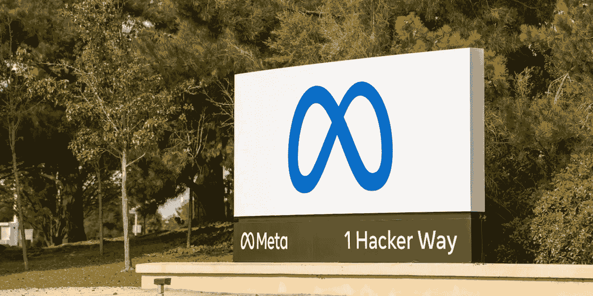
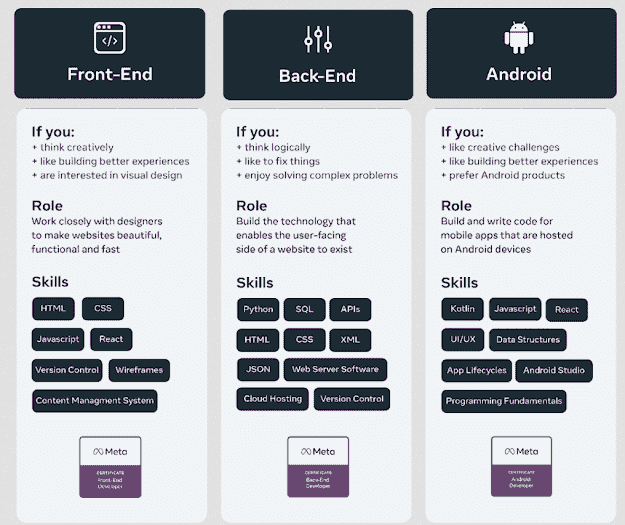
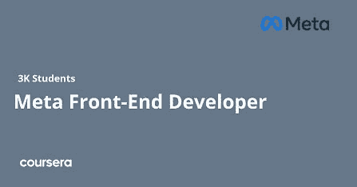
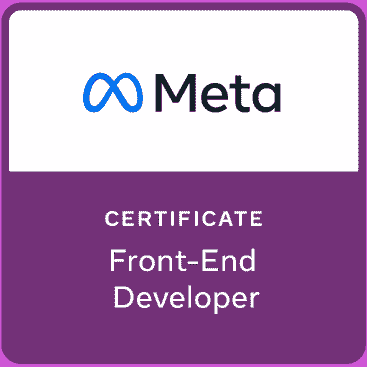
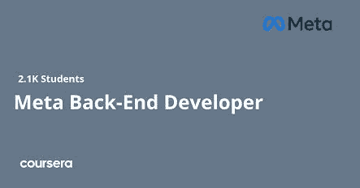

# Coursera 上的 Meta 前端和后端开发者证书值得吗？回顾

> 原文：<https://medium.com/javarevisited/is-the-meta-frontend-and-backend-developer-certificates-on-coursera-worth-it-review-125f1571e515?source=collection_archive---------0----------------------->

## Meta 前端和后端开发者证书真的有助于成为 2023 年的专业软件开发者吗？我认为，确实如此，让我们在这篇综述中了解更多。

你好，伙计们，如果你想在 2023 年成为前端或后端开发人员，并寻找一个结构良好、声誉良好、完全在线的项目，那么 Coursera 上的 [Meta 前端和后端开发人员证书](https://coursera.pxf.io/c/3294490/1164545/14726?u=https%3A%2F%2Fwww.coursera.org%2Fprofessional-certificates%2Fmeta-front-end-developer)是一个很好的起点。

这些证书将来自脸书的母公司 Meta(类似于在[谷歌专业证书](https://coursera.pxf.io/c/3294490/1164545/14726?u=https%3A%2F%2Fwww.coursera.org%2Fprofessional-certificates%2Fgoogle-data-analytics)中来自谷歌的证书)，并且由 Meta 的专业软件工程师**颁发。**

这意味着你不仅可以学到雇主非常看重的最新技术技能，还可以有机会向世界上最优秀的人学习。但是，Coursera 上的这个专业证书与其他证书不同的是可以访问 **Meta Job board** 。

该计划提供对 Meta 职业计划工作委员会的独家访问，这是一个工作搜索平台，将完成者与 200 多家致力于通过 [*Meta 的证书计划*](https://javarevisited.blogspot.com/2022/07/coursera-review-is-meta-frontend-and-backend-developer-certificate-worth.html) 寻找人才的雇主联系起来。它还包括准备和支持编码面试，职业支持，这是任何地方都找不到的。

如果你是一名开发人员，你可能已经知道你从 Coursera 学到的技能可以应用于许多不同类型的项目。但是认证呢？如果你的目标是成为一名全栈开发者，那么获得元证书是否值得？让我们仔细看看这对开发者意味着什么，以及如何最好地获得它。

如果你真的想成为一名软件工程师，尝试一下不仅仅是爱好的软件工作是明智的。成为一名软件工程师应该是一生的职业生涯，加入像 Meta 和 Google 这样的知名公司的职业项目是一个很好的开始。

本月初，Meta 在 Coursera 上推出了备受期待的 [**前端开发者职业证书**](https://coursera.pxf.io/c/3294490/1164545/14726?u=https%3A%2F%2Fwww.coursera.org%2Fprofessional-certificates%2Fmeta-front-end-developer) 和 [**后端开发者职业证书**](https://coursera.pxf.io/c/3294490/1164545/14726?u=https%3A%2F%2Fwww.coursera.org%2Fprofessional-certificates%2Fmeta-back-end-developer) 。这两个是新的入门级证书，不需要以前的经验或教育，并在大约 7 个月内教授就业技能。

完成后，这两个证书提供了访问 Meta 职业计划就业委员会的机会，这是一个求职平台，将完成者与 200 多家致力于通过 Meta 的证书计划和职业支持资源寻找人才的雇主联系起来。

这些激动人心的发布为进入前端和后端开发的需求领域铺平了全新的道路，值得与您的观众分享。

# Coursera 的 Meta 前端和后端开发者证书值得吗？

我认为 Meta 前端和后端开发证书都值得的原因有几个，第一，它来自 Meta，脸书的母公司，第二，它的结构非常好，第三，你将从软件工程专家那里学到 Meta，第四，可能是最重要的，这些认证计划提供了对 Meta 职业计划工作板的独家访问，这本身使这个认证值得。

Coursera 是在线学习的最佳场所之一，因为它不仅提供在线课程和专业，还提供学位或证书。它还开设了 mooc——大型开放式在线课程。这些是自定进度的在线课程，您可以利用自己的时间按照自己的进度学习。

Coursera 已经成为科技界的一个主要参与者，因为它的设计和结构良好的技术项目由谷歌、Meta、AWS、IBM 等公司和斯坦福大学等世界顶级大学提供。

本月早些时候， [Meta](https://www.facebook.com/business/learn/certification) 在 Coursera 上推出了备受期待的前端开发者专业证书和后端开发者专业证书。这些新的入门级证书不需要以前的经验或教育，并教授软件和 web 开发方面受欢迎的职业生涯的就业技能。

现在每个人都在谈论 [**元前端和后端开发人员证书**](https://coursera.pxf.io/c/3294490/1164545/14726?u=https%3A%2F%2Fwww.coursera.org%2Fprofessional-certificates%2Fmeta-front-end-developer) 的原因不仅仅是因为每个人都对 web 开发趋势感到兴奋——还因为这个证书有一些特殊之处:它提供了 web 开发领域中可能被认为是元的知识。

关于元开发者证书的另一个伟大的事情是独家访问元职业计划工作板。完成后，这两个证书提供了访问 Meta 职业计划工作板的机会，该工作板将完成者与 200 多家致力于通过 Meta 的证书计划和职业支持资源寻找人才的雇主联系起来。

这也是我觉得这些 [*元专业证书值得的最重要原因之一。*](https://coursera.pxf.io/c/3294490/1164545/14726?u=https%3A%2F%2Fwww.coursera.org%2Fprofessional-certificates%2Fmeta-front-end-developer) 简而言之，这些令人兴奋的元开发者证书为进入前端和后端开发的热门领域铺平了全新的道路，如果你想在前端和后端开发领域开始你的职业生涯，这是值得加入的。

 [## 元前端开发人员

### 在整个课程中，您将参与实践活动，这些活动提供了实践和实施以下内容的机会…

coursera.pxf.io](https://coursera.pxf.io/c/3294490/1164545/14726?u=https%3A%2F%2Fwww.coursera.org%2Fprofessional-certificates%2Fmeta-front-end-developer) 

# 什么是 Coursera 元开发者证书？它们有助于在 2023 年成为专业软件开发人员吗？

Coursera Meta Developer Certificate 是一个精心设计的认证项目，由流行的社交媒体平台脸书的母公司 Meta 提供。这些认证旨在教你成为一名成功的前端和后端开发人员所需的基本技能。

有两种主要的元开发人员证书，我们将在本文中讨论，元前端开发人员专业证书和元后端开发人员专业证书。

[**Meta 前端开发人员职业证书**](https://coursera.pxf.io/c/3294490/1164545/14726?u=https%3A%2F%2Fwww.coursera.org%2Fprofessional-certificates%2Fmeta-front-end-developer) 是一个 9 门课程的项目，由 Meta 的软件工程专家设计，为学习者做好前端开发人员的职业准备。这些课程将教你使用 [CSS](/javarevisited/10-best-html-and-css-courses-for-beginners-in-2021-6757eec00032) 、 [JavaScript](/javarevisited/10-best-online-courses-to-learn-javascript-in-2020-af5ed0801645) 、 [HTML5](https://javarevisited.blogspot.com/2019/05/top-5-html-5-and-css-3-courses-for-web-developers.html) 、 [Bootstrap](/javarevisited/6-best-bootstrap-online-courses-for-web-designers-and-developers-a688e192b2e2) 、 [React](https://javarevisited.blogspot.com/2018/08/top-5-react-js-and-redux-courses-to-learn-online.html) 和 [Figma](https://javarevisited.blogspot.com/2021/05/top-5-courses-to-learn-figma-for-ui-and.html) 的按需编码技能，以及构建专业页面布局的设计技能。

 [## 元前端开发人员

### 在整个课程中，您将参与实践活动，这些活动提供了实践和实施以下内容的机会…

coursera.pxf.io](https://coursera.pxf.io/c/3294490/1164545/14726?u=https%3A%2F%2Fwww.coursera.org%2Fprofessional-certificates%2Fmeta-front-end-developer) 

学习者还将构建作品集项目来展示他们的学习成果(您可以将它们添加到您的 git 存储库中),并获得编码面试支持以及独家访问 **Meta 职业计划工作板。**

同样， [**Meta 后端开发人员职业证书**](https://coursera.pxf.io/c/3294490/1164545/14726?u=https%3A%2F%2Fwww.coursera.org%2Fprofessional-certificates%2Fmeta-front-end-developer) 是一个 10 门课程的课程，由 Meta 的软件工程专家设计，为初级学习者准备一个后端开发人员的入门级职业。

证书会教你 [Python 编程语言](/javarevisited/7-best-python-online-courses-for-beginners-to-learn-programming-abe12cecb1ad)，Linux 操作系统和命令，SQL 和 MySQL，Django web 框架，编程问题解决技巧。

学习者将建立一个专业的投资组合来展示他们的学习，并为后端开发人员角色的技术面试做准备。

这是一个很好的方式来展示你的专业知识，并获得潜在雇主的认可，因为 Meta 是像谷歌这样受人尊敬的公司的开放，也是著名的 FAANG 集团的一部分。

顺便说一句，除了前端和后端开发人员，Meta 还提供更多的开发人员证书。

这里是 Coursera 上不同元开发者证书的快速指南，基于你作为前端开发者、后端开发者、应用开发者(Android 和 iOS 开发者)、[社交媒体营销](https://javarevisited.blogspot.com/2022/06/coursera-review-is-meta-social-media-worth-it.html)和数据库工程师成功所需的角色和技能。

## Meta Frontend 专业证书值得吗？

正如你所看到的，Coursera 的元前端证书是一个在你的职业生涯中获得飞跃的好方法。如果你正在寻找一个新的前端角色，并觉得自己缺乏成功所需的经验或知识，那么这个证书课程可能适合你。

没有先决条件，这意味着不需要任何经验或教育，该证书将在 7 个月内教会你就业技能，以启动前端开发的入门级职业生涯。

以下是你将在该专业证书中学到的关键编码技能:

*   [CSS](/javarevisited/5-free-html-and-css-courses-to-learn-front-end-web-development-online-8b04517c6ecb) ，
*   [JavaScript](/javarevisited/my-favorite-free-tutorials-and-courses-to-learn-javascript-8f4d0a71faf2) ，
*   HTML5，
*   [自举](/javarevisited/7-free-courses-to-learn-bootstrap-for-web-designers-and-developers-5135215648f1)，
*   [做出反应](/javarevisited/top-10-free-courses-to-learn-react-js-c14edbd3b35f)，
*   还有[图玛](/javarevisited/6-best-figma-ui-ux-design-courses-for-beginners-94711d31ce61)

在此过程中，您还将创建一个响应式网站，学习使用与 JavaScript 库和框架相关的 react，使用 Bootstrap CSS 框架创建网页，使用 GitHub 存储库和版本控制，并构建一个作品集项目来演示学习。

关于[**Meta Frontend developer Certificate**](https://coursera.pxf.io/c/3294490/1164545/14726?u=https%3A%2F%2Fwww.coursera.org%2Fprofessional-certificates%2Fmeta-front-end-developer)**最好的一点是，它还包括准备和支持编码面试、职业支持以及独家访问 Meta Career Programs job board——这是一个求职平台，将完成者与 200 多家致力于通过 Meta 的证书计划寻找人才的雇主联系起来。**

**简而言之，Meta 前端证书也是一个了解更多前端开发的绝佳途径，这将有助于任何想要在这一领域发展的人做好准备。它也完全在线，自定进度，由 Meta 的软件工程专家教授，这意味着你将有机会向世界上最好的工程师和老师学习。**

**完成这个项目后，你还将获得 Meta 和 Coursera 颁发的证书，你可以把它放在你的简历中或添加到你的 LinkedIn 个人资料中，以展示你的前端技能。**

****这里是加入元前端开发者证书**——[元前端开发者证书](https://coursera.pxf.io/c/3294490/1164545/14726?u=https%3A%2F%2Fwww.coursera.org%2Fprofessional-certificates%2Fmeta-front-end-developer)的链接**

****

## **Meta 后端专业证书值得吗？**

**对于那些想学习如何为 web 应用程序或服务器端应用程序构建后端的人来说，元后端证书是一个很好的选择。**

**课程材料很广泛，所以在开始本课程之前，如果你有一些 JavaScript 和 HTML 的经验是最好的。如果没有，互联网上有很多资源可以帮助你学习这些技能。**

**以下是您将在该计划中学到的关键技能:**

*   **Python，**
*   **Linux 命令，**
*   **饭桶，**
*   **SQL，**
*   **版本控制，**
*   **云托管，**
*   **API，**
*   **JSON，**
*   **和 XML**

**你可以看到，这些是成为一名合格的后端开发人员所需的最基本和最受欢迎的技术技能。你不仅会学到这些技能，还会利用他们的技能建立一个投资组合，并使用行业标准工具创建一个 Django web 应用程序。**

**您将能够访问所有的课程视频和测验，以及学生讨论其项目的所有论坛；它们真的很有帮助，因为它们让你知道其他学生在和你相似的情况下做了什么——以及他们犯了什么错误！它也是完全在线和自定进度的。由 Meta 的软件工程专家讲授**

**与 Meta Frontend Professional Certificate 类似，该后端证书计划还包括准备和支持编码面试、职业支持以及独家访问 Meta Career Programs job board——一个求职平台，将完成者与 200 多家致力于通过 Meta 证书计划寻找人才的雇主联系起来。**

**简而言之，最好的 Coursera 专业证书之一，开始你的后端开发职业生涯。**

****这里是加入 Meta 后端开发者证书** — [**后端开发者专业证书**](https://coursera.pxf.io/c/3294490/1164545/14726?u=https%3A%2F%2Fwww.coursera.org%2Fprofessional-certificates%2Fmeta-back-end-developer) 的链接**

****

**这就是 Coursera 上 Meta 前端和后端开发者证书的**回顾。Coursera 的 Meta 前端和后端开发人员证书是一个很好的证书项目，如果你想学习如何构建 web 应用程序，并想开始你的前端或后端开发职业生涯，可以考虑这个项目。****

**该课程易于学习，自始至终都有清晰的说明和有用的资源。这是完全在线和自定进度的，这意味着你可以在任何时候开始，不用担心最后期限或截止日期。**

**也没有考试或测验(虽然有测试)，所以如果你发现自己在课程的某一部分挣扎，这很容易，只要看看别人做了什么，尝试自己的方法，直到它为你点击！**

**如果您有时间，请在完成专业化认证的基础上采取额外的步骤来获得元证书。**

**元证书是为在这个行业寻找工作或想了解更多前端和后端开发的人设计的。如果你已经知道如何编码或者有一些前端开发的经验，并且能够利用这些知识从本课程中受益，那么这将是值得的。**

**获得元证书有很多不同的方法，选择适合自己的方法很重要。如果您有时间，请在完成专业化认证的基础上采取额外的步骤，以获得元开发人员证书。**

**顺便说一下，在 Coursera 上加入 Meta Developer certification，你有两个选择，你可以单独加入这个计划，每个月花费大约 39 美元进行专业化，或者你也可以加入 [**Coursera Plus**](https://coursera.pxf.io/c/3294490/1164545/14726?u=https%3A%2F%2Fwww.coursera.org%2Fcourseraplus) ，每年花费 399 美元，这是 Coursera 的一个订阅计划，让你无限制地访问他们最受欢迎的课程、专业化、专业证书和指导项目。**

** [## Coursera Plus |无限制访问 7，000 多门在线课程

### 在 Coursera 上可以无限制地访问 90%以上的课程、项目、专业和专业证书

coursera.pxf.io](https://coursera.pxf.io/c/3294490/1164545/14726?u=https%3A%2F%2Fwww.coursera.org%2Fcourseraplus)**