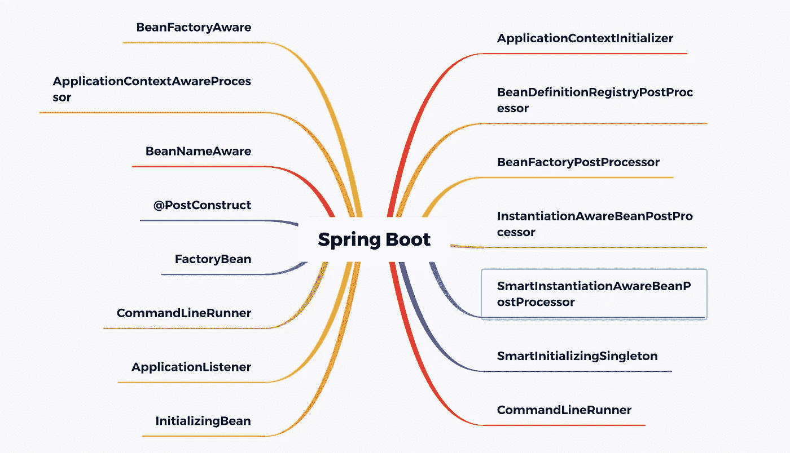

# 据说 99%的程序员都无法掌握这 5 个 Spring Boot 创业扩展点

> 原文：<https://medium.com/javarevisited/it-is-said-that-99-of-programmers-cannot-master-these-5-spring-boot-startup-extension-points-dbf4fcc301b2?source=collection_archive---------0----------------------->

资深程序员都知道， [Spring](/javarevisited/top-10-free-courses-to-learn-spring-framework-for-java-developers-639db9348d25) 的核心思想是容器，所以在项目中，如果容器被刷新，那将是惊涛骇浪。对于 [Spring boot，](/javarevisited/10-free-spring-boot-tutorials-and-courses-for-java-developers-53dfe084587e)它封装了 Spring，遵循约定而不是配置，加上自动组装的机制。