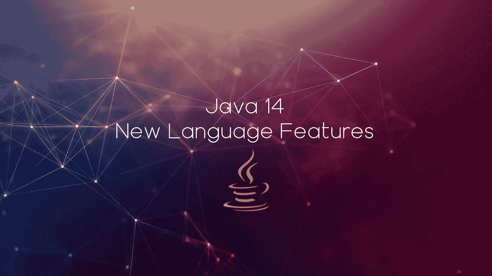

# Java 14 —新的语言特性

> 原文：<https://medium.com/javarevisited/java-14-new-language-features-1e185b7f120?source=collection_archive---------2----------------------->



Java 14 语言中引入了相当多的更新；也就是说，两个**预览版**，一个**二次预览版**，以及一个最终版特性是你将在 Java 14 中看到的新特性。

这些是我们今天将要深入了解的*新闻:*

*   **实例的模式匹配(预览)(JEP 305)**
*   **记录(预览)(JEP 359)**
*   **开关表达式(标准)(JEP 361)**
*   **文本块(第二次预览)(JEP 368)**

我会一次解释一个，并且尽可能深入。

# **用于实例的模式匹配(预览)(JEP 305)**

我们都使用过`instanceof`关系运算符，在运行时检查某个对象是否是特定类型的的*实例。*

**让我们简单回顾一下:** `instanceof`运算符，像所有其他*关系运算符*一样，形成一个布尔表达式，其一般语法如下:

```
a instanceof B
```

它检查对象(`a`)是否是特定类型(`B`)、子类型或实现接口的类的实例。如果是，表达式的计算结果为`true`，否则为`false`。

*   `a` 可以是(1)引用变量，(2)类实例化表达式，(3)枚举常量，或者(4)`null`；
*   `B`可以是(1)类名，(2)接口名，或(3)枚举名；
*   `a`和`B`必须是可转换类型——它们必须在继承树关系中，否则就是编译时错误。

所以，比方说，如果你的方法接受一个类型为`java.lang.Object`的参数，或者你迭代一个包含子类型实例的 bit 通用类型的集合，或者如果有任何其他情况，你不确定*的对象在运行时必须处理哪种特定类型*，你可能首先想要确切地知道该对象是否是特定类型`X`的实例；否则，您将无法安全地向下转换对象并访问(操作)其成员。

所以，你必须写出这样的东西:

```
if (obj instanceof X) {
   X x = (X)obj;
   //...
}
```

重述够了。现在让我们看看上面的例子中有哪些可以改进的地方。它包含:

1.  测试`obj`是否为`X`的实例；
2.  如果是，则将`obj`铸造成`X`型；
3.  在问题中声明一个类型的变量，并给它赋值，即 casted object(如果`ClassCastException`没有发生)。

你不觉得这三个步骤构成了你一直有的重复仪式(have！before now)去做，为了能够使用在编译时类型不确定的接收对象(也就是指`x`所指的，在强制转换之后)？

避免这种乏味的仪式是特性的实例的*模式匹配的动机，这表明，每当类型检查布尔表达式计算为`true`(即实例恰好是它所检查的任何对象的类型)，类型转换应该是不必要的，因为如果你测试对象是否是特定类型的实例，你可能想对该对象做的唯一事情，就是*将它转换为所讨论的类型。**

因此，为了更专注于逻辑，而不是冗长的语言语义(这实际上在使用`instanceof`时总是必要的)，*模式匹配*提出了一种更新、更简洁的语法，对于上面的同一个例子，它看起来像:

```
if (obj instanceof X x) {
    //x is in scope
} else {
    //x is NOT in scope
}
```

在此语法中:

1.  每当`obj instanceof X`为`true`时，`obj`引用被转换为类型`X`，然后被赋值给`x`；
2.  注意，绑定变量的范围(在本例中是`x`)是由`if`的布尔表达式的语义决定的，它将只在 *true* 块的范围内。
    在上面的例子中，如果`obj`不是`X`的一个实例，你将不会把它作为`X`类型的对象，存储在`x.`中，在紧接着`if`的块中；然而，如果它是`!(obj instanceof X x)`，那么*真*块应该是`else`，这就是绑定变量`x`应该只在范围内的地方；
3.  如果`if`语句的条件是一个复合布尔表达式(由`&&`或`||`组成)，那么绑定变量(用你正在检查的`instanceof`的类型声明)在`&&`右边的作用域和*真*块中，但是如果在`||`的右边就不在作用域中。

形式上:

1.  一个*模式*是(1)一个可以应用于目标的*谓词*和(2)一组*绑定变量*的组合，只有谓词成功应用于目标时，才能从目标中提取这些变量；
2.  类型测试模式由一个指定类型的谓词和一个绑定变量组成；
3.  `instanceof`操作符被扩展以接受类型测试模式，而不仅仅是类型。在上面的例子中，短语`X x`是类型测试模式。


# **记录(预览)(JEP 359)**

很长一段时间以来，当谈到语法时，Java 一直被指责为非常冗长。

例如，如果您只想创建一个简单的 POJO 类，该类只用三个字段来模拟 Employee:`name`、`surname`和`position`，那么您应该编写以下代码:

```
public class Employee {

    private String name;
    private String surname;
    private Position position;

    public Employee() {
    } public Employee(String n, String s, Position p) {

        this.name = n;
        this.surname = s;
        this.position = p;

    }

    public String getName() {
        return this.name;
    }

    public String getSurname() {
        return this.name;
    } public Position getPosition() {
        return this.name;
    } public void setName(String name) {
        this.name = name;
    } public void setSurname(String surname) {
        this.surname = surname;
    }

    public void setPosition(Position p) {
        this.position = p;
    }

    //toString.. //hashCode.. //equals..}
```

所有这些代码..构造函数、getters、setters、equals()、hashCode()、toString()..对于创建一个数据载体类来说实在是太多了，您将使用它的实例将数据从一层传送到另一层；从一个抽象到另一个抽象；从一个仓库到另一个。

正因为如此，开发人员经常会忘记、省略或者忽略一些非常重要的方法(他们低估了这些方法)，比如`hashCode()`或者`equals()`。

是的，现代的 ide 做了大量的代码搭建/生成工作，但是阅读如此冗长的代码，保存它，并对它进行维护——仍然是一笔巨大的、大量的和多余的成本。

欢迎光临，`record` s！

记录是 Java 语言中的一种新类型——一种受限形式的类(如`enum`),它充当不可变数据的透明载体/集合。

记录只是一个数据载体，普通数据集合类型，它的实例持有，并用于携带值/数据。记录不像传统的类那样具有功能性，但是因为这样一个事实，即作为一个开发人员，它们使您从编写大量的模板中解放出来，当涉及到一个纯数据集合类型时，它们构成了一个超级简洁、简短和干净编码的类型。

记住:记录为声明类提供了一个紧凑的语法，这些类是浅层不可变数据 的 ***透明持有者，记录并不试图为*可变*类解决任何问题。***

## *我们如何定义记录？*

**记录**是用它的名称和状态描述定义的(两者合起来称为*表示*)，当它被编译时，一个与它的表示相匹配的成熟的 API 由编译器开箱即用地为您生成/提供。记录也可以有一个主体。

问:*什么是状态描述*？
答:那只是记录的*组件*的逗号分隔列表。稍后，当记录被编译时，编译器使用这个*状态描述*生成一个具有相同签名的公共构造函数；

哎呀！你说的组件是什么意思？
答:它是参数，您在记录名之后(在{花括号}之前)定义，并且编译器将为每个参数生成私有的 final 字段和特殊的*访问器*方法(稍后将详细介绍)。把它想象成构造函数的参数列表，你为你的记录定义的(因为这个组件列表稍后会被使用，正如我已经说过的，来生成相应的公共构造函数)。

也许引入一些语义重叠的词的术语有点令人困惑，这些词目前还没有出现在 Java 的词汇表中，我希望我已经澄清了这种困惑。

同样，请记住，**记录**是用它的名称和状态描述定义的(可选地，它可以有一个主体)；状态描述依次是*组件列表*的记录；而*组件*，实际上只是参数，稍后(编译期间)用来生成公共构造函数。

因此，记录定义的一般语法如下所示:

```
[access-modifier] record ([params]){
    //optional body
}
```

> 就这样——你就有了一份成熟、完整、有效的记录。

请耐心等待，看看您从盒子里获得了什么，只需定义您的记录:

*   `private final`每个组件的字段，每个字段具有与其各自组件相同的类型，并且与组件(参数)变量具有相同的名称；
*   `public` *访问每个字段的方法*，这些方法的名称与其对应的字段完全相同，并返回这些字段的类型。
    注意，这里我们不是在谈论传统的*getter*，按照惯例，它们有 *camelCase* 名称。*访问器*，被决定坚持不同的命名约定——与字段名称相同的名称*；*
*   *公共构造函数，其签名与记录的状态描述相同，并从相应的参数初始化每个字段；*
*   *`equals(Object obj)`和`hashCode()`的实现说*两个记录相等，如果它们是相同的类型并且包含相同的状态*；和*
*   *`toString()`实现，包括给定记录的所有组件的字符串表示(及其名称)。*

*所以，通过定义:*

```
*public record Person(String fullName, int age) {}*
```

*您可以有效地获得:*

```
*public class Person {

    private final String fullName;
    private final int age; public Person(String fullName, int age) {
        this.fullName = fullName;
        this.age = age;
    } public String fullName() {
        return this.fullName;
    } public int age() {
        return this.age;
    } //implementation of hashCode() //implementation of equals(Object obj) //implementation of toString()}*
```

> *你看出区别了吗？*

*还有注意！，我不愿意包含我作为注释包含的方法的实现..它会比这个大得多，仍然是非常冗长和庞大的代码。*

*换句话说，你可以说， ***记录*** 是一个浅显不可变的数据聚合类，其唯一的目的是存储(也许有助于传输)数据。一旦实例化，它的实例字段就不能重新初始化。*

## *这里休息一会儿..*

## *..确保你意识到我上面写的一切。*

## *如果我是你，我会再读一遍以上部分..可能..:)*

**

## *让我们继续..*

*除了记录的语法，在编译期间获得的一些新概念方面(我已经对其进行了去神秘化，将其解释为一个*词汇表*)和记录的语义(要求浅不可变的数据聚集器类型)，记录像普通类一样工作。他们可以:*

*   *被声明为顶级或嵌套；*
*   *要通用；*
*   *实现接口；*
*   *定义静态字段(这些也可以声明)、静态初始化器、构造函数(*见下面的特别说明，关于这个*)、实例方法、嵌套类型；*
*   *被注释。*

*但是，有很多事情他们可以 ***不可以*** 做！*

***编译时间限制:***

*   *记录隐式扩展`java.lang.Record`(就像`enum` s 扩展`java.lang.Enum`)。
    当记录被编译时，编译器生成这个扩展——因此，它不能扩展任何其他类(包括其他记录)。Java 不支持多重继承；*
*   *记录不能声明或定义实例字段，除非是基于记录*状态描述*生成的。*

> *以上两点保证了唯一的**状态描述**定义了记录的表示；*

*   *记录是隐式的`final`，(当记录被编译时，编译器从记录中创建`public final class YourRecordName extends java.lang.Record`)，因此，它不能是抽象的。*

> *这个限制再次强调，记录的 API 仅仅由它的状态描述定义，并且不能通过子类化记录来增强。*

## ***记录体中的规范和非规范构造函数***

*Java 记录体中定义的构造函数以一种有点特殊的方式工作。*

***规范构造函数:** 您可以在记录体中定义规范构造函数(与记录的状态描述签名相匹配的构造函数)，例如:*

```
*public record MyRecord(Type1 x, Type2 y) {

    public(Type1 x, Type2 y) {
    }}*
```

*或者！您可以完全避开参数列表:*

```
*public record MyRecord(Type1 t, Type2 t) {

    public MyRecord {
    }}*
```

*这仍然会被编译成规范的构造函数，带有 state description 定义的所有参数。*

*注意，如果在记录体中显式定义规范构造函数:*

1.  *构造函数参数的顺序和名称以及状态描述的组成部分**必须匹配**(如果规范构造函数是用参数定义的**)；***
2.  *您**必须**初始化记录的所有组成部分(状态描述参数)，无论规范构造函数是否定义有参数。*

***非规范构造函数:** 有趣的是，在记录体中定义非规范构造函数也是允许的，但是有一定的限制。*

*如果你定义了一个非规范的构造函数，你必须确保它委托给另一个构造函数(用`this([..])`调用)..如果“另一个构造函数”也是非规范的，那么它也必须委托给另一个构造函数..如此循环往复，**直到**最后一个被委托的非规范构造函数委托给**规范构造函数**。如果没有发生这种情况，就有编译时错误。*

*最后，请记住，从*状态描述*自动导出(生成)的任何行为(方法)也可以明确定义；但是，在这种情况下，你将冒风险，自己去实现那些已经被非常彻底和细致地考虑过的事情。存取器 equals()或 hashCode()的手动/自定义实现可能会破坏记录的语义，否则将“承诺”交付记录。*

*恭喜你！您刚刚完成了一个非常详细和深入的教程，内容是一个新的、非常重要和酷的主题——Java 记录。*

**

# ***开关表达式(标准)(JEP 361)***

*放松，这里没什么新鲜的。*

*在我的 [Java 12 -新语言特性](https://tsiklauri.medium.com/java-12-switch-expressions-jep-325-preview-feature-ba8e3db9706)文章中，我已经非常全面地介绍了**开关表达式**的第一个预览，随后，我在我的 [Java 13 -新语言特性](https://tsiklauri.medium.com/java-13-new-language-features-eba2408ae30)文章中概述了第二个预览(更新),这是针对较新的 Java 13 版本的。*

*—***Java 14 中的 Switch 表达式怎么了？****

*它们是标准化的，自 Java 13 以来没有任何进一步的修改。*

*就是这样。**开关表达式(JEP 361)** 现在是 Java 语言完全标准化的一部分。*

**

# *文本块(第二次预览)(JEP 368)*

*在我的 [Java 13 -新语言特性](https://tsiklauri.medium.com/java-13-new-language-features-eba2408ae30)文章中，我们已经详细介绍了文本块的第一次预览，正如你现在所知道的，如果你还没有查看它，让我直接切入正题，进入更新——JEP 368 中的新内容，*文本块的第二次预览*；什么，即第二个预览添加到已经存在的预览功能——*文本块*。*

*根据前任 JEP(第一次预览版)从工程师和开发人员那里得到的反馈，针对 Java 14 的文本块第二次预览版在文本块中增加了**两个*新的*转义序列**:*

1.  *`\<line-terminator>`和*
2.  *`\s`*

## *\<line-terminator></line-terminator>*

*`\<line-terminator>` —这是一个新的转义序列，我们可以专门在文本块中使用，以强制取消新行字符。注意，如果你使用一些 IDE 或文本编辑器，只需按下<回车>并将光标移动到下一行就可以插入`line-terminator`。你只是通常看不到特殊的*控制字符*:*CRLF(Windows 上)或 LF(Linux 上)。**

**— *这是给*的什么？
—如上所述，用于抑制换行符。**

**假设你有一个文本块，它应该包含一长行；然而，因为你的屏幕不是无限宽的，你最好在你的源代码中把这一行分成两行，同时把真正的文本(因为它将被编译)保持在一行。
注意！原始文本、真实的数据*必须保持*一行，但是仅仅为了方便起见，您想要在您的文本编辑器**中将那一长行拆分成两行(或更多行)!由于你的屏幕宽度有限，滚动条宽度太长不方便。
你想把你的长单行文本编码成两行、三行或更多行，但是你想要的原始数据(文本)必须是一行。您可以将其存储在文件中或打印在控制台输出上，它**必须是一行**。****

**这就是`\<line-separator>`发挥作用的地方。你用这个转义序列在代码中分解字符串文字，但实际上，这只是给你一个视觉上的安慰——文本本身仍然没有**没有**包含换行符，它仍然是一个长行。**

**此代码中的字符串文本:**

```
**String text = """
              I am Giorgi Tsiklauri. I really like \
              coding, teaching, and everything \
              that has to do with computers. I constantly learn \
              and I have a big interest in data structures, \
              algorithms, cyber security, network engineering, \
              climate and astrophysics.
              """**
```

*****不*** 是否包含换行符，如果这是打印出来的，写在文件里的，通过网络发送的，或者通过其他方式显示的，那将是一个巨大的行。**

**这是对字符串块的一个非常有用的新补充。**

**注意，传统的“字符串文字”不允许源代码级机制将文本分成多行，同时保留真正的原始数据—一行。**

## **\s**

**`\s` —这个转义序列简单地转换成一个空格(Java 语法中的 U+0020 或\u0020)。**

**这个转义序列的目的是在需要时保留显式编码的空格，因为默认情况下，编译器会丢弃它们。**

**例如，代码的结果:**

```
**String text = """
              Beethoven's 9th Symphony is transcendental!     
              """;
System.out.print(text);**
```

**将会是:**

```
**Beethoven's 9th Symphony is transcendental!**
```

**尽管如此，在源代码中，我添加了 5 个空格。它们被丢弃，因为编译器会忽略它们。**

**然而，如果你希望保留空格，你可以使用`\s`，并且**注意，**这个转义序列在传统的字符串文字和字符串块中都有效。**

**所以，要么你编码:**

```
**String text = 
        """
        Beethoven's 9th Symphony is transcendental!    \s
        """;**
```

**或者**

```
**String text = "Beethoven's 9th Symphony is transcendental!    \s";**
```

**该文本将被编译(因此—在任何使用它的地方使用)为:**

```
**Beethoven's 9th Symphony is transcendental!......**
```

**我用上面的`.`符号表示空格。注意，最后的`\s`也作为空格包含在内。**

**这就是这篇文章的内容。**

**感谢您的关注。关注我的个人资料，获取更多关于 Java、JVM、算法和数据结构的帖子。**