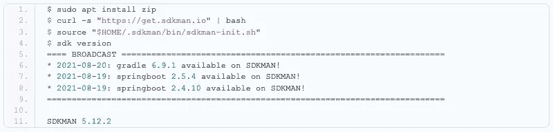
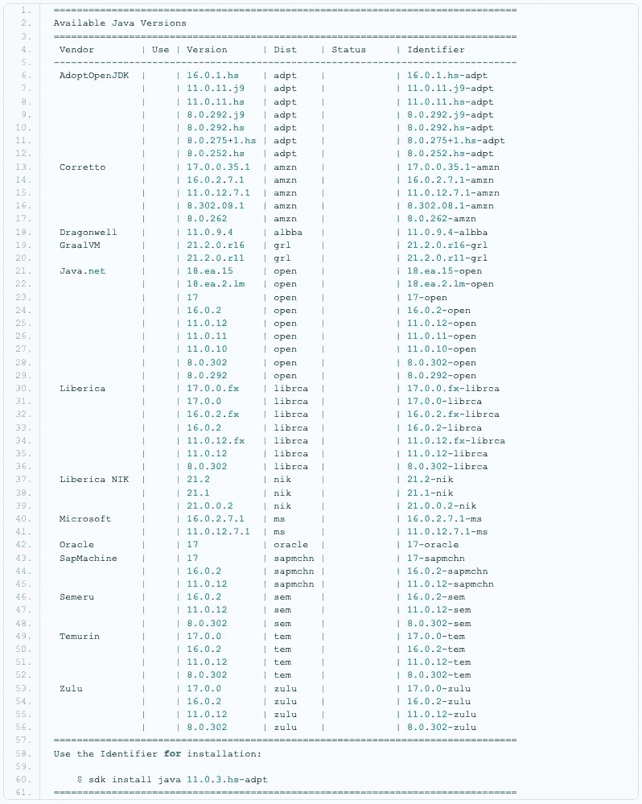
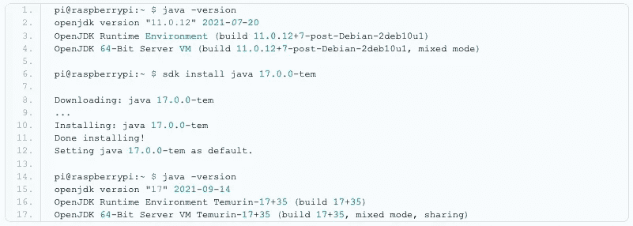
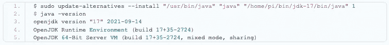
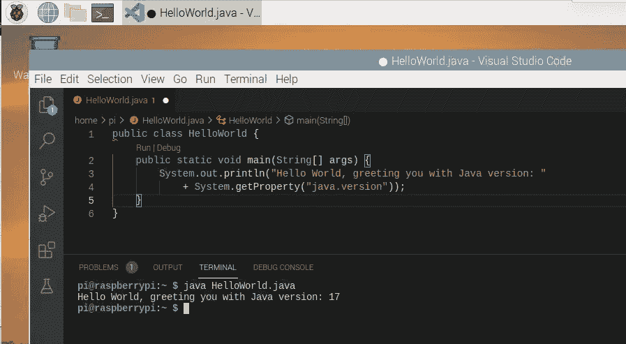
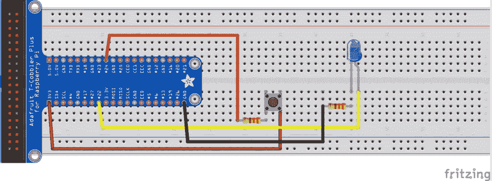
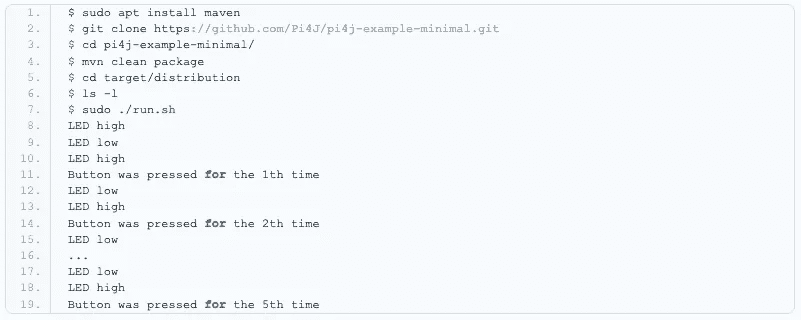

# 树莓派上的 Java 17

> 原文：<https://medium.com/javarevisited/java-17-on-the-raspberry-pi-d5a4d3e0e8ca?source=collection_archive---------1----------------------->

作为 [Foojay 虚拟 OpenJDK 17+ JUG Tour](https://foojay.io/today/schedule-for-foojay-virtual-openjdk-17-jug-tour/) 的一部分，我被要求在 Raspberry Pi 上展示 Java 和 JavaFX 17 的状态。因此，这是一个用一些最新版本信息更新我的 [#JavaOnRaspberryPi](https://twitter.com/hashtag/JavaOnRaspberryPi) 演示文稿的绝佳机会。

在这篇文章中，你可以找到更多的背景信息，2021 年 8 月 27 日曼彻斯特水壶的录音可以在 YouTube 上找到。

过去，我一直在 Raspberry Pi 上试验 Java 16(参见“[在 64 位 Raspberry Pi 上从 GitHub 源代码构建 OpenJDK】”)，但现在版本 17 已经推出，是时候用即将推出的新“长期支持”(LTS)版本升级我们的 Raspberry Pi 了。](https://foojay.io/today/building-openjdk-from-github-sources-on-64-bit-raspberry-pi/)

为了能够轻松地测试和安装不同的 Java 版本，我喜欢使用 [SDKMAN](https://sdkman.io/install) ，但不幸的是这不适用于 32 位系统。所以，没问题，我们从一个新鲜的树莓派和 64 位操作系统版本开始！

# 使用 64 位操作系统设置新的 Raspberry Pi

虽然在撰写本文时 64 位版本仍未正式发布(如前面的“[更快&更可靠的 64 位操作系统，带 USB 引导](https://foojay.io/today/64-bit-raspbian-os-on-raspberry-pi-4-with-usb-boot/)”)中所述，但在 Raspberry Pi Foundation 的[下载服务器上有一个更常规的更新版本。](http://downloads.raspberrypi.org)

对于这篇文章，我使用了 2021-05-28 的`/raspios_arm64/images/`版本，并用 [Raspberry Pi Imager 工具](https://www.raspberrypi.org/software/)将其“刻录”在 USB 闪存驱动器上。这是为 Raspberry Pi 定制的 Debian 10 的桌面版本，预装了最少的额外工具。包含 Java 11 和额外程序的完整版本仅在`/raspios_full_armhf/`中作为 32 位版本提供。

启动后，我们可以在终端中检查版本:

检查 Linux 版本

# SDKMAN

SDKMAN 是一个非常有用的工具，可以快速安装新的 Java 版本或者在已经安装的版本之间切换。通过几个终端命令，我们可以将它安装在我们的 Raspberry Pi 上。

安装 SDKMAN

很好，我们现在让 SDKMAN 在树莓派上运行了！有一个令人印象深刻的可以安装的 Java 版本列表！这是 2021 年 9 月 23 日你用命令`sdk list java`得到的列表:

可与 SDKMAN 一起安装的 Java 版本

让我们安装由 adoptium.net[提供的 Temurin 版本 17(原名为 adoptopenjdk.net)。](https://adoptium.net)

用 SDKMAN 安装 Java 17

事实上`sdk install java 17.0.0-tem`就是切换到 Java 17 所需要的一切！

# 早期访问 Java 17

由于在撰写本文时还没有正式的 Java 17，所以另一种方法是安装 jdk.java.net 提供的早期版本。8 月 23 日，EA 版本可用，可以根据[对 opensource.com](https://opensource.com/article/19/11/install-java-linux)的逐步描述进行安装:

安装来自 jdk.java.net 的早期访问 Java 版本

现在让我们更容易地启动 Java:

更新 Java 替代方案

快看，树莓派上的 Java 17-ea！😉

# Visual Studio 代码

查看“[在 Raspberry Pi 上使用 VS 代码进行 Java 开发](https://foojay.io/today/java-development-with-vs-code-on-the-raspberry-pi/)”了解更多关于在 Raspberry Pi 上使用 VSC 的信息，但简单来说安装如下:

如何在树莓 Pi 上安装 Visual Studio 代码

现在让我们试试你能写的最小的 Java 程序来检查和打印 Java 版本…

HelloWorld Java 代码示例

最后，由于我们可以不编译 Java 文件就运行它们，从 Java 11 开始，我们可以像这样运行它:

运行 HelloWorld 示例

树莓派上 VSC hello world 的截图

# 运行 Pi4J 项目

现在，让我们看看是否可以运行 Pi4J 项目的最小示例项目来控制一个 LED 并读取一些基本电子组件的按钮状态。

带 LED 和按钮的最小 Pi4J 示例的接线

这在[最小示例应用](https://pi4j.com/getting-started/minimal-example-application/)中有完整描述，但这是*TL；DR；*版本，打开一个终端，运行以下命令[安装 Maven](https://javarevisited.blogspot.com/2016/06/how-to-install-maven-in-on-windows-78-or-10.html#axzz5het8pfqP) ，获取演示代码，编译并运行:

Pi4J 最小示例应用程序的日志输出

# 结论

和往常一样，Java 可以在任何地方运行，所以在树莓 Pi 上运行 17 版并不奇怪！Pi4J 示例应用程序运行起来也没有问题！

*文章原载于*[*foojay . io*](https://foojay.io/today/java-17-on-the-raspberry-pi/)*。*

您可能喜欢的其他 **Java 文章和资源**

 [## 2021 年免费在线学习 Java 的 10 个最佳地点

### 我最喜欢的免费在线学习 Java 的网站，适合初学者和想学习 Java 编码的人…

medium.com](/javarevisited/10-best-places-to-learn-java-online-for-free-ce5e713ab5b2)  [## 2021 年 Java 程序员路线图

### 2021 年成为 Java 开发人员的图解指南，包含相关课程的链接

medium.com](/javarevisited/the-java-programmer-roadmap-f9db163ef2c2)