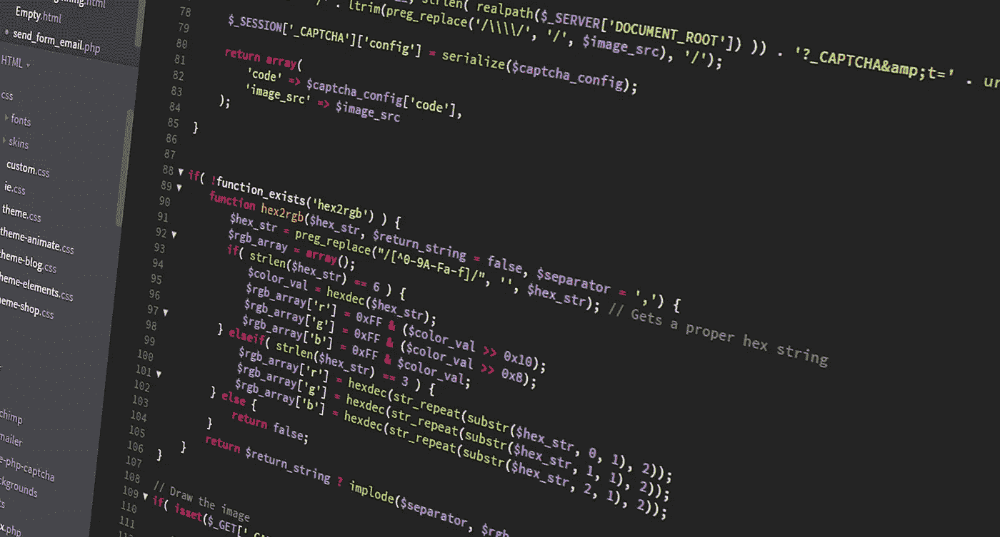
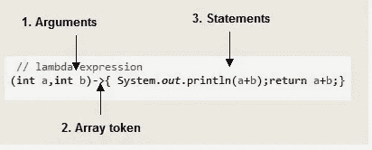

# Java 8 面试问答— Java2Blog

> 原文：<https://medium.com/javarevisited/java-8-interview-questions-and-answers-java2blog-9ae2c1fc06cc?source=collection_archive---------2----------------------->

在本帖中，我们将专门针对 [Java 8](https://java2blog.com/java-8-tutorial/) 上的一些重要面试问题。这些年来，Java 发生了很大的变化，Java 8 引入了许多新特性，当你准备 Java 面试时，你需要了解这些特性。以下是 Java 8 面试中最常被问到的问题。

以下是 Java 8 面试中最常被问到的问题。

# Java 8 中引入了哪些新特性？

Java 8 中增加了许多新特性。以下是重要功能的列表:

*   [λ表达式](https://java2blog.com/lambda-expressions-in-java-8/)
*   [界面中的默认方法](https://java2blog.com/interface-default-methods-in-java-8/)
*   [功能界面](https://java2blog.com/java-8-functional-interface-example/)
*   [可选](https://java2blog.com/java-8-optional/)
*   方法引用
*   日期 API
*   流 API
*   JavaScript 引擎 Nashorn

# 2)使用 Java 8 的主要优势是什么？

*   更紧凑的代码
*   少锅炉板代码
*   更具可读性和可重用性的代码
*   更多可测试的代码
*   并行操作

# 3)什么是 lambda 表达式？

Lambda 表达式是一个匿名函数，它有一组参数、一个 lambda (->)和一个函数体。没有名字也可以调用它来发挥作用。

## λ表达式的结构

让我们看一个简单的线程执行的例子:

更多细节可以参考 java 中的 [lambda 表达式。](https://www.java2blog.com/lambda-expressions-in-java-8/)

# 4)能解释一下 Lambda 表达式的语法吗？

所以我们可以把 Lambda 表达式的结构分成三个部分:

**1。自变量列表或参数**

Lambda 表达式可以有零个或多个参数。

您可以选择不声明参数类型，因为它可以从上下文中推断出来。

不能声明一个参数的类型，也不能声明其他参数的类型。

当只有一个参数时，如果推断出了它的类型，就不一定要使用括号

**2。数组令牌(- > )**

**3。正文**

*   身体可以有表情或语句。
*   如果主体中只有一个语句，则不需要花括号，匿名函数的返回类型与主体表达式的返回类型相同
*   如果有一个以上的语句，那么它应该在花括号中，匿名函数的返回类型与代码块返回的值相同，如果没有返回，则为 void。

# 5)什么是功能接口？

函数接口是那些只能有一个抽象方法的接口。它可以有一个[静态方法](https://javarevisited.blogspot.com/2013/11/difference-between-static-vs-non-static-method-java.html#axzz5Y4KkQFHS)，默认方法或者可以覆盖对象的类方法。

Java 中已经存在许多功能接口，比如 Comparable、Runnable。

因为我们在 Runnable 中只有一个方法，所以它被认为是函数接口。

你可以阅读更多关于[功能界面](https://www.java2blog.com/java-8-functional-interface-example/)的信息。

# lambda 表达式和函数接口是如何关联的？

Lambda 表达式只能应用于函数接口的抽象方法。
**例如**

Runnable 只有一个名为 run 的抽象方法，因此可以如下使用:

这里我们使用的线程构造器将 Runnable 作为一个参数。如你所见，我们在这里没有指定任何函数名，因为 Runnable 只有一个抽象方法，java 将隐式创建匿名 Runnable 并执行 run 方法。
会和下面代码一样好。

# 7)能否创建自己的功能界面？

是的，你可以创建自己的功能界面。Java 可以隐式地识别函数接口，但是你也可以用 [@FunctionalInterface](https://javarevisited.blogspot.com/2018/01/what-is-functional-interface-in-java-8.html) 来注释它。
示例:
创建一个名为`Printable”`的接口，如下图

创建名为"`FunctionalIntefaceMain”`的主类

当您运行上面的程序时，您将得到下面的输出:

如您所见，由于 Printable 只有一个名为 print()的抽象方法，我们可以使用一个 [lambda 表达式](http://www.java67.com/2017/06/10-points-about-lambda-expressions-in-java-8.html)来调用它。

# java 8 中的方法引用是什么？

方法引用用于引用函数接口的方法。它只不过是 lambda 表达式的一种压缩方式。你可以简单地用方法引用替换 lambda 表达式。
**语法:**
class::methodname

# 9)什么是可选的？为什么以及如何使用它？

Java 8 引入了一个名为 Optional 的新类。引入这个类主要是为了避免 Java 中的 NullPointerException。可选类封装可选值，可选值要么存在，要么不存在。
它是对象的包装器，可用于避免 NullPointerExceptions。让我们举一个简单的例子

您已经编写了下面的函数来获取字符串中第一个不重复的字符。

你调用上面的方法如下。

你看到问题了吗，getNonRepeatedCharacter("SASAS ")没有不重复的字符，因此它将返回 null，我们调用 c.toString，因此它显然会抛出 NullPointerException。您可以使用 Optional 来避免这种 NullPointerException。
让我们改变方法，返回可选对象而不是字符串。

当上述方法返回 Optional 时，您已经知道它也可以返回 null 值。
你可以调用 Optional 的 isPresent 方法来检查 Optional 中是否有包装的值。

如果 Optional 中没有值，它将简单地打印“在字符串中没有找到非重复字符”。

# 10)默认方法有哪些？

默认方法是接口中那些有主体并使用默认关键字的方法。Java 8 中引入默认方法主要是为了向后兼容。
更多细节可以参考 Java 中的[默认方法](https://www.java2blog.com/interface-default-methods-in-java-8/)。

# 11)谓词和函数的区别？

两者都是功能接口。
[谓词](https://www.java2blog.com/java-8-predicate-examples/) < T >是一个单参数函数，它要么返回 true，要么返回 false。这可以用作 lambda 表达式或方法引用的赋值目标。

函数<t r="">也是一个单参数函数，但是它返回一个对象。这里 T 表示函数的输入类型，R 表示结果类型。</t>

这也可以用作 lambda 表达式或方法引用的赋值目标。

# 12)您知道 Java 8 中引入的日期和时间 API 吗？旧的日期和时间 API 有什么问题？

旧日期和时间 API 的问题:

**线程安全:**您可能已经意识到 java.util.The date 是可变的，不是线程安全的。甚至 java.text.SimpleDateFormat 也不是线程安全的。新的 Java 8 日期和时间 API 是线程安全的。

**性能:** Java 8 的新 API 比旧的 Java APIs 性能更好。

**可读性更强:**日历、日期等老 API 设计很差，很难理解。Java 8 日期和时间 API 易于理解，并且符合 ISO 标准。

# 13)能否提供一些 Java 8 日期和时间的 API？

**LocalDate** 、 **LocalTime** 和 **LocalDateTime** 是 Java 8 的核心 API 类。顾名思义，这些类对于观察者的上下文来说是本地的。它表示观察者上下文中的当前日期和时间。

# 14)如何使用 Java 8 日期和时间 API 获取当前日期和时间？

您可以简单地使用 LocalDate 的 **now** 方法来获取今天的日期。

它会给你以下格式的输出:

您可以使用 LocalTime 的 **now** 方法来获取当前时间。

它会给你以下格式的输出:

# 15)Java 8 中我们有 PermGen 吗？你知道元空间吗？

在 Java 7 之前，JVM 使用一个名为 PermGen 的区域来存储类。它在 Java 8 中被删除，并被 MetaSpace 取代。
元空间优于 permgen 的主要优势:
PermGen 的最大大小是固定的，不能动态增长，但元空间可以动态增长，没有任何大小限制。

*原载于 2017 年 9 月 10 日*[*https://java2blog.com*](https://java2blog.com/java-8-interview-questions/)*。*