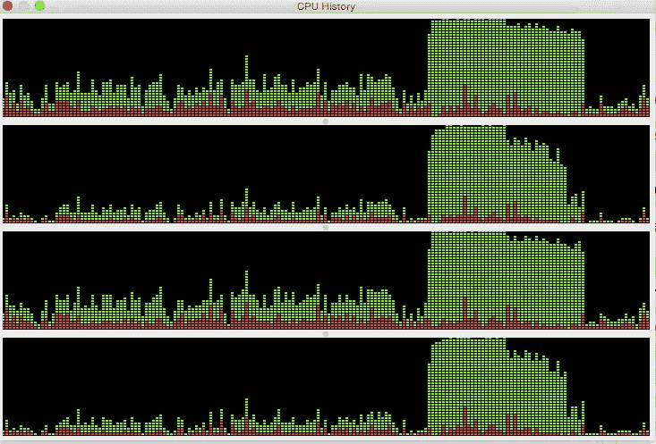

# Java 8 并行流简介— Java2Blog

> 原文：<https://medium.com/javarevisited/java-8-parallel-stream-java2blog-e1254e593763?source=collection_archive---------0----------------------->

[](https://click.linksynergy.com/fs-bin/click?id=JVFxdTr9V80&subid=0&offerid=323058.1&type=10&tmpid=14538&RD_PARM1=https%3A%2F%2Fwww.udemy.com%2Fjava-the-complete-java-developer-course%2F)

在这篇文章中，我们将会看到 java 中的并行流。

[Java 8](https://java2blog.com/java-8-tutorial/) 引入了并行流的概念来做并行处理。由于廉价的硬件成本，现在我们有许多 CPU 核心，并行处理可以用来更快地执行操作。

让我们借助一个简单的例子来理解

当您运行上面的程序时，您将得到下面的输出

> = = = = = = = = = = = = = = = = = = = = = = = = = = = = = = = =
> 使用顺序流
> = = = = = = = = = = = = = = = = = = = = =
> 1 主
> 2 主
> 3 主
> 4 主
> 5 主
> 6 主
> 7 主
> 8 主
> 9 主
> 9 主
> = = = = = = = = = = = = = = = = = = = = = = = = = = = = = = = = = = = = = T17

如果您注意到输出，主线程正在处理顺序流的所有工作。它等待当前迭代完成，然后处理下一个迭代。

在[并行流](http://www.java67.com/2018/10/java-8-stream-and-functional-programming-interview-questions-answers.html)的情况下，同时产生 4 个线程，它在内部使用 Fork 和 Join pool 来创建和管理线程。并行流通过静态`ForkJoinPool.commonPool()`方法创建`ForkJoinPool`实例。

并行流利用所有可用的 CPU 内核，并行处理任务。如果任务数量超过核心数量，则剩余任务会等待当前运行的任务完成。

# 并行流很酷，所以你应该一直使用它吗？

**一个大大的不！！**
将顺序[流](https://java2blog.com/java-8-stream-filter-examples/)转换成并行流，只需添加即可。并行，并不意味着你应该总是使用它。使用并行流时，您需要考虑许多因素，否则您会受到并行流的负面影响。

并行流比[顺序流](http://www.java67.com/2014/04/java-8-stream-examples-and-tutorial.html)有更高的开销，并且需要大量时间在线程之间进行协调。
当且仅当以下条件成立时，您才需要考虑并行流:

*   您有一个大型数据集要处理。
*   正如你所知道的，Java 使用 [ForkJoinPool](http://javarevisited.blogspot.sg/2016/12/difference-between-executor-framework-and-ForkJoinPool-in-Java.html) 来实现并行性，ForkJoinPool 派生源代码流并提交执行，所以你的源代码流应该是可拆分的。
    例如:
    [ArrayList](https://javarevisited.blogspot.com/2011/05/example-of-arraylist-in-java-tutorial.html) 非常容易拆分，因为我们可以通过它的索引找到一个中间元素并将其拆分，但 LinkedList 很难拆分，并且在大多数情况下执行得不是很好。
*   你实际上正遭受性能问题的困扰。
*   您需要确保线程之间的所有共享资源都需要正确同步，否则可能会产生意想不到的结果。

测量平行度的最简单公式是“NQ”模型，如 Brian Goetz 在他的演示中所提供的。

**NQ 模式**:

```
N x Q >10000
```

其中，
N =数据集中的项目数
Q =每个项目的工作量

这意味着如果你有大量的数据集和较少的工作(例如:Sum)，并行性可以帮助你更快地运行程序，反之亦然。因此，如果你有更少的数据集和更多的工作(做一些计算工作)，那么并行性也可以帮助你更快地获得结果。

让我们借助另一个例子来看看。

在本例中，我们将了解在并行流和顺序流的情况下，当您执行长时间计算时，CPU 的表现。我们正在做一些 arbit 计算，让 CPU 忙起来。

当您运行上面的程序时，您将得到下面的输出。

> 117612733
> 完成时间:6 分钟

但是我们对这里的输出不感兴趣，而是当执行上述操作时 CPU 的行为如何。


如您所见，在顺序流的情况下，CPU 没有得到充分利用。

让我们在第 16 行编号处进行更改，并使流平行，然后再次运行程序。

```
long sum=data.stream()
				.parallel()
				.map(i ->(int)Math.sqrt(i))
				.map(number->performComputation(number))
				.reduce(0,Integer::sum);
```

当您并行运行 Stream 时，您将得到低于输出的结果。

> 117612733
> 完成时间:3 分钟

让我们检查使用并行流运行程序时的 CPU 历史。

[](https://medium.com/javarevisited/top-5-java-online-courses-for-beginners-best-of-lot-1e1e240a758)

如您所见，并行流使用了所有 4 个 CPU 内核来执行计算。

这就是 java 中并行流的全部内容。

您可能也喜欢阅读 Java 8 教程

1.  [Java 8 教程](https://java2blog.com/java-8-tutorial/)
2.  [Java 8 面试问题](https://java2blog.com/java-8-interview-questions-answers/)
3.  [Java 8 中的 Lambda 表达式](https://java2blog.com/lambda-expressions-in-java-8/)
4.  [核心 java 教程](https://java2blog.com/core-java-tutorial-for-beginners-experienced/)
5.  [从零开始学习 Java 8 的 5 本书](http://javarevisited.blogspot.sg/2016/10/best-books-to-learn-java-8.html)
6.  [学习 Java 8 及更高版本的 5 门免费课程](https://javarevisited.blogspot.com/2018/08/top-5-free-java-8-and-9-courses-for-programmers.html)

<https://javarevisited.blogspot.com/2019/10/the-java-developer-roadmap.html#123>  </javarevisited/what-java-programmers-should-learn-in-2020-648050533c83>  

*原载于 2019 年 4 月 23 日*[*https://java2blog.com*](https://java2blog.com/java-8-parallel-stream/)*。*