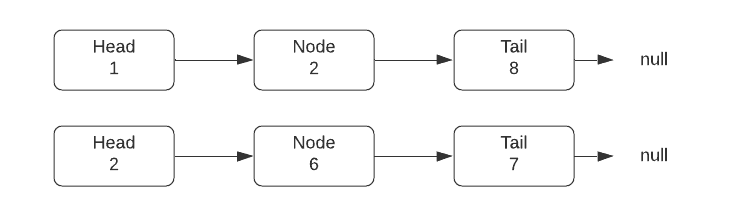
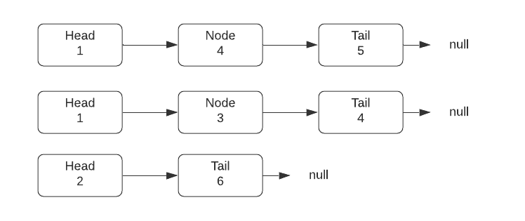
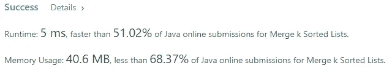

# Java 算法:合并 k 排序列表(LeetCode)

> 原文：<https://medium.com/javarevisited/java-algorithms-merge-k-sorted-lists-leetcode-84c99000bfd7?source=collection_archive---------0----------------------->


由[马库斯·斯皮斯克](https://unsplash.com/@markusspiske?utm_source=medium&utm_medium=referral)在 [Unsplash](https://unsplash.com?utm_source=medium&utm_medium=referral) 上拍摄的照片

# 任务描述:

给你一个`k`链表`lists`的数组，每个链表按升序排序。

将所有的链表合并成一个排序后的链表并返回。

**例 1:**

```
**Input:** lists = [[1,4,5],[1,3,4],[2,6]]
**Output:** [1,1,2,3,4,4,5,6]
**Explanation:** The linked-lists are:
[
  1->4->5,
  1->3->4,
  2->6
]
merging them into one sorted list:
1->1->2->3->4->4->5->6
```

# 解决方案:

在开始解决这个问题之前，让我们回忆一下链表是什么。

[](https://javarevisited.blogspot.com/2017/07/top-10-linked-list-coding-questions-and.html#axzz6fY0boe26)

[链表](/javarevisited/top-20-linked-list-coding-problems-from-technical-interviews-90b64d2df093)是由通过两个(双链表)指针中的一个(单链表)互相连接的节点组成的数据结构。每个节点通常包含一些值和指向下一个节点的指针。第一个节点称为头，最后一个节点称为尾。Tail 作为下一个指针通常为空。

在这个任务中，我们正在处理[排序链表](http://www.java67.com/2016/02/how-to-sort-linkedlist-in-java-example.html)。这意味着每个节点中的所有值都被排序。每个列表中的每个节点的值都小于或等于它所指向的节点的值。为了形象化，这里有一个排序链表的例子。

[](http://www.java67.com/2016/02/how-to-sort-linkedlist-in-java-example.html)

理解了什么是排序链表，我们就可以解决这个问题的更简单的版本。你如何合并两个排序的链表？

[](https://javarevisited.blogspot.com/2017/03/how-to-reverse-linked-list-in-java-using-iteration-and-recursion.html#axzz6e8hmwujv)

答案是——非常简单。比较每个列表的标题。选择具有最小值的节点。将它附加到您的答案中，并将指针调整到您从中挑选出一个节点的列表中的下一个节点。这样做，直到其中一个头不等于 null。一旦你达到这一点，你可以简单地把剩下的附在你的答案上。

[](https://javarevisited.blogspot.com/2013/05/find-if-linked-list-contains-loops-cycle-cyclic-circular-check.html#axzz5jI43Qiwi)

现在我们已经接近解决实际的问题了。从更简单的任务中，我们看到了解决方案的关键——通过调整指针，取值最小的节点并将其附加到答案上。

有了一个 K 个排序列表头的[数组](/javarevisited/20-array-coding-problems-and-questions-from-programming-interviews-869b475b9121)，我们可以遍历它，每次都选择一个具有最小值的节点。这将解决问题，但时间复杂性是可怕的。

更好的方法是取每个列表的头，并将其添加到优先级队列中。优先级队列是另一个[数据结构](/javarevisited/top-10-free-data-structure-and-algorithms-courses-for-beginners-best-of-lot-ad807cc55f7a?source=grid_home---------0-2-----------------18---ce729948_f262_4982_a7a1_a5058c8fe9fa--)，它提供在 O(1)常数时间内获得最小或最大值。并且在 O(log n)时间内添加或删除该值，这对于我们的任务来说已经足够好了。根据存储元素的方式，优先级队列通常被称为二进制堆。我可以在以后的文章中描述它。

在第 8 行中，我们创建了一个“虚拟”节点，作为我们的临时头。它将帮助我们通过调用 dummy.next 很容易地返回排序链表的真正头部

在第 13–15 行，我们创建了一个[优先级队列](https://javarevisited.blogspot.com/2013/10/what-is-priorityqueue-data-structure-java-example-tutorial.html#axzz6f4s58Ml9)。我们需要对其中的元素进行排序。为此，我们提供了比较器。

在第 17–23 行，我们将所有非空的头添加到优先级队列中。

在第 25–42 行，我们有包含主逻辑的主 while 循环。我们通过从我们的[优先级队列](http://www.java67.com/2015/07/how-to-use-priorityqueue-in-java-example.html)的顶部移除具有最小值的节点来更新当前节点。然后我们通过从当前节点获取下一个节点来更新下一个指针。我们还需要更新 prev 指针。你可以把 prev 指针看作是指向我们正在构建的链表的临时尾部的指针。最后但同样重要的是，如果下一个链接不为空，我们必须将其推回优先级队列。

[](https://www.java67.com/2020/07/how-to-get-first-and-last-element-of-linkedlist-in-java.html)

在给定的示例 1 中执行了前面的步骤后，我们将得到如下所示的状态。我故意没有把它弄平。向你展示从初始状态到结束状态的转变

[](https://www.java67.com/2018/06/data-structure-and-algorithm-interview-questions-programmers.html)

上面列出的算法给出了下面的结果。



我们的解决方案的时间复杂度是 O(N log K ),其中 N -是所有列表中的节点总数，K -是我们拥有的排序链表的数量。

我们的解决方案的空间复杂度是 O(N ),其中 N -是创建答案的节点总数加上 O(K ),其中 K -是我们拥有的排序链表的数量。根据大 O 符号，我们可以省略 O(K ),因为就元素数量而言，它可能等于或小于 O(N)。

我希望这篇文章能帮助你理解隐藏在这个困难任务背后的逻辑。感谢阅读！期待您的反馈。回头见，✌

其他**你可能喜欢的数据结构和算法问题**

[](/javarevisited/50-data-structure-and-algorithms-interview-questions-for-programmers-b4b1ac61f5b0) [## 50 大数据结构和算法程序员面试问题

### 准备编程工作面试？这里有 50 多个数据结构和算法问题，你可以练习…

medium.com](/javarevisited/50-data-structure-and-algorithms-interview-questions-for-programmers-b4b1ac61f5b0) [](/javarevisited/25-software-design-interview-questions-to-crack-any-programming-and-technical-interviews-4b8237942db0) [## 破解任何编程和技术面试的 25 个软件设计面试问题

### 常见系统设计问题和有用资源的链接

medium.com](/javarevisited/25-software-design-interview-questions-to-crack-any-programming-and-technical-interviews-4b8237942db0) [](/javarevisited/top-21-string-programming-interview-questions-for-beginners-and-experienced-developers-56037048de45) [## 面向初学者和有经验的开发人员的 21 个字符串编程面试问题

### 除了数组、二叉树和链表数据结构，字符串是编程工作中的另一个热门话题…

medium.com](/javarevisited/top-21-string-programming-interview-questions-for-beginners-and-experienced-developers-56037048de45) 

如果你不是 Medium 会员，我强烈推荐你加入 Medium，阅读来自真实领域的伟大作家的伟大故事。你可以**在这里加入介质**[](/@somasharma_81597/membership)