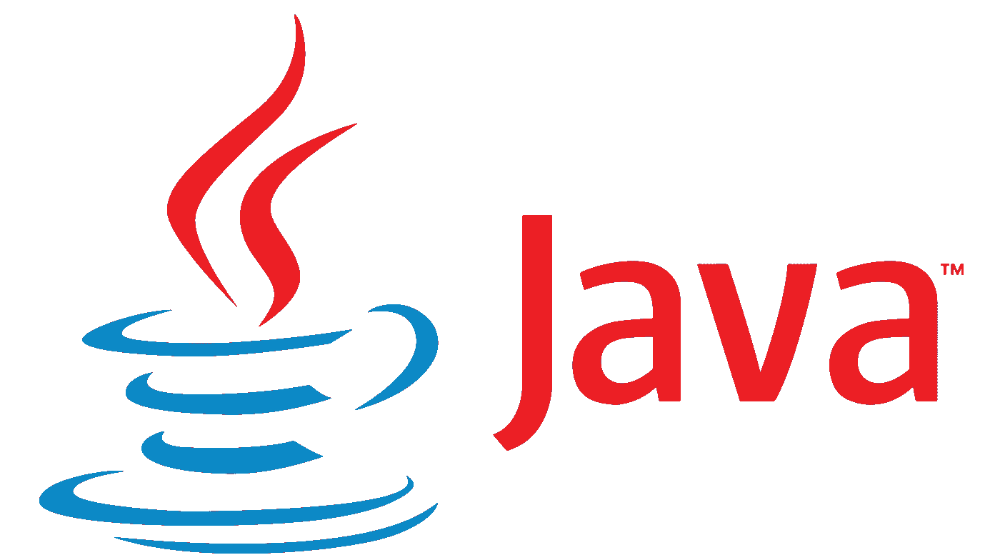

# Java 注释 101

> 原文：<https://medium.com/javarevisited/java-annotations-101-cd4d01e1470a?source=collection_archive---------1----------------------->

了解主要的 Java 注释以及如何使用它们



🍎如果你曾经看过 Java 代码库，你很有可能在方法或类之前看到类似于`@Override`或类似的标签。这些标签被称为**注释**。批注是元数据标记，有助于为类、接口、方法或字段定义附加信息。注释不会给功能代码增加额外的实现，但是有助于提供额外的信息，如:

*   **编译器信息** —编译器可以使用注释来捕捉错误或抑制警告。
*   **给开发人员的信息** —当有人查看代码时，注释有助于使代码可读性更强，更容易理解。
*   **编译和部署时间处理** —软件工具可以处理注释以生成代码、XML 文件等。
*   **运行时处理** —可以在运行时检查注释以运行测试。

☕️ Java 有一个完整的预定义注释列表，甚至允许你定义自己的注释。这里列出了最广泛使用和最重要的注释。

# **预定义注释**

## [@覆盖](https://javarevisited.blogspot.com/2012/11/why-use-override-annotation-in-java.html#axzz5WKm9BB8F)

🏎`@Override`注释通知编译器子类元素正在覆盖父类或超类元素。虽然在[覆盖方法](https://www.java67.com/2019/04/difference-between-overloading-overriding-hiding-shadowing-and-obscuring-in-java-oop.html)时不要求使用这个注释，但它有助于防止错误。如果用 override 标记的方法无法正确地重写超类方法，编译器将生成一个错误。

```
class Avatar { public void destroyEvil() { ... }          // overridden method
} class Aang extends Avatar {    @Override                                   // overriding method
    public void destroyEvil() { ... }
}
```

## @ SuppressWarnings

如果你阅读⚠️编译器警告，会有所帮助，但是它们经常在终端中制造噪音。`[@SuppressWarnings](https://javarevisited.blogspot.com/2015/09/what-is-suppresswarnings-annotation-in-java-unchecked-raw-serial.html)`会压制那些警告。Java 编译器可以抛出大量警告，但是使用`@SuppressWarnings,`可以隐藏所有警告或者选择想要隐藏的警告。

`@SuppressWarnings({“unchecked”, “deprecated”})`将抑制*未选中的*和*已弃用的*警告。

```
@SuppressWarnings("unchecked")
void uncheckedWarning() { List words = new ArrayList();
    words.add("hello");                //throws an unchecked warning
}
```

## @已弃用

☠️这个`@deprecated`注释也很常见。这意味着带注释的方法已被弃用，不再受到开发人员的支持。[编译器](https://www.java67.com/2013/03/helloworld-in-java-how-to-write-compile-example-tutorial.html)不会将已弃用的方法与常规方法区别对待。因此，即使该方法是可调用的，它也可能不会返回理想的响应。它是开发人员的文档。

```
@depricated
public String prepareForY2K() { ... }
```

## @作者

📝`@author`标记是一个简单的注释，记录了方法或文件的作者。它通常会与一些更多的信息配对，比如版本、发行号等。

⭕️ Oracle 建议您按照以下顺序编写标签:

*   `@author`——记载该法典的作者
*   `@version`-确保一次只更新一个(避免锁定)
*   `@param`-记录参数的名称和描述
*   `@return` —记录返回值；如果无效则省略
*   `@throws`-记录检查的异常(在抛出条款中声明)
*   `@see`-指向参考的链接或文本
*   `@since`-记录添加功能时的产品版本
*   `@deprecated`-如果不再支持该代码，则记录

# 测试注释

🧑🏽‍🏫️写测试是开发周期的一个重要方面，和写基础代码本身一样重要(如果不是更重要的话)。有各种为测试显式构建的注释。

## [@测试](https://javarevisited.blogspot.com/2012/06/junit4-annotations-test-examples-and.html)

🖋 `@Test`告诉 JUnit，带注释的方法应该作为测试来执行。为了运行该方法， [JUnit](/javarevisited/5-courses-to-learn-junit-and-mockito-in-2019-best-of-lot-f217d8b93688) 构建类的新实例，然后调用测试方法。

您可以证明注释的两个可选参数:

🕒`**@Timeout**` 如果执行时间比时钟上指定的时间长(以毫秒为单位)，则会导致测试方法失败。

例如，以下操作失败(0.1 秒后):

```
@Test(timeout=100)
public void toInfinityAndBeyond() { while(true);
}
```

📣`**@Expected**` 声明[测试方法必须抛出特定异常](https://javarevisited.blogspot.com/2013/04/JUnit-tutorial-example-test-exception-thrown-by-java-method.html)，否则测试失败。

例如，以下内容会失败:

```
@Test(expected=NullPointerException.class)
public void outOfBounds(){ new ArrayList<Object>().get(1);
}
```

## @忽略

🤷🏽‍♀️`@Ignore`测试注释[忽略一个测试或一组测试](http://javarevisited.blogspot.sg/2015/02/how-to-disable-junit-test-ignore.html#axzz569M76Trp)以避免潜在的执行失败。

您可以在两种可能的场景中进行`@Ignore`测试:

1.  用`@Test`忽略测试方法
2.  忽略类级别的所有测试。

```
@Ignore
@Test(expected=NullPointerException.class)   //obviously wrong test
public void outOfBounds(){ 

    new ArrayList<Object>().get(1); 
}
```

## @以前

⏪用`@Before`标注的方法在每次测试前执行。当您想要在运行测试之前执行一些代码时，比如设置测试环境，这是很有用的。`@Before`改名为`@BeforeEach`，也管用。

⏮兄弟注释`@BeforeAll`或`@BeforeClass`用于需要在一系列测试之前执行昂贵操作的情况，比如启动服务器或更改数据库。

## @之后

⏩`@After`是前面标签的反义词。所有标注了`@After`的方法都将在测试后运行。

⏭`@AfterAll`或`@AfterClass`方法在类的所有测试都运行后执行。

> 所有的`@beforeAll`和`@afterall`带注释的方法必须是静态的，所以它们在运行类的测试之前被执行。
> 但是，`@before`和`@after`方法不应该是[静态](https://javarevisited.blogspot.com/2011/11/static-keyword-method-variable-java.html)，否则编译器会抛出错误。

```
public class OutputFileTest{ @BeforeAll
    public static void startServer() { ... } @Before	
    public void createTestLogFile() { ... }

    @After
    public void deleteTestLogFile() { ... }

    @Test 
    public void test1() { ... } @Test 
    public void test2() { ... } @AfterAll
    public static void stopServer() { ... }}
```

上述代码将按以下顺序执行:

🟢0️⃣`startServer()`1️⃣`createTestLogFile()`2️⃣`test1()`3️⃣`deleteTestLogFile()`4️⃣`createTestLogFile()`5️⃣`test2()`6️⃣`deleteTestLogFile()`7️⃣`stopServer()`🔴

🍏这个列表并不全面，但它涵盖了最基本的。使用上面的例子来获得 Java 中的[编码的最佳实践。](https://javarevisited.blogspot.com/2018/07/top-5-websites-to-learn-coding-in-java.html)