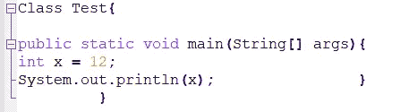
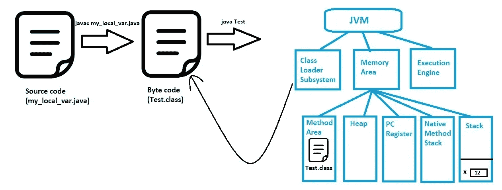

# Java 基础知识| Java 中的变量第 1 部分

> 原文：<https://medium.com/javarevisited/java-basics-variables-in-java-part-1-66d6612773e9?source=collection_archive---------3----------------------->

作者图片

H ello 的读者们，这篇文章是关于 Java 中的**变量**的。从这篇文章中，我将涵盖所有关于 Java 中的**方法局部变量**的有趣事实。

在 Java 中，主要有 3 种类型的变量。
- **局部变量**-
-**实例变量**-
-**静态变量**

**方法局部变量**和**块变量**合称为**局部变量**。

方法局部变量位于方法内部。让我们通过一个示例来理解这一点。

作者截图

为了从这段代码中获得输出，您必须首先编译并运行这段代码。我们假设这个源代码的文件名是*my _ local _ var . Java*(*)。java* 扩展名暗示这是一个 java 文件)。

假设你的桌面上保存了一个用 java 编写的源代码，那么你可以进入桌面文件夹，在窗口顶部的地址栏中键入 ***cmd*** 并点击 enter。现在都设置为编译你的源代码。在命令提示符下键入以下命令，并再次按 enter 键。

> ***javac my _ local _ var . Java***

万岁！！！编译完成。

编译后，我们可以运行我们的源代码。键入以下命令来运行我们的 java 文件中编写的程序。

> ***java 测试***

我很确定，从这一点开始，我将要告诉你们的事情将会让你们所有人更加感兴趣，因为我将会告诉你们与我们的代码片段相关的幕后事情。

作者图片

看上面的图不要紧张。我会一一解释所有的概念。

如上图所示，当我们运行命令***javac my _ local _ var . Java***时，源代码将被转换为字节码。在这种情况下，它将创建一个名为 ***Test.class*** 的文件，作为包含主方法 ***Test*** 的源代码中的类名。那个*。类别*文件将被输入到下一个命令。这就是为什么我们运行下一个命令作为 ***java 测试。*** 命令 ***java*** 调用 JVM (Java 虚拟机)。因此，作为 JVM 的三个主要部分中的一个主要部分的 ***类加载器子系统*** 将在硬盘中搜索 ***Test.class*** 文件，并将其加载到 ***方法区*** (方法区是指内存区的五个主要部分中的一个。内存区域是 JVM 除类装入器子系统之外的第二个主要部分)。主方法的下一个 ***堆栈帧*** 将在 ***堆栈*** 内创建(堆栈是除方法区之外的另一个主要的内存区)。所以在 Main 方法的堆栈框架内，方法局部变量 x 将被创建&存储。那么下一行是打印行。x (12)的文字将被打印在命令提示符上。现在它已经到达了 main 方法的末尾，所以栈帧将被删除，这也是方法局部变量 x 存在的结束。因此，我们可以得出结论，方法局部变量的生存期将随着该方法局部变量所属方法的堆栈帧的删除而结束。

与方法局部变量相关的另一个重要事实是，如果我们在代码中的任何地方使用声明的方法局部变量，方法局部变量肯定应该被初始化。否则会导致编译错误，因为 JVM 不会给声明的方法局部变量赋默认值。

这是本文的结尾。希望这对你们所有人都很有见地。如果你觉得这篇文章有用，点击拍手图标。

注意安全…保持冷静…

感谢您的阅读！！！