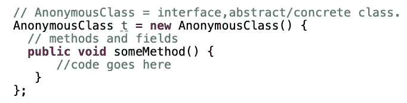
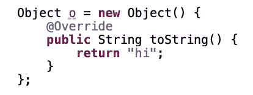
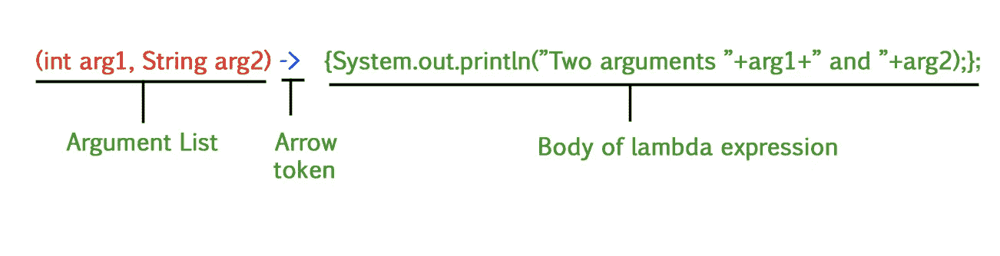
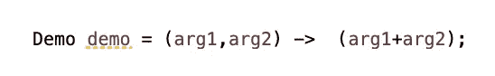
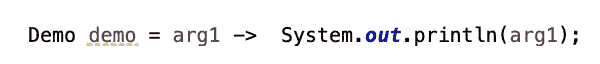
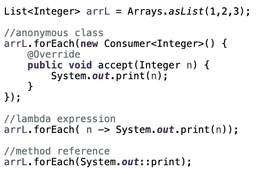

# Java:两分钟学会匿名类和 Lambda 表达式

> 原文：<https://medium.com/javarevisited/java-brief-probe-into-lambda-expressionsjava-brief-probe-into-lambda-expressions-bb681d29561a?source=collection_archive---------2----------------------->

在深入 lambda 之前，我们先来回顾一下什么是匿名类的先验知识。

# 匿名的

匿名类是没有名字的[内部类](https://javarevisited.blogspot.com/2012/12/inner-class-and-nested-static-class-in-java-difference.html#axzz5caMgsIIs)。是 esp。当我们需要临时扩展或实现一个接口时，使用起来很方便。

匿名内部类语法:

举个例子，

# 希腊字母的第 11 个

如果接口只有一个抽象方法([**@ functional interface**](https://javarevisited.blogspot.com/2018/01/what-is-functional-interface-in-java-8.html#ixzz6YkAnyRbL))，我们可以[用一个 lambda 表达式来精简匿名类](https://javarevisited.blogspot.com/2015/01/how-to-use-lambda-expression-in-place-anonymous-class-java8.html#axzz6ngd8ND25) /接口。λ表达式如下所示:

举个例子，

**⚠️omit 写《归来》**

⚠️ **省略了自变量**的括号

✏️ **注意:**[**λ表达式**](/javarevisited/7-best-java-tutorials-and-books-to-learn-lambda-expression-and-stream-api-and-other-features-3083e6038e14?source=---------14------------------) **就像函数一样。参见下面的例子:**

✍️

# 另外，我想通过这里的掌声和你交流。所以如果你喜欢这个故事，请奖励我 1-3👏(PS 按住点击👏不用动手指就能连续鼓掌。);如果你在关注我，也期待我访问你的故事，请给我 5 分👏让我去 know️ ❤ ️