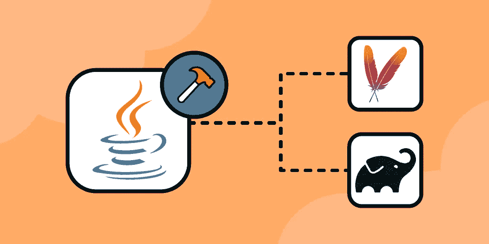

# Java 构建工具:Maven vs Gradle

> 原文：<https://medium.com/javarevisited/java-build-tools-maven-vs-gradle-78851c5fb93a?source=collection_archive---------0----------------------->

构建自动化工具是用于构建自动化的应用程序。构建自动化是软件开发一个重要方面。它指的是将源代码转化为可执行程序的自动化过程。您对构建工具的选择取决于您正在使用的语言和框架。

今天，我们将关注 Java 构建工具。Java 是软件开发中最常用的语言之一。有许多可用的 Java 构建工具。我们将比较两种最流行的 Java 开发构建工具:Maven 和 Gradle。

**我们将讲述**:

*   什么是构建自动化？
*   构建工具是做什么的？
*   Maven 是什么？
*   格拉德是什么？
*   Maven vs Gradle:相似之处
*   Maven vs Gradle:差异
*   Maven vs Gradle:哪个 Java 构建工具适合你？
*   结论

# 什么是构建自动化？

构建自动化是将创建、执行和测试程序所需的任务自动化的过程。在您为一个程序创建了源代码之后，构建自动化开始处理和准备源代码，以便部署到生产环境中。

构建自动化是 DevOps 中任何持续集成过程的最佳实践和先决条件。大多数现代开发团队都有既定的构建自动化过程。这些任务自动化有助于开发人员和开发团队节省宝贵的时间和资源，他们曾经手动执行这些任务。

构建自动化任务在历史上是使用 makefiles 完成的。今天，他们使用构建自动化工具或构建自动化服务器来完成。术语构建自动化可以与构建系统互换使用。

# 构建工具是做什么的？

构建工具简化了各种各样的构建自动化任务，包括:

*   **编译**:将源代码编译成机器码
*   **依赖管理**:识别和修补必要的第三方集成
*   自动化测试:执行测试并报告失败
*   **为部署打包应用**:为部署到服务器准备源代码

# Maven 是什么？

Maven，或 Apache Maven，发布于 2004 年，是对 Apache Ant 的改进。它是一个基于 XML 的构建工具和项目管理器。Maven 是一个 Apache 开源项目。它的默认存储库是 Maven 中央存储库。中央存储库由从个人开发人员到大型组织的贡献者提供的开源组件组成。有大量的 Maven 插件可以定制和扩展构建工具的功能。

Maven 项目主要由用 XML 编写的项目对象模型(POM)文件定义。这些 POM.xml 文件包含项目的依赖项、插件、属性和配置数据。Maven 使用声明式方法，并有预定义的生命周期。

# 格拉德是什么？

Gradle 于 2008 年首次发布。基于 Maven 的概念，它被作为 Maven 的继任者推出。它没有使用 Maven 基于 XML 的项目配置，而是引入了一种基于 Groovy 和 Kotlin 编程语言的领域特定语言(DSL)。Gradle 支持 Maven 和 Ivy 存储库来声明项目配置。它的设计考虑了多项目构建。

# Maven vs Gradle:相似之处

Maven 和 Gradle 都是在 Apache License 2.0 下发布的免费开源软件。它们都是高度可定制的，并且受到各种 Java IDEs 的支持，包括 Eclipse。

Maven 和 Gradle 之间的更多相似之处包括:

*   用于识别工件的 GAV 格式
*   插件增加了功能，包括向项目添加任务和依赖配置
*   相同的目录结构(Gradle 采用了 Maven 的)
*   两者都解决了来自可配置存储库的依赖性

# Maven vs Gradle:差异

Maven 和 Gradle 之间的一些关键区别是:

*   **构建脚本语言** : Gradle 的构建脚本天生就比 Maven 的更加通用和强大。这是因为 Gradle 基于一种编程语言(Groovy)，而 Maven 基于一种标记语言(XML)。这里需要注意的是，Gradle 的构建脚本容易出现错误，因为它是基于编程语言的。
*   **性能** : Gradle 实施了**构建缓存和增量编译**等策略来实现快速性能。Gradle 声称，对于增量更改，它的运行速度比 Maven 快 7 倍，当任务输出被缓存时，它的运行速度比 Maven 快 3 倍。不过，请对此持保留态度。有些开发人员认为 Maven 是两者中速度更快的。
*   定制的灵活性和简易性:Gradle 的基于 Groovy 的构建脚本比 Maven 的 XML 提供了更直接的灵活性。例如，您可以将插件定制直接写入 Gradle 的构建脚本。当您想要定制构建工件和项目结构时，Gradle 也更加强大。虽然 Maven 也是高度可定制的，但是它基于 XML 的配置需要一些额外的步骤来定制您的构建。
*   **插件** : Maven 比 Gradle 存在的时间更长。由于这个原因，有更多的 Maven 插件可用，并且更多的主要供应商支持 Maven 插件而不是 Gradle 插件。
*   **依赖管理**:这两个构建工具使用不同的方法来解决依赖冲突。Maven 遵循声明顺序，而 Gradle 引用依赖树。

# Maven vs Gradle:哪个 Java 构建工具适合你？

选择 Java 构建工具很大程度上取决于您的个人偏好和项目需求。

如果你在 Gradle 和 Maven 之间做决定，这里有一些事情需要考虑:

*   典型的项目规模:如果你从事大型项目，Gradle 可能比 Maven 表现得更好更快。如果您主要处理较小的项目，Maven 的性能差异可以忽略不计，或者与您的决策无关。
*   **定制需求**:如果你的项目需要很多额外的东西，Gradle 基于 Groovy 的构建脚本很容易允许定制。如果您不介意在基于 XML 的脚本中添加功能的额外步骤，Maven 可能足以满足您的需求。
*   **学习曲线**:众所周知，Gradle 的学习曲线非常陡峭，即使对于经验丰富的构建工程师来说也是如此。如果你知道 Gradle 将是适合你的，那么这个学习曲线是一个值得的时间和精力投资。然而，如果 Maven 能够充分满足您的需求，学习 Gradle 可能是一场不必要的艰苦战斗。
*   **社区支持**:在 Gradle 出场之前，Maven 的社区就已经建立了。如果社区支持和文档对您很重要，Maven 可能会更好地满足您的需求。

# 结论

选择构建工具将取决于您的个人需求。无论你是在 DevOps 还是软件开发领域，像 Maven 和 Gradle 这样的 Java 构建工具都是无价的实用工具。由于两者都是免费的，考虑尝试两者来做出明智的决定！

你可能喜欢的其他 **Maven 和 Gradle 文章**

</javarevisited/6-best-maven-courses-for-beginners-in-2020-23ea3cba89>  </javarevisited/5-best-gradle-courses-and-books-to-learn-in-2021-93f49ce8ff8e>  </javarevisited/top-10-free-courses-to-learn-maven-jenkins-and-docker-for-java-developers-51fa7a1e66f6> 