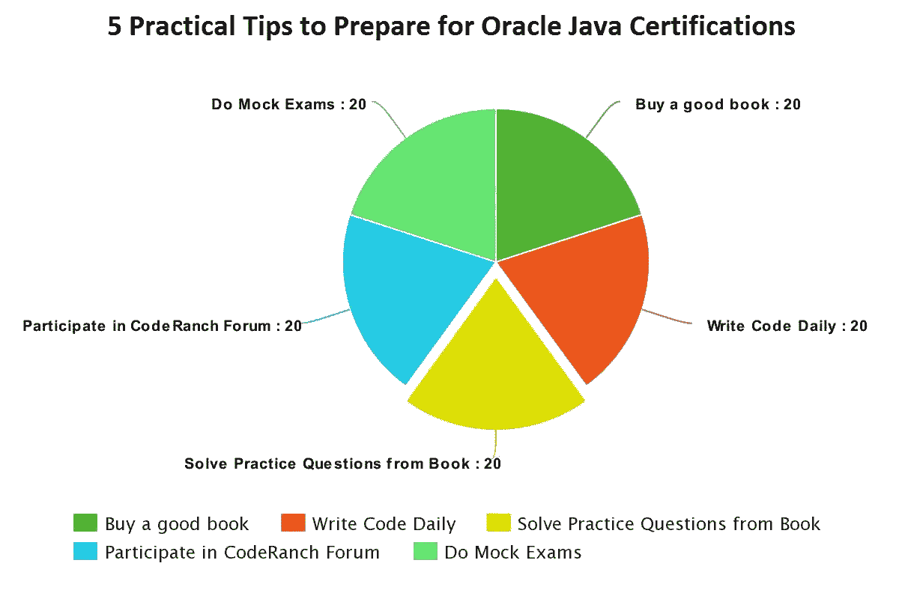
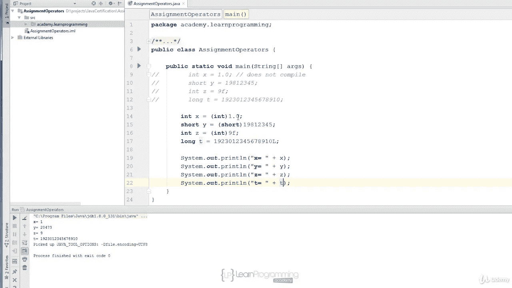
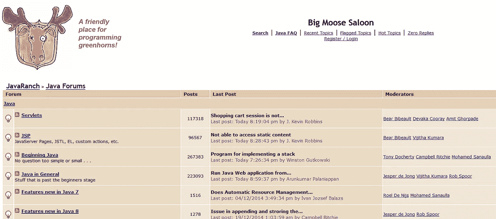

# 甲骨文的 Java 认证——2023 年如何破解？准备 OCAJP 和 OCPJP 考试的实用技巧

> 原文：<https://medium.com/javarevisited/java-certifications-how-to-crack-it-practical-tips-to-prepare-ocajp-and-ocpjp-exams-538f6fe36b37?source=collection_archive---------1----------------------->

Java 认证在 IT 行业受到高度重视，为 Java 开发人员提供了全球认可。它有助于找到一份更好的工作，获得更高的薪水，甚至在现有工作上获得更高的加薪或奖金。这就是为什么每年都有成千上万的 Java 开发人员试图成为 [**认证 Java 开发人员**](https://javarevisited.blogspot.com/2018/07/why-become-certified-java-programmer.html) ，但是考试成功并不容易。

甲骨文的 Java 认证有一个艰难的通过率，OCAJP(甲骨文认证助理 Java 程序员)和 OCPJP(甲骨文认证专业 Java 程序员)都接近 65%。你需要对 Java 编程语言和 API 有深入的了解才能通过考试。

此外，OCPJP 的准备工作与 OCAJP 没有太大的不同，尽管你不得不使用只集中在 OCPJP 的资源。你还需要涵盖更多的主题和深度，因为 OCPJP 8 肯定是一个棘手的问题。

为了做好准备并获得高分，你必须遵守纪律并遵循我将要分享的提示。过去，这些提示帮助我在 Sun 认证中获得了 90%以上的分数。

所以不浪费更多的时间，这里是我的 5 个建议，为 OCAJP 和 OCPJP 考试做好准备

## 1.每天编码

编码是不可替代的，你必须每天编码来培养编码意识，这将有助于你阅读真实考试中给出的代码。

就 OCPJP 而言，这变得更加重要。每日编码将提高你的代码阅读能力，这是在规定时间内完成所有问题所必需的。

您还将学会快速发现错误和理解逻辑，这在专业编程领域是一笔非常好的资产。

日常编码也会提高你的编码感，帮你写出[干净的代码](http://www.amazon.com/Clean-Code-Handbook-Software-Craftsmanship/dp/0132350882?tag=javamysqlanta-20)，这是每个雇主都想要的。

## 2.参加一个好的在线课程

没有比参加一个好的在线课程更好的准备方式了。它们不仅提供主动学习，而且给你一个与教师和其他准备认证的人互动的机会。

这里有一些很好的课程，你可以参加，为 OCAJP 8 和 OCPJP 8 认证做准备。

1.  [Whizlab 的 OCAJP 8 培训课程](http://shareasale.com/r.cfm?b=1130601&u=880419&m=43514&urllink=&afftrack=)
2.  [Whizlab 的 OCPJP 8 培训课程](http://shareasale.com/r.cfm?b=1130600&u=880419&m=43514&urllink=&afftrack=)
3.  [Oracle Java 认证—通过助理 1z 0–808 考试！](https://click.linksynergy.com/fs-bin/click?id=JVFxdTr9V80&subid=0&offerid=323058.1&type=10&tmpid=14538&RD_PARM1=https%3A%2F%2Fwww.udemy.com%2Foracle-java-associate-certification-exam-course-1z0-808%2F)

这三门课程应该足够准备好了，但是如果你需要更多的选择，你还可以查看[最佳 Java 认证课程](https://javarevisited.blogspot.com/2018/01/top-5-java-8-certifications-courses-training-online-OCAJP.html#axzz5Jq0WoIAF)的清单。

## 3.阅读一本好的学习书籍

没有比一本好的学习书籍更好的伴侣了，如果你正在准备 OCAJP 7 或 OCAJP 8，你可以看看这些资源，找到一个好的学习指南。

1.  [OCA Java SE 8 程序员 I 认证指南 Mala Gupta](http://aax-us-east.amazon-adsystem.com/x/c/Qj8Abd-ia13ynKIVoi2e_jcAAAFkTKAXRQEAAAFKARdHqPI/https://assoc-redirect.amazon.com/g/r/https://www.amazon.com/OCA-Java-Programmer-Certification-Guide/dp/1617293253/ref=as_at?creativeASIN=1617293253&linkCode=w61&imprToken=POUZyp0PJGlvCedfkqBdvA&slotNum=0&tag=javamysqlanta-20)
2.  [OCA:甲骨文认证助理 Java SE 8 程序员 I 学习指南](http://aax-us-east.amazon-adsystem.com/x/c/Qj8Abd-ia13ynKIVoi2e_jcAAAFkTKAXRQEAAAFKARdHqPI/https://assoc-redirect.amazon.com/g/r/https://www.amazon.com/dp/1118957407/ref=as_at?creativeASIN=1118957407&linkCode=w61&imprToken=POUZyp0PJGlvCedfkqBdvA&slotNum=1&tag=javamysqlanta-20)
3.  [Ganesh、Hari 和 Tushar 举办的 Oracle 认证专业 Java SE 8 程序员考试 1z 0–809](http://aax-us-east.amazon-adsystem.com/x/c/Qj8Abd-ia13ynKIVoi2e_jcAAAFkTKAXRQEAAAFKARdHqPI/https://assoc-redirect.amazon.com/g/r/https://www.amazon.com/Oracle-Certified-Professional-Programmer-1Z0-809/dp/1484218353/ref=as_at?creativeASIN=1484218353&linkCode=w61&imprToken=POUZyp0PJGlvCedfkqBdvA&slotNum=3&tag=javamysqlanta-20)

这三本书和学习指南足以在 OCAJP 和 OCPJP 获得高分，但是如果您需要更多选择，请查看以下 Java 认证书籍列表:

1.  [OCAJP 8 级(1z 0–808)考试优秀学习指南列表](http://javarevisited.blogspot.com/2016/10/best-books-for-ocajp8-exam-1z0-808-java8.html)
2.  [ocpjp 8 认证的前两本书—Java 8 1z 0–809，810，813 考试](http://javarevisited.blogspot.sg/2016/10/top-2-books-for-ocpjp8-certification-1Z0-809-810-813.html)

## 4.买一个好的考试模拟器

参加了一门好课程，读了一本好书，接下来你需要的是一个好的考试模拟器，如果你想得高分，这是必须的，但如果你的目标只是通过考试，这不是必需的。

以下是我对考试模拟器的一些建议

1.  [Whizlab 的 OCAJP 8 全面测试](http://shrsl.com/?g0ce)
2.  [大卫·梅尔的 Java 8 转储](https://www.certification-questions.com/practice-exam/java/1z0-809?affiliateCode=fcff36fd-557a-4713-abf6-973e9924770f&utm_source=Javin&utm_medium=affiliate&utm_campaign=affiliate)
3.  [Whizlab 的 OCPJP8 全面测试](http://shrsl.com/?g0cb)
4.  [OCAJP 8: Java SE 8 程序员 I(1z 0–808)模拟测试](https://click.linksynergy.com/fs-bin/click?id=JVFxdTr9V80&subid=0&offerid=323058.1&type=10&tmpid=14538&RD_PARM1=https%3A%2F%2Fwww.udemy.com%2Fjava-se-8-programmer-i-1z0-808-certification%2F)
5.  [Java 认证:OCA(1z 0–808)模拟测试](https://click.linksynergy.com/fs-bin/click?id=JVFxdTr9V80&subid=0&offerid=323058.1&type=10&tmpid=14538&RD_PARM1=https%3A%2F%2Fwww.udemy.com%2Fjava-oca%2F)
6.  [Java 认证:OCP(1z 0–809)模拟考试](https://click.linksynergy.com/fs-bin/click?id=JVFxdTr9V80&subid=0&offerid=323058.1&type=10&tmpid=14538&RD_PARM1=https%3A%2F%2Fwww.udemy.com%2Fjava-ocp%2F)

如果你同时购买 OCAJP 和 OCPJP 8 模拟器，你甚至可以得到很好的折扣。只需使用优惠券代码“JAVACOMBO2”即可获得 25%的折扣。

如果你需要更多的选择，你也可以参考这个 Java 考试模拟器列表，包括免费和付费的:

1.  [OCAJP 和 OCPJP 十大 Java 认证考试模拟器](http://www.java67.com/2017/03/top-10-ocajp-and-ocpjp-exam-simulators.html)
2.  [前 5 名 Java 8 模拟测试和考试模拟器(OCAJP 和 OCPJP) —最佳选择](http://javarevisited.blogspot.sg/2016/11/top-5-java-8-practice-test-and-exam-simulators-best-OCAJP-OCAPJP.html)

## 5.定期参加论坛

准备认证需要很长时间，你必须保持自己的积极性，了解考试和其他细节，没有什么比参加论坛更好的了，比如[code branch](http://coderanch.com)或 [Stack Overflow](https://medium.com/u/d53dd768d047?source=post_page-----538f6fe36b37--------------------------------)

## 6.解决尽可能多的练习题

熟能生巧，能解决多少就解决多少，你会慢慢养成考试所需的速度和准确度。这里有一些 OCPJP 考试的自由练习测试

*   [5 次免费 OCAJP8、OCPJP8 模拟考试和练习题—1z 0–808 809(Java 8 认证)](http://javarevisited.blogspot.sg/2015/11/5-free-ocajp8-ocpjp8-mock-exams-and-practice-questions.html)
*   [OCAJP 1z 0–808—Java 8 OCA 认证最佳书籍和模拟考试](http://javarevisited.blogspot.sg/2017/04/ocajp-1z0-808-best-books-and-mock-exams-Java8-certification.html)
*   [5 免费 OCAJP 7 和 OCPJP7 模拟考试—在线模拟考试(1z 0–803 和 1z 0–804](http://javarevisited.blogspot.sg/2016/08/5-free-ocajp-7-and-ocpjp7-mock-exams.html)

> 祝 Java 认证一切顺利。把它作为 2023 年的目标，到 2023 年底你一定会成为 Java 认证开发者。

## 你可能喜欢的其他媒体文章

</javarevisited/what-java-programmers-should-learn-in-2020-648050533c83>  </javarevisited/10-advanced-spring-boot-courses-for-experienced-java-developers-5e57606816bd>  </javarevisited/top-5-java-online-courses-for-beginners-best-of-lot-1e1e240a758> 