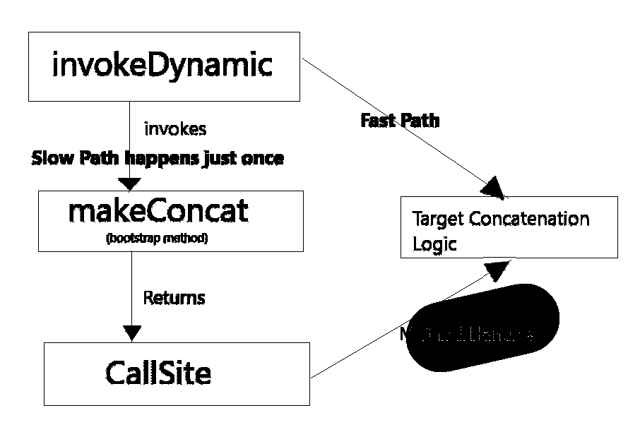

# 针对字符串连接的 Java 编译器优化

> 原文：<https://medium.com/javarevisited/java-compiler-optimization-for-string-concatenation-7f5237e5e6ed?source=collection_archive---------2----------------------->

在早期的 Sun Java 版本中(确切地说，直到 JDK1.4)，字符串连接是一件代价很高的事情。尽管后来 JDK 使用 StringBuilder 带来了字符串连接的编译器优化，但字符串类(不仅仅是连接)仍然是 Java 开发人员在访谈或其他场合讨论最多的话题。

在 JDK 1.5 中引入了`StringBuilder` 类，同时，编译器针对字符串连接进行了优化，在后台使用 StringBuilder 代替 StringBuffer(可以使用 ***javap -c*** 来检查字节码)。所以使用+运算符连接字符串:

```
String a = b + c + d;
```

被转换成

```
String a = new StringBuilder(b).append(c).append(d).toString();
```

## 如果+运算符被自动转换成字符串生成器，为什么它还存在？

让我们举一个例子，考虑下面的类:

```
public class StringConcatenation 
{
    public static void main(String[] args) 
    {
        String result = "";
        for (int i = 0; i < 1e6; i++) 
        {
           ** result += "some data";**
        }
        System.out.println(result);
    }
}
```

直到 [JDK 8](https://javarevisited.blogspot.com/2018/08/top-5-java-8-courses-to-learn-online.html) 这实际上被编译器转换成如下:

```
public class StringConcatenation 
{
    public static void main(String[] args) 
    {String result **=** ""**;**
      for (int i = 0; i < 1e6; i++) 
      {
        **StringBuilder tmp = new StringBuilder();
        tmp.append(result);
        tmp.append("some more data");
        result = tmp.toString();**
      }
      System.out.println(result);
    }
}
```

由于创建了 100 万个对象和可能的 GC，所以性能很差。因此，建议避免编译器优化，直接使用字符串生成器类，如下所示:

```
public class StringConcatenation 
{
    public static void main(String[] args) 
    {
      **StringBuilder result = new StringBuilder((int)1e6);**
      for (int i = 0; i < 1e6; i++) 
      {
        **result.append("some more data");**
      }
      System.out.println(result.toString());
    }
}
```

# **Java 9 带来另一项优化**

**从 Java 9(**Java Enhancement Proposal 280 或[**JEP 280**](http://openjdk.java.net/jeps/280)**)**，整个 StringBuilder append 序列已经被一个简单的 **invokedynamic (** *在下面的* **下一节中对此有更多介绍)**调用 Java . lang . invoke . stringconcatfactory，它将接受需要串联的值。

> 在 Java 7 之前，JVM 只有四种方法调用类型: *invokevirtual* 调用普通类方法， *invokestatic* 调用静态方法， *invokeinterface* 调用接口方法， *invokespecial* 调用构造函数或私有方法。

## **为什么需要动态实现来代替 StringBuilder？**

这种变化背后的主要动机是在不改变字节码的情况下改变连接策略，从而避免重新编译。

## 什么是 **InvokeDynamic** (也叫 Indy)？

在 voke**Dy**namic[**opcode**](https://en.wikipedia.org/wiki/Opcode)中添加了**作为[JSR 292](https://jcp.org/en/jsr/detail?id=292)(Java 7 的第一个真实版本)的一部分，以支持在没有静态类型信息的情况下高效灵活地执行方法调用。**

JDK 基本上是在编译时定义字节码规范，在运行时选择该规范的实现。让我们举个例子，假设我们想要连接“我是”和“格鲁特”。

*   创建一个函数签名，即 concat *(String，String) - > String*
*   上述函数的自变量是“我是”和“格鲁特”
*   一个[***makeconcantwithconstants***](https://github.com/openjdk/jdk14u/blob/8c9ab998b758a18e65e2a1cebcc608860ae43931/src/java.base/share/classes/java/lang/invoke/StringConcatFactory.java#L593)**bootstrap 方法被调用，带有上述函数签名、自变量和动态性所需的一些其他参数(其中有一个是**策略**，在下一节将详细介绍)，它返回一个 CallSite 对象。**
*   **这个 CallSite 对象封装了一系列的 *MethodHandles* ，它们指向该函数签名的实际目标实现。**
*   **现在，这个生成的函数用于返回串联的字符串“我是格鲁特”**

**[](https://medium.com/javarevisited/top-5-java-online-courses-for-beginners-best-of-lot-1e1e240a758)**

# **Java 9+字符串连接策略**

**`[StringConcatFactory](https://github.com/dmlloyd/openjdk/blob/jdk9/jdk9/jdk/src/java.base/share/classes/java/lang/invoke/StringConcatFactory.java)`提供不同的[策略](https://github.com/openjdk/jdk/blob/687ce3e7bb6d45ef67037dd77acd58aa48bbd724/src/java.base/share/classes/java/lang/invoke/StringConcatFactory.java#L136)来使用 ASM 和基于 MethodHandle 的方法生成在字节码生成器中划分的`CallSite`。**

*   **`[BC_SB](https://github.com/dmlloyd/openjdk/blob/jdk9/jdk9/jdk/src/java.base/share/classes/java/lang/invoke/StringConcatFactory.java#L137)` : [生成相当于 Java 8 中`javac`生成的字节码](https://github.com/dmlloyd/openjdk/blob/jdk9/jdk9/jdk/src/java.base/share/classes/java/lang/invoke/StringConcatFactory.java#L795)。**
*   **`[BC_SB_SIZED](https://github.com/dmlloyd/openjdk/blob/jdk9/jdk9/jdk/src/java.base/share/classes/java/lang/invoke/StringConcatFactory.java#L143)` : [生成与`javac`等价的字节码](https://github.com/dmlloyd/openjdk/blob/jdk9/jdk9/jdk/src/java.base/share/classes/java/lang/invoke/StringConcatFactory.java#L795)，但尝试估计`StringBuilder`的初始大小。**
*   **`[BC_SB_SIZED_EXACT](https://github.com/dmlloyd/openjdk/blob/jdk9/jdk9/jdk/src/java.base/share/classes/java/lang/invoke/StringConcatFactory.java#L149)` : [生成等同于`javac`的字节码](https://github.com/dmlloyd/openjdk/blob/jdk9/jdk9/jdk/src/java.base/share/classes/java/lang/invoke/StringConcatFactory.java#L795)，但计算`StringBuilder`的确切大小。**
*   **`[MH_SB_SIZED](https://github.com/dmlloyd/openjdk/blob/jdk9/jdk9/jdk/src/java.base/share/classes/java/lang/invoke/StringConcatFactory.java#L155)` : [将调用`StringBuilder`的方法句柄](https://github.com/dmlloyd/openjdk/blob/jdk9/jdk9/jdk/src/java.base/share/classes/java/lang/invoke/StringConcatFactory.java#L1232)与估计的初始大小结合起来。**
*   **`[MH_SB_SIZED_EXACT](https://github.com/dmlloyd/openjdk/blob/jdk9/jdk9/jdk/src/java.base/share/classes/java/lang/invoke/StringConcatFactory.java#L161)` : [组合方法句柄](https://github.com/dmlloyd/openjdk/blob/jdk9/jdk9/jdk/src/java.base/share/classes/java/lang/invoke/StringConcatFactory.java#L1232)，最终调用具有精确大小的`StringBuilder`。**
*   **`[MH_INLINE_SIZED_EXACT](https://github.com/dmlloyd/openjdk/blob/jdk9/jdk9/jdk/src/java.base/share/classes/java/lang/invoke/StringConcatFactory.java#L167)` : [结合了 MethodHandles](https://github.com/dmlloyd/openjdk/blob/jdk9/jdk9/jdk/src/java.base/share/classes/java/lang/invoke/StringConcatFactory.java#L1467) ，直接创建一个精确大小 byte[]的字符串，不需要复制。**

**默认且最具[性能的](http://cr.openjdk.java.net/~shade/8085796/notes.txt)是能够带来 3 到 4 倍性能提升的`MH_INLINE_SIZED_EXACT`。您可以通过定义属性`java.lang.invoke.stringConcat`来覆盖命令行上的`Strategy`。**

**值得一看的是`[MH_INLINE_SIZED_EXACT](https://github.com/dmlloyd/openjdk/blob/jdk9/jdk9/jdk/src/java.base/share/classes/java/lang/invoke/StringConcatFactory.java#L167)` : [结合了 MethodHandle](https://github.com/dmlloyd/openjdk/blob/jdk9/jdk9/jdk/src/java.base/share/classes/java/lang/invoke/StringConcatFactory.java#L1467)，看看我们现在如何使用 method handle 来有效地替代代码生成。**

**参考资料:**

*   **[https://howtodoinjava.com/java9/compact-strings/](https://howtodoinjava.com/java9/compact-strings/)**
*   **[http://Cr . open JDK . Java . net/~ ntv/talks/eclipse summit 16/indyunderthehood . pdf](http://cr.openjdk.java.net/~ntv/talks/eclipseSummit16/indyunderTheHood.pdf)**
*   **[https://arnaud Roger . github . io/blog/2017/06/14/compact strings . html](https://arnaudroger.github.io/blog/2017/06/14/CompactStrings.html)**
*   **[https://medium . com/better-programming/top-5-new-features-expected-in-Java-14-82c 0d 85 b 295 e](/better-programming/top-5-new-features-expected-in-java-14-82c0d85b295e)**
*   **[https://www.baeldung.com/java-invoke-dynamic](https://www.baeldung.com/java-invoke-dynamic)**
*   **[https://www . bael dung . com/Java-string-concatenation-invoke-dynamic](https://www.baeldung.com/java-string-concatenation-invoke-dynamic)**

**有问题吗？建议？评论？**

**下一步是什么？ [**在媒体上关注我**](/@vaibhav0109) 成为第一个阅读我的故事的人。**