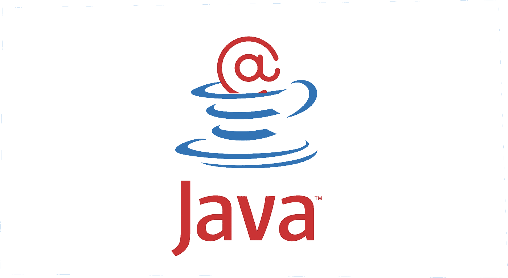

# Java:创建和使用定制注释

> 原文：<https://medium.com/javarevisited/java-creating-and-using-custom-annotations-a792f3d9962f?source=collection_archive---------0----------------------->



我对注释的 Java 徽标的看法

🍎在我的[上一篇文章](https://utkjain.medium.com/java-annotations-101-cd4d01e1470a)中，我解释了什么是注释以及如何在 Java 中使用预构建的注释。Java 还为我们提供了创建自己的注释来增强代码的选项。要生成任何自定义注释，我们也必须使用元注释。本文解释了如何创建元注释和自定义注释，并用它们来装饰对象。请继续阅读！

# 自定义注释

☕️除了 Java 提供的大量预定义注释，我们还可以定义自己的自定义注释。自定义注释帮助:

*   通过向方法添加默认行为，减少编写代码的工作量
*   向类和接口添加自定义行为
*   省去编写 XML 描述符和标记接口的工作

✍🏽要定义任何自定义注释，我们首先需要使用一个`@interface`标签来声明它。然后，我们使用元注释定义目标和范围。我已经在本文的后半部分解释了元注释(Retention、Target、Inherited)的使用。自定义注释可以在三个级别上定义:

*   班级水平
*   现场水平
*   方法级别

## 班级水平

```
@Retention(RetentionPolicy.RUNTIME)
@Target(ElementType.Type)
public @interface CustomAnnotation{ ... }
```

🧑🏽‍🏫上面的`CustomAnnotation`有一个运行时保留策略，我们可以将它应用于所有的类。因为它没有方法，所以它作为一个简单的标记来标记我们需要的类。这里需要注意的一点是，任何类级别的自定义注释都不能有任何参数，也不能抛出任何异常。另外，返回值类型仅限于[原语](https://javarevisited.blogspot.com/2015/09/difference-between-primitive-and-reference-variable-java.html)，[字符串](/javarevisited/top-21-string-programming-interview-questions-for-beginners-and-experienced-developers-56037048de45)，[类](https://www.java67.com/2017/08/difference-between-abstract-class-and-interface-in-java8.html)，[枚举](https://javarevisited.blogspot.com/2011/08/enum-in-java-example-tutorial.html)，注释，它们的[数组](/javarevisited/20-array-coding-problems-and-questions-from-programming-interviews-869b475b9121)，默认值不能为空。

## 现场水平

🏟类似于类级别，我们可以定义字段级别的注释并将范围限制到它们。

```
@Retention(RetentionPolicy.RUNTIME)
@Target(ElementType.FIELD)
public @interface CustomAnnotation{ ... }
```

## **方法级别**

👨🏾‍🔧我们还可以声明一个带有运行时保留的注释，以应用于我们的类的方法，如下所示:

```
@Retention(RetentionPolicy.RUNTIME)
@Target(ElementType.METHOD)
public @interface CustomAnnotation{ ... }
```

## 使用自定义注释

这里有一个🪛的例子来演示自定义注释的使用。

大概是 2 类，汽车和发动机。假设我们有一个要求，即 BasicEngine 需要适用于所有类型的汽车。在这种情况下，我们可以开发像`@BasicEngine`这样的定制注释，并注释所有种类的汽车实现(例如，掀背车、跑车、轿车等)。，)带`BasicEngine`。

> 自定义注释类(接口):

```
import java.lang.annotation.*;
@Inherited
@Documented
@Target(ElementType.TYPE)
@Retention(RetentionPolicy.RUNTIME)

@interface BasicEngine {
    String mileage() default "20";
    String fuelType() default "Gasoline";
}
```

> 使用自定义批注初始化(无需导入):

```
@BasicEngine(bId="30", bName="BioDiesel")
public class Car {
    String make;
    String model; public Car(String make, String model){
        this.make = make;
        this.model = model;
    }

    public void getCarDetails(){
        System.out.println("Car Manufacturer: " + make);
        System.out.println("Car Model: " + model);
    }
}
```

> 测试上述内容的驱动程序类:

```
import java.lang.annotation.Annotation;
public class TestCustomAnnotationBasicEngine {public static void main(String[] args) throws Exception{
        Car car = new Car("32", "Diesel");
        car.getCarDetails();
        Class carClass = car.getClass(); Annotation testAnn = carClass.getAnnotation(BasicEngine.class); BasicEngine engine = (BasicEngine)testAnn; System.out.println("Mileage: " + engine.mileage());
        System.out.println("Fuel Type: " + engine.fuelType());
    }
}
```

# 元注释

🏴元注释是应用于其他注释以增加其范围的注释。这非常重要，因为它允许我们使用其他注释来描述注释，并编写注释。

♨️ Java 直接在语言蓝图中加入了重要的元注释:

## @继承

👨‍👦默认情况下，批注不能从其超类继承。然而，如果我们需要从超类继承一个注释到子类，我们使用`@Inherited`注释。

```
@Inherited
public @interface CustomAnnotation { ... }@CustomAnnotation
public class ParentClass { ... }public class ChildClass extends ParentClass { ... }
```

这里，ChildClass 类将自动获取 CustomAnnotation，因为它是从 ParentClass 继承而来的。ChildClass 将能够调用任何 CustomAnnotations 功能

## @目标

🎯注释的作用域是基于方法或文件的需求，就像构造函数或声明一样。我们可以使用`@Target`注释将注释限制为应用于特定的目标。

```
@Target(ElementType.METHOD)
public @interface CustomAnnotation{ ... }
```

在上面的代码中，`CustomAnnotation`只限于方法，也就是说，字段、包等不会用它来注释。

> 如果没有定义目标类型，注释可以用于任何元素。

## @保留

🤔`@Retention`指定注释可用的级别。
Java 允许我们定义三个级别的保留策略:

*   `**RetentionPolicy.SOURCE**` —在源代码级别可用，被编译器忽略
*   `**RetentionPolicy.CLASS**` —在编译时对编译器可用，但被 JVM 忽略
*   `**RetentionPolicy.RUNTIME**` —适用于 [JVM](/javarevisited/7-best-courses-to-learn-jvm-garbage-collection-and-performance-tuning-for-experienced-java-331705180686?source=---------8------------------)

```
@Retention(RetentionPolicy.RUNTIME)
public @interface CustomAnnotation{ ... }
```

🍏总之，注释是 Java 提供的一个方便的工具，学习它们对于成为一个更好更聪明的开发人员是至关重要的！