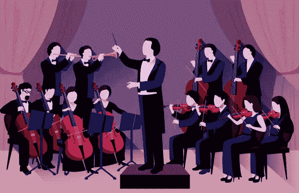

# JAVA 开发人员指南从命令设计模式开始

> 原文：<https://medium.com/javarevisited/java-developer-guide-to-begin-with-command-design-pattern-8b0793b1a006?source=collection_archive---------2----------------------->

你有没有想过，一个音乐指挥家甚至不知道所有这些乐器是如何工作的，如何指挥一群音乐家？或者你怎么能在不知道内部工作原理的情况下驾驶一辆汽车，比如发动机如何工作，它如何需要燃料进入发动机，阀门如何工作，等等。

类似地，在大多数编程场景中，您希望隐藏实现，以便当您查看最顶层的问题时，它只包含指令或代码的可管理部分。[命令模式](https://javarevisited.blogspot.com/2016/05/command-design-pattern-in-java-example-code.html)有助于将命令的执行与命令本身分开，隐藏命令执行的实际实现。

# 什么是命令模式？

命令模式是著名的 [GoF 设计模式](https://en.wikipedia.org/wiki/Design_Patterns)中的行为设计模式之一。在这种设计模式中，一个对象(**命令**)被用来封装触发一个事件或稍后在另一个对象(**接收者**)上执行任何动作所需的所有信息(如方法名和参数)，这个命令对象被提供给另一个对象(**调用者**)来根据**客户端**的需求执行动作。

它将调用操作的 **invoker** 对象与操作的 **receiver** 对象分开，从而消除了它们之间的硬连接。添加新的**命令**很容易，因为现有的类保持不变。

使用 [**命令**模式](https://javarevisited.blogspot.com/2016/05/command-design-pattern-in-java-example-code.html)，可以将特定的**方法**调用转换为独立的**对象**。这种改编允许我们将命令作为方法参数传递，将它们存储在其他对象中，在运行时交换链接的命令，以及许多有趣的用途。

一个**命令**可以被**序列化**，这是指将其转换为可以随时写入文件或数据库的字节的过程，就像任何其他流对象一样。

这些字节稍后可被检索以用作初始的**命令**对象。因此，您可以**安排**和**推迟**命令的执行。不过，还有更多！你可以用同样的方式在网络上排队、记录或发送**命令**。

# 命令模式 JAVA 示例

在这个例子中， **C** [**命令**模式](https://www.java67.com/2018/05/top-20-system-design-interview-questions-answers-programming.html)有助于使用操纵杆控制视频游戏玩家的移动。基于操纵杆接收到的输入，我们可以调用移动玩家的命令。

## 接收器定义

为**玩家**创建了一个界面来列出可用的指令。

## **VideoGamePlayer** 类实现了 **Player** 接口，并为所有动作指令提供了**具体方法**。

## 命令定义

**Action** 接口有一个 **doAction** 方法，该方法将由所有具体命令来实现。

## 具体命令(实现)

这里，在每种类型的**具体命令**中，我们在**构造器**参数中传递**播放器**，并实现 **doAction** 方法来执行特定的动作。

## 调用者定义

创建了 [**控制器**](https://www.java67.com/2021/10/3-ways-to-send-different-content-types.html) 接口，列出了所有**调用者特有的**方法。

## 具体调用者(实现)

向**构造器**参数中的**操纵杆控制器**类提供所有命令，并实现所有方法来执行相应的**命令**。这里这个**具体调用者**不需要检查**接收者**对象的指令，因此消除了所有的硬连线。

## 实际的客户端实现

在客户端类 main 方法中，创建了 **Player** 对象( **receiver** )与 **VideoGamePlayer** 实现。创建了**操纵杆控制器**(具体**调用者**)所需的所有动作(**命令**)。基于从**客户端**标准输入接收到的输入，**调用者**通过**命令**间接向**接收者**发送指令。

源代码可从以下网址获得:[https://github . com/s3c-d43m0n/Desing-Patterns-in-JAVA/tree/main/Behavioral/Command](https://github.com/s3c-d43m0n/Desing-Patterns-in-JAVA/tree/main/Behavioral/Command)

# 实施中的关键点

*   **客户端**需要按照特定的顺序创建所有对象:首先创建**接收者**，然后创建**命令**，最后创建**调用者**。
*   用一次执行**方法**声明**命令**接口。
*   为**接收器**中定义的每个动作创建单独的**命令**。
*   将所有的**命令**提供给**调用者**对象，并与适当的动作链接。

**注:**该模式也被称为**动作**或**事务**模式。

*你最喜欢的设计模式是什么，或者如果你想更好地理解任何其他模式或主题，请随时联系我，在*[*LinkedIn*](https://www.linkedin.com/in/ritvik92/)*或*[*Google Form*](https://forms.gle/XFsuo1ZbP35gfqAX7)*上，我下次会尽力介绍它！*

请把这个分享给你所有的媒体朋友，然后点击那个👏按钮，以扩大它的范围。未来更新请关注 [*me*](/@ritvik.singh.chauhan) *。感谢阅读。*