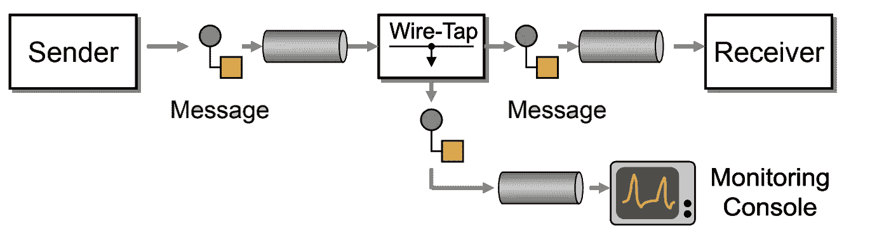

# JAVA 开发人员指南从 Wire-Tap 企业集成模式开始

> 原文：<https://medium.com/javarevisited/java-developer-guide-to-begin-with-wire-tap-enterprise-integration-pattern-27a385231dd8?source=collection_archive---------1----------------------->

监听是监控机构用来监控电话的术语。如果你在大多数黑客或科幻电影/系列中看到过电话窃听或信号拦截活动，你可能会知道这个术语。软件企业也使用类似的概念来监控或拦截两个服务之间的数据流。Wire-Tap 模式有助于解决拦截数据的问题，而不会中断服务之间的流。

# 什么是窃听模式？

Wire-Tap 是《企业集成模式:设计、构建和部署消息传递解决方案》一书[中的设计模式之一，该书描述了简单的路由器(也称为 Tee)将消息从一个输入通道复制到两个输出通道。](/javarevisited/top-5-books-to-learn-spring-boot-and-microservices-for-experienced-java-developers-499a9d921d18)

在软件系统中的大多数情况下，需要监控或复制流经的数据。这通常是通过截取数据并将其重定向到不同的位置来实现的，如监控仪表板、控制台、文件系统或数据库。这种功能不能改变原始数据，也不能中断服务流程。

# 线抽头模式 JAVA 示例

假设我们正在构建一个消息窃听系统，它拦截来自交换机的数据。在这个例子中，我使用 Switch 从一个源队列消费数据，并将其推送到一个目标队列。增加了窃听服务，以拦截消息处理器交换机上的数据。

## 消息定义:

对于**消息**模型，我有 **id** 、**文本**和**消息日期**字段。被覆盖的 **toString** 方法返回 [**JSON**](https://javarevisited.blogspot.com/2018/02/how-to-parse-json-with-date-field-in-java-jackson-example.html) 类似的字符串进行输出。

## 发件人服务:

在发送方服务线程中，生成**消息**对象(使用 **getMessage** 方法)并在 **run** 方法中将其推送到 [**队列**](https://javarevisited.blogspot.com/2017/03/difference-between-stack-and-queue-data-structure-in-java.html) 。这里 **messageId** 字段用于为每个生成的**消息**对象生成唯一的密钥。**随机**字段用于为**消息**对象生成随机**文本**。

## 接收器服务:

在接收方服务线程中，消耗**队列**中的**消息**对象[中的**运行**方法](https://javarevisited.blogspot.com/2012/03/difference-between-start-and-run-method.html)。

## 消息处理器开关:

在消息处理器线程中，从**源**队列中拉出**消息**对象，并将其推送到**目的**队列中，但在中间调用 **wiretapService** 对象的 **wiretap** 方法来拦截消息。

## 窃听服务:

在窃听服务线程中，每当使用**消息**对象调用**窃听**方法时，就会使用 **MessageCloneUtil** 实用程序类创建一个深度克隆的**消息**，并将其推送到其[队列](https://www.java67.com/2022/04/how-to-to-perform-union-of-two-linked.html) 中进行进一步处理。

## 消息克隆实用程序:

由于我们在**消息**对象中有不可变字段 **id** 为 **long** 和 **text** 为 **String** ，所以在深度克隆时，我按原样使用它们。但是创建一个新的 [**日期**对象](https://www.java67.com/2018/01/how-to-change-date-format-of-string-in-java8.html)，其值与原始的**输入**相同。

**行动中的窃听模式:**

在下面的演示代码中，为创建服务创建了两个队列。使用它们两个来创建一个 **MessageProcessorSwitch** 线程，只使用**源**队列来创建一个**发送方服务**线程，只使用**目的方**队列来创建一个**接收方服务**线程。每当 **SenderService** 线程将**消息**推送到**源**队列时，两个线程( **ReceiverService** 和 **WiretapService** )都在获取数据。

源代码可从[https://github . com/s3c-d43m 0n/Desing-Patterns-in-JAVA/tree/main/Integration/Wiretap](https://github.com/s3c-d43m0n/Desing-Patterns-in-JAVA/tree/main/Integration/Wiretap)获得

# 实施中的关键点

*   **消息**对象
*   **在实现模式时，不能中断两个服务之间的现有流。这里 **WiretapService** 被定义为 **MessageProcessorSwitch** 类中的**私有**字段，因为我们不想将其暴露给其他资源。**
*   **这里我使用了[**blocking queue**](https://javarevisited.blogspot.com/2012/12/blocking-queue-in-java-example-ArrayBlockingQueue-LinkedBlockingQueue.html)对象作为 [**线程安全**队列](https://www.java67.com/2021/07/how-to-implement-thread-safe-bounded-buffer-in-java.html)，因为我有多个线程拉/推**消息**对象。我们可以根据需求进行更改。**
*   **这里，我将队列用于消费者/生产者场景。**高端**软件系统在专门处理**微服务**时，大多都在使用 [**JMS**](https://javarevisited.blogspot.com/2020/05/top-16-jms-java-messaging-service-interview-questions-answers.html) 或 [**KAFKA**](/javarevisited/top-10-apache-kafka-online-training-courses-and-certifications-621f3c13b38c) 等排队解决方案。**

***你最喜欢的设计模式是什么，或者如果你想更好地理解任何其他模式或主题，请随时联系我，在*[*LinkedIn*](https://www.linkedin.com/in/ritvik92/)*或*[*Google Form*](https://forms.gle/XFsuo1ZbP35gfqAX7)*上，我会尽量在下次介绍它！***

**请把这个分享给你所有的媒体朋友，然后点击那个👏按钮，以扩大它的范围。未来更新请关注 [*me*](/@ritvik.singh.chauhan) *。感谢阅读。***