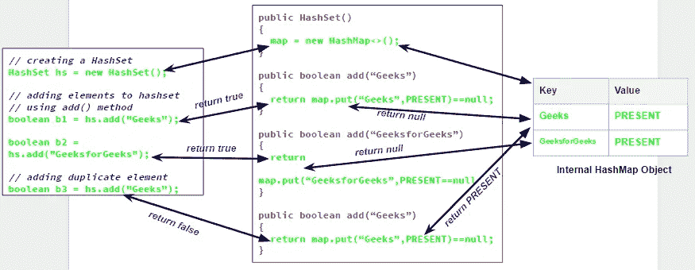
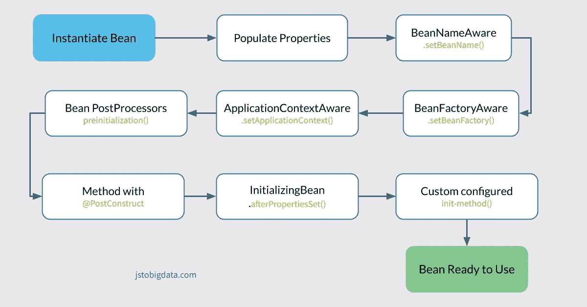
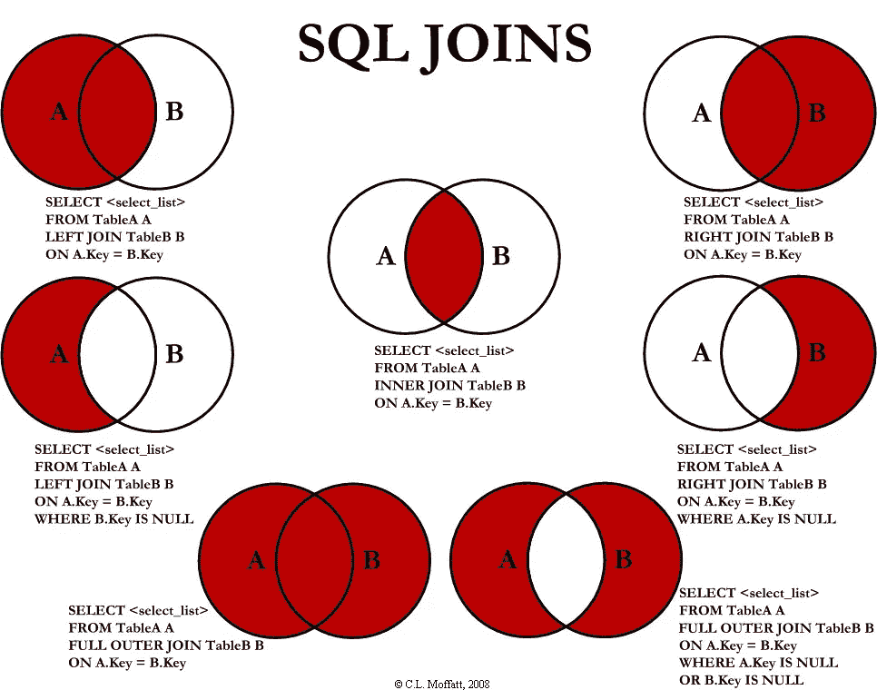

# 17 Java 开发人员面试问题系列-9(0-6 岁的有经验的候选人)

> 原文：<https://medium.com/javarevisited/java-developer-interview-question-series-9-9ddc9700f5ac?source=collection_archive---------1----------------------->

## 本文将涵盖 Java 面试问题，核心 Java、Java-8、函数式编程、Spring 框架、编码面试问题和 SQL 数据库问题。让我们深入研究一下。


> 编码

## **Java 8 流 API:**

给你一份员工名单，上面有员工 Id、姓名、薪水、部门，从人力资源部找出一名员工的最高薪水。

```
 Optional<Employee> maxSalaryEmployee = 
            employeeList.stream()
            .collect(Collectors.maxBy(Comparator.comparing(Employee::getSalary)));
```

## **多态性编码难题？猜测产量？**

```
public class InheritanceTest {
        public static void main(String[] args) {
            *method*(null);
        }
        public static void method(Object o) {
            System.*out*.println("Object method");
        }
        public static void method(String s) {
            System.*out*.println("String method");
        }
}
```

## **继承编码问题，猜欧** tput？

```
class A{
    public void m1() throws ArrayIndexOutOfBoundsException{
        System.*out*.println("In m1 A");
    }
}
class B extends A
{ 
    void   m1() throws IndexOutOfBoundsException
        {
        System.*out*.println("In m1 B");
        }
        void m2() throws IndexOutOfBoundsException
        {
        System.*out*.println("In m2 B");
        }
        }
 public class Test {
   public static void main(String[] args) {
    A a=new B();
    a.m2();
}
}
```

## **写一个程序，从三个整数数组列表中找出一个公共元素。例如 arr1、arr2 和 arr3。**

```
findCommon(int a[], int b[], int c[], int n1, int n2,int n3)
{
    // three sets to maintain frequency of elements
    HashSet<Integer> uset = new HashSet<>();
    HashSet<Integer> uset2 = new HashSet<>();
    HashSet<Integer> uset3 = new HashSet<>();
    for (int i = 0; i < n1; i++) {
        uset.add(a[i]);
    }
    for (int i = 0; i < n2; i++) {
        uset2.add(b[i]);
    }
    // checking if elements of 3rd array are present in
    // first 2 sets
    for (int i = 0; i < n3; i++) {
        if (uset.contains(c[i]) && uset2.contains(c[i])) {
            // using a 3rd set to prevent duplicates
            if (uset3.contains(c[i]) == false)
                System.out.print(c[i]+" ");
            uset3.add(c[i]);
        }
    }
}
```

## **员工列表，根据位置或城市查找员工，并按字母方式排序，如 a-z，每个城市员工的薪金应从最高薪金到最低薪金排序。**

## **Java 8 中的方法引用是什么？**

方法引用用于引用函数接口的方法。它是 lambda 表达式的一种紧凑而简单的形式。每次当你使用一个 [**lambda 表达式**](http://www.javaguides.net/2018/07/java-8-lambda-expressions-in-practice.html) 来引用一个方法时，你可以用一个方法引用替换你的 lambda 表达式。您可以将这些方法与“::”双冒号运算符一起使用。

示例:

```
ContainingClass::staticMethodName
```

## HashSet 内部工作？



作者:GeekForGeek

> 弹簧靴

## **说说 SpringBoot 的切入点。它能做什么？什么是组件扫描？如何排除任何配置？**

许多 Spring Boot 开发者喜欢他们的应用程序使用自动配置、组件扫描，并且能够在他们的“应用程序类”上定义额外的配置。单个`@SpringBootApplication`注释可用于启用这三个特性，即:

*   `@EnableAutoConfiguration`:启用 [Spring Boot 的自动配置机制](https://docs.spring.io/spring-boot/docs/2.0.x/reference/html/using-boot-auto-configuration.html)
*   `@ComponentScan`:对应用所在的包启用`@Component`扫描(参见[最佳实践](https://docs.spring.io/spring-boot/docs/2.0.x/reference/html/using-boot-structuring-your-code.html))
*   `@Configuration`:允许在上下文中注册额外的 beans 或导入额外的配置类

`@SpringBootApplication`注释相当于使用`@Configuration`、`@EnableAutoConfiguration`和`@ComponentScan`及其默认属性，

# **春豆的生命周期？**



作者 jstobigdata

## **春天如何注射豆子？你更喜欢哪种类型的依赖注入？**

依赖注入是一种我们可以用来实现 IoC 的模式，其中在设置对象的依赖关系时，控制是反向的。

将对象与其他对象连接起来，或者将对象“注入”到其他对象中，是由汇编器完成的，而不是由对象本身完成的。

在基于[构造函数的依赖注入](https://www.baeldung.com/constructor-injection-in-spring)的情况下，容器将调用一个构造函数，每个参数代表我们想要设置的一个依赖。Spring 主要通过类型来解析每个参数，然后是属性名和消除歧义的索引。让我们使用注释来看看 bean 及其依赖项的配置:对于基于 setter 的 DI，在调用无参数构造函数或无参数静态工厂方法来实例化 bean 之后，容器将调用我们的类的 setter 方法。让我们使用注释来创建这个配置:

## **说说 Java 内存模型吧。java 中的内存泄漏？如何在 java 中纠正这种情况？如何使用一个分析器？内存不足错误？**


内存泄漏是这样一种情况，即堆中存在不再使用的对象，但垃圾收集器无法将它们从内存中移除，因此不必要地维护它们。内存泄漏很糟糕，因为随着时间的推移，它会阻塞内存资源并降低系统性能。

使用 **Java profiling** 您可以监控不同的 JVM 参数，包括对象创建、线程执行、方法执行，是的，还有垃圾收集。此外，使用可以检测内存泄漏的工具。使用堆转储也有帮助。

## **Java 中可选？**

Optional 是 Java 8 中引入的新类型。它用于表示可能存在也可能不存在的值。换句话说，一个可选对象可以包含一个非空值(在这种情况下，它被认为是*存在*)或者根本不包含任何值(在这种情况下，它被认为是*空*)。

可选对象可以具有下列可能状态之一:

*   **出席**:可选对象不代表缺席。可选对象中有一个值，可以通过调用 get()来访问它。
*   **缺项**:可选对象确实表示没有值；不能用 get()访问它的内容。

## **Java 中索引的用法？it 在数据库中的利与弊？**

**索引**表示数组列表中的位置，第一个位置为 0(零)。大多数编程语言都是如此

优势—搜索简单又省事。

缺点-插入和删除不容易。

## **解释数据库连接。**

[](https://javarevisited.blogspot.com/2020/05/self-join-example-sql-query-to-find-employee-more-than-managers-leetcode-solution.html?utm_source=dlvr.it&utm_medium=facebook&m=1)

## **如何用 java 写包装器类？**

## **Java 中的 JIT 是什么？**

[**实时** (JIT)](https://javarevisited.blogspot.com/2011/12/jre-jvm-jdk-jit-in-java-programming.html) 编译器是 **JRE** (Java 运行时环境)的一个组件，它可以提高 Java 应用程序在运行时的性能。它通过在运行时将字节码编译成本机代码来帮助提高 Java 程序的性能。

## **你有没有写过没有静态的 main 方法？**

你可以在没有静态修饰符的情况下在你的程序中编写 main 方法，程序编译时没有编译错误。但是，在执行的时候，JVM 并不认为这个新方法(没有 static)是程序的入口点。

> **寻找更多面试问答？**
> 
> 下面是一些我准备时用过的推荐书籍。


*[***你可以在这里得到你的副本，寻找 Spring Boot 采访:***](https://gumroad.com/a/669883603/hrUXKY)*

*[***【Spring Boot 访谈】***](https://gumroad.com/a/669883603/pfolo) ***【免费样稿】:*** [***点击这里***](https://gumroad.com/a/669883603/pfolo)*

****你可以在这里拿到你的文案:*** [***搜 Java 面试***](https://gumroad.com/a/669883603/HMOAv)*

***搜罗 Java 面试【免费样本复制】:** [**点击这里**](https://gumroad.com/a/669883603/HMOAv)*

*[***250+弹簧框架练习题***](https://gumroad.com/a/141401299/sygyq)*

*[**在推特上关注我**](https://twitter.com/ajtheory)*