# Java EE—Java servlet 和 JSP

> 原文：<https://medium.com/javarevisited/java-ee-java-servlets-and-jsps-6ed1d2fca237?source=collection_archive---------2----------------------->

由于其多功能性，Java 是国际上最受好评的编程语言之一。使用 Java 可以创建控制台应用程序、swing 应用程序(使用 javax.swing 库)、 [JavaFX](/javarevisited/7-best-java-fx-online-courses-for-beginners-9e774ba6f996) 应用程序等。但是当涉及到企业世界时，它们是不够的。

为了理解 Java 在企业领域是如何工作的，你需要理解 [Java EE](/javarevisited/top-7-online-courses-to-learn-java-ee-jakarta-ee-in-2020-216c1a5eea99) ，或者 Java 企业版。

在本文中，当您步入 Java EE 世界时，我们将看到最基本的特性之一，[servlet 和 JSP(Java 服务器页面)](/javarevisited/10-best-servlet-and-jsp-online-courses-for-java-developers-d23cf6902360)。

# Servlets 的需求

[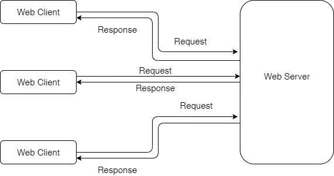](https://javarevisited.blogspot.com/2020/08/top-5-courses-to-learn-servlet-and-jsp.html)

我们先来了解一下客户端-服务器架构。当您通过 web 浏览器访问网站时，web 浏览器就是 web 客户端。这个 web 客户端将向 web 服务器**、**发出**请求**，然后 web 服务器将对**请求**进行操作，并产生**响应**并将其返回给 web 客户端。那个**回应**就是我们去网站时看到的。

因此，web 客户端和 web 服务器之间的通信只不过是一堆**请求**和**响应。**有数百万用户访问您正在访问的这个特定网站，并且可能有来自多个浏览器的多个并发的并行请求。

这些请求和响应通过 HTTP(超文本传输协议)进行交换，这是 web 客户端和服务器之间唯一的通信策略。现在，为了处理一个请求，web 服务器需要执行一系列指令，作为一名 Java 开发人员，我们对服务器端编程有什么选择呢？

有很多选项，如 Java Standard Edition APIs 和 CGI(公共网关接口)脚本，但要动态管理请求，我们需要一个更好的解决方案，这就是 Java Enterprise Edition 的用处。有了它，我们就有了很多选择，其中之一就是 servlets。

## Servlets 的特性

*   强大的服务器端编程来生成动态 web 内容。
*   与 CGI 脚本相反，高效—为每个新请求创建一个线程。
*   与所有 JVM 特性一起工作，例如[面向对象](/javarevisited/my-favorite-courses-to-learn-object-oriented-programming-and-design-in-2019-197bab351733)、[多线程](/javarevisited/8-best-multithreading-and-concurrency-courses-for-experienced-java-developers-8acfd3b25094)等。

# 设置 Servlet/JSP 应用程序

在这里，我将使用 IntelliJ IDEA Ultimate edition。但是您可以使用任何 IDE，如 eclipse EE、Netbeans 等。首先，从 IntelliJ 的启动向导中选择**新建项目**或者转到**文件→新建→项目**创建一个新项目。

从**新建项目**向导中选择 **Java Enterprise** 并为您的项目命名。对于本文，我们将创建一个名为 **Quirk 的项目。**

因此，我给**怪癖**作为“名字”。然后对于“项目模板”,从下拉列表中选择 **Web 应用程序**。然后，您必须为项目运行设置一个“应用服务器”。

在这里，我已经有了一个服务器“Tomcat 7.0.109”(设置一个应用服务器检查[这个](https://www.jetbrains.com/help/idea/configuring-and-managing-application-server-integration.html))。).对于“语言”选择 [**Java**](/javarevisited/10-best-places-to-learn-java-online-for-free-ce5e713ab5b2) ，对于“构建系统”选择 [**Maven**](/javarevisited/6-best-maven-courses-for-beginners-in-2020-23ea3cba89) 。选择 Java SDK 并单击“Finish ”,因为我们不会在下一个窗口中添加任何依赖项。

新建项目向导

现在，您将看到项目窗口，首先，我们需要修复我们的依赖关系。为此，单击底部选项卡窗格或**视图→工具窗口→终端打开终端。**

然后键入`mvn clean install -DskipTests`来设置依赖项。如果你还没有安装 Maven，查看[这个](https://nipunaupeksha.medium.com/understanding-maven-7df0ae4ada7b)来了解 [Maven](/javarevisited/top-10-free-courses-to-learn-maven-jenkins-and-docker-for-java-developers-51fa7a1e66f6) 以及如何安装。

[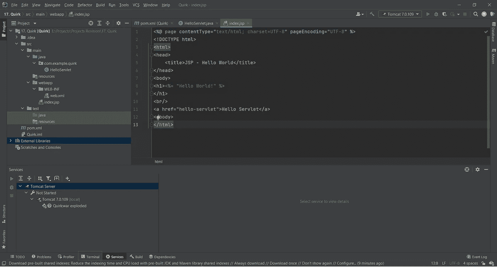](https://javarevisited.blogspot.com/2019/03/top-5-course-to-learn-apache-maven-for.html)

项目窗口

如果你已经正确地设置了所有的东西，你将会得到一个信息“构建成功”。

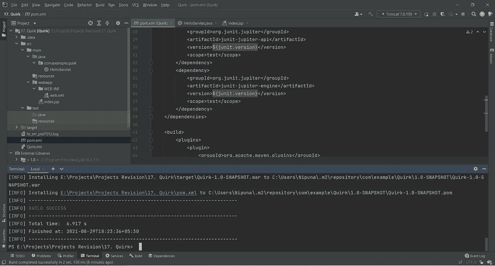

mvn 全新安装-DskipTests 输出

然后选择“运行”按钮来构建项目。

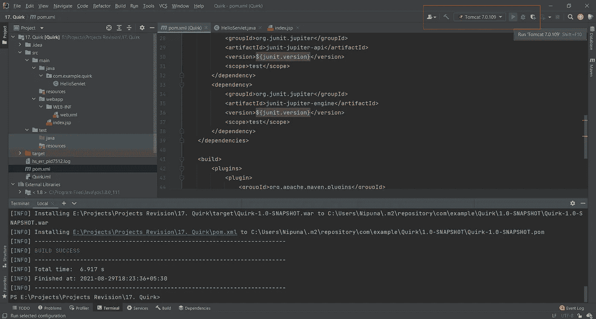

单击运行运行您的项目

构建项目需要几秒钟时间，并且会在您的 web 浏览器中自动打开。与该网页相关联的页面是由 [IntelliJ](/javarevisited/7-best-courses-to-learn-intellij-idea-for-beginners-and-experienced-java-programmers-2e9aa9bb0c05) 在项目创建阶段自动生成的**index.jsp**文件。

[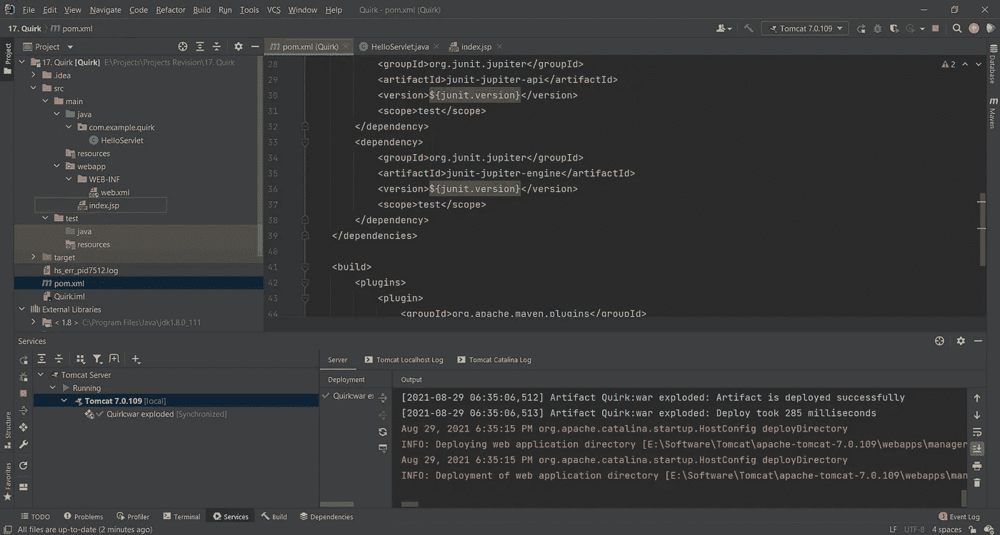](https://javarevisited.blogspot.com/2017/06/10-maven-tips-java-developer-should-know.html)

构建输出和 index.jsp 文件

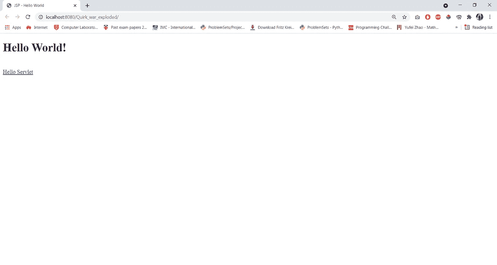

在网络浏览器中运行的应用程序

# Servlets 基础—获取请求

正如我们前面所讨论的，HTTP 是客户端和服务器之间的通信协议，有相当多的 HTTP 请求类型。

*   获取—从服务器获取信息
*   [发布](https://javarevisited.blogspot.com/2016/10/difference-between-put-and-post-in-restful-web-service.html) —在服务器上处理信息
*   [上传](https://www.java67.com/2016/09/when-to-use-put-or-post-in-restful-web-services.html) —上传服务器上的资源
*   删除—删除服务器上的资源
*   HEAD —与 GET 相同，但仅返回标题
*   修补—更新服务器上的资源
*   选项—帮助跟踪在服务器上工作的 HTTP 方法

现在让我们看看 GET 请求。当涉及到获取请求时，有几个要点。

*   用于从服务器获取信息。
*   发送的数据是 URL 中可见的查询字符串；因此缺乏安全感。
*   数据限制为 8kB，很少有注意事项。
*   幂等——不会改变服务器端的任何东西。

现在让我们看看如何在我们的项目上创建一个 GET 请求。为此，首先进入**src→main→Java→com . example . quirk**文件夹，右键单击它创建一个新的包。我们将这个包命名为 **servlets** ，并在这个包中创建一个新的 **java** 文件，命名为**GetServlet.java**

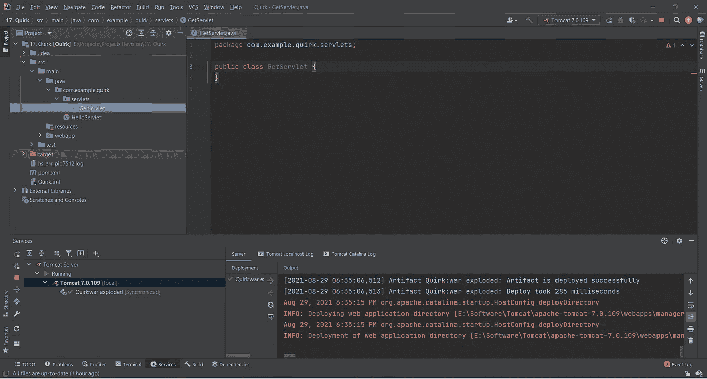

GetServelt.java

现在，由于这个类需要具有 servlet 的所有功能，我们将用 [**HttpServlet**](https://www.java67.com/2012/10/servlet-jsp-interview-questions-answer-faq-experience.html) 类来扩展它。扩展后，GetServlet.java 文件看起来会像这样。

现在，对于我们为什么要扩展 **HttpServlet** 类的问题，我们将看看 [Servlet API](https://javarevisited.blogspot.com/2011/09/servlet-interview-questions-answers.html) 的层次结构。

[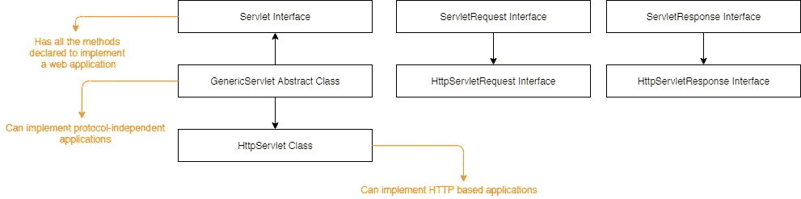](https://javarevisited.blogspot.com/2011/09/servlet-interview-questions-answers.html)

Servlet 层次结构

这里， [**GenericServelt**](https://www.java67.com/2012/12/difference-between-genericservlet-vs-httpservlet-jsp.html) 是一个抽象类， **Servlet** 是一个接口，它拥有构建 web 应用程序的所有方法。因为我们正在讨论构建一个 HTTP web 应用程序，所以我们使用了 **HttpServlet** 类，它包含了构建 HTTP web 应用程序的所有方法。

此外，由于没有请求和响应我们无法构建任何应用程序，因此我们有了[**servlet request**](https://www.java67.com/2021/07/servlet-and-filter-interview-questions-answers-java-.html)接口和 **ServletResponse** 接口。由于我们正在制作一个 HTTP web 应用程序，我们将使用扩展接口 **HttpServletRequest** 和 **HttpServletResponse。**

现在让我们回到代码。因为我们需要一个 GET 请求，所以我们可以使用从 **HttpServlet** 类、 **doGet()获得的内置方法。得到那个 **doGet()** 方法后，**GetServlet.java**文件会是这个样子。**

现在，让我们修改代码，这样我们发送一个 [GET 请求](https://www.java67.com/2014/08/difference-between-post-and-get-request.html)我们将得到一个简单的 HTML 响应。我们先写代码，以后再分析。所以代码应该是这样的。

这里，`htmlResponse`包含我们访问该站点时该站点包含的消息。而`PrintWriter`对象用于将`htmlResponse`写入该站点。即使我们写了这个并再次运行我们的服务器，我们也看不到任何东西，因为我们还没有设置应该用来获取这个特定数据的 URL。我们以两种方式设置这个 URL 路径，我们可以使用**注释**或者我们可以在 **Webapp →WEB-INF** 文件夹内的 **web.xml** 文件中设置它。首先，我们将看看如何在 **web.xml** 文件中设置它，接下来我们将看看如何使用注释来设置它。要在 **web.xml** 文件中设置路径，我们需要像这样修改 **web.xml** 文件。

这里，我们添加了从第 7 行到第 14 行的所有内容来配置路径。这样做时要考虑的最重要的几点是，

*   我们可以给`<servlet><servlet>`中的`<servlet-name><servlet-name>`标签取任何名字，而`<servlet-mapping><servlet-mapping>`中的`<servlet-name></servlet-name>`内部的名字应该与那个名字相同。
*   我们应该把我们类的完整路径给`<servlet-class></servlet-class>`。

现在来看第二个选项，我们可以像这样简单地给我们的类添加一个注释。

您可以使用注释或者使用 **web.xml** 文件。但是当你实现的时候，一定要使用 XML 标签或者注释。

现在，当我们在我们的应用服务器上运行它时，它将看起来像这样。

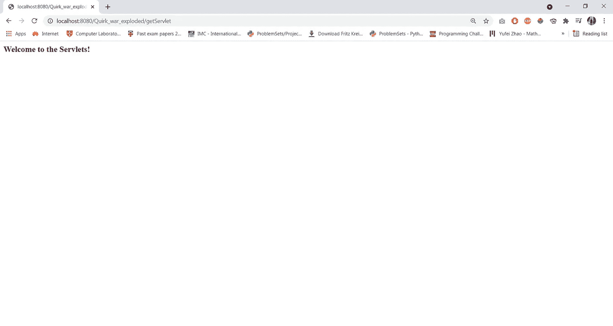

从/getServlet 获取请求

当我们用请求发送参数时，我们在 URL 中像这样发送它们，这里的`http://localhost:8080/Quirk/getServlet?name=quirk`，`name`是一个参数，它的值是`quirk`，整个`?name=quirk`通常被称为**查询字符串。**我们可以这样编辑代码，在网页上显示出来。

网页上的视图是这样的。

您的第一个 servlet 输出！

这就是我们如何使用 servlets 发送 GET 请求。你可以从[这里](https://github.com/nipunaupeksha/Quirk/tree/1.first-servlet-with-GET-request)找到上述部分的文件。

# 创建自定义 WebApp

现在我们知道了如何创建 servlet。因此，现在我们可以为我们的项目创建一个定制的 web 应用程序，并进一步学习 servlets 和 JSP 的概念。为此，请转到您的 **webapp** 文件夹，并将以下文件夹粘贴到其中， **html** 、 **css** 、 **js、**和**图片**。你可以在这里找到[的文件夹。html 文件夹包含您可以用作项目模板的文件。稍后我们将看看如何在 IntelliJ 中使用我们的 **html** 和 **jsp** 页面。](https://github.com/nipunaupeksha/Quirk/tree/2.search-get-request)

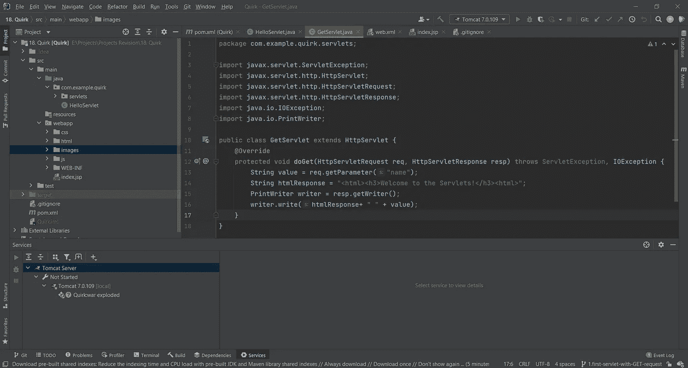

html、css、js 和 images 文件夹被添加到 webapp 文件夹中

添加文件后，我们将创建一个简单的 GET 请求。我们正在创建一个 GET 请求来查找产品。**index.html**文件中的搜索栏就是为此而创建的。搜索一个项目后，我们将在 searchResults.html 的**页面上显示结果。如果您查看 searchResults.html 的**页面，您可以看到一些标记，如{0}、{1}等。这里，我们已经初始化了这些标记，因为我们将把整个 HTML 页面作为文本读取，并用这些标记替换搜索结果，这样我们就可以看到搜索的输出。****

因为我们首先要访问数据库，所以我们需要创建一个数据库。对于这个项目，我们将使用 **MySQL** 作为我们的数据库，并建立数据库，我们将使用 **XAMPP** 。要下载并安装 XAMPP，请阅读这里提到的说明。安装 XAMPP 后，启动 XAMPP 控制面板，启动 **Apache** 和 **MySQL** 服务器。然后点击 **MySQL** 服务器的**管理**按钮，打开 ***phpmyadmin*** 页面。

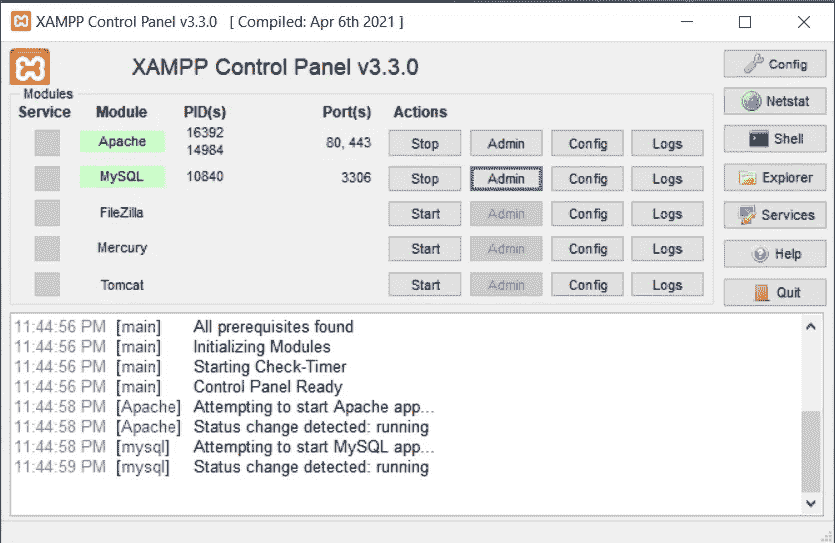

XAMPP 控制面板

我已经为我的项目创建了数据库，您可以获取 SQL 文件来创建数据库。

现在，让我们创建一些包并向其中添加一些 java 文件。首先，我们将在 com.example.quirk 中创建一个名为 **beans** 的包来添加我们项目的 bean。我们将为我们的产品创建的第一个 bean，因此我们将把文件命名为**Product.java**

您可以看到属性 productId、productName、productDescription、productPrice 和 productImgPath 以及专用于它们的 getters 和 setters。

现在我们需要一个连接来连接我们创建的数据库。为此，我们需要创建一些类。我们将在 com.example.quirk 中的一个新包中创建它们，名为 **dao** ，这是“数据访问对象”的首字母缩写。在这个包中，我们将创建一个名为**DBConnection.java**的新 java 文件，它专门用于在我们需要时创建一个连接。这个连接的重要部分是它使用了**单例模式**，因此性能不会降低。

然后我们将在同一个包中创建另一个 java 文件，**ApplicationDao.java**来控制数据库请求。对于我们的任务，我们连接到数据库并查找用户在搜索框中输入的产品。

现在让我们为搜索创建一个 servlet。为此，转到包含您的 servlets 的包，创建一个名为 SearchServlet.java**的文件。**

你可以看到我在这里使用了注释。因此, **web.xml 文件不会有任何变化。**

现在，我们必须再次配置我们的文件结构。将**index.jsp**和**searchResults.html**添加到 **webapp** 文件夹中。你可以在这里找到文件。我们必须配置这种结构，因为对于 web 应用程序，IntelliJ 有一定的限制。现在您的文件结构如下所示(您可以看到一个名为 **sql** 的附加文件夹，因为我将我的 sql 脚本添加到了该文件夹中)。

在这里，因为我们不需要**HelloServlet.java**文件，我们可以删除它。然后当你运行 tomcat 服务器时，你可以找到我们创建的网站。单击搜索按钮，输入产品名称，然后按搜索按钮。

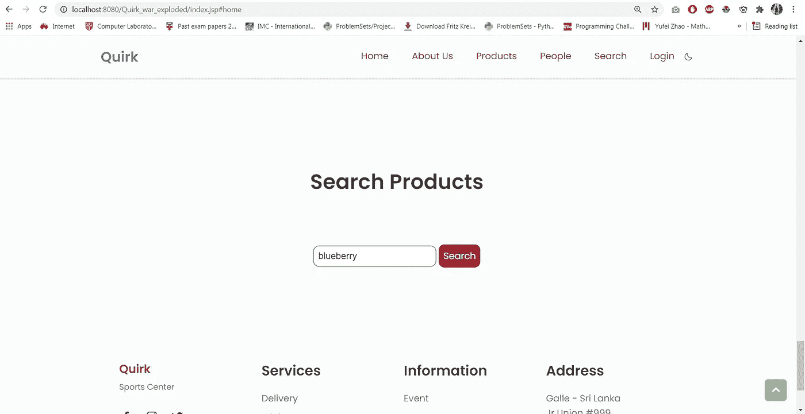

然后你会得到你搜索的产品。但是它将只显示一个结果，因为我们编写的代码只显示一个结果。我们稍后将更改代码以显示多个结果。这里，你应该注意的最重要的部分之一是 URL。您可以在那里看到与搜索相关的查询字符串。

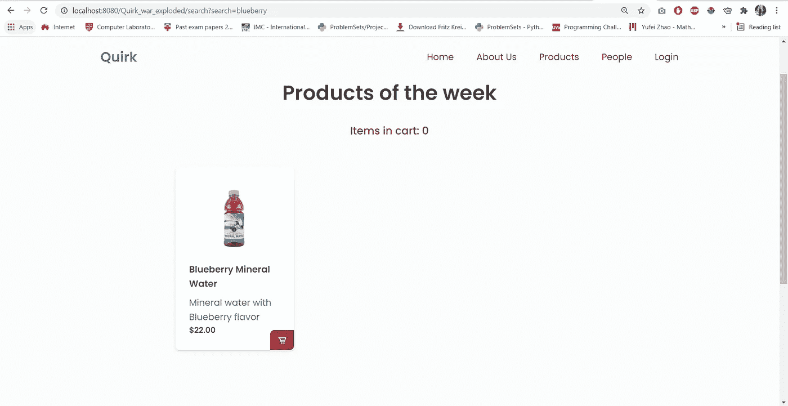

在创建与 Java Web 项目相关的 HTML 或 JSP 页面时，您应该做的最重要的事情之一是，您应该始终避免在 HTML 或 JSP 文件中使用单引号。例如，您应该使用`<i class="fa fa-facebook"><i/>`而不是`<i class='fa fa-facebook'></i>`，因为大多数“没有显示元素”都是由于这个简单的错误造成的。你可以在这里找到从[到这一部分的所有文件。](https://github.com/nipunaupeksha/Quirk/tree/2.search-get-request)

# Servlets 基础知识—发布请求

正如我们之前提到的，POST 也是一种 HTTP 请求类型，它可以用于在服务器端发布/处理信息。通常，这用于将数据修改到数据存储中。数据存储可以是文本文件、XML 文件、数据库等。例如，用户注册是一个 POST 请求，因为我们将数据发送到服务器端，以便它可以将这些声明存储在数据库中，从而为该站点创建您的身份。

我已经创建了一个包含注册表的**register.html**文件，你可以添加那个文件或者任何你喜欢的文件。转到我们的代码，我们首先要在我们的**bean**文件夹中实现另一个名为**User.java**的 bean。

然后，我们将转到**ApplicationDao.java**文件，为我们的用户注册添加另一个方法。之后的**ApplicationDao.java**文件的完整代码如下。

现在，为了发布我们在 web 应用程序中插入的值，我们需要使用另一个 servlet。为此，我们将在我们的 **servlets** 文件夹中创建一个新的 servlet，**RegisterServlet.java。**

在这里，您可以看到我们正在做一个 **doPost()** 方法，将数据发送到数据库并更新网页。但是为什么我们还要写一个 **doGet()** 方法呢。这是因为我们使用超链接在网页中导航，而``标签总是使用 GET 请求。因此，我们需要为网页上的标记设置一个默认值，这就是我们使用 **doGet()** 方法的原因。

你可以从[这里](https://github.com/nipunaupeksha/Quirk/tree/3.user-register-post-request)找到本节的所有相关资料。您应该注意到的一件事是，对于我们的注册导航栏中的链接，我们已经为它指定了我们在 servlet 中提到的 **registerUser** 路径。现在，如果一切都是正确的，你可以注册一个用户，并在数据库中看到结果。

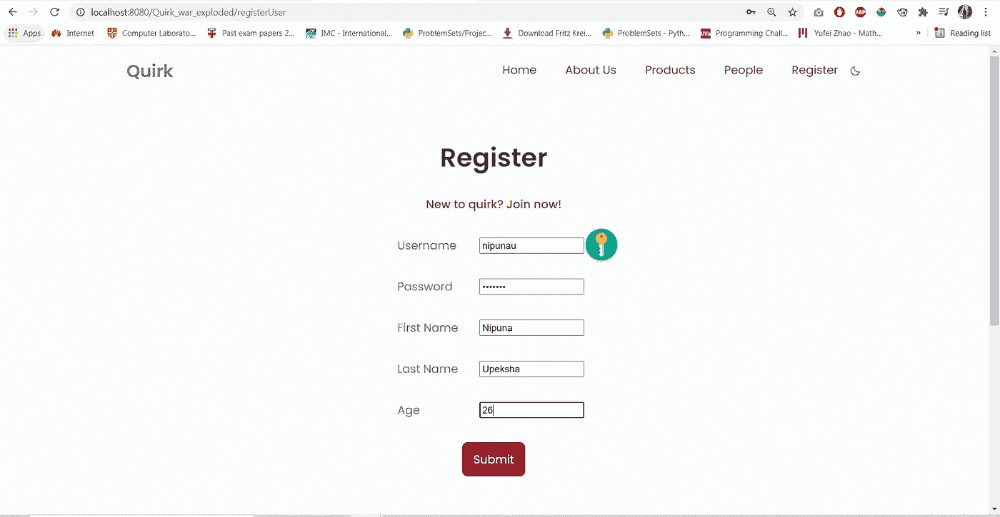

注册新用户

用户注册成功。

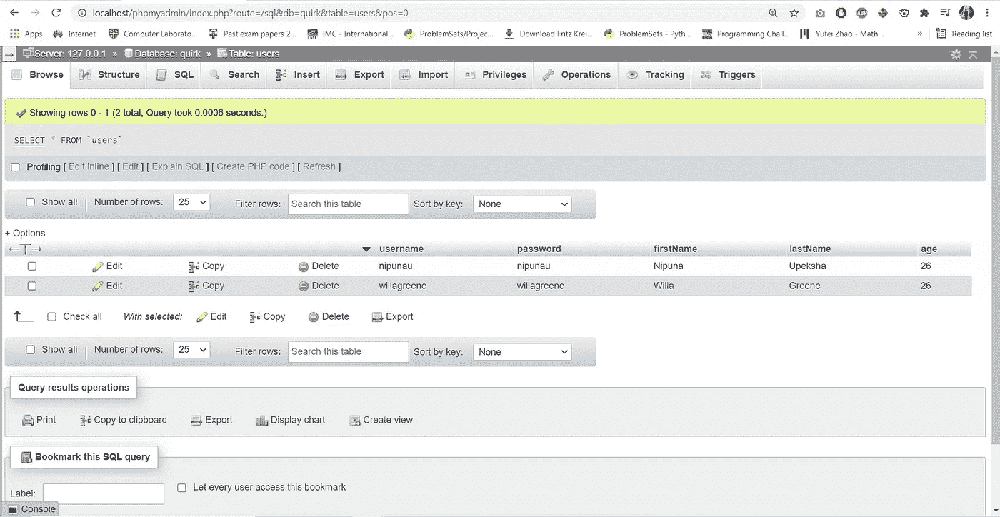

我们数据库中的表用户

# Servlets 中的转发

servlets 中的转发是一个重要的概念，因为我们已经为 GET 和 POST 请求做了两个演示，所以现在是我们学习这个的时候了。要了解我们到目前为止的流程，请查看下图。

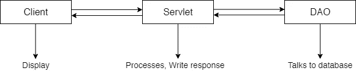

首先，请求从客户机发送到 servlet，servlet 将提取所请求的数据，并将其打包到对象中，然后调用 DAO。然后 DAO 与数据库对话并将数据返回给 servlets。servlets 然后准备响应并将其返回给客户机。在这个过程中，我们要求 servlet 写回响应。但是通常在 web 应用程序中，所有的请求处理功能都不会封装到一个 servlet 中。通常需要将功能拆分到多个 servlets 上，以使代码更加模块化和可维护。在这种情况下，有必要了解如何将请求的控制权从一个 servlet 转移到另一个 servlet。

为了理解这一点，我们将创建一个名为**login.jsp**的新文件，并尝试实现登录功能。你可以从 Github [库](https://github.com/nipunaupeksha/Quirk)中找到 login.jsp**文件。**

在这里，当我们从导航栏点击**登录**链接时，我们将首先访问一个登录 Servlet，然后通过它进入**login.jsp**。我们这样做是因为在 URL 中你可以看到我们正在访问的页面的资源位置，出于安全原因，我们必须隐藏它。现在让我们转到我们的项目，在 **servlets** 文件夹中实现**LoginServlet.java**。

您可以看到我们用来进行转发的对象是 **RequestDispatcher** 对象。现在，当我们从浏览器访问登录页面时，我们可以看到它只显示了 **/login** ，而没有显示 **/login.jsp** 。

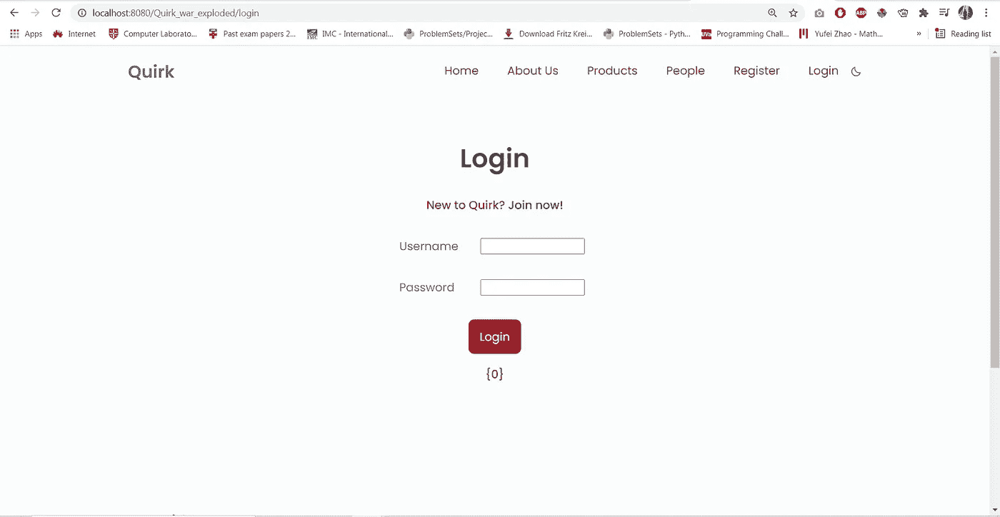

login.jsp·佩奇

还有另一个名为`include`的方法可以与 **RequestDispatcher 一起使用。**在这里，我们可以将第 19 行改为`dispatcher.include(req,resp);`，这将从登录 servlet 获取请求和响应，并将其与您从**login.jsp**页面获取的请求和响应合并，并将其呈现给 web 浏览器。这是使用转发的另一种方式。

# Servlets 中的重定向

现在我们来看看另一个有趣的话题，叫做“重定向”。重定向的含义是将控制权移交到当前应用程序上下文之外。为了展示重定向是如何工作的，我们将看看页脚中的社会元素。继续看代码，我们将在我们的 **servlet** 文件夹中创建一个新类，为此创建**RedirectServlet.java**。

现在转到**index.jsp**的页脚，将行`<a href="#" class="footer__social"><i class="bx bxl-instagram"></i></a>`改为`<a href="redirect" class="footer__social"><i class="bx bxl-instagram"></i></a>`

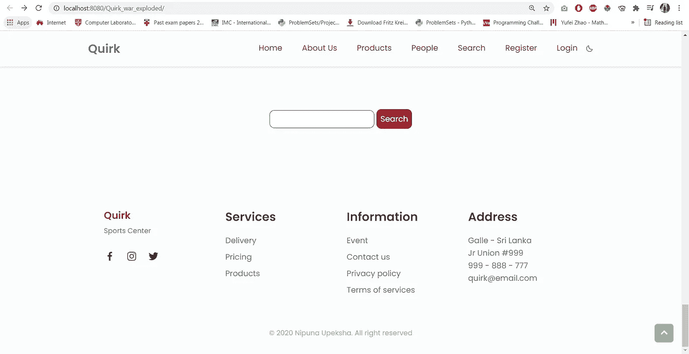

我们网络应用的页脚

现在，如果你点击页脚的 Instagram 图标，你将被重定向到我的 Instagram 个人资料。你可以通过更改**RedirectServlet.java**类中的网址，将其更改为你的 Instagram 个人资料。

# 使用 ServletConfig

这是将配置信息传递给特定 servlet 的方式。例如，注册到一个 web 服务 URL，像天气数据可以通过这个的 config init 参数读取。让我们看一个例子来进一步了解这一点。

我们的 servlet 类中已经有一个名为**GetServlet.java**的文件，我们可以为它定义一些初始化参数。如果您已经通过 **web.xml** 映射了 servlet，您可以像这样定义 init 参数。

在这里，`<param-name></param-name>`可以有任何值，您想要关联的值应该在`<param-value></param-value>`内

现在转到我们的**GetServlet.java**文件，我们可以通过 **ServletConfig** 对象来访问这个 init 参数值。

现在，如果您运行 tomcat 服务器并转到/ **getServlet** ，您可以在 IntelliJ 终端中看到正在打印出 **URL** 的值。现在，您可以将 init 参数值用于您的代码。

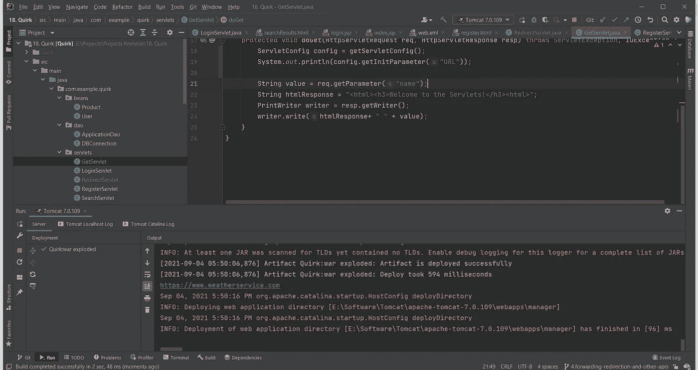

如果你想在注释中使用这些初始化参数，也可以这样做。初始化参数的注释版本如下所示。记住在你的项目中只使用其中的一个。

# 使用 ServletContext

servlet 上下文 API 可用于传递整个应用程序的配置信息。对于 servlet 上下文对象，将会有参数，它们在部署描述符文件(在我们的例子中是 **web.xml** 文件)中的`<context-param>`元素下定义。由于 servlet 上下文是针对整个应用程序的，所以它们不是附属于单个 servlet，而是附属于整个应用程序，这就是为什么我们在 **web.xml** 文件中定义与 servlet 上下文 API 相关的参数。我们可以编辑我们的 **web.xml** 文件，如下所示，以使用 servlet 上下文。

我们可以在 GetServlet.java 文件中得到它的值。

如果我们启动我们的 tomcat 服务器，并转到 **/getServlet** ，您可以看到正在打印数据库 URL。

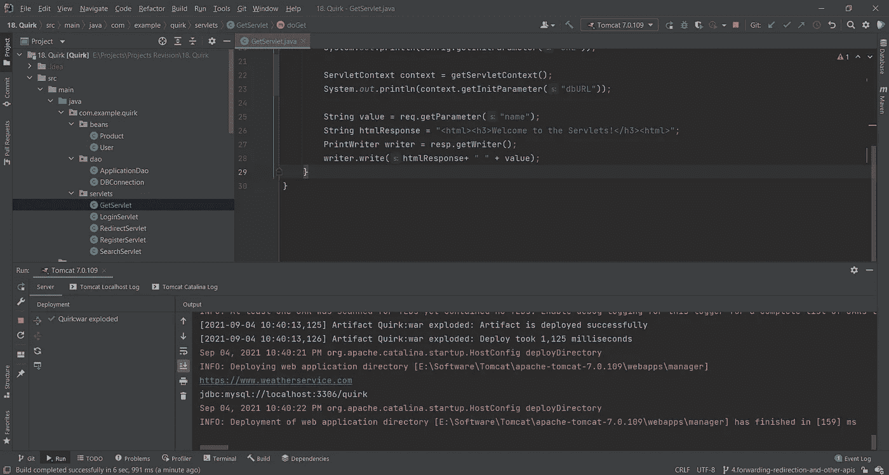

# 使用请求/响应对象

每当我们从客户机向服务器发出请求时，请求就用对象来表示。这是扩展 servlet 请求 API 并向 HTTP servlets 提供所有请求信息的对象。它由两部分组成，头和主体。头是请求可能需要的所有额外信息，比如从客户机发送到服务器的内容类型。主体是您随请求一起发送的数据。请求对象的一些重要 API 调用有:`request.getSession()`、`request.getHeader(String headerName)`、`reuqest.getRequestURI()`、`request.getParameter(String param)`、`request.getCookies()`和`request.getMethod()`

现在让我们看看响应对象。它还包含两个部分，头部和身体。响应对象的头类似于请求对象的头。主体包含您想要写回客户端的信息。有几个方法也与这个对象相关。但是响应对象的一些重要 API 调用有:`response.sendRedirect(String url)`、`response.addCookie(Cookie cookie)`、`response.encodeURL(String url)`、`response.setContentType(String contentType)`、`response.getStatus()`、`response.getWriter()`

您可以从[这里](https://github.com/nipunaupeksha/Quirk/tree/4.forwarding-redirection-and-other-apis)找到本节描述的代码。

# Servlet 生命周期

在制作 servlets 时，我们只是创建了它们，并没有在任何地方实例化它们，即使我们使用的是 Java。因此，现在是我们了解这些 servlets 背后的过程的时候了，以便了解它们实际上是如何工作的。为了理解这一点，我们应该研究 servlet 的生命周期。谈到 servlet 的生命周期，有几个要点。

*   完全由服务器容器管理(在我们的例子中是 tomcat)。
*   servlet 的生命周期从第一个请求到来时开始。
*   当取消部署应用程序或关闭服务器时，生命周期结束。

我们可以分两个阶段来看 servlet 的生命周期，

1.  当第一个请求进入 servlet 时。
2.  当重复请求同一个 servlet 时。

现在让我们看看 servlet 的更一般的生命周期。

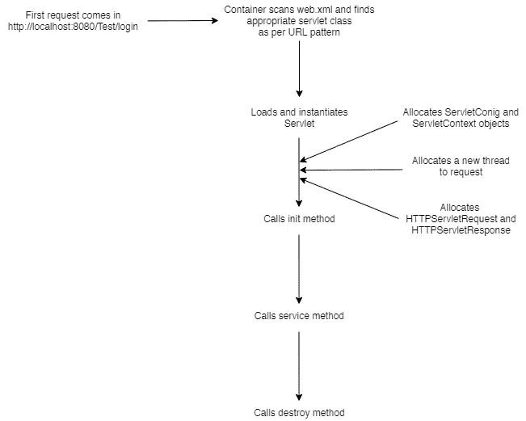

这里，`service()`方法来自 **HTTPServlet** 类，`init()`和`destroy()`方法来自 **GenericServlet** 抽象类。这里，`init()`方法是初始化 servlet 的方法，`service()`方法是相应地委托`doGet()`和`doPost()`方法的方法。这是你的请求被提供给用户的地方。当您的 web 应用程序将要终止或服务器将要关闭时,`destroy()`方法就会发挥作用。从以上三种方法中，`init()`和`destroy()`可以被覆盖，而`service()`方法不能被覆盖。

让我们转到我们的项目，在我们的 **servlet** 包中创建一个新的 servlet**HomeServlet.java**。

现在您运行 tomcat 服务器并转到 **/homeServlet** ，您可以在终端中看到一些输出。

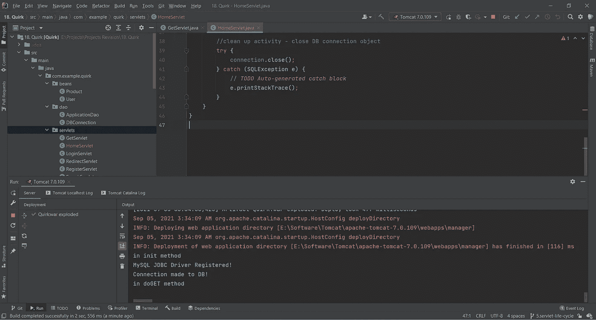

在这里，您可以看到来自`init()`和`services()`方法的输出，这是由于 servlet 的生命周期。如果我们关闭 Tomcat 服务器，我们也可以看到`destroy()`方法。

你可以从[这里](https://github.com/nipunaupeksha/Quirk/tree/5.servlet-life-cycle)找到与上述章节相关的代码。

# JSP 基础

现在我们将看看 JSP 或 Java 服务器页面。当谈到 JSP 时出现的一个主要问题是，如果这些也是用 HTML 编写的，我们为什么还要使用 JSP？很少有理由使用 JSP 而不是 HTML，但是所有这些理由都是由于 HTML 的缺点。

*   HTML 页面只允许呈现静态数据。
*   读写 HTML 模板的 I/O 操作是一个耗时的过程(正如我们在**SearchResults.html**中看到的)
*   将 CSS 代码直接填入所有 HTML 是一个费力的过程
*   专业的 UI 开发人员可能无法处理 servlet 代码。

现在看看 JSP，它的主要优势是创建动态内容的能力。动态内容是根据用户请求给出定制响应的能力。例如，facebook 的新闻提要部分因用户而异，但是为创建新闻提要元素而编写的代码对于任何用户都是相同的。用户从服务器获得他们自己定制的响应，这样新闻提要元素就能够适应这些响应并将它们显示给用户。

# JSP 元素

JSP 元素用于支持 JSP 页面上的 Java 或任何其他脚本代码。当我们在 JSP 中编写任何 Java 代码时，它们都被翻译并进入 JSP 的 servlet 文件。

在开始编写代码之前，我们应该了解一些 JSP 元素的类型。

*   Scriptlet: `<%%>` —帮助编写 JSP 上的 Java 语句
*   表达式:`<%= %>` —帮助评估 JSP 上的表达式
*   声明:`<%!%>` —帮助在页面的脚本语言中声明变量和方法；代码在 servlet 文件中作为单独的方法。

现在让我们回到我们的代码，看看如何应用它们。首先，我们将把**searchResults.html**的名字改为**searchResults.jsp。现在转到我们的**SearchServlet.java**文件并修改代码，这样我们就可以在 JSP 页面上使用它了。**

您可以看到，我们正在设置一个属性，并用请求调度程序转发它，这样我们就可以在 JSP 页面上使用它。现在让我们转到**searchResults.jsp**页面，用 JSP 元素编辑它，这样我们就可以动态地使用内容了。

你可以看到，从第 55 行到第 59 行，我们在`<%%>`中编写普通的 Java 代码，我们用另一个`<%%>`结束了第 69 行的`while`循环的花括号。现在，由于我们使用了 Java 对象，我们需要将相关的类导入到 JSP 中。我们正在通过`<%@page import=""%>`这样做，你可以看到从第 2 行到第 5 行的导入对象。现在最重要的部分是我们如何在`while`循环中设置动态内容。为了给各个字段赋值，我们去掉了之前使用的标记，用从**产品** bean 中获得的属性替换它们，并用`<%=>`将它们括起来。现在，您可以启动 Tomcat 服务器，进行搜索，所有结果将出现在**searchResults.jsp**文件中。

做一个搜索

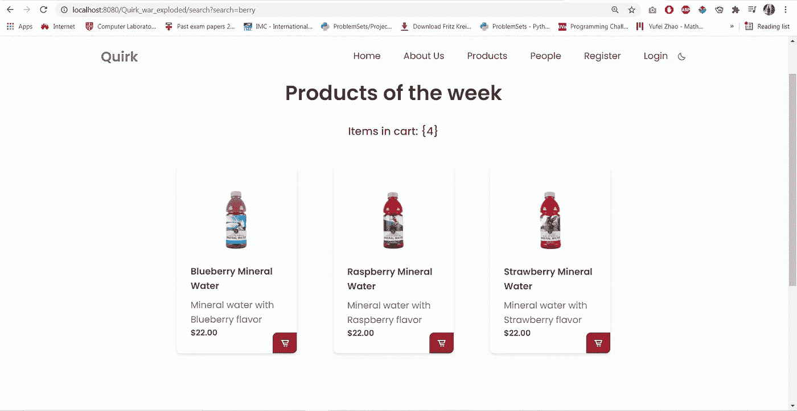

搜索结果

您可以看到，我们仍然需要修复“购物车中的商品”部分。我们将在以后研究如何解决这个问题。现在让我们看看如何在 JSP 中使用声明。为此，我们只需在网站上显示日期和时间。让我们稍微修改一下**index.jsp**文件，这样我们就可以看到它是如何被应用的。

您可以看到，我使用了第 290 行到第 297 行的声明，并使用了我在第 40 行定义的方法。这就是我们在 JSP 中使用声明的方式。现在，如果我们在我们的服务器上运行它，我们可以看到这样的输出。

index.jsp 的日期和时间

现在让我们看看 JSP 指令。JSP 指令是用于翻译过程的特殊指令，它们不会作为页面的输出出现。谈到 JSP 页面，我们最常用的一些指令是:

*   Page — `<%@page%>` —帮助导入类、配置错误页面、设置 JSP 会话以及设置页面的字符编码。这有很多属性，其中一些重要的是`import`、`buffer`、`contentType`和`extends`
*   包含— `<%@include%>` —允许包含 JSP 资源。例如，我们可以在像**header.jsp**这样的单独 JSP 文件中创建我们的头部分，并使用这个指令在我们的**index.jsp**文件中使用它，只需在`<main></main>`部分之前键入`<%@include file="header.jsp"%>`即可。
*   Taglib — `<%@taglib%>` —为了定义一个定义了许多标签的标签库，我们使用 TLD(标签库描述符)文件来定义标签。

现在让我们看看 JSP 隐式对象。JSP 隐式对象是已经在 JSP 上定义的对象，比如我们在**searchResults.jsp**文件中使用的`request`变量。有些是，

*   `out` —帮助将输出写入 JSP — JSPWriter
*   `request`—JSP 页面请求— HTTPServletRequest
*   `response`—JSP 页面请求— HTTPServletResponse
*   `session` —登录用户的会话对象— HTTPSession
*   `config` —表示 ServletConfig 对象
*   `application` —表示 ServletContext 对象
*   `exception` —代表异常，可用于错误页面
*   `pageContext` —包含对所有隐式对象的引用，可用于访问页面信息

从[这里](https://github.com/nipunaupeksha/Quirk/tree/6.jsp-fundamentals)可以找到与上述章节相关的代码。

# 会话管理

现在让我们了解会话管理。为了理解会话管理，我们首先需要理解 HTTP 的限制，因为它我们需要会话管理。由于 HTTP 是一种无状态协议，它不保存客户端和服务器之间的会话状态，因此会出现这种 HTTP 限制。例如，想象一个有几个页面的 google 表单，假设我们在第一页输入我们的名字，然后进入第二页，但是当我们回到第一页时，我们输入的细节不见了。这种事情不应该发生在 web 应用程序中。那么我们如何解决这个问题呢？答案是会话管理，servlet 规范有用于会话跟踪的 HTTPSession API。这是通过会话 ID 完成的。会话 id 交换可以通过 cookies 或 URL 重写来完成。

首先，让我们看看如何通过 cookies 交换 session-id。Cookies 是存储在浏览器中的小块信息。当服务器为新用户生成一个会话 id 时，它会创建一个包含该会话 id 的 cookie 对象，并将其作为响应的一部分写入。然后我们就可以在我们的会议中使用它。这整个过程可以通过调用`getSession()` API 来触发。

我们将在 cookies 的帮助下，尝试解决之前无法解决的“购物车中的商品”问题。为此，我们将首先在我们的 **servlet** 包**ProductsServlet.java 中编写一个 servlet。**

我们将为会话管理更新我们的**SearchServlet.java**类。

T

然后，我们将更改**searchResults.jsp**来进行会话管理。

现在，如果您再次运行 Tomcat 服务器并在搜索后选择商品，您会发现购物车中的商品数量正在增加。

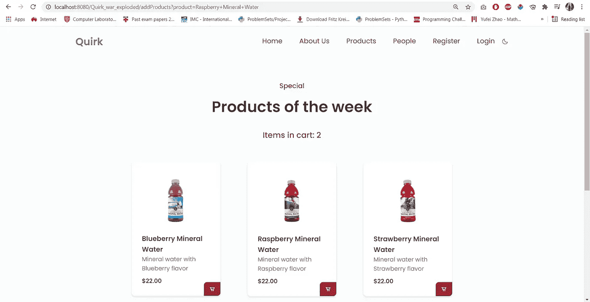

现在让我们来理解交换会话 id 的第二种方式，URL 重写。这实际上是在 cookies 被禁用的情况下发生的一个后备选项。这里，URL 被重写，在末尾附加了会话 id。为此，我们需要禁用浏览器中的 cookie。我用的是谷歌 chrome，在 chrome 中，你可以进入设置，搜索 cookies，然后禁用 cookies。

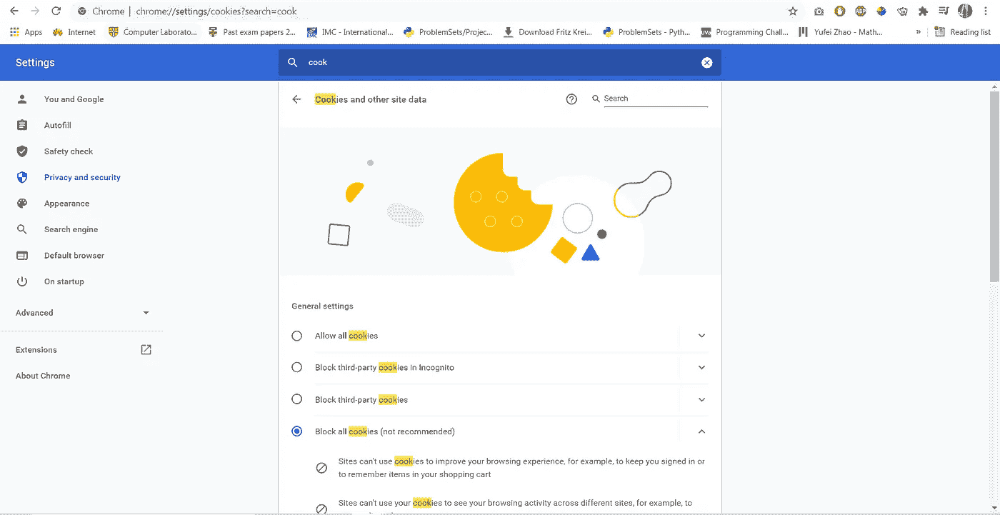

现在让我们转到我们的代码，在**LoginServlet.java**文件中做一些修改。

此外，我们将在我们的 **servlets** 文件夹中创建一个新的 servlet**ProfileServlet.java**。

对于**profile.jsp**和**home.jsp**文件，我创建了**index.jsp**文件的副本并编辑它们。我做的最重要的事情之一是在**home.jsp 上使用`<%=response.encodeURL("getProfileDetails)%>`对 URL 进行编码。你可以在这里找到来自[的文件](https://github.com/nipunaupeksha/Quirk/tree/7.session-management)。现在，当我们在 tomcat 服务器上运行并登录时，您可以在 URL 中看到类似这样的内容。**

`http://localhost:8080/Quirk_war_exploded/getProfileDetails;jsessionid=B363CE37BB121D96DAF7248D6040DB64`

因为我们已经为一个用户进行了登录，所以我们也可以使用会话 API 为一个用户进行注销。为此，我们将在我们的 **servlets** 文件夹中创建一个新的 servlet，**LogoutServlet.java**

我已经编辑了 home.jsp**页面的导航链接，这样注销功能就可以正常工作了。你可以从[这里](https://github.com/nipunaupeksha/Quirk/tree/7.session-management)找到与会话管理相关的文件。**

# 过滤器和监听器

过滤器类是为请求的预处理和后处理而保留的，它们可以动态地拦截请求和响应。现在，我们将在 web 应用程序中实现一个过滤器，以便更熟悉过滤器 API。首先，我们将向我们的**ApplicationDao.java**文件添加一个新的代码片段来验证用户。

然后我们将在我们的**LoginServlet.java**文件中使用`validateUser()`方法。

然后我们将相应地编辑**login.jsp**页面。

现在我们将创建我们的第一个过滤器。我们将为过滤器创建一个名为 **filters** 的新包，并创建我们的过滤器**AuthenticationFilter.java**

现在有两种方法来验证这个过滤器，要么使用 **web.xml** 要么使用注释。首先我们将看一下 **web.xml** 文件。

这里需要注意的重要一点是`<url-pattern></url-pattern>`，你可以看到我们使用`/*`来表示。这意味着这个过滤器适用于所有的 servlets。

如果我们使用注释，我们可以像这样使用它。

现在，如果您运行 Tomcat 服务器并登录 web 应用程序，您将看到您可以访问该配置文件。但是如果你将它的 URL 复制并粘贴到一个**匿名窗口**中，你会看到你被重定向回登录页面。这是因为隐名窗口不保存会话信息。

已重定向至匿名窗口中的登录页面

现在让我们看看听众。web 应用程序中会发生各种各样的事件，了解这些事件并做出正确的响应非常重要。这些类型的操作是通过监听器完成的。现在让我们回到我们的代码来学习更多关于侦听器的知识。我们将制作一个监听器来监听我们的连接。为此，首先，让我们创建一个名为 **listeners** 的新包，并在其中创建一个新文件**ApplicationListener.java**。

之后，我们可以在 **web.xml** 文件中配置监听器或者使用注释。如果我们要使用 **web.xml** 文件，我们可以向它添加以下代码片段。

`<listener><listener-class>com.example.quirk.listeners.ApplicationListener</listener-class></listener>`

或者我们可以使用注释，让它看起来像这样。

现在，让我们转到**ApplicationDao.java**文件，对`searchProducts()`方法做一个方法重载。

然后，我们将转到**SearchServlet.java**文件并编辑`doGet()`方法。

现在，您启动 tomcat 服务器，您可以看到我们放入侦听器中的行正在被打印。

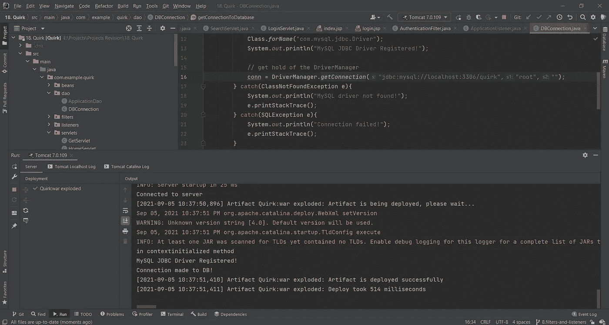

你可以在[这里](https://github.com/nipunaupeksha/Quirk/tree/8.filters-and-listeners)找到讨论主题的源代码。

# **JSP 标准动作和表达式语言**

当我们在 JSP 页面中编写 Java 代码片段时，很明显，如果动态内容增加，代码会变得混乱和不可维护。对于企业应用程序来说，这是一个很大的问题，解决方案是 JSP 动作。JSP 动作语法很简单，看起来像这个`<jsp:*name of tag*/>`，没有很多标签。因此，使用 JSP 动作有助于保持代码的可读性和完整性。一些最常用的 JSP 标准操作是，

*   `<jsp:useBean.../>` —帮助实例化 JSP 上的 bean 或获取指定范围内的 JSP 上的 bean。
*   `<jsp:forward.../>` —将控制转发给上下文中的其他资源
*   `<jsp:include.../>` —包括当前资源中的另一个资源
*   `<jsp:getProperty.../>` —从 JavaBean 属性中获取并显示一个值
*   `<jsp:setProperty.../>` —为 JavaBean 属性设置值

现在，让我们来看代码。首先，我们将转到**ApplicationDao.java**文件，并创建一个方法来获取用户的配置文件信息。

现在我们将转到**ProfileServlet.java**文件，并相应地更改`doGet()`方法。

由于我们使用 index.jsp**的副本**作为 profile.jsp**的副本**，我们现在要用我们的名字和姓氏来更改我们公司首席执行官的姓名。使用 JSP 动作来做这件事会让您了解如何使用 JSP 动作。所以修改后的 profile.jsp 页面看起来是这样的。

查看第 222 行和第 225 行，您可以了解如何使用 JSP 动作以及它们有多简单。现在，如果您运行 Tomcat 服务器并登录到您的配置文件，您可以看到类似这样的内容。

你可以看到**的名字 Willa Greene** 被改成了 **JSP Servlets。**因为我输入的用户名和姓是他们。

现在我们来看看表情语言。表达式语言实际上比 JSP 动作更容易。你只需要把你想要的值放在`${}`里面就行了。例如，由于我们已经通过请求传递了`user`属性，我们将使用表达式语言再次更改**profile.jsp**页面。

虽然，我添加了整个**profile.jsp**文件，但是我只修改了 230 行。你可以看到在 JSP 中使用表达式语言是多么容易。另外，我们也可以用表达式语言来做类似这样的简单操作，`${4+5*5}`现在我们运行 tomcat 服务器，我们可以看到类似这样的东西。

您可以看到，由于我们使用的表达式语言，名称**杰克·瑞恩**被更改为 **JSP Servlets** 。要了解更多关于表达式语言的知识，您可以访问[*tutorialspoint.com*](https://www.tutorialspoint.com/jsp/jsp_expression_language.htm)。您可以从[这里](https://github.com/nipunaupeksha/Quirk/tree/9.jsp-actions)访问我们在本节中使用的代码片段。

这就是了！这是终点线！我知道这是一篇很长的博文，里面有很多东西。但是我希望当您使用 JSP 和 servlets 构建您的第一个 web 应用程序时，您会发现这一点很重要。这篇文章中也可能有一些错别字和错误。如有发现，请加私信。原来就是这样！干杯，编码快乐！

Git 存储库链接—[https://github.com/nipunaupeksha/Quirk](https://github.com/nipunaupeksha/Quirk)