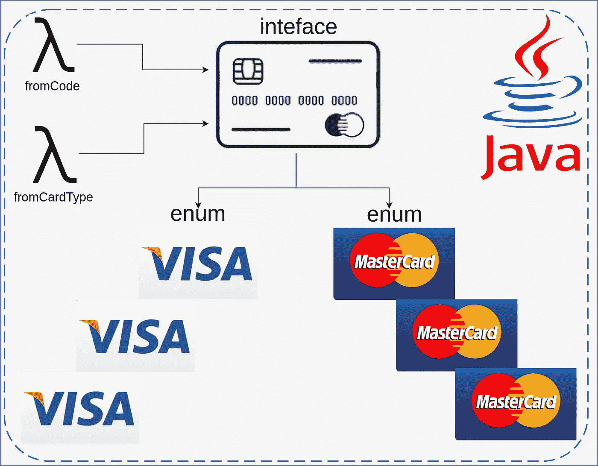

# Java 枚举多态性模式

> 原文：<https://medium.com/javarevisited/java-enum-polymorphism-pattern-7cbc4e2b92ac?source=collection_archive---------0----------------------->

## 在 Java 中，常量组通常以枚举的形式表示。枚举可以实现一个允许它成为多态的接口。在本教程中，我将用一个真实的例子展示如何实现[枚举多态性模式](https://javarevisited.blogspot.com/2011/08/enum-in-java-example-tutorial.html)。

