# Java 库将帮助你为电子学和 Raspberry Pi 编程

> 原文：<https://medium.com/javarevisited/java-libraries-which-will-help-you-to-program-for-electronics-and-the-raspberry-pi-149ba0af72f3?source=collection_archive---------2----------------------->

理解和学习新事物的最好方法是自己记录下来。在编写一本关于在 Raspberry Pi 上开始使用 Java 和 JavaFX 的[书时，我发现了一些缺失的库来简化我的示例代码。所以我决定自己写。我的第一个](https://webtechie.be/books/) [Maven 资源库](https://mvnrepository.com)开源项目！我采取了一些试错法，但在这里，我希望你会发现它们有用！

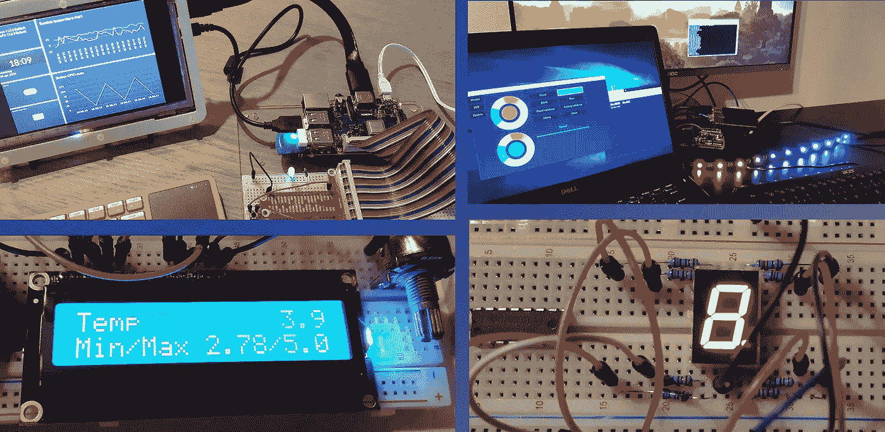

# Raspberry Pi 接头和引脚

LED、按钮、传感器等硬件组件的连接是通过 Pi-header 的 40 个引脚完成的。但是，哪些是电源引脚、地或 GPIO(通用输入/输出)？取决于你如何使用它们，你需要知道逻辑，BCM 或 WiringPi 号码。

为了更容易理解和使用这些数字，可以使用第一个库“pi-headers”。它可以在 Maven 资源库的[中找到，源代码可以在](https://mvnrepository.com/artifact/be.webtechie/pi-headers) [GitHub > PiHeaders](https://github.com/FDelporte/PiHeaders) 上找到。这个库包含了很多关于管脚和头的枚举信息。

这只是不同引脚类型的一个例子:

```
public enum PinType { 
  POWER("Power", 0x990000),
  GROUND("Ground", 0x000000), 
  DIGITAL("Digital", 0x009900), 
  DIGITAL_AND_PWM("Digital and PWM", 0xff7ff00),
  DIGITAL_NO_PULL_DOWN("Digital without pulldown", 0x800080); 
}
```

在[GitHub>JavaFX-pinning-info](https://github.com/FDelporte/JavaOnRaspberryPi/tree/master/Chapter_05_PiPinning/javafx-pinning-info)上提供了一个使用该库通过 Java FX 可视化引脚头的示例应用程序。这些截图是用这个 JavaFX 应用程序生成的:

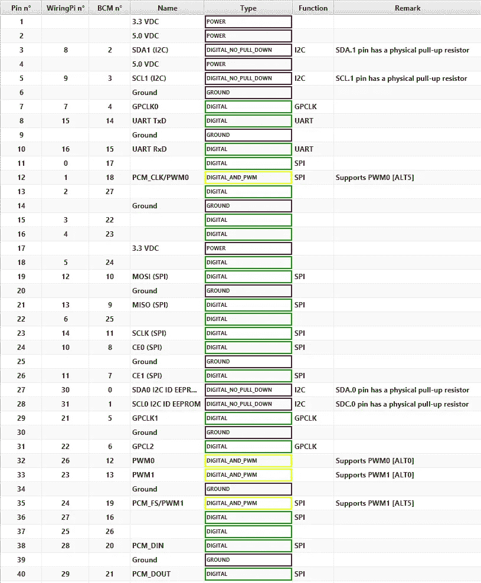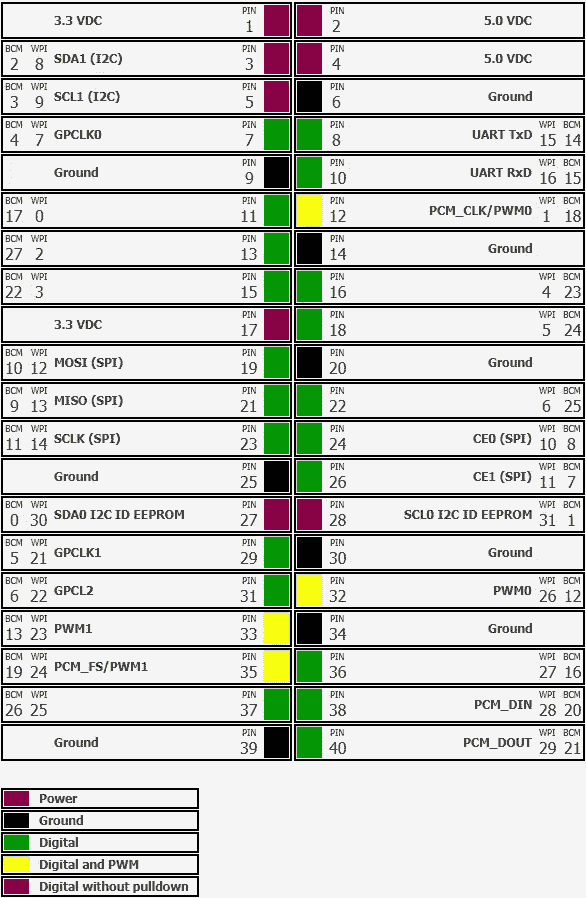

表格视图和标题视图中的 40 引脚标题

# 电阻值计算器

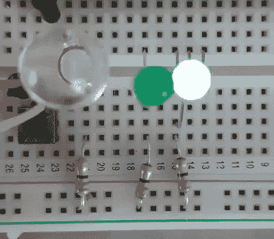

开始尝试硬件时，最常用的组件是 LED。为了将流经 LED 的电流限制在预期值(而不是立即破坏它们——是的，我也遇到过这种情况……)，您需要一个电阻来调整 Raspberry Pi 的 3.3V 输出或 Arduino 的 5V 输出。

第二个库“[电阻计算器](https://mvnrepository.com/artifact/be.webtechie/resistor-calculator)”为您提供了这些功能。来源可以在 [GitHub >电阻计算器](https://github.com/FDelporte/ResistorCalculator)上找到。

因为电阻上的颜色代码乍一看像个谜，所以它有一个带有颜色代码值的枚举。

```
public enum ColorCode {
   BLACK(0, 0x000000, 1D, null, 250),
   BROWN(1, 0x761d1d, 10D, 1D, 100), 
   RED(2, 0xcc0000, 100D, 2D, 50),                            
   ...
}
```

库中的计算器功能将帮助您找到正确的电阻。

```
/**                            
* Calculates the ResistorValue based on the List of ColorCode.
* This function can calculate for 3, 4, 5 and 6 colors.
*
* Will throw IllegalArgumentException when a ColorCode is given                            
* which can not be used at a given position.                            */                           
public static ResistorValue resistorValue(List<ColorCode> colors)
```

在[GitHub>JavaFX-resistants](https://github.com/FDelporte/JavaOnRaspberryPi/tree/master/Chapter_02_Tools/javafx-resistors)上还有一个 Java FX 示例应用程序，演示了这个库的使用。

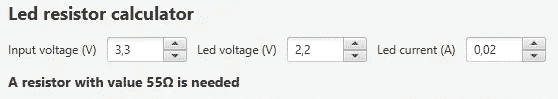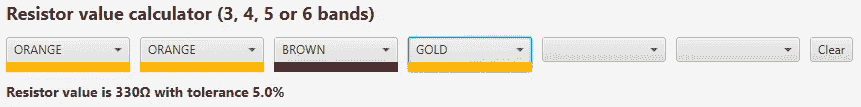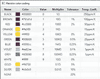

使用电阻计算器库的 JavaFX 演示应用程序

# Java FX LED-段数显示

另一个在入门硬件示例中经常使用的组件是 LED 段数显示器。为了能够在 JavaFX 应用程序的硬件组件上可视化输出，创建了一个单独的 [Java 库](/javarevisited/10-of-the-most-popular-javascript-frameworks-libraries-for-web-development-in-2019-a2c8cea68094)，你也可以在 Maven 上找到这个库[。源代码在 GitHub 项目](https://mvnrepository.com/artifact/be.webtechie/javafx-led-number-display)中共享。

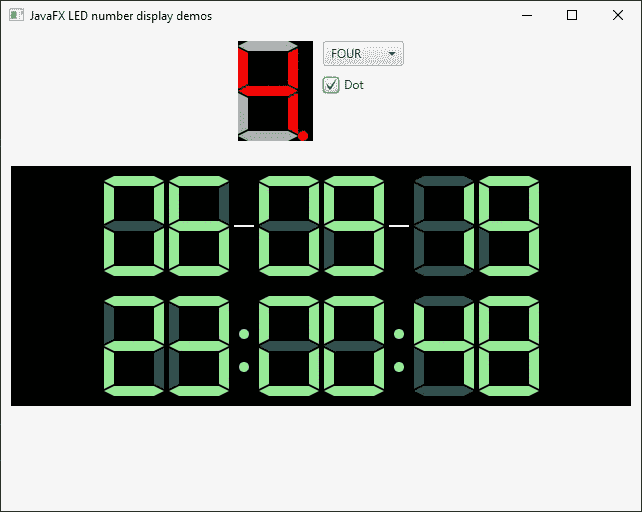

Java FX LED-段号显示，以不同的使用案例和颜色展示

该库在[示例应用](https://github.com/FDelporte/JavaOnRaspberryPi/tree/master/Chapter_08_BitsAndBytes/javafx-led-number-display-controller)中使用，通过 SN74HC595 串行输入并行输出移位寄存器说明如何使用位和字节将数据发送到实际硬件组件。

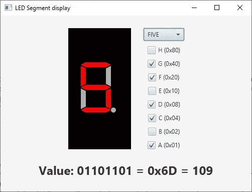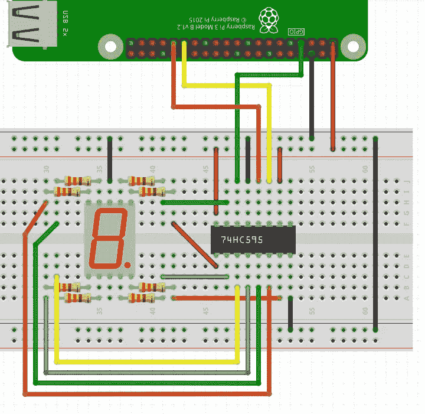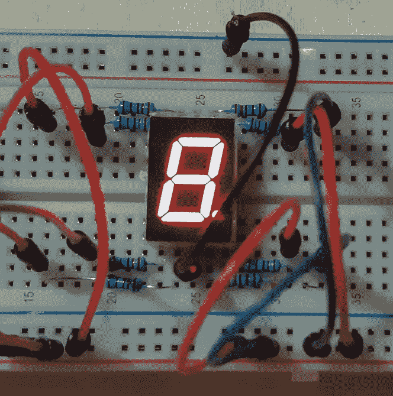

# Pi4J:Java 和 Raspberry Pi GPIO 之间的桥梁

我创建了上述三个库，因为我正在写的书需要它们，我以前从未创建和共享过这样的开源库。所以有很多挑战，这总是一个很好的触发学习新东西。

当然，如果没有一个非常好的库来使用和控制 Raspberry Pi: [Pi4J](https://www.pi4j.com/1.2/index.html) 上的 [Java](/javarevisited/top-5-java-online-courses-for-beginners-best-of-lot-1e1e240a758) 的 GPIO，所有这些都没有任何价值。您也可以将它作为 [Maven 依赖项](https://mvnrepository.com/artifact/com.pi4j/pi4j-core)添加到您的 Java 项目中，它将允许您做更多的事情。

查看这个项目，它为我儿子的鼓室提供了一个触摸屏 JavaFX 用户界面:

展示用 Java、JavaFX、Raspberry Pi 和 Arduino 制作的鼓室控制器

# 结论

Raspberry Pi 上的 Java 和 JavaFX 非常有趣！如果你想学习如何结合硬件和软件，它们是很棒的。购买一个电子初学者工具包，并开始实验！

当我有了第一个由 Java 控制的闪烁 LED 时，一个新的世界打开了，我真的希望你也会有同样的神秘感觉！