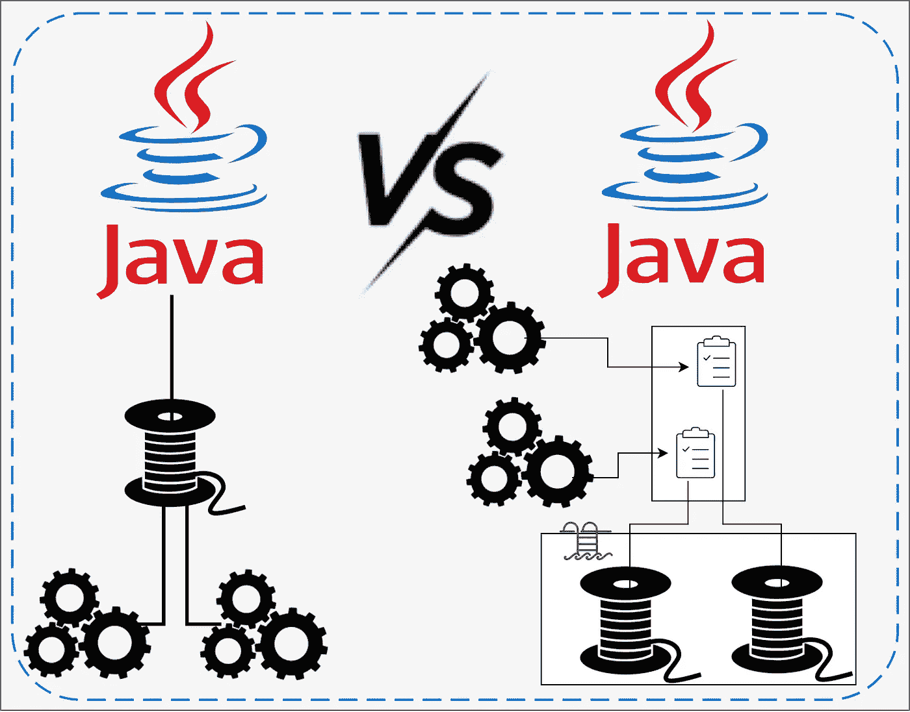

# 使用执行器服务的 Java 多线程

> 原文：<https://medium.com/javarevisited/java-multithreading-using-executor-service-ebffd18b00b6?source=collection_archive---------1----------------------->

## Java 编程语言中的多线程是不断发展的。本教程是关于这一演变的另一个步骤——执行者服务。

在之前的博客中，我展示了一个 Java 多线程的例子，使用了最初的方法，使用了 [Thread 和 Runnable。](http://www.java67.com/2012/08/what-is-thread-and-runnable-in-java.html)