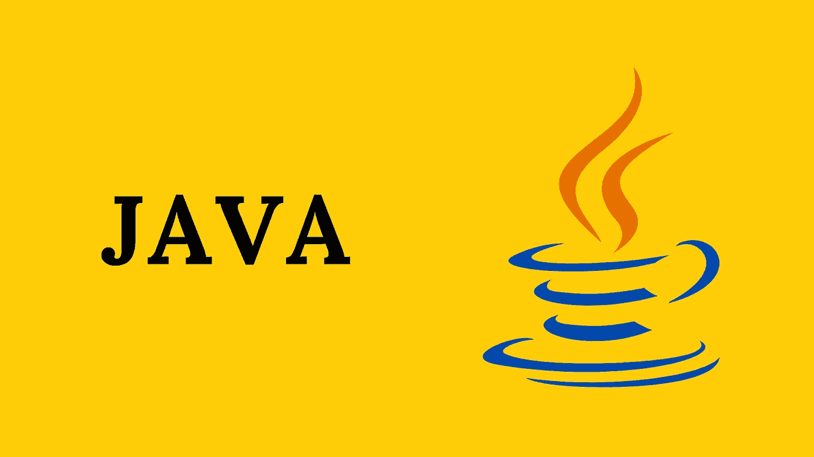

# Java 螺母和螺栓——用 IntelliJ IDEA 引导(系列 I)

> 原文：<https://medium.com/javarevisited/java-nuts-and-bots-booting-with-intellij-idea-ide-series-i-a8bd2775a6e4?source=collection_archive---------2----------------------->

Java 编程语言——安全、强大、快速

ava 是最流行的编程语言之一。它在 web(企业)和移动开发、桌面应用程序、web 和应用程序服务器、数据库连接、游戏以及更多方面都取得了卓越的成就！Java 已经在超过[130 亿台设备上运行。](https://www.oracle.com/java/moved-by-java/timeline/)看看 TIOBE 索引，了解对这种广泛使用的编程语言的需求。