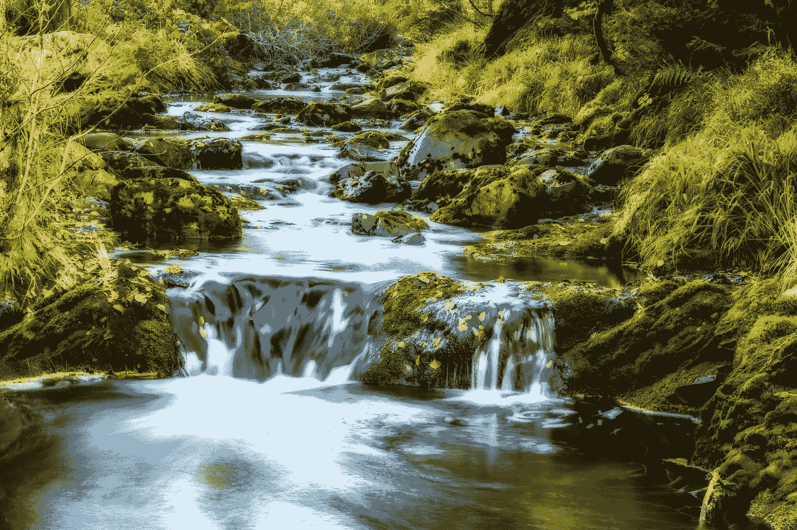

# Java 流 101

> 原文：<https://medium.com/javarevisited/java-streams-101-introduction-to-java-streams-in-java-8-ba22efdb2fa4?source=collection_archive---------2----------------------->

来自[像素](https://www.pexels.com/photo/cascade-creek-environment-flow-219717/)的真实流

# Java 8 中的 Java 流简介

Java Streams 是添加到 **Java 8** 的主要特性之一。 [Streams](/javarevisited/7-best-java-tutorials-and-books-to-learn-lambda-expression-and-stream-api-and-other-features-3083e6038e14) 是数据源的包装器，允许我们操作数据集合，使批量处理变得方便快捷。

一个[流](/javarevisited/8-best-lambdas-stream-and-functional-programming-courses-for-java-developers-3d1836a97a1d) **不存储数据**，从这个意义上说，**本身不是一个数据结构**。因为它不是一个独立的数据结构，它从来没有真正…