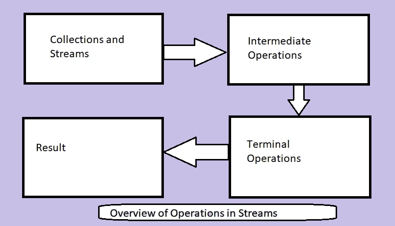

# 面向初学者的 Java 流

> 原文：<https://medium.com/javarevisited/java-streams-for-beginners-105ed3aa2f74?source=collection_archive---------0----------------------->


Wjatscheslaw Spiemann 在 [Unsplash](https://unsplash.com/s/photos/stream?utm_source=unsplash&utm_medium=referral&utm_content=creditCopyText) 上拍摄的照片

Java 8 中引入了流 API。它用于处理对象的集合。在流和 Lambda 函数的帮助下，我们可以编写干净、简洁和可理解的代码。

流是操作的管道，我们可以用它来评估数据。

[](https://javarevisited.blogspot.com/2018/08/top-5-java-8-courses-to-learn-online.html)

[流](/javarevisited/7-best-java-tutorials-and-books-to-learn-lambda-expression-and-stream-api-and-other-features-3083e6038e14?source=---------14------------------)有中间和终端操作，我们可以根据自己的要求使用。以下是操作列表:

**中间** **操作**:查看、平面映射、限制、排序、相异、映射、过滤等

**终端** **操作** : noneMatch、allMatch、collect、findAny、findFirst、anyMatch、toArray、reduce、min、max、forEach、collect、count 等。

## 我们如何创建一个流对象？

```
List<Integer> numbers = Arrays.*asList*(1,2,3,4,5,6,7,8,9,10);
Stream<Integer> numberStream = numbers.stream();
Stream<Integer> newNumberStream = Stream.*of*(1,2,3,4,5,6,7,8,9,10);
```

上面提到的两种方法都为我们提供了流对象。要么我们在[集合对象](/javarevisited/50-java-collections-interview-questions-for-beginners-and-experienced-programmers-4d2c224cc5ab)上调用 ***stream()*** 方法，要么我们直接将值传递给 **Stream.of()** 方法。

## 让我们看看流中的**中间方法**是如何工作的:

1.  **地图:**

[map()](/javarevisited/how-to-use-streams-map-filter-and-collect-methods-in-java-1e13609a318b) 方法用于对集合列表执行操作。让我们看看如何创建一个给定列表中所提供数量的立方体列表。

```
List<Integer> numbers = Arrays.*asList*(1,2,3,4,5,6,7,8,9,10);

List<Integer> cubedNumbers= numbers.stream()
        .map(x -> x*x*x).collect(Collectors.*toList*());

System.*out*.print(cubedNumbers);
```

我们在这里看到的输出是:

```
[1, 8, 27, 64, 125, 216, 343, 512, 729, 1000]
```

**2。过滤器:**

[filter(](https://www.java67.com/2018/03/java-8-stream-find-first-and-filter-example.html) )方法，用于根据我们的条件过滤出结果。现在让我们考虑从 1 到 10 的数字列表中过滤出偶数。

```
List<Integer> numbers = Arrays.*asList*(1,2,3,4,5,6,7,8,9,10);

List<Integer> evenNumbers = numbers.stream()
        .filter(x -> x%2==0).collect(Collectors.*toList*());

 System.*out*.print(evenNumbers);
```

输出将是:

```
[2, 4, 6, 8, 10]
```

**3。排序:**

现在，如果您希望对给定的集合进行排序， [Streams](/javarevisited/7-best-java-collections-and-stream-api-courses-for-beginners-in-2020-3ad18d52c38) 将为您服务！！您可以使用 sorted()方法作为排序的中间函数。

```
List<Integer> numbers = Arrays.*asList*(6,7,8,1,4,5,9,10,2,3);List<Integer> sortedList = numbers.stream().sorted().collect(Collectors.*toList*());

System.*out*.print(sortedList);
```

这里的输出将是:

```
[1, 2, 3, 4, 5, 6, 7, 8, 9, 10]
```

**4。平面图:**

[flatMap()](http://www.java67.com/2016/03/how-to-use-flatmap-in-java-8-stream.html) 用于将 2 级流转换为 1 级流。简而言之，如果我们有一个由 ArrayList 组成的 arrayList 集合，那么在 flatMap()的帮助下，我们可以将它们转换成一个单独的 arrayList。

```
List<Integer> list1 = Arrays.*asList*(1,2,3);
List<Integer> list2 = Arrays.*asList*(4,5,6);
List<Integer> list3 = Arrays.*asList*(7,8,9);

List<List<Integer>> listOfNumbers = Arrays.*asList*(list1, list2, list3);

List<Integer> listOfAllIntegers = listOfNumbers.stream()
        .flatMap(x -> x.stream())
        .collect(Collectors.*toList*());

System.*out*.println(listOfAllIntegers);
```

输出应该是这样的:

```
[1, 2, 3, 4, 5, 6, 7, 8, 9]
```

**5。独特:**

如果给定的集合有重复项，我们可以使用 distinct()方法删除重复项，得到一个过滤后的集合。

```
List<String> countries = Arrays.*asList*("India", "Australia", "SriLanka","Russia", "Australia","SriLanka","India");

List<String> distinctCountries = countries.stream().distinct()
.collect(Collectors.*toList*());
    System.*out*.println(distinctCountries);
}
```

这里的输出将是:

```
[India, Australia, SriLanka, Russia]
```

**6。偷看:**

**peek()** 是一个**中间**动作。 [**peek()**](https://www.java67.com/2016/09/java-8-streampeek-example.html) 返回一个由被遍历的流的元素组成的流，当从结果流中消耗元素时，另外对每个元素执行所提供的动作。

如果我们不指定终端操作，peek()操作什么也不做。

```
Stream.*of*(1,2,3,4,5,6,7,8,9,0)
        .filter(x -> x%2 ==0)
        .peek(e -> System.*out*.println("The even numbers 
         are : " + e))
        .collect(Collectors.*toList*());
```

这提供了输出:

```
The even numbers are : 2
The even numbers are : 4
The even numbers are : 6
The even numbers are : 8
The even numbers are : 0
```

## 现在让我们看看终端操作:

1.  **收集:**

[collect()](https://www.java67.com/2018/06/java-8-streamcollect-example.html) 操作帮助将流收集到一个集合中。该方法采用收集器实现，提供有用的归约操作。

```
List listOfCountries = Arrays.*asList*("India", "Indonesia", "Nepal", "Afghanistan");

List output = (List) listOfCountries.stream()
        .filter(x-> x.toString().startsWith("I"))
        .collect(Collectors.*toList*());
System.*out*.println(output);
```

输出:

```
[India, Indonesia]
```

**2。计数:**

**count()** 终端操作帮助我们找到已处理集合的计数。

```
List listOfCountries = Arrays.*asList*("India", "Indonesia", "Nepal", "Afghanistan");

long output = listOfCountries.stream()
        .filter(x-> x.toString().startsWith("I"))
        .count();

System.*out*.println(output);
```

输出:

```
2
```

**3。全匹配:**

allMatch()运算帮助我们得到答案: ***流的所有元素都匹配条件吗？***

```
List listOfCountries = Arrays.*asList*("India", "Indonesia", "Nepal", "Afghanistan");

boolean areAllElementsStartingWithI = listOfCountries.stream()
        .allMatch(x -> x.toString().startsWith("I"));

System.*out*.println(areAllElementsStartingWithI);
```

输出:

```
false
```

**4。任意匹配:**

与 allMatch()相比，anyMatch()有助于检查流中的元素是否符合条件。

```
List listOfCountries = Arrays.*asList*("India", "Indonesia", "Nepal", "Afghanistan");

boolean areAllElementsStartingWithI = listOfCountries.stream()
        .anyMatch(x -> x.toString().startsWith("I"));

System.*out*.println(areAllElementsStartingWithI);
```

输出:

```
true
```

**5。ForEach:**

[forEach()](https://www.java67.com/2016/01/how-to-use-foreach-method-in-java-8-examples.html) 方法用于对结果集合进行迭代，与传统的 for 循环相同。

```
List listOfCountries = Arrays.*asList*("India", "Indonesia", "Nepal", "Afghanistan");

listOfCountries.stream()
         .filter(x-> x.toString().startsWith("I"))
         .forEach(System.*out*::println);
```

输出:

```
India
Indonesia
```

就是这样！！从今以后要经常使用小溪，玩得开心！