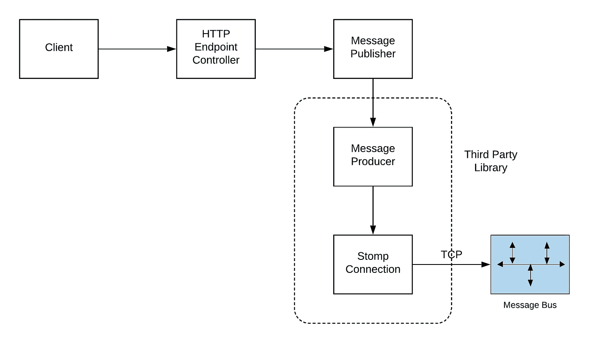
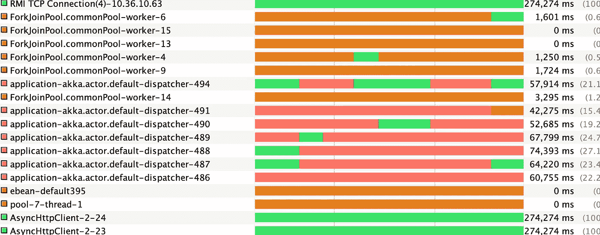
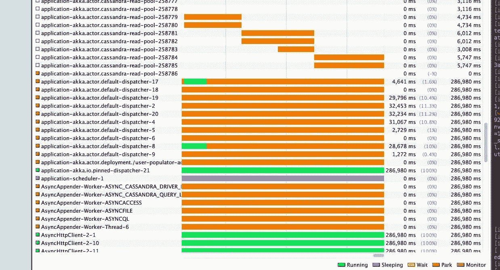

# Java 线程本地——好处和坏处

> 原文：<https://medium.com/javarevisited/java-threadlocal-the-boon-and-the-bane-18263fa4f64?source=collection_archive---------1----------------------->

供图— [Unsplash](https://unsplash.com/photos/Koxa-GX_5zs)

最近，我和我的团队正在对某段代码(特别是一个 HTTP 端点)进行一些性能测试，这段代码很大程度上是继承的，但也有一些我们自己的添加。

为了确保操作的整体延迟满足新增加的 SLA 需求，我们开始使用 [Jmeter](https://jmeter.apache.org/) 执行负载测试。

继承的代码还将一些消息异步发布到我们的内部*消息总线*，以供其他系统和分析管道使用。高层流程看起来像这样。

消息发布的基本高层流程。为简洁起见，省略了其他不相关的细节。

消息发布库是使用 [Stomp](https://stomp.github.io/) 协议构建的，由另一个团队管理。

[消息生产者](https://javarevisited.blogspot.com/2012/02/producer-consumer-design-pattern-with.html#axzz5gssD6l67)(如上所示)是一个共享实例，在多个线程间共享是安全的，每个进程一个实例(生产者建立了到消息代理的物理 TCP 连接)就足够了。

片段 1。在端点控制器代码中使用的消息发布者的单个实例。

当这个端点上的负载增加到与预期的额外生产负载相匹配时，我们开始观察到性能下降。

通过查看线程的健康状况来检查 Java 进程，以获得系统中任何问题的良好指示，这始终是一个很好的实践。JVisualVM 是洞察健康过程的有用工具。

可视化虚拟机输出

注意线程 ***default-dispatcher-*** 。这些线程的任务是发布消息。然而，那些线程时间线中的红色块表示它们在对象监视器上等待了很长时间(Java 世界中的*同步*块、*独占重入锁*)。

> 绿色区域表示线程处于运行状态。
> 
> 红色区域表示等待锁/条件且不做任何有用工作的线程。
> 
> 理想情况下，应该避免这种红色块，因为它们会严重影响应用程序的并发性以及整体性能。

由于线程队列中的消息堆积，这对堆大小也有不利影响。

**原因**

在进行线程转储时，我们意识到这个库在内部使用了流/阻塞 I/O，这意味着流不能在线程间安全地共享。

这需要为读/写锁定流，从而序列化多个线程对它的访问。

为了缓解这个问题，我们有以下选择。

<https://javarevisited.blogspot.com/2019/10/the-java-developer-roadmap.html#123>  

# 每条消息的生产者

为每个消息创建一个新的生产者(有效地建立到消息代理的新连接),并在使用时关闭。

**优点**

*   容易实现。
*   线程之间没有共享，这意味着线程之间没有争用。

**缺点**

*   每个连接建立都必须支付 TCP 握手的费用(这是一个昂贵的提议)。
*   这将直接影响性能，延迟将再次变高，导致消息堆积，因为发布速率将始终落后于消息创建速率。

# 每个线程的生产者

这是我们想到探索优秀的 Java [ThreadLocal](https://docs.oracle.com/javase/8/docs/api/java/lang/ThreadLocal.html) 的地方。ThreadLocal 本质上是状态的独立副本，排除了它们之间的任何状态(变量)共享，因为每个线程都独占访问由静态 thread local 维护的状态副本。

上面代码片段 1 中的代码被修改成

代码片段 2:为生产者使用 ThreadLocal。

更改后的虚拟虚拟机快照看起来好得多，因为不再有红色块，并且它阻止了缓慢的内存增长。此外，线程的数量(由应用程序容器管理)是有限的，因此额外连接的有效数量在可接受的范围内。

请注意没有监视器块的调度程序线程。

令我们震惊的是，在这个补丁上线几个小时后，与消息代理的物理连接就一飞冲天了。

请注意连接从 6–8K(正常)增加到 36K

到代理的物理连接的增加对依赖于消息代理基础设施的其他应用程序产生了负面影响。

有延迟峰值的示例应用程序。

**为什么会这样？**

容器管理的线程池通常有一个空闲超时，这意味着线程在一段时间不活动后变得空闲，容器管理的线程池会丢弃它们。在实践中，这是一个非常合理的场景，因为交通在一天中会发生变化。

然而，即使线程被丢弃，维护消息总线生产者(映射到物理连接)的 threadlocal 仍然是打开的。

这显然意味着物理连接会堆积起来，因为线程池会通过其线程工厂请求新的线程来处理未来的请求。

服务器上的物理连接需要更长的时间才能关闭(通常处于 CLOSE_WAIT 状态)。

ThreadLocals 不提供任何清理资源的机会，这可能会导致非常严重的不良影响，如上所述。

**第一课**

> 当使用容器管理的动态线程池时，应该避免将物理资源包装在线程局部变量中，因为缺少清理机会会使这些资源处于悬空状态，可能会耗尽共享资源配额。
> 
> 如果你使用这个来缓存任何这样的连接到云消息代理，数据库，重新考虑你的选择。
> 
> 除非您能够完全控制线程池，并且愿意为保持空闲线程运行付出代价，否则最好避免使用 ThreadLocal 来缓存昂贵的资源。

</javarevisited/what-java-programmers-should-learn-in-2020-648050533c83>  

# 潜在修复

然而，我们仍然需要解决这个问题。我将在此提出两种解决方案。

# 每个演员的制片人

这是我的同事[摩哂陀·奇姆瓦尔](/@mahendrachhimwal)提议的我们为用例实现的解决方案(fix)。

我们的应用程序大量使用了优秀的 [Actor](https://arxiv.org/vc/arxiv/papers/1008/1008.1459v8.pdf) 模型，以及它在 Java/Scala 中有价值的实现 [Akka](https://doc.akka.io/docs/akka/current/actors.html) 。

**为什么会这样？**

*   参与者是软件抽象，不像线程这样的物理资源，通常由应用程序容器管理。
*   参与者占用的内存和其他资源可以忽略不计，因此维护这样一个参与者池的成本可以忽略不计。
*   由于 threadlocal 的优势，不能在 actor 外部访问 Actor 的内部状态。
*   所使用的 Actor 池完全由应用程序控制，可以在没有任何空闲超时的情况下运行，这是 ThreadLocal 方法失败的主要原因。

# 生产者群体

不想只为这个用例引入 Actor 框架的应用程序可以为它们昂贵的资源实现一个池。通常我们会看到 HTTP 连接、DB 连接、LDAP 连接等等的池实现。

如果您没有现成的池实现，您可以使用众所周知的 [Apache Commons Pool](https://commons.apache.org/proper/commons-pool/index.html) 库来编写一个。

您的应用程序可以调整池的大小(取决于负载)，它可以确保一次只有一个线程可以访问池化的资源，从而避免线程之间的任何争用。

# 结论

*   ThreadLocals 是标准 JDK 中可用的优秀构造，允许多线程应用程序很好地伸缩。
*   但是，应该非常小心在 threadlocal 中管理的资源。
*   *避免*:映射到 JVM 边界之外的物理资源的对象(特别是对于托管线程池)。这种资源的例子:数据库连接、文件句柄、网络套接字等。
*   *好的候选对象*:需要在应用程序的不同位置访问的上下文/会话对象，或者每个线程安全拥有的任何对象。
*   ThreadLocals 用于正确的用例具有正确的对象可能是一件好事，而它们可能会以严重的方式严重影响您的应用程序或任何依赖系统。

# 资源

*   [演员](https://arxiv.org/vc/arxiv/papers/1008/1008.1459v8.pdf) *模特计算*
*   [*Akka 框架*](https://doc.akka.io/docs/akka/current/typed/guide/introduction.html)
*   [*Apache Commons Pool*](https://commons.apache.org/proper/commons-pool/index.html)

# 信用

非常感谢 [*摩哂陀·奇姆瓦尔*](/@mahendrachhimwal) 帮我准备了本文所需的图表。也感谢加吉·达斯古普塔提供的宝贵反馈。

您可能喜欢的其他 **Java 并发文章**

*   **2020 年 Java 开发者路线图(** [**路线图**](https://javarevisited.blogspot.com/2019/10/the-java-developer-roadmap.html#123) **)**
*   **10 个 Java 多线程和并发最佳实践(** [**文章**](https://javarevisited.blogspot.com/2015/05/top-10-java-multithreading-and.html#axzz5Neevu8QO) **)**
*   **Java 中 50 大多线程与并发问题(** [**问题**](http://javarevisited.blogspot.sg/2014/07/top-50-java-multithreading-interview-questions-answers.html#axzz4jaJmaqbE) **)**
*   **Java 并发高手前 5 本书(** [**本书**](https://javarevisited.blogspot.com/2016/06/5-books-to-learn-concurrent-programming-multithreading-java.html) **)**
*   **Java 中 CyclicBarrier 和 CountDownLatch 的区别？(** [**回答**](http://www.java67.com/2012/08/difference-between-countdownlatch-and-cyclicbarrier-java.html) **)**
*   **Java 中如何避免死锁？(** [**回答**](https://javarevisited.blogspot.com/2018/08/how-to-avoid-deadlock-in-java-threads.html) **)**
*   **理解 Java 程序中数据和代码的流动(** [**回答**](https://javarevisited.blogspot.com/2019/02/thread-code-and-data-how-multithreading-java-program-execute.html) **)**
*   **2020 年实践中的 Java 并发还有效吗(** [**答**](https://javarevisited.blogspot.com/2018/07/is-java-concurrency-in-practice-still-relevant-in-era-of-java8.html) **)**
*   **如何使用 wait-notify 在 Java 中进行线程间通信？(** [**回答**](https://javarevisited.blogspot.com/2013/12/inter-thread-communication-in-java-wait-notify-example.html) **)**
*   **2020 年成为更好的 Java 开发者的 10 个小技巧(** [**小技巧**](https://javarevisited.blogspot.com/2018/05/10-tips-to-become-better-java-developer.html#axzz61Tq0rRG1) **)**
*   **5 门课程深入学习 Java 多线程(** [**门课程**](https://javarevisited.blogspot.com/2018/06/top-5-java-multithreading-and-concurrency-courses-experienced-programmers.html) **)**

感谢您阅读本文。如果你喜欢这篇文章或跟帖面试问题，请分享给你的朋友和同事。如果您有任何问题或反馈，请留言。